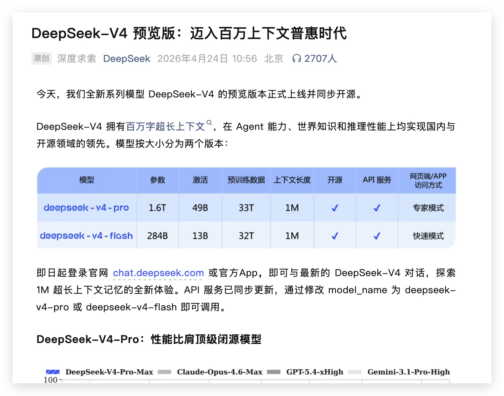
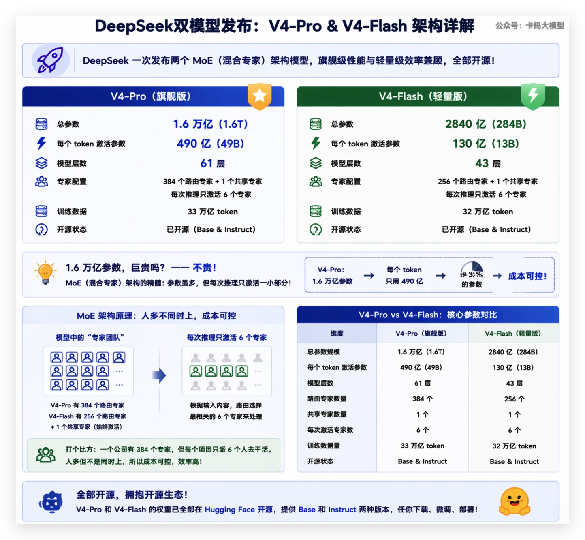
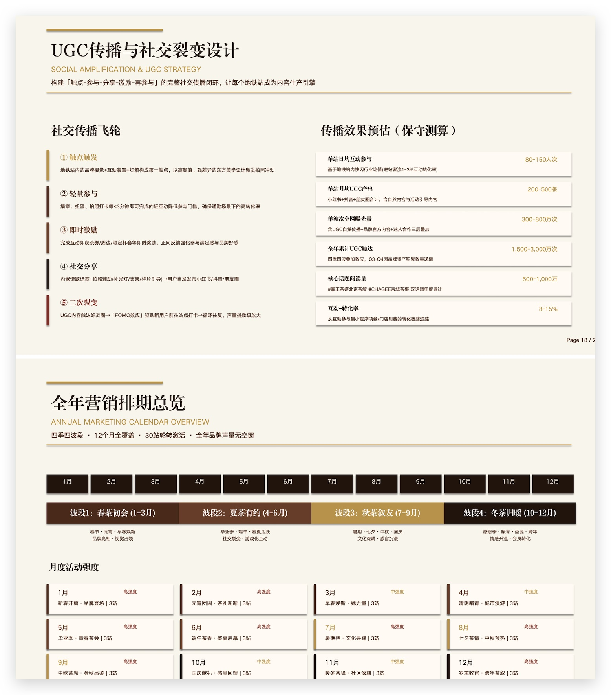
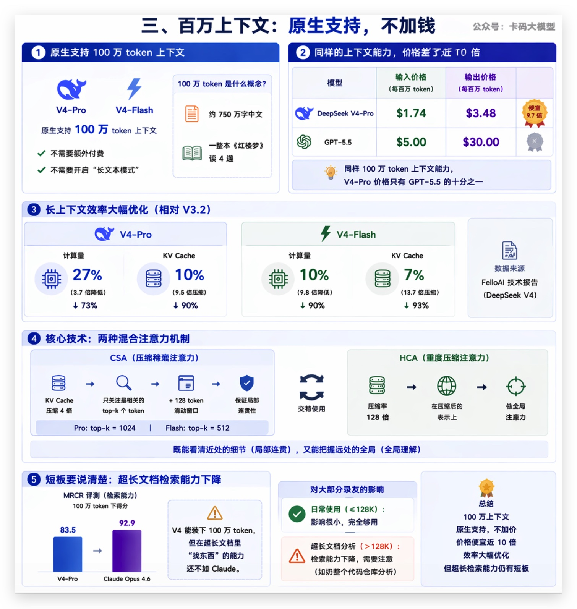
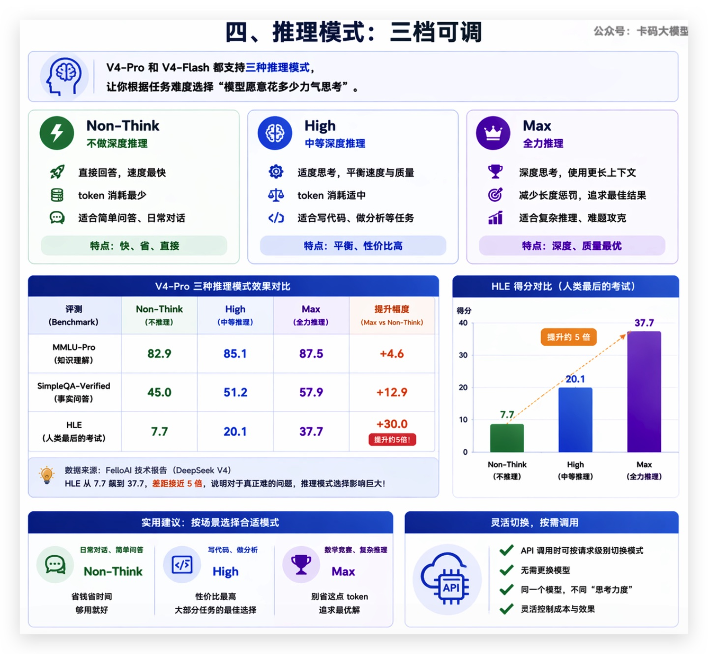
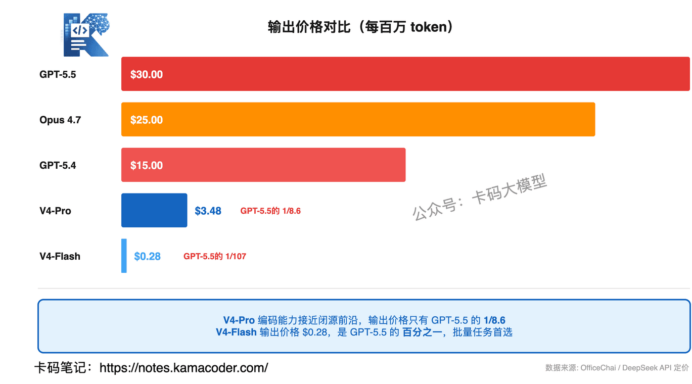
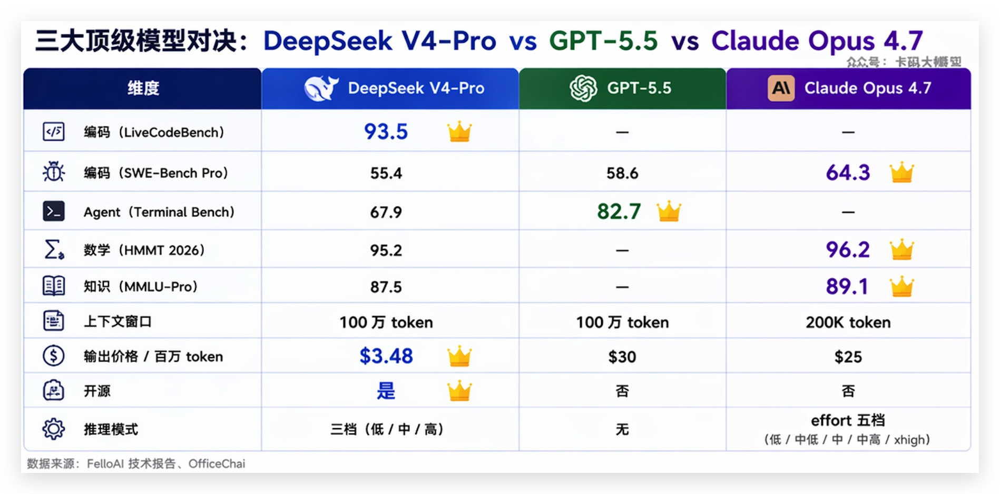
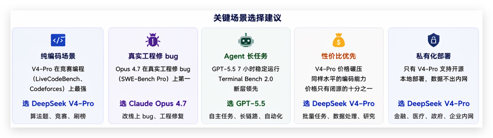
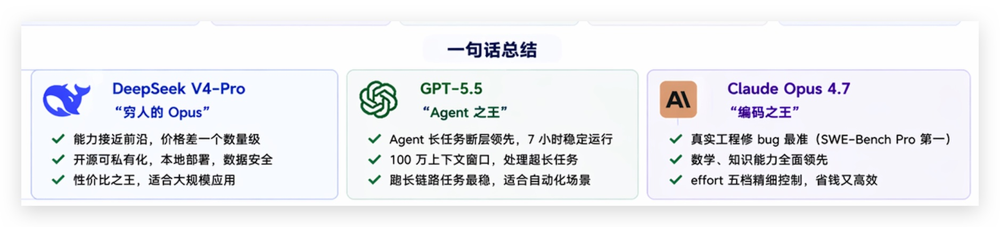
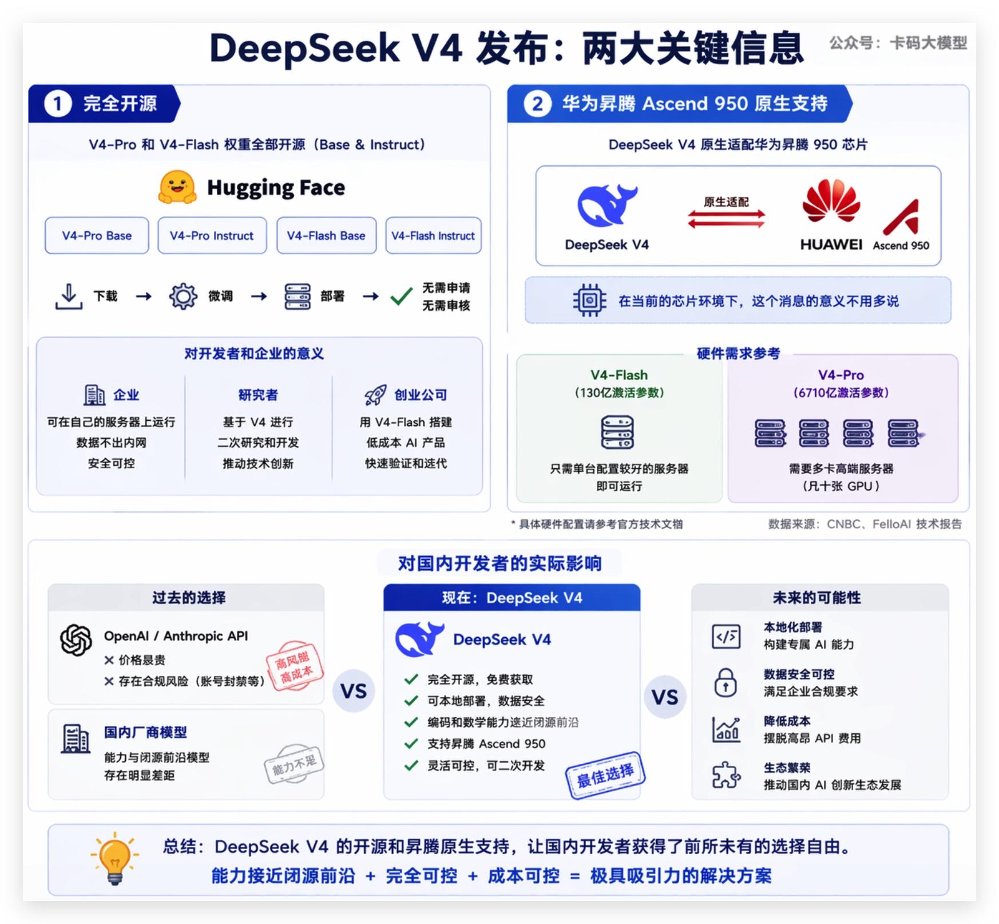

# DeepSeek V4发布：1.6万亿参数开源MoE，百万上下文，价格只要GPT-5.5的十分之一

> 来源: https://notes.kamacoder.com/llm/news/deepseek-v4.html

# `# DeepSeek V4发布：1.6万亿参数开源MoE，百万上下文，价格只要GPT-5.5的十分之一 
 

昨天写GPT-5.5  (opens new window)的时候，结尾说了一句"deepseekV4也发布了，明天单独写一篇来分析一下"。 

没错，**同一天**，2026年4月24日，DeepSeek和OpenAI撞车了。 

GPT-5.5凌晨发，DeepSeek V4北京时间白天发。两家同一天放大招，这节奏符合ai的气质（卷起来）。 

 

之前在Opus 4.7那篇  (opens new window)里还调侃DeepSeek"生产队的驴不能这么拖"，结果人家真的在憋大招。 

而且这次不是小打小闹——**1.6万亿参数、开源、百万上下文、价格只要闭源模型的十分之一**。 

接下来逐个拆开看看。 

## `# 一、两个模型：V4-Pro和V4-Flash 

DeepSeek这次一口气发了两个模型，都是MoE（混合专家）架构： 

**V4-Pro**——旗舰版 
  - 总参数：**1.6万亿**（1.6T）   - 每个token激活参数：**490亿**（49B）   - 61层，384个路由专家 + 1个共享专家，每次只激活6个   - 训练数据：33万亿token 

**V4-Flash**——轻量版 
  - 总参数：**2840亿**（284B）   - 每个token激活参数：**130亿**（13B）   - 43层，256个路由专家 + 1个共享专家，同样每次激活6个   - 训练数据：32万亿token 

录友可能会问：1.6万亿参数，这不是巨贵吗？ 

**不贵。** 这就是MoE的精髓——参数虽然多，但每次推理只激活一小部分。V4-Pro有1.6万亿参数，但每个token只用490亿，相当于只用了3%的参数。 

打个比方：一个公司有384个专家，但每个项目只派6个人去干活。人多但不是同时上，所以成本可控。 

两个模型都开源了，权重放在Hugging Face上，Base和Instruct版本都有。 

## `# 二、评测数据：编码能力开源天花板 

先看最硬的数据。 

 

**编码类** 

| 评测  V4-Pro  V4-Flash  Claude Opus 4.6  GPT-5.4  Gemini 3.1 Pro 
| LiveCodeBench  **93.5**  91.6  88.8  —  91.7 
| Codeforces  **3206**  3052  —  3168  3052 
| SWE-Bench Verified  80.6  79.0  **80.8**  —  80.6 
| Terminal Bench 2.0  67.9  56.9  65.4  75.1  68.5 

录友可能不知道这几个指标啥意思，我来解读一下： 

**LiveCodeBench 93.5**——这是实时编码能力评测，V4-Pro直接超过了GPT-5.4的91.7。一个开源模型，在编码benchmark上打赢了OpenAI的上一代旗舰，这在以前是不敢想的。 

**Codeforces 3206分**——这是竞赛编程平台的rating，3206分在人类选手中排**第23名**。GPT-5.4是3168分。一个AI模型，在全球编程竞赛中能排进前30，而且是开源的。 

**SWE-Bench Verified 80.6**——修真实GitHub issue的能力，和Claude Opus 4.6的80.8基本持平。注意这里对比的是Opus 4.6，不是4.7。 

**Terminal Bench 2.0 67.9**——这是Agent全链路工程能力测试，V4-Pro只拿到67.9。GPT-5.5是82.7，差距明显。**这也是V4最大的短板：Agent场景还追不上闭源前沿。** 

不过deepseek在Agent方面，还是有较大提升 ，下图为 V4-Pro 在某 Agent 框架下生成的 PPT 内页示例： 

 

**数学类** 

数学方面V4-Pro也很猛： 
  - **Putnam-2025**：120/120，满分通过。Putnam是北美最难的大学数学竞赛之一   - **IMOAnswerBench**：89.8，接近GPT-5.4的91.4   - **HMMT 2026**：95.2，略低于Claude Opus 4.6的96.2和GPT-5.4的97.7 

**知识类——这是短板** 

| 评测  V4-Pro  Gemini 3.1 Pro  Claude Opus 4.6 
| MMLU-Pro  87.5  **91.0**  89.1 
| SimpleQA-Verified  57.9  **75.6**  — 
| GPQA Diamond  90.1  **94.3**  — 
| HLE  37.7  **44.4**  40.0 

知识类评测，V4-Pro全面落后于Gemini 3.1 Pro，也低于Claude Opus 4.6。DeepSeek自己也承认了这一点，说V4在通用知识方面"距离Gemini 3.1 Pro还有差距"。 

**总结一下评测**：编码和数学是开源天花板，甚至超过部分闭源模型；知识和Agent场景还有差距。DeepSeek自己的定位是"略低于GPT-5.4和Gemini 3.1 Pro"，大概落后前沿3-6个月。 

但别忘了——**这是开源的**。 

## `# 三、百万上下文：原生支持，不加钱 

V4-Pro和V4-Flash都原生支持**100万token上下文**，不需要额外付费，不需要开什么"长文本模式"。 

100万token是什么概念？大约相当于**750万字中文**，或者**一整本《红楼梦》读4遍**。 

这个上下文长度和GPT-5.5一样，都是100万。但GPT-5.5的价格是$5/$30（输入/输出每百万token），V4-Pro是$1.74/$3.48。**同样的上下文能力，价格差了将近10倍。** 

而且DeepSeek在长上下文的效率上做了很大优化。相比V3.2，在100万token长度下： 
  - V4-Pro：计算量只有V3.2的**27%**（3.7倍降低），KV cache只有**10%**（9.5倍压缩）   - V4-Flash：计算量只有V3.2的**10%**（9.8倍降低），KV cache只有**7%**（13.7倍压缩） 

 

怎么做到的？核心是两种混合注意力机制： 

**CSA（压缩稀疏注意力）**——把KV cache压缩4倍，然后只关注最相关的top-k个token（Pro是1024个，Flash是512个），再加一个128 token的滑动窗口保证局部连贯性。 

**HCA（重度压缩注意力）**——更激进，压缩率128倍，在压缩后的表示上做全局注意力。 

两种机制交替使用，既能看清近处的细节，又能把握远处的全局。 

**不过有个短板要说清楚**：长上下文检索能力在超过128K之后会下降。MRCR评测在100万token下只有83.5，Claude Opus 4.6是92.9。也就是说，**V4能装下100万token，但在超长文档里"找东西"的能力还不如Claude。** 

对大部分录友来说，日常用到的上下文很少超过128K，所以这个短板影响不大。但如果你的场景是"扔一整个代码仓库进去让AI分析"，要注意这个限制。 

## `# 四、推理模式：三档可调 

V4-Pro和V4-Flash都支持三种推理模式： 
  - **Non-Think**：不做深度推理，直接回答。速度最快，token消耗最少   - **High**：中等深度推理，适合大部分需要思考的任务   - **Max**：全力推理，使用更长上下文，减少长度惩罚 

这个设计和Claude的effort参数思路类似——让用户根据任务难度选择"模型愿意花多少力气思考"。 

效果差距有多大？看V4-Pro的数据： 

| 评测  Non-Think  Max  提升 
| MMLU-Pro  82.9  87.5  +4.6 
| SimpleQA-Verified  45.0  57.9  +12.9 
| HLE  7.7  37.7  +30.0 

HLE（Humanity's Last Exam，人类最后的考试）从7.7飙到37.7，差距接近**5倍**。这说明对于真正难的问题，推理模式的选择影响巨大。 

**实用建议**： 
  - 日常对话、简单问答：**Non-Think**，省钱省时间   - 写代码、做分析：**High**，性价比最高   - 数学竞赛、复杂推理：**Max**，别省这点token 

API调用时可以按请求级别切换模式，不用换模型。 

 

## `# 五、价格：这才是真正的杀手锏 

看完能力，再看价格。这才是DeepSeek V4最炸裂的部分。 

 

| 模型  输入（缓存命中）  输入（缓存未命中）  输出 
| **V4-Flash**  **$0.028**  **$0.14**  **$0.28** 
| **V4-Pro**  **$0.145**  **$1.74**  **$3.48** 
| Claude Opus 4.7  —  $5.00  $25.00 
| GPT-5.5  —  $5.00  $30.00 
| GPT-5.4  —  $2.50  $15.00 

来算笔账： 

**V4-Pro vs GPT-5.5**：输出价格$3.48 vs $30，**GPT-5.5贵了8.6倍**。输入价格$1.74 vs $5，贵了2.9倍。 

**V4-Pro vs Claude Opus 4.7**：输出价格$3.48 vs $25，**Opus 4.7贵了7.2倍**。 

**V4-Flash就更离谱了**：输出$0.28/百万token。跑同样的任务，V4-Flash的成本是GPT-5.5的**百分之一**。 

而且DeepSeek还有缓存命中机制——如果你的请求和之前的请求有大量重复的前缀（比如system prompt），缓存命中后输入价格再打**八折**。V4-Flash缓存命中后输入只要$0.028/百万token，这个价格基本可以忽略不计。 

**但价格低不代表能替代。** V4-Pro在编码benchmark上确实接近甚至超过GPT-5.4，但在Agent场景（Terminal Bench 2.0）和知识类评测上还有明显差距。 

所以结论很清楚：**如果你的场景是编码、数学、批量处理，V4-Pro的性价比碾压一切。如果你需要Agent长任务或者最强的通用知识能力，闭源模型还是更稳。** 

## `# 六、与GPT-5.5、Opus 4.7三方对比 

现在市面上三个最值得关注的模型：DeepSeek V4-Pro、GPT-5.5、Claude Opus 4.7。怎么选？ 

| 维度  DeepSeek V4-Pro  GPT-5.5  Claude Opus 4.7 
| 编码（LiveCodeBench）  93.5  —  — 
| 编码（SWE-Bench Pro）  55.4  58.6  **64.3** 
| Agent（Terminal Bench）  67.9  **82.7**  — 
| 数学（HMMT 2026）  95.2  —  96.2 
| 知识（MMLU-Pro）  87.5  —  89.1 
| 上下文窗口  100万  100万  200K 
| 输出价格/百万token  **$3.48**  $30  $25 
| 开源  **是**  否  否 
| 推理模式  三档  无  effort五档 

 

几个关键判断： 

**纯编码场景**：V4-Pro在竞赛编程（LiveCodeBench、Codeforces）上最强，但在真实工程修bug（SWE-Bench Pro）上Opus 4.7还是第一。如果你写的是算法题，V4-Pro更强；如果你改的是线上bug，Opus 4.7更稳。 

**Agent长任务**：GPT-5.5断层领先，7小时稳定运行不是V4能比的。Terminal Bench 2.0差了将近15个百分点。 

**性价比**：V4-Pro碾压。同样水平的编码能力，价格只有闭源模型的十分之一。跑批量任务、做数据处理、搞研究，V4-Pro是最优选。 

**私有化部署**：只有V4能做到。开源权重意味着你可以在自己的服务器上跑，数据不出内网。对金融、医疗、政府这些对数据安全敏感的行业，这是唯一选择。 

 

**说白了**：V4-Pro是"穷人的Opus（实惠装）"，能力接近前沿，价格差一个数量级。GPT-5.5是"Agent之王"，跑长任务最稳。Opus 4.7是"编码之王"，改bug最准。三个不是替代关系，是各有战场。 

 

## `# 七、开源 + 华为昇腾：对国内开发者意味着什么 

 

这次发布有两个对国内开发者特别重要的信息： 

**第一，完全开源。** 

V4-Pro和V4-Flash的权重都放在Hugging Face上，Base和Instruct版本都有。你可以下载、微调、部署，不需要申请、不需要审核。 

这意味着： 
  - 企业可以在自己的服务器上跑，数据不出内网   - 研究者可以基于V4做二次开发   - 创业公司可以用V4-Flash搭建低成本的AI产品 

**第二，华为昇腾Ascend 950原生支持。** 

DeepSeek宣布V4原生适配华为昇腾950芯片。在当前的芯片环境下，这个消息的意义不用多说。 

V4-Flash只需要130亿激活参数，在配置好的单台服务器上就能跑。V4-Pro需要的硬件更多（几十张GPU），但对大厂来说不是问题。 

**对国内开发者的实际影响**：以前想用前沿大模型，要么调OpenAI/Anthropic的API（贵，而且有合规风险）我之前两个claude账号都被封了  (opens new window)，要么用国内厂商的模型（能力差一截）。现在V4-Pro在编码和数学上已经接近闭源前沿，而且可以本地部署，这个选择就很有吸引力了。 

## `# 写在最后 

总结一下 DeepSeek V4：**开源平权、价格屠夫、编码天花板**。 

对开发者来说： 
  - **预算有限的**：V4-Pro是目前性价比最高的选择，编码能力接近前沿，价格只要十分之一   - **跑批量任务的**：V4-Flash的$0.28/百万token输出价格，跑多少都不心疼   - **需要私有化部署的**：V4是唯一能本地跑的前沿级模型   - **跑Agent长任务的**：还是GPT-5.5更合适，V4在这块差距明显   - **改线上bug的**：Opus 4.7的SWE-Bench Pro 64.3还是最强 

不过这里还是要说明一下：**编码天花板"说的是benchmark，不是真实开发体验** 

我们平时写代码，靠的是Agent——接入Claude Code CLI，让模型自己定位问题、改代码、跑测试、验证结果，这是一整套链路。V4在LiveCodeBench、Codeforces这些"做题"场景确实猛，但Terminal Bench 2.0只有67.9，GPT-5.5是82.7，Opus 4.7在Agent编码上更是公认最强。 

**做题强不等于干活强。** 真正接入CLI跑Agent任务，DeepSeek V4和Claude还是差了不少。benchmark上的"编码天花板"，到了真实开发场景里，可能只是"编码中等偏上"。 

所以录友们别被benchmark迷惑了——如果你的日常是用Agent写代码，Claude Code + Opus 4.7还是第一选择（但确实贵）。 

目前我个人感受写代码，写文章性价比最高的还是 Claude agent + Cli + GLM5.1  (opens new window) 

V4的优势在**性价比和开源**，不在Agent体验。而现在agent其实是里普通用户最近的一种交互方式。 

一周之内，Opus 4.7、GPT-5.5、DeepSeek V4接连发布。三家各有所长，没有谁能通吃。 

**DeepSeek 依然是国产开源之光**！！ 

加油
