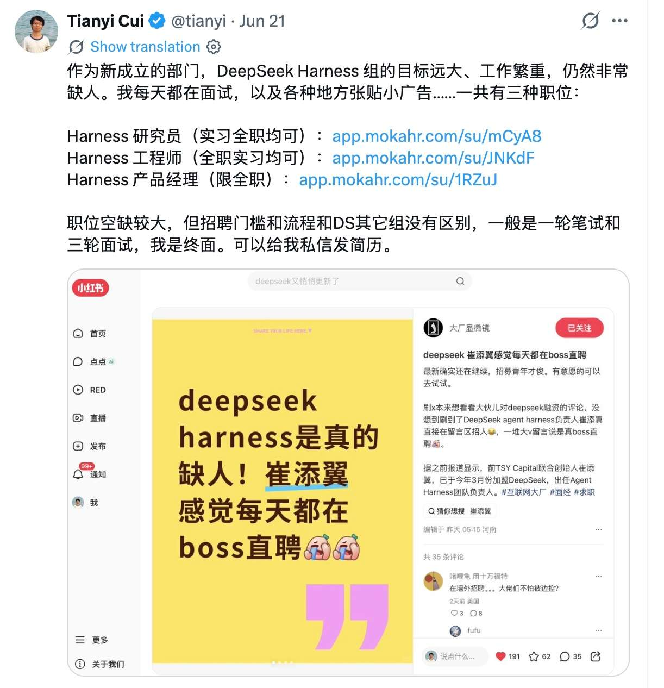
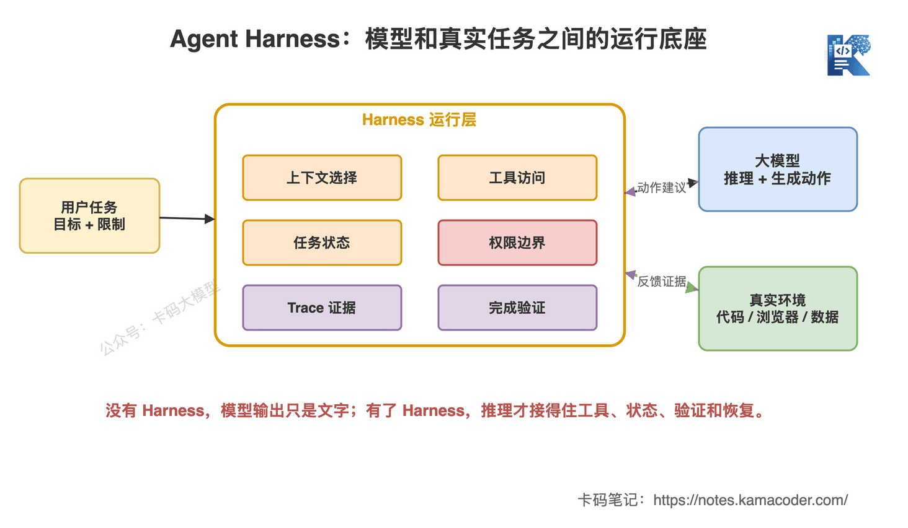
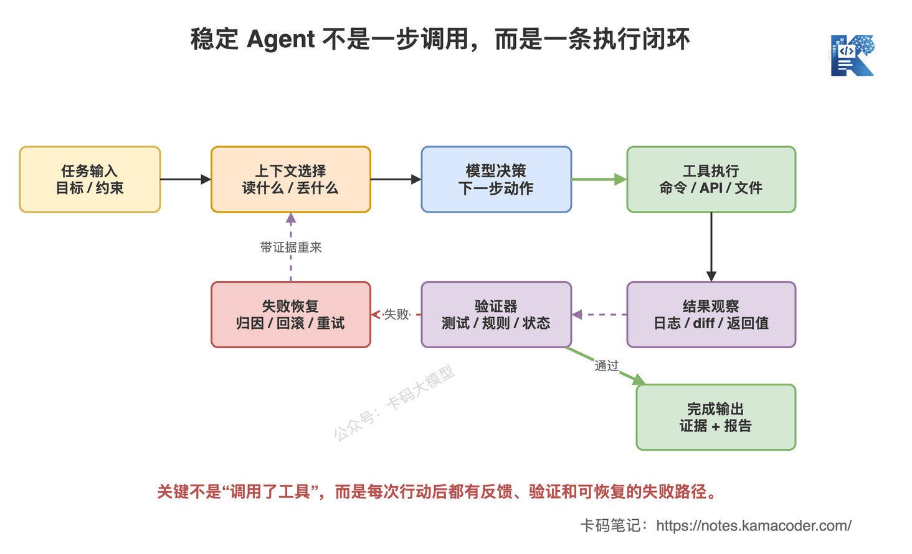
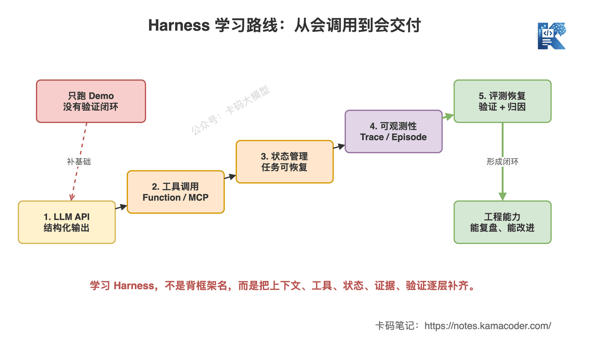

# DeepSeek大举招人，Agent Harness工程师火了：普通程序员怎么学Harness

> 来源: https://notes.kamacoder.com/llm/news/deepseek-agent-harness-hiring.html

# `# DeepSeek大举招人，Agent Harness工程师火了：普通程序员怎么学Harness 
 

最近 DeepSeek 又刷屏了。 

不是发模型，也不是降价。 

是招人。 

Harness 团队负责人，在各大平台公开招人： 

 

DeepSeek 从 V3、R1 到 DeepSeek V4，一直都是用很强的模型能力和很低的价格打市场。现在模型有了，调用量有了，下一步一定不是只继续堆参数。 

下一步是：**把模型变成能干活的系统。** 

这也是为什么最近“Agent Harness 工程师”这个词会被频繁讨论。 

我查了一轮公开报道，TechRadar  (opens new window) 和 WSJ  (opens new window) 都提到 DeepSeek 正在大规模扩招，方向覆盖服务端、数据、超算、产品和工程落地。 

至于“Agent Harness 工程师”这个具体岗位，不同截图和转述里有出现，但我没有在稳定可检索的官方网页里找到完整原始岗位页。所以这篇不纠结一个岗位名是不是写在 JD 第一行，而是看背后的趋势： 

**大模型公司的竞争，正在从“模型会不会回答”，转向“模型能不能稳定执行任务”。** 

而 Harness，正是这个转向里最关键的一层。 

## `# 一、Harness 到底是什么 

很多录友第一次看到 Harness，会直接翻成“测试工具”。这个理解太浅了。 

在 Agent 语境里，Harness 更像是 **模型和真实任务之间的运行底座**。 

模型本身只会预测下一个 token。但一个 Agent 要真的干活，必须知道当前任务是什么、该读哪些上下文、能调用哪些工具、工具返回了什么、现在执行到哪一步、是否越权、做完之后怎么验证、失败了怎么恢复。 

这些东西，不是模型权重自己长出来的。它们都要靠 Harness 承接。 

 

这张图要表达的是：**模型负责推理，Harness 负责把推理接到真实环境里。** 

如果没有 Harness，模型输出就是一段文字。看起来聪明，但落不到系统里。 

有了 Harness，模型才有机会变成 Agent：能观察项目、能调用工具、能拿到反馈、能留下证据、能判断任务是否完成。 

今年 5 月的论文 AI Harness Engineering  (opens new window) 里有一个说法很关键：软件工程 Agent 的能力，不应该只看基础模型，而要看 **model-harness-environment system**。 

翻成录友能听懂的话就是：**别只问模型强不强，要问“模型 + Harness + 环境”这套系统能不能交付。** 

很多人做 Agent 项目，第一反应永远是换模型。结果换来换去还是翻车。为什么？因为问题不在模型，问题在 Harness 太弱。 

## `# 二、为什么大厂开始重视这层 

过去大模型公司最核心的竞争是训练。谁数据多，谁算力强，谁架构好，谁 RL 做得猛，谁就能在榜单上往前冲。 

但模型能力来到一个阶段后，用户的问题变了。 

用户不是问：“你 MMLU 多高？” 

用户问的是：“你能不能帮我把这个仓库改了？”“你能不能把这个报表跑出来？”“你能不能在权限范围内自动查数据、写代码、跑测试、给结论？” 

这就不是单模型问题了。 

你让模型直接干真实任务，会遇到一堆工程问题： 
  - 上下文太多，不知道该读哪几个文件   - 工具太多，不知道什么时候该用哪个   - 命令跑失败了，只会继续编理由   - 改完代码不跑测试，嘴上说“已完成”   - 一路执行没有 trace，出错后根本复盘不了   - 权限边界不清楚，容易误删、误调用、误提交 

这些问题，录友做过 Agent为什么容易翻车 就知道，不是“prompt 写细一点”就能解决的。 

它需要一套工程底座。这套底座就是 Harness。 

 

这张图回答的是：**Agent 为什么不是“模型想一步，工具跑一步”这么简单。** 

真正稳定的 Agent 执行链路，应该有观察、行动、反馈、验证和失败恢复。模型给出动作只是中间一步。 

工具返回结果后，Harness 要把结果重新组织成可用反馈；验证器要判断有没有真的完成；失败路径要能回到任务状态里，而不是让模型凭感觉继续写。 

Harness-Bench  (opens new window) 这类研究也强调了同一个点：Agent 的表现会受到 Harness 配置影响，不能只把能力归因到基础模型。 

说白了：**同一个模型，放在不同 Harness 里，表现可能完全不是一回事。** 

这对普通程序员意味着什么？ 

意味着你不一定要去训练模型。但你可以去做这层工程。 

而且这层工程，非常适合后端、平台、基础设施、测试、DevOps 出身的录友切进去。 

## `# 三、Harness 包括哪些能力 

不要把 Harness 想成一个框架名字。它不是 LangChain，不是 AutoGen，也不是某个 SDK。这些都只是工具。 

Harness 是一组工程职责。 

**第一，任务规格。** 用户一句“帮我改一下登录问题”，太模糊了。Harness 要把任务变成可执行规格：目标是什么，限制是什么，完成标准是什么，哪些事情不能做。 

**第二，上下文选择。** Agent 不可能把整个世界都读进上下文。它要知道先搜什么、读什么、压缩什么、丢掉什么。 

Claude Code怎么读懂大代码库 里我们讲过，大代码库不是靠“全塞进去”解决的，而是靠搜索、规则、记忆和工具协同。 

**第三，工具访问。** Agent 不是有工具就行。工具要有清晰的输入输出，要有权限边界，要能返回结构化结果。这里可以接着看 工具设计决定Agent上限 和 MCP协议详解。 

**第四，状态管理。** Agent 执行一半，必须知道自己现在在哪：读过什么、改过什么、失败过几次、当前假设是什么、下一步为什么这么做。如果状态只放在聊天上下文里，长任务一定会乱。 

**第五，可观测性。** Agent 不是跑完给你一句“完成了”就行。你要能看到 trace：它为什么选这个工具？哪个命令失败了？哪个文件被改了？哪次验证没过？失败原因归因到哪里？ 

Agentic Harness Engineering  (opens new window) 讲的就是这个方向：用可观测性驱动 Harness 迭代，让每次改动都能被验证，而不是靠玄学试错。 

**第六，验证和恢复。** Agent 说完成了，不等于真的完成了。代码任务要跑测试，文档任务要查格式，数据任务要校验口径，浏览器任务要检查页面状态，权限任务要看有没有越界。 

如果没通过，不能让模型直接编个解释结束。要回到失败点，收集证据，调整计划，再跑一次。 

这才是 Agent 工程。 

## `# 四、普通程序员怎么学 Harness 

如果你现在还停留在“调一个 LLM API，接一个聊天框”，那说实话，太简单了。 

这东西会的人太多。现在真正有区分度的，是你能不能把 API 包成一个稳定执行系统。 

 

这张图回答的是：**Harness 学习不是背框架，而是逐层补齐工程闭环。** 

我建议按 5 层学。 

**第一层：LLM API 和结构化输出。** 先把输入输出、token、成本、延迟、JSON Schema、重试、超时、流式输出吃透。最小练习：让模型稳定输出一个 JSON 计划，然后用程序解析，不允许靠字符串乱切。 

**第二层：工具调用。** 学 Function Calling、MCP、CLI 工具封装。重点不是“会注册工具”，而是会设计工具：参数少而清晰、返回值结构化、错误信息可恢复、权限边界明确。 

最小练习：给 Agent 三个工具：搜文件、读文件、运行测试。让它只能通过工具回答代码库问题。 

**第三层：任务状态。** 别把所有东西都塞 prompt。你要设计一个任务状态对象，记录当前目标、已完成步骤、已读上下文、工具调用结果、当前失败原因和下一步计划。 

最小练习：让 Agent 处理一个三步任务，中途断掉后能从状态恢复，而不是重新开始。 

**第四层：trace 和日志。** 会做 Agent 的人，一定会看 trace。每次模型决策、工具调用、返回结果、验证结果，都要能查。 

最小练习：把一次 Agent 运行保存成一个 episode，包括输入、计划、工具调用、文件 diff、测试结果、最终结论。 

**第五层：评测和失败恢复。** 这是从玩具到工程的分界线。准备 20 个小任务，每个任务都有自动验证脚本，统计 Agent 的任务完成率、平均工具调用次数、失败类型。 

做到这里，你就不是“会调模型 API”的人了。 

你开始懂 Agent Harness 了。 

**项目的话，可以做做** KamaClaude  (opens new window) 

因为它练到的是 Agent 工程的核心：**上下文、工具、状态、验证、恢复。** 

## `# 写在最后 

DeepSeek 招人这事，表面看是一个公司扩张。 

但对普通程序员来说，它释放的信号很明确：**大模型行业不只缺会训练模型的人，也缺会把模型落到系统里的人。** 

Agent Harness 就是这个中间层。它不如预训练听起来高大上，也没有发模型那么风光，但真实落地的时候，它很硬。 

用户最终不关心你 prompt 写得多漂亮。用户只关心：任务有没有完成，证据能不能检查，失败能不能恢复，权限有没有守住，成本能不能控制。 

所以录友如果想往大模型应用和 Agent 方向走，不要只停在“会调 API、会接聊天框、会跑框架 Demo”。 

那层太浅了。 

真正要补的是：**工具怎么设计，状态怎么管理，trace 怎么记录，验证怎么做，失败怎么归因，下一轮怎么变好。** 

别只学模型。 

学系统。
