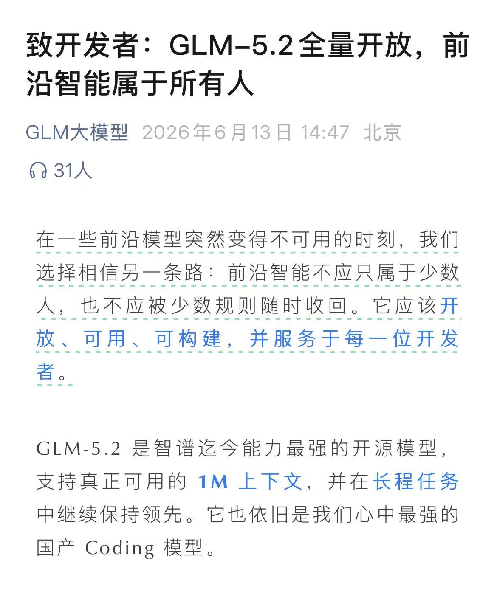
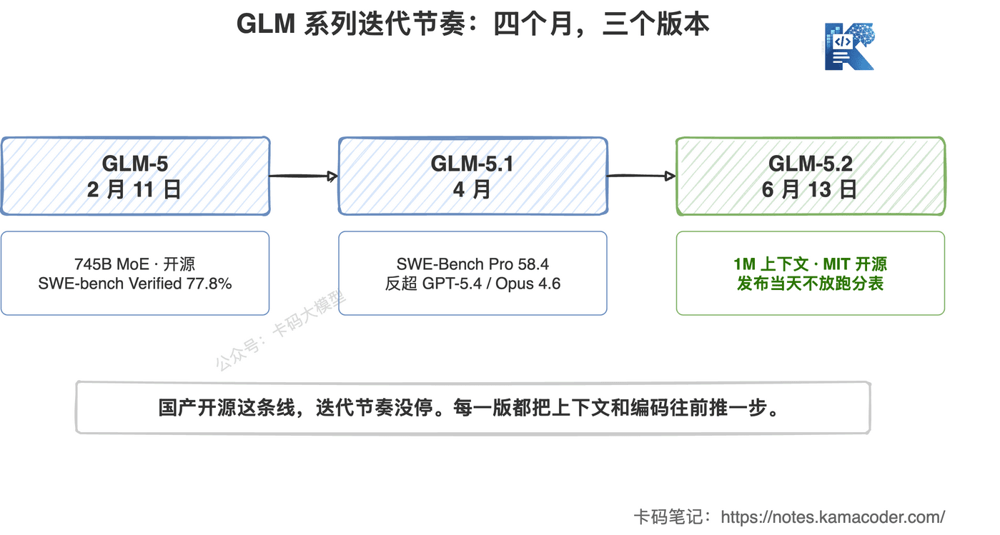
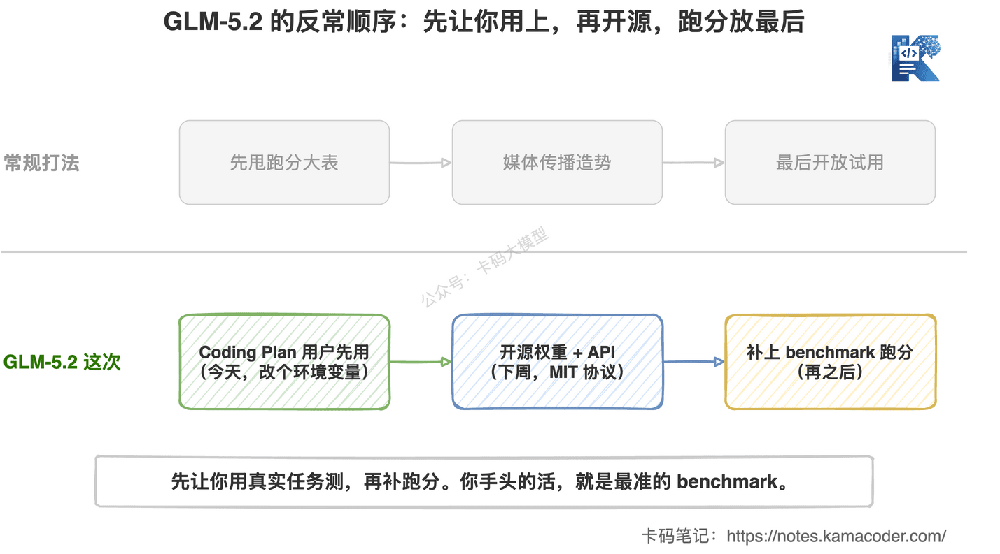
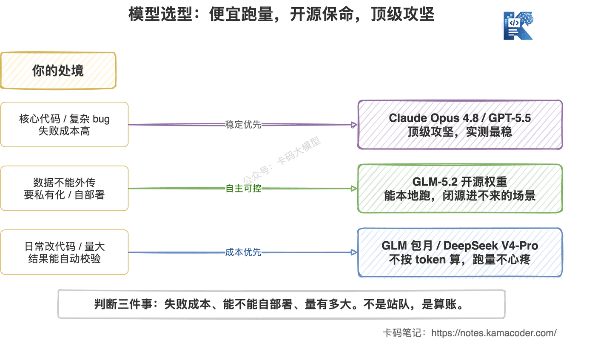

# GLM-5.2发布：智谱这次不放跑分表，先让你用上，开源、1M上下文、华为昇腾训练

> 来源: https://notes.kamacoder.com/llm/news/glm-5-2.html

# `# GLM-5.2发布：智谱这次不放跑分表，先让你用上，开源、1M上下文、华为昇腾训练 
 

智谱今天（2026 年 6 月 13 日）发布了 GLM-5.2。 

 

算一下节奏：2 月 11 日 GLM-5，4 月 GLM-5.1，今天 GLM-5.2。 

四个月三个版本，国产这边卷得也不轻。 

 

但这次发布最让我意外的，不是又快了一个小版本。 

而是另一件事： 

**官方发布当天，一张 benchmark 跑分表都没放。** 

你没看错。 

没有 SWE-bench，没有 Terminal-Bench，没有那种"我赢了谁几个点"的大表。 

这在 2026 年的大模型发布里，几乎是反常的。 

卡哥觉得这事值得单独说说。 

## `# 一、别人比谁分高，智谱直接说先别看分 

这两年大模型发布几乎是同一个套路。 

先甩一张大表，自己的模型某几项第一，标红加粗。 

我们前面写 Claude Opus 4.8 那篇就吐槽过：**大表负责传播，脚注负责真相。** 一个模型换个 harness、换个工具链，分数能差好几个点。 

GLM-5.2 这次干脆把表撤了。 

官方的发布口径很直白： 

**先开放给 GLM Coding Plan 的用户用，开源权重和 API 往后放一周，benchmark 也一起延后。** 

一句话总结就是： 

**Coding Plan 优先，不是跑分优先。** 

 

这个顺序很有意思。 

正常发布是：跑分 → 媒体传播 → 开放试用。 

GLM-5.2 反过来：先让付费用户用上 → 一周后放权重和 API → 再补跑分。 

存量 Coding Plan 用户今天就能用，方式简单到离谱——**改一个环境变量，把模型 ID 换成 `glm-5.2` 就行。** 

你不用等评测，自己的活就是最好的评测。 

## `# 二、先别急着夸，也别急着骂 

我知道有录友看到"不放跑分"会立刻分两派。 

一派说：有底气，敢让你直接用真实任务测，不玩数字游戏。 

一派说：是不是分不好看，藏着掖着？ 

卡哥的看法是，**两种解读现在都成立，因为没数据。** 

这正是问题所在。 

没有第三方跑分，意味着现在所有对 GLM-5.2 的判断，本质上都是智谱的"意向声明"，不是排行榜实测位置。 

官方说了三句话： 
  - 强大的编码能力   - 可用的 1M 上下文   - 长程任务继续领先 

注意"可用的 1M"这个措辞。 

这种留有余地的说法，通常说明内部自己也清楚：**1M 上下文能塞进去，和 1M 上下文里每个 token 都管用，是两回事。** 

我们在 MiniMax M3 评测 里反复强调过这点：长上下文的"能装"和"装了还准"差很远。 

所以我的态度是： 

**这次发布值得关注，但现在还不能下"超过谁"的结论。** 

等下周权重和 API 放出来，第三方一测，才有真东西可聊。 

在那之前，参考一下它的"出身"会更靠谱。 

GLM-5 当时是 745B 的 MoE，激活 44B，SWE-bench Verified 77.8%，在开源里是头部。GLM-5.1 更狠，SWE-Bench Pro 58.4，反超了 GPT-5.4（57.7）和 Claude Opus 4.6（57.3），编码能力做到了 Opus 4.6 的九成多。 

按这个底子推，GLM-5.2 大概率不会差。 

但"大概率不差"和"实测领先"，还是别混为一谈。 

## `# 三、真正的看点，是开源加国产算力 

跑分可以等，但有两件事是 GLM-5.2 实打实的差异化。 

**第一，它要开源，而且是 MIT。** 

下周放权重，MIT 协议，免费商用。 

这意味着什么？ 

**任何一家公司，可以把它下下来，跑在自己的服务器上，不用把代码喂给闭源 API。** 

Claude Opus 4.8、GPT-5.5 再强，你也只能调它的接口。数据出门，按 token 付费，模型权重你永远摸不到。 

对一部分录友和公司来说，这条线是硬需求： 
  - 代码不能外传的金融、政企项目   - 想做私有化部署的团队   - 想在开源权重上自己做微调、蒸馏的研究 

这些场景里，闭源前沿模型再强也进不来。开源就是开源，没得替代。 

**第二，GLM 这条线是华为昇腾训练的，全程没用 Nvidia。** 

从 GLM-5.1 开始，智谱就公开说训练完全跑在华为昇腾上。 

这件事的意义不在跑分，在供应链。 

**一个不依赖 Nvidia、权重还开源的前沿模型，本身就是一种确定性。** 

在芯片这么敏感的时间点，这个确定性，有时候比多两个点的 SWE-bench 更值钱。 

## `# 四、GLM Coding Plan 怎么买，值不值 

GLM-5.2 现在的入口就是 GLM Coding Plan  (opens new window)。 

它不是按 token 计费，是按"提示次数"包月的订阅制，分四个档： 

| 档位  5 小时额度  周额度  适合谁 
| Lite  ~80 次提示  ~400 次  先评估试用 
| Pro  ~400 次提示  ~2,000 次  日常开发主力 
| Max  ~1,600 次提示  ~8,000 次  高强度重度使用 
| Team  按座位  组织共享账单  团队 

价格大概 $18/月 起。 

我的实话实说： 

**这套订阅制的性价比，是 GLM 这条线最能打的地方。** 

我在 DeepSeek V4 降价 那篇就提过，目前我写代码性价比最高的组合之一，就是 Claude 的 Agent + CLI，配 GLM 的 Coding Plan 兜底。 

逻辑很简单： 
  - 用 Claude Code / GLM 自己的 CLI 做交互层   - 难任务上 Opus 4.8、GPT-5.5   - 大量的日常改代码、补测试、读模块，交给包月的 GLM，跑多少都不心疼 

**包月买的是"不用算 token 的安全感"。** 你不会因为多让模型读几遍代码就肉疼，这种心态对写代码很重要。 

不过别冲动。 

先上 Lite 评估，活儿对得上再升 Pro，真到天天重度用再考虑 Max。 

不要一上来就 Max，额度用不满就是浪费。 

## `# 五、和 Opus 4.8、DeepSeek V4 怎么选 

老问题又来了：这么多模型，到底用哪个。 

卡哥的选型逻辑一直没变：**不是站队，是算账。** 

按三件事分流：失败成本、能不能自部署、量有多大。 

 

说具体点： 

| 你的处境  推荐  为什么 
| 核心代码、复杂 bug、长链路 Agent，失败成本高  Claude Opus 4.8 / GPT-5.5  实测最稳，会验证，工具调用习惯好 
| 数据不能外传 / 要私有化部署 / 想自己微调  GLM-5.2（开源权重）  闭源模型再强也进不来，开源是硬需求 
| 日常改代码、补测试、读模块，量大  GLM Coding Plan 包月  不按 token 算，跑多少不心疼 
| 批量分析、代码扫描、结果能自动校验  DeepSeek V4-Pro  便宜，量大跑得起 

这几个不是互斥的，真实开发里我经常是混着用。 
  - 难的地方上 Opus 4.8   - 量大的日常用 GLM 包月或 DeepSeek   - 碰到数据敏感、必须本地跑的，GLM-5.2 开源权重是唯一选项 

**便宜模型跑量，开源模型保命，顶级模型攻坚。** 三句话基本能覆盖。 

## `# 写在最后 

GLM-5.2 这次发布，最值得记住的不是某个跑分。 

是它的打法： 

**先让你用上，开源权重跟上，跑分往后放。** 

这套打法对开发者其实是友好的——你不用被一屏大表带节奏，自己的真实任务就是最准的 benchmark。 

但也别因为它"不卷跑分"就上头。 

没数据的时候，官方说的每一句都还只是意向，不是结论。 

我的建议很简单： 
  - 已经在用 GLM Coding Plan 的，改个环境变量直接试，用你手头真实的活去测   - 要私有化、要自部署的，盯紧下周的开源权重   - 没特殊需求的，等下周第三方跑分出来再决定也不迟 

模型选型从来不是追新。 

是看哪个在你的任务上，更稳、更便宜、更可控。 

自己测，按活儿选。 

加油。
