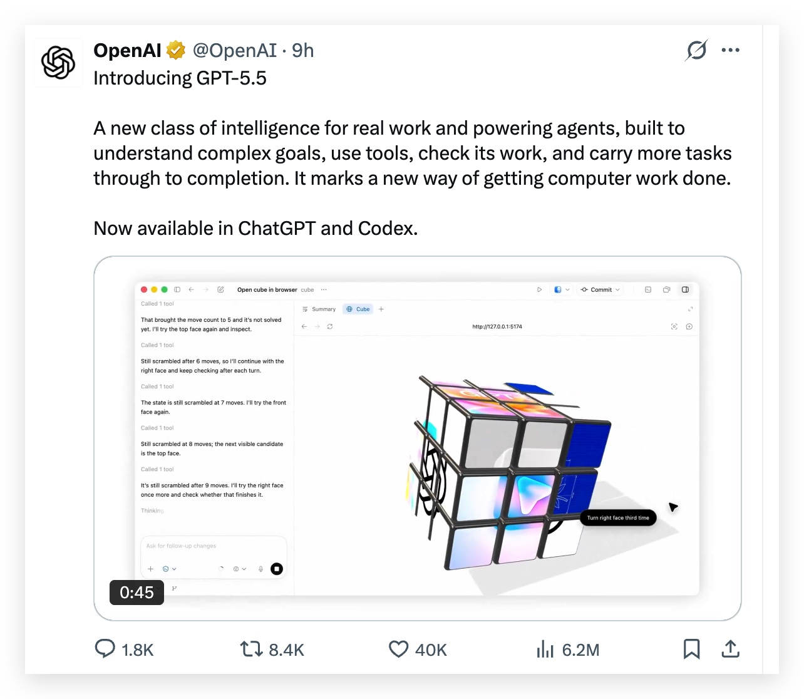
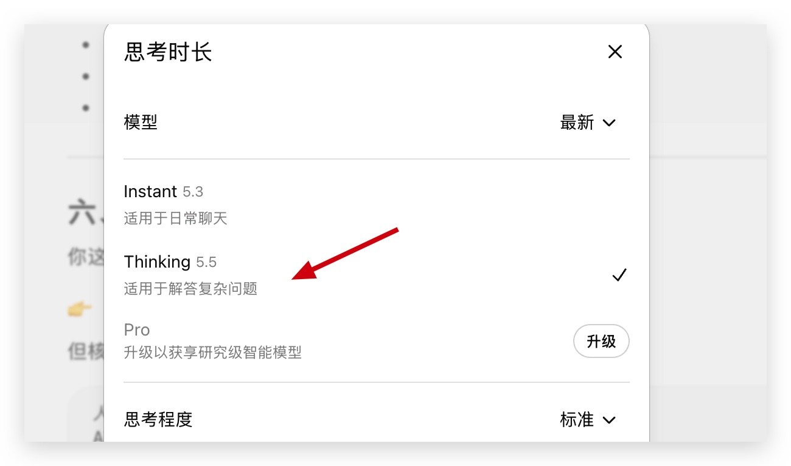
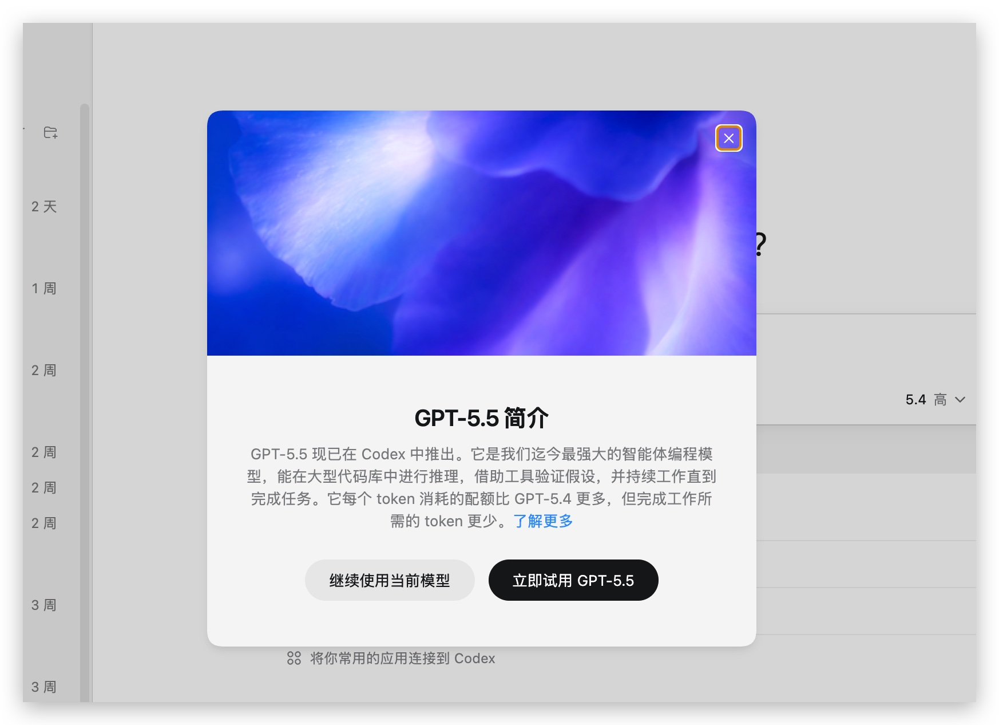
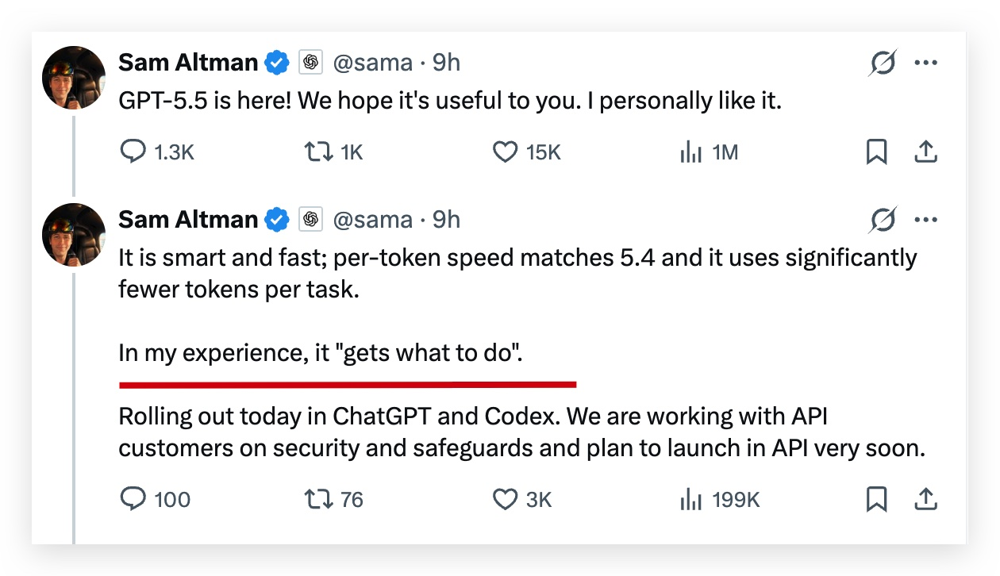
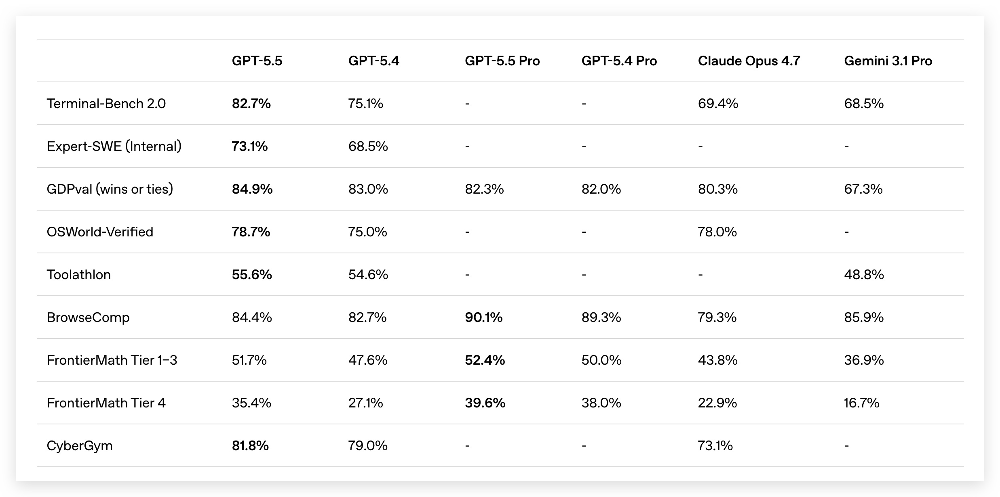
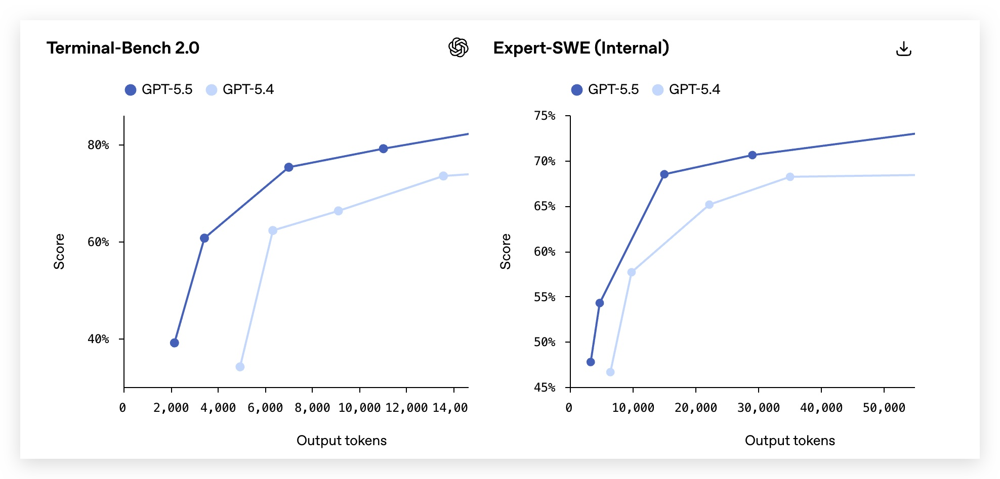
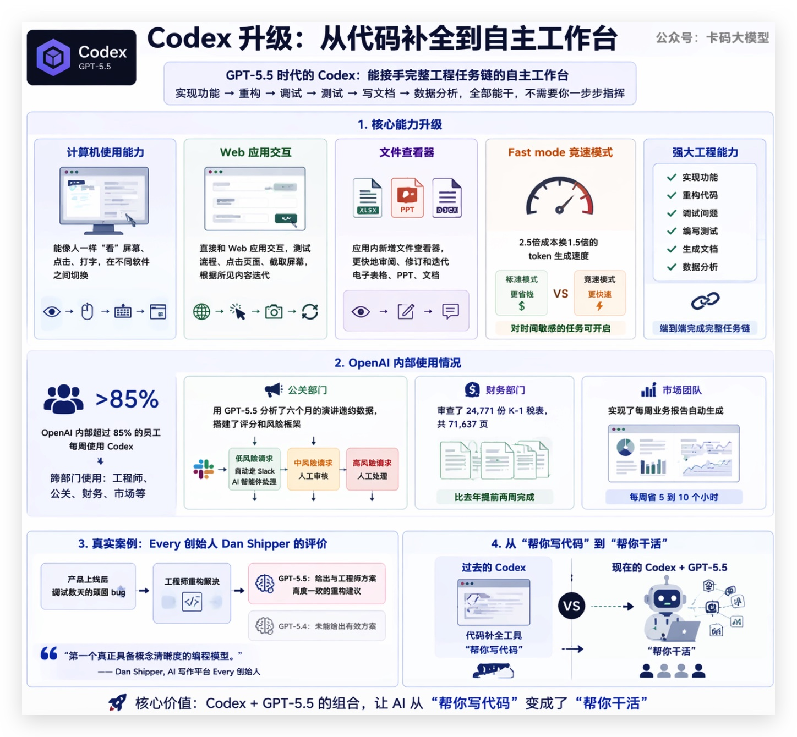
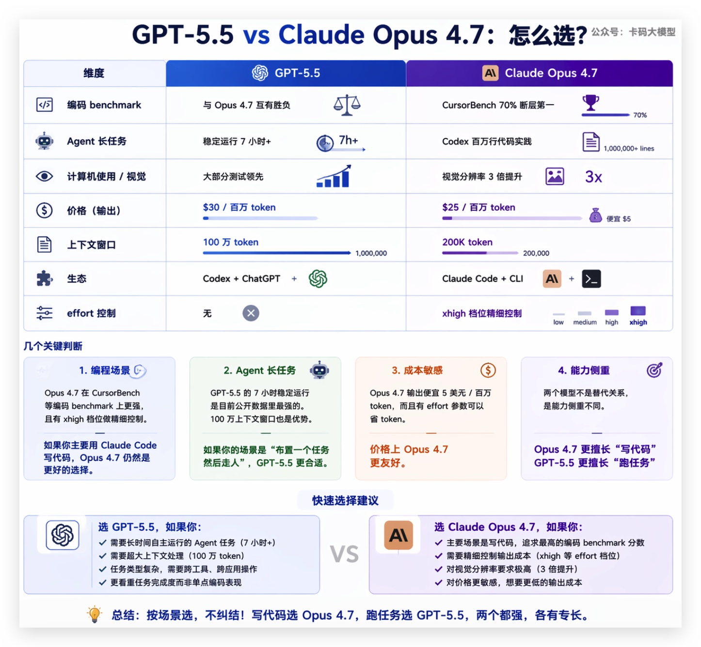
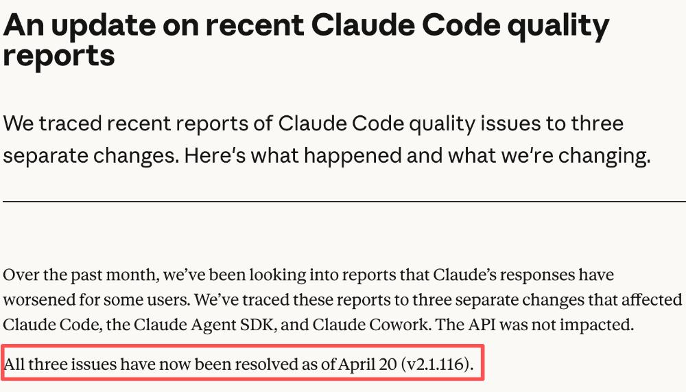

# GPT-5.5发布：OpenAI最强Agent编程模型，稳定自主运行7小时，价格翻倍值不值？

> 来源: https://notes.kamacoder.com/llm/news/gpt-5-5.html

# `# GPT-5.5发布：OpenAI最强Agent编程模型，稳定自主运行7小时，价格翻倍值不值？ 
 
> 

如果大家想充值GPT会员，这里推荐一个靠谱chatGPT代充  (opens new window)
 

上周刚写完Claude Opus 4.7发布  (opens new window)，还在感叹Opus编码能力遥遥领先。 

结果今天凌晨，OpenAI直接甩出GPT-5.5。看看X上的介绍： 

 

现在大家在 chatgpt的网页端和codex上用起来了。 

我这里已经更新： 

 

codex也通知更新： 

 

OpenAI团队原话：**这是我们迄今为止最智能、最直观易用的模型**。 

Sam Altman本人的评价更直接：**根据我的经验，它知道该做什么**。 

 

"知道该做什么"，用过Agent的录友应该能get到——现在大部分模型的问题不是"不会做"，而是"不知道该做什么"。它需要你把每一步都安排好，少说一句它就跑偏。 

GPT-5.5想解决的就是这个问题。 

接下来逐个拆开看看。 

## `# 评测 

先看硬数据。 

 

图里那些英文评测名字，大部分录友可能看不懂，逐个解释一下： 

**编码类** 

**Terminal-Bench 2.0**——全链路Agent工程能力。不是写一段代码就完事，而是在真实终端环境中完成"实现→调试→验证"的完整工程链。GPT-5.5拿到82.7%，Opus 4.7没有公开这个分数。 

**Expert-SWE (Internal)**——OpenAI内部评测，专门测人类预估中位完成时间20小时的长周期编程任务。比SWE-Bench难得多，Codex研究员自己都说"SWE-Bench已不能衡量顶尖编程能力了"。GPT-5.5拿到73.1%。 

**SWE-Bench Pro**——业界公认最能反映真实GitHub issue解决能力的评测，给模型一个真实的GitHub issue描述，让它生成修复补丁。GPT-5.5得分58.6%，**但Opus 4.7是64.3%，这块GPT-5.5输了。** 

**Aider Polyglot**——Aider排行榜的多语言编码测试，不只是一种语言写对就行，跨语言都要能干活。 

**知识工作 / Agent类** 

**GDPval**——评估AI在44个职业中完成规范知识工作的水平，涵盖法律、医疗、金融等领域。GPT-5.5拿到84.9%，Opus 4.7是80.3%。 

**OSWorld-Verified**——测试模型能否独立操作真实电脑环境——像人一样看屏幕、点鼠标、打字、在不同软件间切换。GPT-5.5得分78.7%，Opus 4.7是78.0%，基本打平。 

**Tau2-bench**——测试模型在复杂客服工作流中处理多轮对话、查询系统、执行操作的能力。GPT-5.5在没有提示词调优的情况下达到98.0%。 

**MMMU Pro**——带工具调用的多模态视觉理解测试，看图的同时还能调用工具，考验的是组合场景下的能力。 

**科研 / 学术类** 

**GeneBench**——多阶段科学数据分析，要求模型在几乎没有人工干预的情况下处理模糊数据、应对隐藏混杂因素。分低是因为难度极高，GPT-5.5拿到25.0%。 

**BixBench**——基于真实生物信息学设计的评测，GPT-5.5得分80.5%，所有已公开分数的模型中排名第一。 

**FrontierMath Tier 4**——由陶哲轩等顶级数学家策划的前沿数学题库中最难一档，题目涉及代数几何、数论，难度接近未发表研究。GPT-5.5得分35.4%，Opus 4.7只有22.9%，差距超过12个百分点。 

**ARC-AGI-2**——通用智能基准测试，测抽象推理和泛化能力，被认为是衡量AGI进展的重要指标。GPT-5.5拿到85.0%。 

**安全类** 

**CTF (Capture The Flag)**——网络安全夺旗赛，测安全攻防能力，GPT-5.5得分88.1%。 

**CyberGym**——网络安全综合评测，涵盖漏洞分析、攻击模拟，GPT-5.5拿到81.8%，Opus 4.7是73.1%。 

看完这些数字，结论很明确：**GPT-5.5在Agent场景（终端操作、电脑使用、知识工作、科研）大幅领先，但在纯编码修复（SWE-Bench Pro）还是输给了Opus 4.7。** 

## `# 一、编程能力：超越Gemini 3.1 Pro，与Opus 4.7互有胜负 

GPT-5.5的编程能力**全面超越了Gemini 3.1 Pro**，这个没什么争议。 

但和Claude Opus 4.7比呢？情况有点微妙： 

**GPT-5.5领先的领域**：专业任务、计算机使用与视觉、工具使用、抽象推理——这些领域的测试成绩大部分高于Claude Opus 4.7。 

**GPT-5.5没拉开差距的领域**：学术能力和工具使用——和Claude Opus 4.7、Gemini 3.1 Pro差不多。 

说白了，GPT-5.5强在**Agent场景**——需要跨上下文推理、持续自主行动的任务。纯学术benchmark，三家没拉开实质性差距。 

这也符合OpenAI这次的主打方向：GPT-5.5不是刷榜模型，是**干活模型**。 

## `# 二、Agent能力：这才是GPT-5.5的核心升级 

OpenAI这次反复强调的词是"Agentic"。 

在Terminal-Bench 2.0、Expert-SWE (Internal) 可以看到 5.5的较大进步。 （这两个评测不知道啥意思的话，可以看本篇开头的介绍） 

 

GPT-5.5在**智能体编程、计算机使用、知识型工作、早期科学研究**领域提升最显著——共同特点是：需要跨上下文推理和持续自主行动。 

不是单步变强了，是**连续干活的能力变强了**。 

几个实测案例： 

**案例1：20分钟完成代码合并** 

开源项目Claude Engineer的创建者Pietro Schirano，让GPT-5.5对比两个版本的代码差异，然后基于正式版本创建新分支，将其他分支的所有改动合并进去——只用了大约**20分钟**。 

他还用GPT-5.5一次性生成了一个可玩的3D射击游戏，每个图形由Three.js从零生成。 

更离谱的是，他让GPT-5.5**通过USB连接**为Flipper Zero创建应用程序，并成功推送到设备上。他感慨："我第一次感觉自己不再受限于模型的功能，而只受限于我的想象力。" 

**案例2：稳定自主运行7小时** 

AI工程师Peter Gostev做了个深度测试——给GPT-5.5设定步骤提示词，让它按步骤逐项完成。实测：**至少可以稳定自主运行7个小时**。 

7小时意味着什么？意味着你早上给它布置一个任务，中午吃饭回来，它还在干，而且没跑偏。 

对比一下，之前大部分Agent模型跑30分钟就开始"忘事"了——上下文腐化、偏离初衷、重复劳动。GPT-5.5能跑7小时不崩，这个进步是实打实的。 

**案例3：11分钟构建数学应用** 

波兰密茨凯维奇大学数学系助理教授Bartosz Naskręcki，用Codex中的GPT-5.5，**仅凭一条提示词，11分钟内**构建了一个代数几何应用——可视化二次曲面的交线，并将结果转换为Weierstrass模型。 

## `# 三、Codex升级：从代码补全到自主工作台 

这次发布，OpenAI 说的最多的是 Codex。 

之前的 Codex 本质上还是代码补全工具——你写一段，它续一段。但 GPT-5.5 时代的 Codex，OpenAI 的定位变了：**能接手完整工程任务链的自主工作台。** 

什么叫"自主工作台"？就是从实现功能、重构、调试、测试到写文档、跑数据分析，全部能干，不需要你一步步指挥。 

具体升级了什么？ 

**计算机使用能力**——Codex 现在能像人一样"看"屏幕、点击、打字，在不同软件之间切换。你可以让它去测试一个入职流程，它会自己打开网页、填表、点按钮、截屏，根据看到的内容不断迭代，直到任务完成。 

**Web 应用交互**——Codex 可以直接和 Web 应用交互，测试流程、点击页面、截取屏幕，然后根据所见内容迭代。不只是写代码了，是能"操作"了。 

**文件查看器**——应用内新增了文件查看器，可以更快地审阅、修订和迭代电子表格、PPT、文档。 

**Fast mode**——Codex 新增竞速模式，2.5倍成本换1.5倍的 token 生成速度。对时间敏感的任务可以开，不急的就用标准模式省钱。 

还有一个数据挺有意思：OpenAI 内部超过 **85% 的员工**每周使用 Codex，跨部门——不只是工程师，公关、财务、市场都在用。 

具体怎么用的？公关部门用 GPT-5.5 分析了六个月的演讲邀约数据，搭建了评分和风险框架，低风险请求自动走 Slack AI 智能体处理。财务部门审查了 24,771 份 K-1 税表，共 71,637 页，比去年提前两周完成。市场团队实现了每周业务报告自动生成，**每周省 5 到 10 个小时**。 

AI 写作平台 Every 创始人 Dan Shipper 给了一个很具体的案例：他在产品上线后调试了数天的顽固 bug，最终靠工程师重构解决。他用 GPT-5.5 重新面对同一个问题，模型给出了与工程师方案高度一致的重构建议。而 GPT-5.4 没做到。他的评价是："**第一个真正具备概念清晰度的编程模型**。" 

这些案例说明一件事：**Codex + GPT-5.5 的组合，让 AI 从"帮你写代码"变成了"帮你干活"。** 这才是 OpenAI 这次想讲的核心故事。 

 

## `# 四、速度与效率：比GPT-5.4更省token 

GPT-5.5保持了和GPT-5.4**相同的每token延迟**，但智能水平更高。 

而且完成相同的Codex任务时，GPT-5.5使用的token数**显著更少**。 

这意味着两件事： 
  - **同样的事，GPT-5.5用更少的token就能做完**——效率更高   - **同样的事，GPT-5.5做得更好**——能力更强 

又快又好还省钱？等等，别急，往下看价格。 

## `# 五、价格：翻倍了 

这是最扎心的部分。 

| 模型  输入价格  输出价格 
| GPT-5.4  $2.5/百万token  $15/百万token 
| **GPT-5.5**  **$5/百万token**  **$30/百万token** 
| **GPT-5.5 Pro**  **$30/百万token**  **$180/百万token** 
| Claude Opus 4.7  $5/百万token  $25/百万token 

GPT-5.5比GPT-5.4**贵了一倍**。 

和Claude Opus 4.7比：输入价格一样，输出每百万token贵5美元。基本持平。 

但GPT-5.5 Pro就离谱了——$180/百万输出token，这是给不差钱的大厂准备的。 

**我的看法**：GPT-5.5虽然单位token更贵，但做同样任务用的token更少，实际成本差距没有价格表看起来那么大。 

不过"更省token"这个优势能不能抵消"价格翻倍"，取决于你的具体任务——简单任务用5.4就够了，复杂Agent任务5.5更合适。 

**还有一个变量**：上下文窗口100万token。之前GPT-5.4也是100万，没变。 

但7小时Agent任务跑下来，100万token能不能撑住？如果中间需要Context Reset，那实际token消耗可能比预期高不少。 

## `# 六、与Claude Opus 4.7 各有所长 

 

上周刚写的Opus 4.7  (opens new window)，编码能力暴涨、视觉3倍提升、xhigh档位。现在GPT-5.5来了，怎么选？ 

| 维度  GPT-5.5  Claude Opus 4.7 
| 编码benchmark  与Opus 4.7互有胜负  CursorBench 70%断层第一 
| Agent长任务  稳定运行7小时+  Codex百万行代码实践 
| 计算机使用/视觉  大部分测试领先  视觉分辨率3倍提升 
| 价格（输出）  $30/百万token  $25/百万token 
| 上下文窗口  100万token  200K token 
| 生态  Codex + ChatGPT  Claude Code + CLI 
| effort控制  无  xhigh档位精细控制 

几个关键判断： 

**编程场景**：Opus 4.7在CursorBench等编码benchmark上更强，且有xhigh档位做精细控制。如果你主要用Claude Code写代码，Opus 4.7仍然是更好的选择。 

**Agent长任务**：GPT-5.5的7小时稳定运行是目前公开数据里最强的。100万上下文窗口也是优势。如果你的场景是"布置一个任务然后走人"，GPT-5.5更合适。 

**成本敏感**：Opus 4.7输出便宜5美元/百万token，而且有effort参数可以省token。价格上Opus 4.7更友好。 

**说白了**：Opus 4.7更擅长"写代码"，GPT-5.5更擅长"跑任务"。两个不是替代关系，是能力侧重不同。 

## `# 七、Anthropic紧急出手：修复降智，重置限制 

GPT-5.5发布的时间点很有意思——Claude Code最近性能变差的事情，社区里骂声一片。 

Anthropic反应很快：GPT-5.5发布当天，发长文宣布**已修复降智问题**，并且**重置所有订阅用户的使用限制**。 

 

修复和重置是真的，但时机也确实是被迫的——用户刚在抱怨Claude变笨，竞品就发布了新品，不动作不行。 

## `# 写在最后 

GPT-5.5三个关键词：**Agent更强、价格翻倍、与Opus 4.7各有所长**。 

对开发者来说： 
  - **在用Claude Code写代码的**：不用急换，Opus 4.7编码能力仍然更强，而且更便宜   - **在跑Agent长任务的**：值得试试GPT-5.5，7小时稳定运行确实是目前最强   - **预算有限的**：GPT-5.4或Opus 4.6仍然是性价比之选，GPT-5.5翻倍的价格不是谁都扛得住   - **做竞品分析的**：注意GPT-5.5在"计算机使用"和"工具使用"上的领先——这说明OpenAI在Agent这个方向上投入很大 

最后说一句实话：现在大模型迭代速度太快了，Opus 4.7刚发布一周，GPT-5.5就来了。接下来Google I/O大概率也会放Gemini的新版本。 

（deepseekV4 也发布了，明天单独写一篇来分析一下） 

加油
