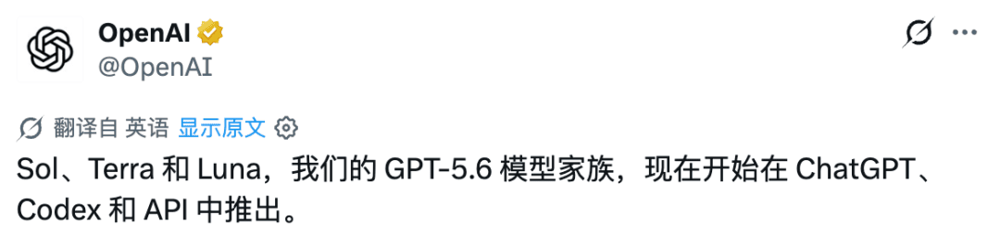
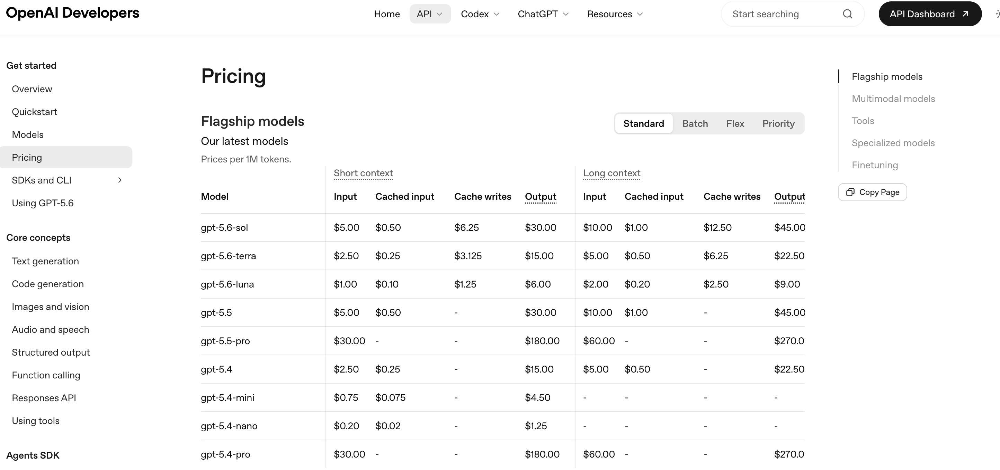
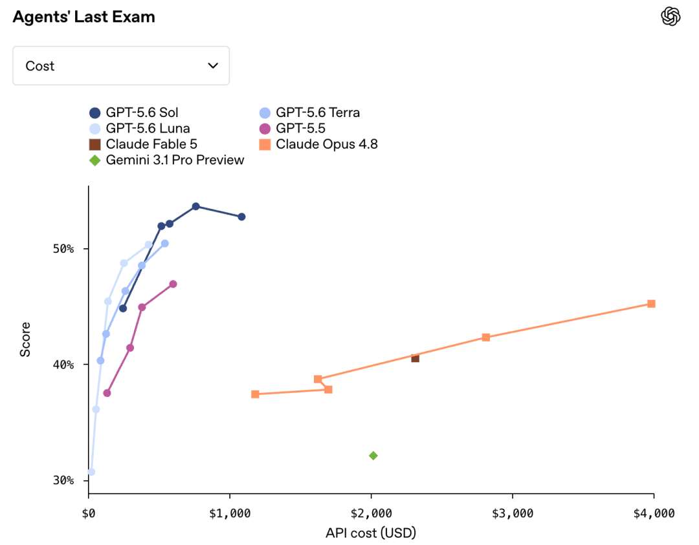
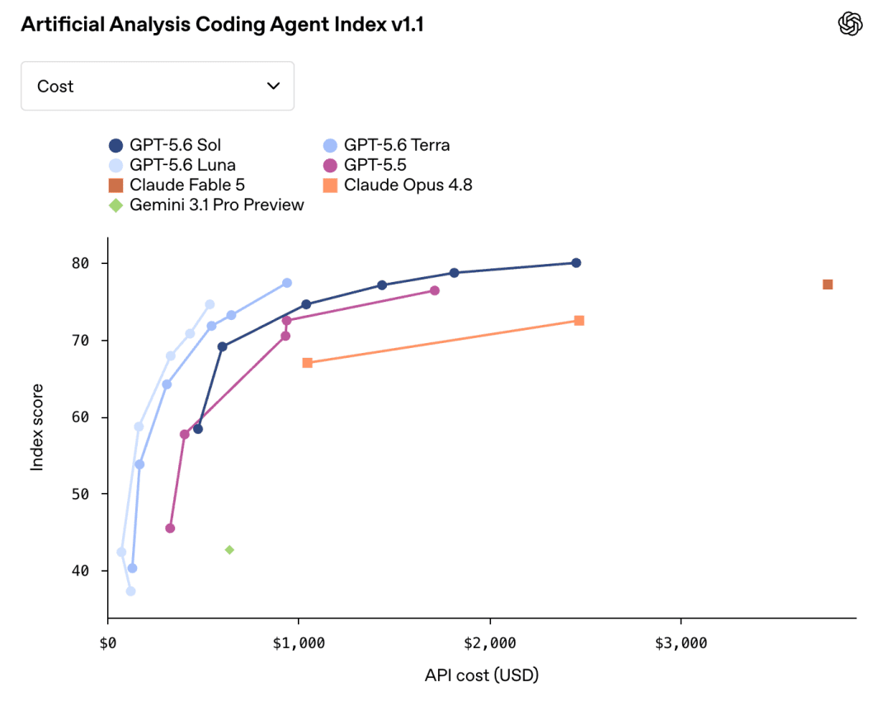
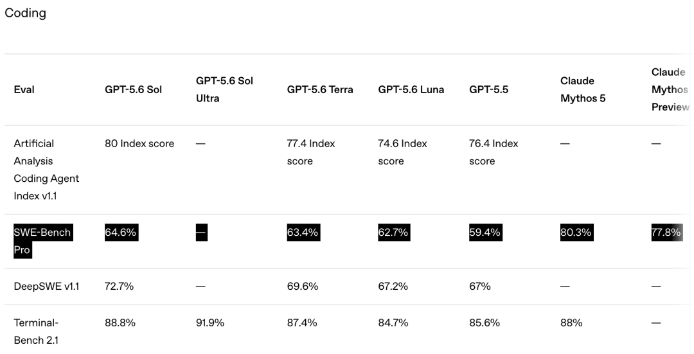
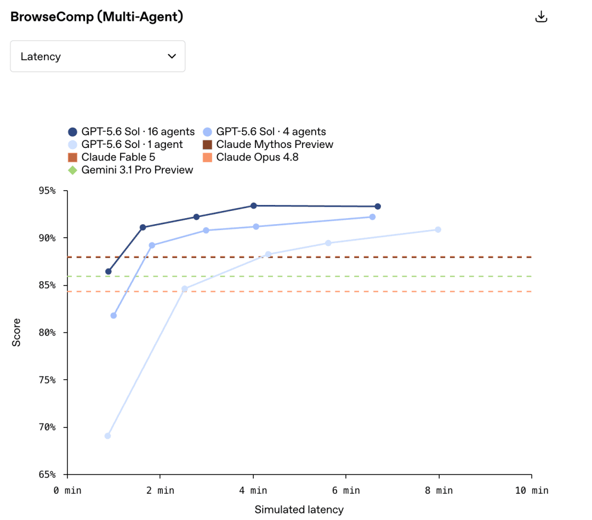
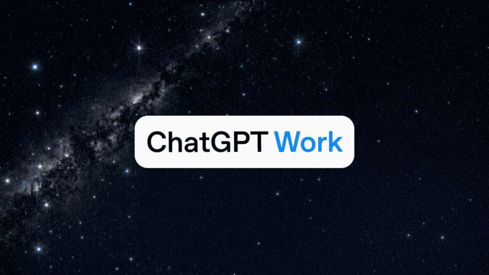
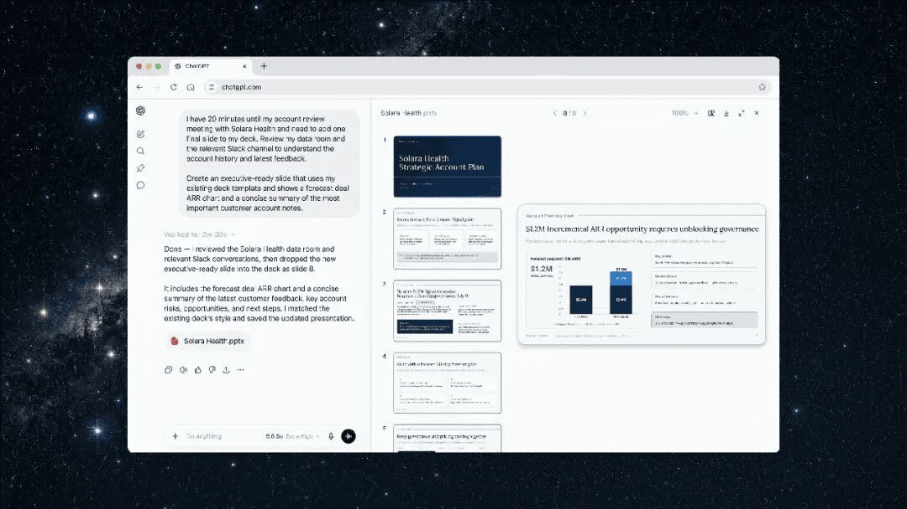
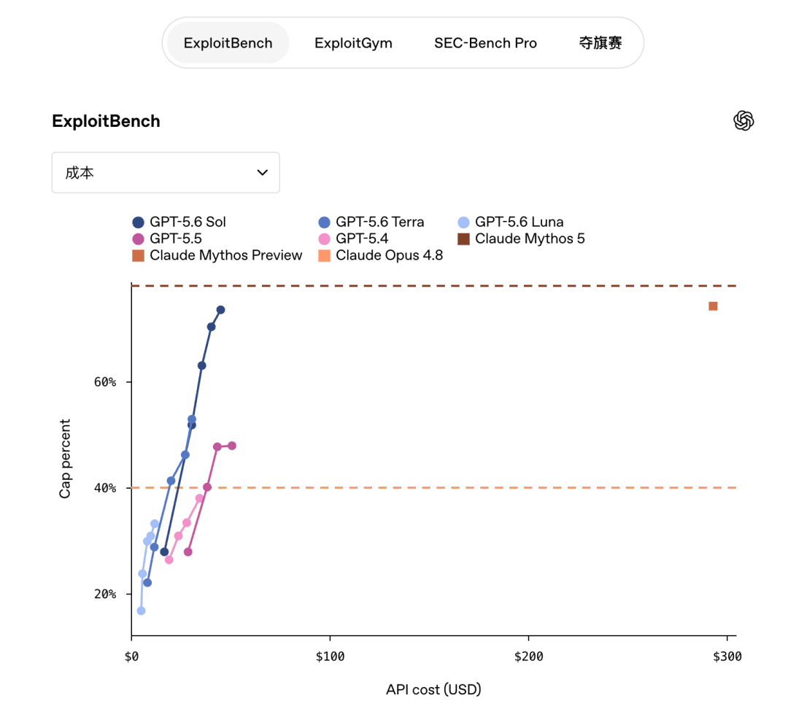
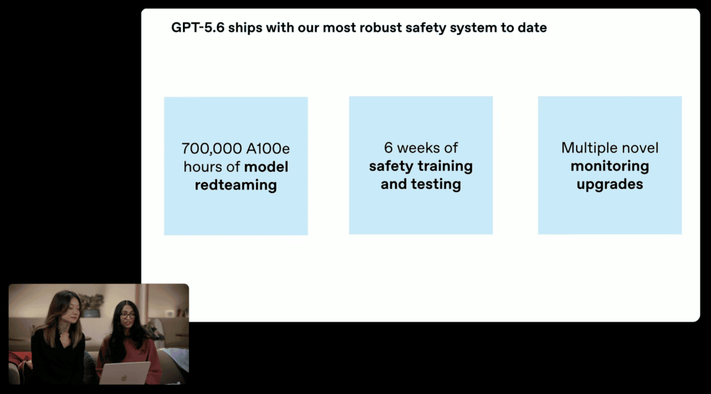

# GPT-5.6突然全面开放：Codex并入ChatGPT，AI开始自己组队干活了

> 来源: https://notes.kamacoder.com/llm/news/gpt-5-6.html

# `# GPT-5.6突然全面开放：Codex并入ChatGPT，AI开始自己组队干活了 
 

两周前，OpenAI 先把 GPT-5.6 交给少量合作伙伴测试，普通用户只能在外面看热闹。 

现在终于不用等了。 

2026年7月9日，OpenAI 宣布 GPT-5.6 正式全面上线，24小时内陆续覆盖 ChatGPT、Codex 和 API。 

而且这次不是只发一个模型，是一口气端出三个：**旗舰 Sol、均衡款 Terra、低成本款 Luna。** 

 

前面写GPT-5.5的时候，我说它最大的变化是从“帮你写代码”走向“替你跑完整任务”。 

GPT-5.6 接着往前推了一步：**模型不只会跑任务，还会自己拆任务、调工具、并行拉起多个智能体，最后把结果收回来。** 

模型之外，OpenAI 还把 Codex 独立 App 并入新版 ChatGPT 桌面端，推出 ChatGPT Work 和 Sites。 

所以这次真正的主角，不只是 GPT-5.6。 

**OpenAI 想把 ChatGPT 从聊天框，改造成一个能持续干活的操作系统。** 

（如果国内读者因为各种原因（网络、手机号验证等等）用不了GPT、Claude的模型，推荐用这个中转APIDOCK  (opens new window)，还是很靠谱的） 

## `# 一次发三个模型，OpenAI也开始给智能分档了 

先把三个名字说清楚。 

| 模型  定位  API输入价格  API输出价格  更适合什么任务 
| GPT-5.6 Sol  旗舰模型  $5/百万Token  $30/百万Token  复杂编程、长链路Agent、科研、安全、攻坚任务 
| GPT-5.6 Terra  均衡模型  $2.5/百万Token  $15/百万Token  日常开发、知识工作、大多数生产任务 
| GPT-5.6 Luna  最快、最便宜  $1/百万Token  $6/百万Token  高频调用、摘要分类、后台自动化、轻量Agent 

 

Sol 还是上一代旗舰 GPT-5.5 的价格，Terra 直接打五折，Luna 更便宜。 

这不是传统的“大杯、中杯、小杯”那么简单。 

OpenAI 明确说了，Sol、Terra、Luna 会成为长期能力档位，以后可以各自按不同节奏升级。数字代表模型世代，名字代表能力层级。 

翻译成人话就是：**以后选 OpenAI 模型，不能只看版本号，还得先看任务值不值得上 Sol。** 

这套设计很像真实团队。 

普通活交给 Luna，日常主力用 Terra，真正难啃的任务再找 Sol。所有请求都无脑调用 Sol，不叫尊重智能，叫不会算账。 

提示缓存也改了。缓存读取只收正常输入价格的一折，缓存写入按正常输入价格的1.25倍计费，开发者可以手动设置缓存断点，缓存至少保留30分钟。 

对长提示词、固定工具说明、企业知识库和长时间 Agent 来说，这个变化比“又涨了几分”更实在。**重复上下文不用每一轮都按原价重算，账单会更可控。** 

## `# 这次最狠的不是跑分，是“每完成一个任务花多少钱” 

看 GPT-5.6 的官方发布页，会发现 Claude 的名字出现得非常勤快。 

OpenAI 这次的宣传策略很直接：不只比谁得分高，还比完成同一个任务需要多少时间、多少 Token、多少钱。 

在 Agents' Last Exam 这个覆盖55个行业、考察长流程专业工作的评测中，OpenAI 公布的最高配置成绩达到53.6，比 Claude Fable 5 高13.1分。即使只开中档推理，官方估算成本也只有 Fable 5 的四分之一左右。 

 

不过这里要提醒录友一句：**发布正文里的最高曲线成绩，和文末完整评测表里的标准配置数字不是同一档，不能混着比。** 

完整表格里，标准 Sol 是52.7%，Terra 是50.4%，Luna 是50.3%。配置不同、推理强度不同、成本预算不同，结果都会变。 

OpenAI 自己也在脚注里承认，图里的延迟和 API 成本是根据生产行为离线模拟出来的，真实项目可能差很多。 

所以这些图能说明趋势，但不能直接拿来算你下个月的账单。 

## `# 编程能力很强，但还没把Claude打趴下 

编程当然是主战场。 

在 Artificial Analysis Coding Agent Index v1.1 上，GPT-5.6 Sol 拿到80分，高于 Fable 5 的77.2分。Terra 是77.4，Luna 是74.6，也都比上一代更有性价比。 

 

Terminal-Bench 2.1 上，Sol 是88.8%，ultra 模式能到91.9%，超过 Claude Mythos 5 的88%。DeepSWE 上，Sol 也拿到72.7%。 

这些评测更接近真实 Agent 工作：进终端、读仓库、改代码、运行命令、处理失败、继续推进。 

这正是 GPT-5.6 的优势区间。 

但如果有人说 GPT-5.6 已经把 Claude 全面打趴下了，那也不恰当。 

在 SWE-Bench Pro 上，Sol 只有64.6%，Fable 5 是80%，Mythos 5 是80.3%。差距不是误差，是一眼就能看出来的差距。 

 

FrontierMath Tier 4 上，Sol 是83%，Fable 5 是87.8%；GDPval-AA 专业工作评测里，Sol 的1747.8 Elo 也略低于 Fable 5 的1759.6。 

所以更准确的结论是： 

**GPT-5.6 在长链路Agent、终端任务、速度和单位成本上非常强；Claude 在部分代码修复、专业工作和高难数学上仍然领先。** 

这和我前面分析Claude Fable 5、Claude Opus 4.8时的结论一致：别只问谁是最强模型，要看你的失败成本发生在哪。 

## `# ultra模式：一个模型干不过，就拉一队模型一起干 

GPT-5.6 新增了两个更高推理档位：`max` 和 `ultra`。 

`max` 比原来的 `xhigh` 获得更多思考时间。模型可以多验算几次、多换几条路径、多做几轮检查。 

`ultra` 更直接：**默认拉起4个智能体并行开工，部分评测可以扩到16个。** 

 

这不是简单地把同一道题复制四份。 

一条工作流可以拆成资料搜索、代码实现、测试验证、结果审查几条支线，不同智能体并行推进，根智能体再把结果合并。 

图里真正值得看的不是“16个一定比4个强”，而是曲线向左上方移动：**同样时间拿到更高分，或者同样分数更快完成。** 

代价也非常明显：更多智能体意味着更多 Token。 

所以 ultra 不是日常开关。普通改文案、写接口、修小 Bug 也开16个智能体，和叫16个高级工程师一起改按钮颜色没区别。 

API 侧还加入了 Programmatic Tool Calling。以前开发者要提前写好每一步工具调度逻辑，再把工具返回内容一轮轮塞回模型。现在 GPT-5.6 可以在内存里写一个轻量程序，自己调用工具、过滤中间结果、判断下一步。 

**以前是开发者手把手编排 Agent，现在模型开始自己写编排脚本。** 

对大模型面试来说，这里很值得注意。以后再被问“如何减少 Agent 的 Token 消耗”，答案不能只有压缩上下文。程序化工具调用、缓存断点、结果过滤、并行子任务和模型分层，都会成为标准答案。 

## `# ChatGPT Work：Codex不只给程序员用了 

GPT-5.6 发布当天，OpenAI 同时推出了 ChatGPT Work。 

 

它不是给 ChatGPT 换了一个更商务的皮肤。 

ChatGPT Work 的定位是：**跨应用和文件执行操作，把一个目标持续推进几个小时，最后交付表格、文档、PPT、分析报告或者 Web 应用。** 

底层用的就是 Codex 技术。 

OpenAI 公布了一个很有意思的数据：Codex 每周用户已经超过500万，其中超过100万人做的事情和写代码没有关系。 

OpenAI 一看，既然财务、销售、运营、市场都开始拿 Codex 干活，那干脆把它做成通用工作 Agent。 

所以新版 ChatGPT Work 可以连接 Slack、Teams、Google Drive、SharePoint、邮箱、日历、CRM 和项目管理工具。它可以自己找资料、更新 Excel、制作 PPT，再把结果发回协作软件。 

Scheduled Tasks 还能让它定时执行：每天检查网页变化、每周刷新会议材料、新邮件到达后更新报告。 

这才是“Agent”真正落地的样子。不是在聊天框里告诉你应该怎么做，而是拿到权限之后真的把事情做完。 

## `# Codex并入ChatGPT，独立App没有消失 

网上不少标题写“Codex App 被砍了”。 

这个说法不准确。 

更准确的说法是：**原来的 Codex App 更新后会变成新版 ChatGPT 桌面 App，Chat、Work、Codex 三个模式放进同一个应用。** 

Codex 的编码能力还在，而且新增了 diff 内联编辑、侧边栏 PR Review、更快的 Computer Use，以及单个项目连接多个代码仓库。 

如果你只想写代码，也可以把 Codex 设成默认视图，甚至继续用 Codex 图标。原来的 ChatGPT 桌面 App 则改名为 ChatGPT Classic。 

另一个变化是 Sites 公测。 

 

你可以让 ChatGPT Work 把分析结果直接做成仪表盘、项目追踪页、产品原型或者交互报告，再通过链接分享。 

这条产品线其实很清楚： 

**Chat 负责讨论，Work 负责执行，Codex 负责工程，Sites 负责把结果变成可交付产品。** 

Atlas 独立浏览器也开始退出，相关能力会转入新版 ChatGPT 桌面端和 Chrome 侧边栏。 

OpenAI 不是在增加几个零散功能，而是在收入口。 

## `# AI开始参与训练AI，这才是更大的变化 

GPT-5.6 官方发布里还有一组容易被跑分盖住的数据。 

过去六个月，OpenAI 内部用于代码推理的研究算力份额增长了100倍，Agent Token 用量增长约22倍。GPT-5.6 内测期间，活跃研究员日均输出 Token 已经超过 GPT-5.5 最高时期的两倍。 

发布会还展示了 Sol 参与 Luna 后训练的过程。研究员给出目标、训练配置和资源要求，Codex 负责寻找空闲 GPU、启动脚本、检查任务是否正常运行。 

以前这类工作需要一队研究员持续盯着，现在越来越多步骤开始交给模型。 

OpenAI 为此做了一套 RSI 指数，专门评估调试研究系统、优化训练内核、运行机器学习实验、改进另一个模型这些任务。GPT-5.6 Sol 比 GPT-5.5 高16.2分。 

这件事比“会不会写一个网页”重要得多。 

**当模型能帮助训练下一代模型，模型迭代速度本身也会被模型加速。** 

## `# 能力越强，安全限制也越重 

GPT-5.6 的网络安全能力提升非常猛。 

ExploitBench 从 GPT-5.5 的47.9%提升到73.5%；ExploitGym 在六小时上限下从15.1%提升到33.7%。 

 

能力上来之后，OpenAI 的限制也明显更严。 

这次正式开放前，OpenAI 用了约70万 A100 等效 GPU 小时做自动化红队测试，又进行了六周安全训练和测试。 

 

最敏感的网络安全能力会通过 Trusted Access 开放。个人需要身份验证和更高级的账户安全措施，高风险实体和地区会受到额外限制。 

GPT-5.6 Sol 的安全系统拦截的潜在有害行为约为上一代的10倍。误伤肯定也会增加，所以 ChatGPT 和 Codex 提供了切换低能力模型重试的入口。 

这也解释了为什么 GPT-5.6 先做有限预览，再全面开放。顶级模型发布已经不只是服务器扛不扛得住的问题，还要看能力风险、身份验证和监管协调。 

## `# 普通用户和开发者到底怎么选 

先说可用范围。 

| 使用方式  GPT-5.6可用情况 
| ChatGPT聊天  Plus、Pro、Business、Enterprise 可用 Sol；Pro、Enterprise 还可选 Sol Pro 
| ChatGPT Work / Codex  Free、Go 可用 Terra；Plus及以上可选 Sol、Terra、Luna 
| max  能在 Work 或 Codex 使用 GPT-5.6 的用户都能开启 
| ultra  Work 中面向 Pro、Enterprise；Codex 中面向 Plus 及以上 
| API  Sol、Terra、Luna 全部开放，多智能体功能处于 Beta 

再说选型。 

**日常开发，先用 Terra。** 

它接近上一代旗舰能力，但价格只有一半。改业务代码、写测试、做普通数据分析，大多数任务没必要直接上 Sol。 

**高频后台任务，用 Luna。** 

分类、摘要、信息抽取、定时监控、简单工具调用，这些任务靠规模吃成本。Luna 每百万输入 Token 只要1美元，更适合跑量。 

**复杂攻坚，再上 Sol。** 

大仓库重构、长时间 Agent、跨工具调查、科研分析、安全审查，以及失败一次就很贵的任务，才是 Sol 的价值区间。 

**任务能并行拆开，而且时间比 Token 更贵，再考虑 ultra。** 

这和选择DeepSeek V4、Opus 4.8、Fable 5 的逻辑一样：不是站队，是算账。 

你需要算的不是每百万 Token 的单价，而是： 
  - 一次任务成功率有多高   - 失败后返工要花多少时间   - 模型会不会在长链路里跑偏   - 任务能不能拆开并行   - 数据能不能交给外部模型   - 这个任务到底需不需要最强推理 

## `# 写在最后 

GPT-5.6 最值得关注的，不是某一张榜单又刷新了。 

而是 OpenAI 把模型、Agent、工具调用、桌面端和最终交付物串成了一条链。 

Sol、Terra、Luna 解决成本分层，max 和 ultra 解决复杂任务，ChatGPT Work 负责跨应用执行，Codex 负责工程，Sites 负责交付。 

**以后拉开 AI 应用差距的，可能不是谁先接入最强模型，而是谁知道什么时候根本不该用最强模型。**
