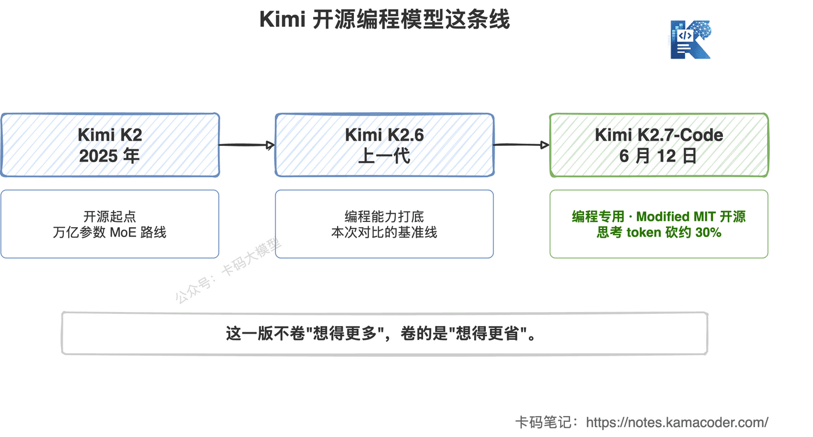
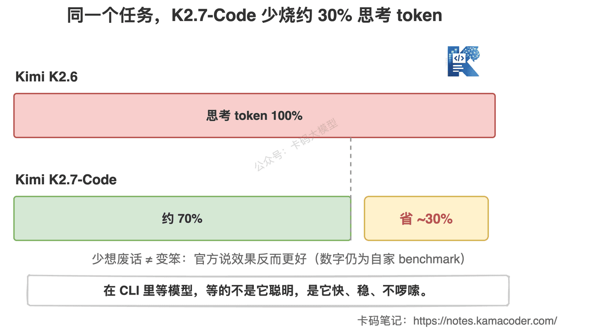
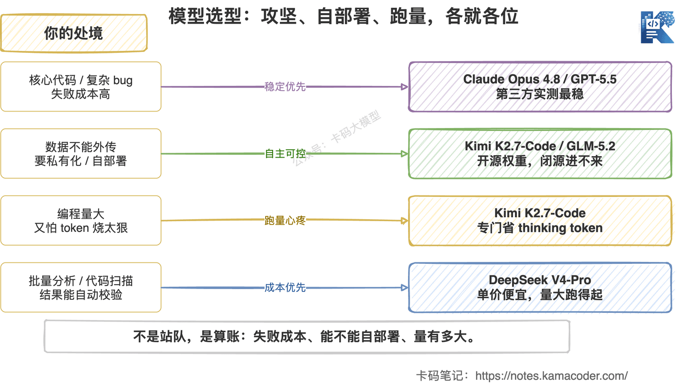

# Kimi K2.7-Code 发布并开源：主打的不是"更聪明"，是"少想废话"

> 来源: https://notes.kamacoder.com/llm/news/kimi-k2-7-code.html

# `# Kimi K2.7-Code 发布并开源：主打的不是"更聪明"，是"少想废话" 
 

月之暗面前两天（2026 年 6 月 12 日）发布并开源了 Kimi K2.7-Code。 

如果你关注的是新一代旗舰模型，直接看这篇：Kimi K3 发布实测。K3 已经把战场从“省 Token 的编程模型”推到了“百万上下文 + 原生视觉 + 前端审美”。 

 

一句话先说清楚定位： 

**这是一个编程专用模型，开源权重，挂的是 Modified MIT，免费商用。** 

权重已经传上 Hugging Face（`moonshotai/Kimi-K2.7-Code`），在线直接用是 `kimi.com/code`。 

但这次发布真正让卡哥觉得值得说一句的，不是又开源了一个编程模型。 

而是它的卖点很反常。 

## `# 一、别人卷"想得更多"，Kimi 卷"少想废话" 

这两年模型发布的主旋律，基本是一个词：**更聪明。** 

更长的思维链，更多的 reasoning token，遇到难题先哗哗想个几千 token 再动手。 

Kimi K2.7-Code 这次反过来了。 

官方主打的一句话是： 

**同样的活，thinking token 比上一代 K2.6 砍掉约 30%，效果还更好。** 

 

别小看这"少想 30%"。 

写过 Agent、用 CLI 跑过大任务的录友都有体感：**很多模型不是不会，是想太多。** 

一个简单的改名重构，它先给你分析半天架构、列三套方案、再自我反思一轮，token 哗哗烧，时间哗哗等。 

我们在 Claude Opus 4.8 那篇就聊过这个事——"想得多"不等于"做得对"，过度思考既慢又贵。 

Kimi 这次等于直接把这点拎出来当卖点： 

**该想的时候想，不该想的时候别磨叽。** 

对真实开发来说，这个方向其实比"再涨两个点跑分"更实在。 

因为你在 CLI 里等模型，等的不是它聪明，是它**快、稳、不啰嗦**。 

## `# 二、先泼盆冷水：跑分目前全是它自家的 

话又说回来，"砍 30%、效果更好"这话，**现在只能听个意向，还不能当结论。** 

为什么？ 

因为 K2.7-Code 发布到现在，放出来的跑分，**清一色是月之暗面自己的 benchmark：** 
  - Kimi Code Bench v2：62.0，比 K2.6 涨 21.8%   - Program Bench：53.6，涨 11.0%   - MLS Bench Lite：35.1，涨 31.5%   - MCP Mark Verified：81.1，涨 11.4%（这项官方说超过了 Claude Opus 4.8 的 76.4） 

数字都挺漂亮。 

但你注意到没有——**SWE-bench Verified、SWE-bench Pro、Terminal-Bench 这些大家公认的第三方编程榜单，一个都没有。** 

我们写 GLM-5.2 那篇反复强调过一句话：**自家 benchmark 负责传播，第三方榜单负责真相。** 

自己出题、自己考、自己打分，涨多少都不奇怪。 

尤其是"超过 Opus 4.8"这种话，是在它自己的 MCP Mark 上超的，换个 harness、换条赛道，结论可能就不一样了。 

所以卡哥的态度跟上次一样： 

**这次发布值得关注，省 token 的方向也对，但"超过谁"先别急着信。** 

等第三方上 SWE-bench 实测，才有真东西可聊。 

## `# 三、真正硬的差异化：开源 + 1T 的家底 

跑分可以等，但有两件事是 K2.7-Code 实打实的底牌。 

**第一，它是开源的，Modified MIT，免费商用。** 

这条线的意义，我们在 GLM-5.2 那篇讲透过，这里再点一句： 

Claude Opus 4.8、GPT-5.5 再强，你也只能调接口，数据出门、按 token 付费、权重永远摸不到。 

开源不一样——**代码不能外传的金融政企、想私有化部署的团队、想自己微调蒸馏的研究，闭源模型再强也进不来，开源是硬需求。** 

**第二，1 万亿参数的 MoE 家底。** 

K2.7-Code 是 1T 总参数的 MoE，激活 32B，384 个专家（每次选 8 个，含 1 个共享专家），256K 上下文，还支持文本、图像、视频输入。 

这个体量，在开源编程模型里是头部。 

**一个 1T 的开源模型，还专门为"省 token"调过，这个组合是有杀伤力的。** 

## `# 四、怎么用，多少钱 

入口有三个： 
  - **在线直接用**：`kimi.com/code`   - **API**：`platform.moonshot.ai`，模型 ID 是 `kimi-k2.7-code`   - **命令行**：Kimi Code，月之暗面自己的终端编程 Agent（terminal-first 的 CLI） 

API 价格（每百万 token）： 

| 项目  价格 
| 输入（cache 未命中）  $0.95 
| 输入（cache 命中）  $0.19 
| 输出  $4.00 

这个定价不算便宜，但也不贵，属于中间档。 

而且要结合它"省 token"的卖点一起看： 

**单价中等，但如果它真能把 thinking token 砍掉 30%，一整个任务跑下来的实际花费，可能比单价更低的模型还省。** 

这是 Kimi 这次想讲的账：**别只看每百万多少钱，看跑完一个活到底花了多少。** 

有一点要注意：**K2.7-Code 默认开思考模式（thinking 是强制的），temperature 固定 1.0、top_p 固定 0.95**，接入的时候别去乱调这几个参数。 

## `# 五、和 Opus 4.8、GLM-5.2、DeepSeek V4 怎么选 

老问题又来了：模型这么多，到底用哪个。 

卡哥的选型逻辑从来没变过：**不是站队，是算账。** 看三件事——失败成本、能不能自部署、量有多大。 

 

具体到 K2.7-Code，它的位置是这样： 

| 你的处境  推荐  为什么 
| 核心代码、复杂 bug、长链路 Agent，失败成本高  Claude Opus 4.8 / GPT-5.5  第三方实测最稳，会验证，工具调用习惯好 
| 数据不能外传 / 要私有化 / 想自己微调  Kimi K2.7-Code 或 GLM-5.2 开源权重  闭源模型进不来，开源是唯一选项 
| 编程任务量大、又怕 token 烧太狠  Kimi K2.7-Code  专门为省 thinking token 调过，跑量心里有底 
| 批量分析、代码扫描、结果能自动校验  DeepSeek V4-Pro  单价便宜，量大跑得起 

这几个不是互斥的，真实开发里我经常混着用。 
  - 难的地方上 Opus 4.8   - 要本地跑、数据敏感的，Kimi K2.7-Code 和 GLM-5.2 二选一   - 纯跑量、能自动校验的，DeepSeek 兜底 

至于 Kimi 和 GLM 这两个开源编程模型怎么选，现在还真不好下死结论——**两边都没第三方 SWE-bench，建议你拿自己手头真实的活，各跑一遍再定。** 

长上下文这块也提一句：K2.7-Code 是 256K，GLM-5.2 喊到 1M。但我们在 MiniMax M3 那篇说过，**"能装进去"和"装了还准"是两回事**，别只看上下文窗口的数字。 

## `# 写在最后 

Kimi K2.7-Code 这次，最值得记住的不是某个跑分。 

是它换了个卷法： 

**别人比谁想得多，它比谁想得省。** 

这个方向对天天在 CLI 里等模型的录友来说，其实很对路——你要的不是它表演思考，是它把活干完、还别烧太多 token。 

但也别上头。 

第三方跑分没出来之前，"省 30%、超 Opus"都还是官方的一面之词。 

我的建议很简单： 
  - 数据敏感、要本地跑的，盯紧它的开源权重，和 GLM-5.2 各测一遍   - 编程量大、心疼 token 的，拿真实任务上手试试它"省"的本事到底真不真   - 没特殊需求的，等第三方 SWE-bench 出来再决定也不迟 

模型选型从来不是追新，是看哪个在你的活上更稳、更省、更可控。 

自己测，按活儿选。 

加油。
