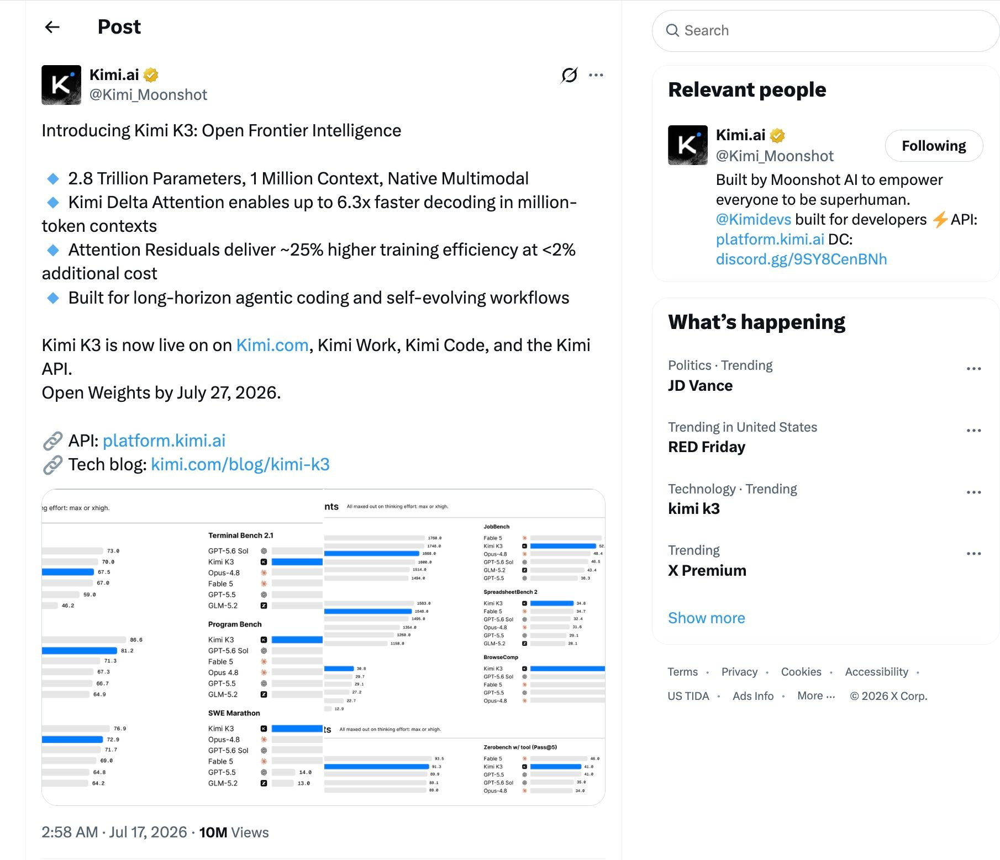
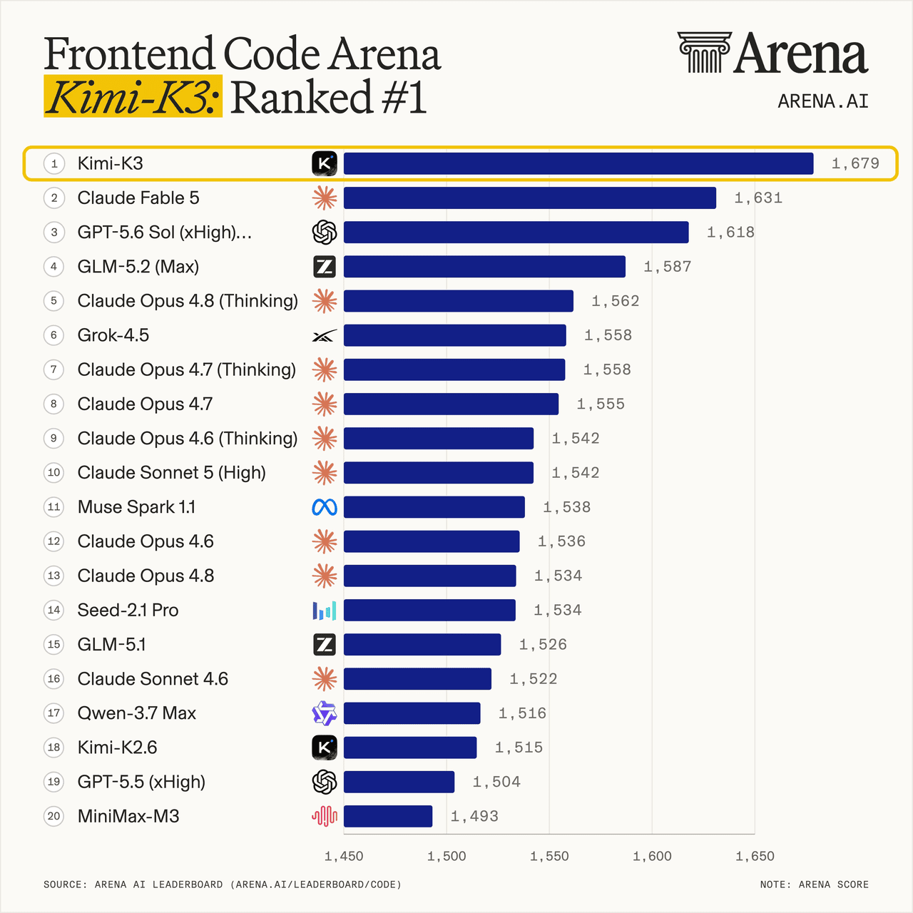
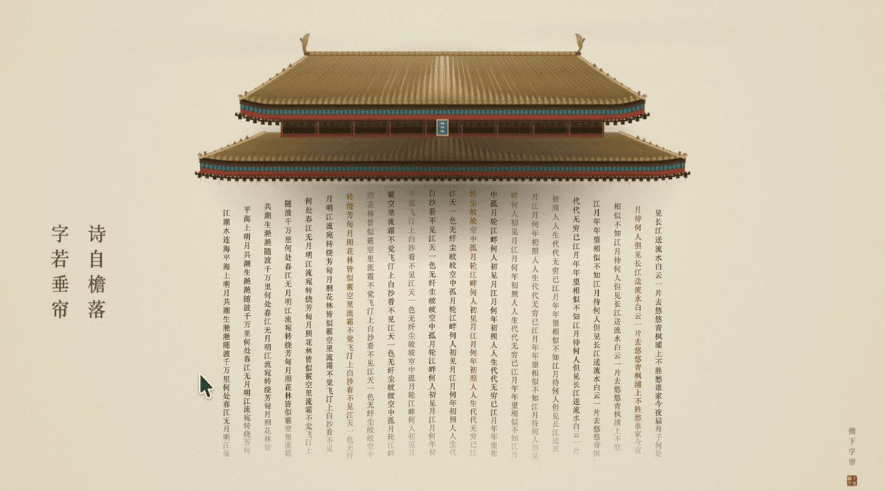
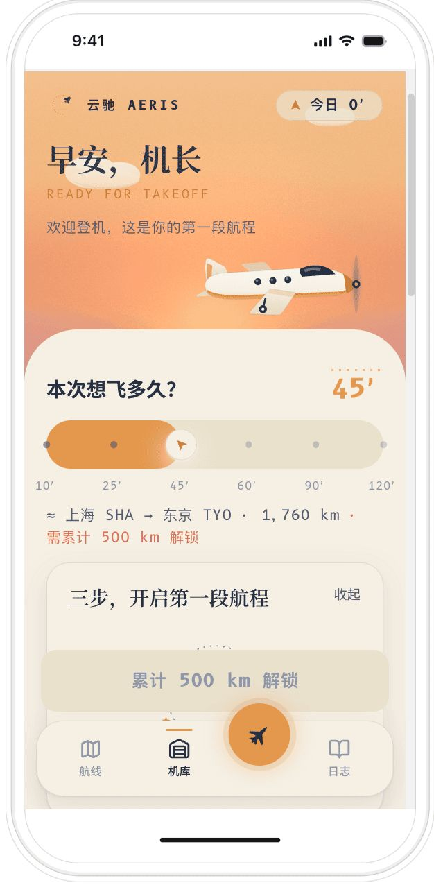
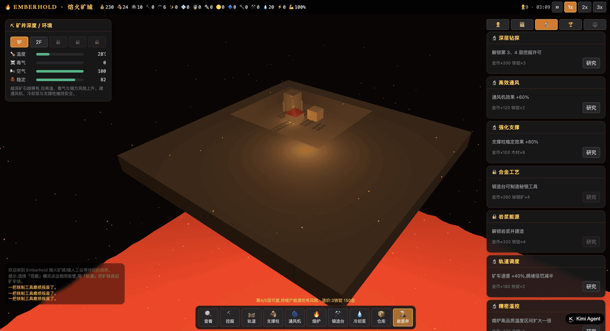
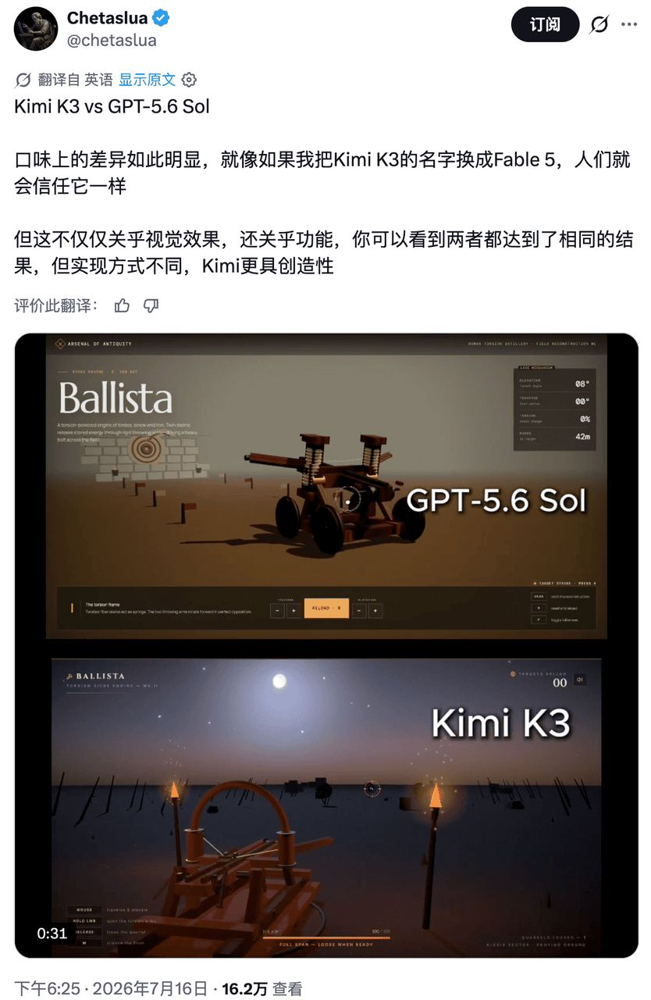
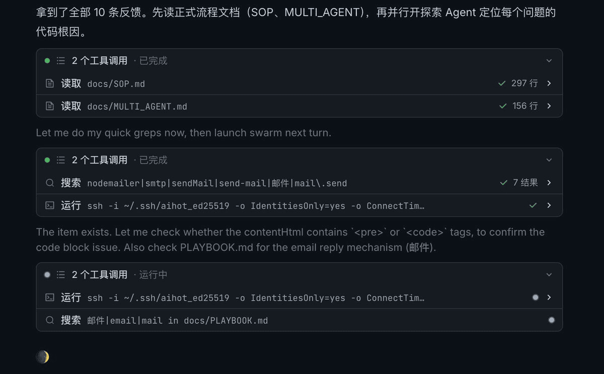
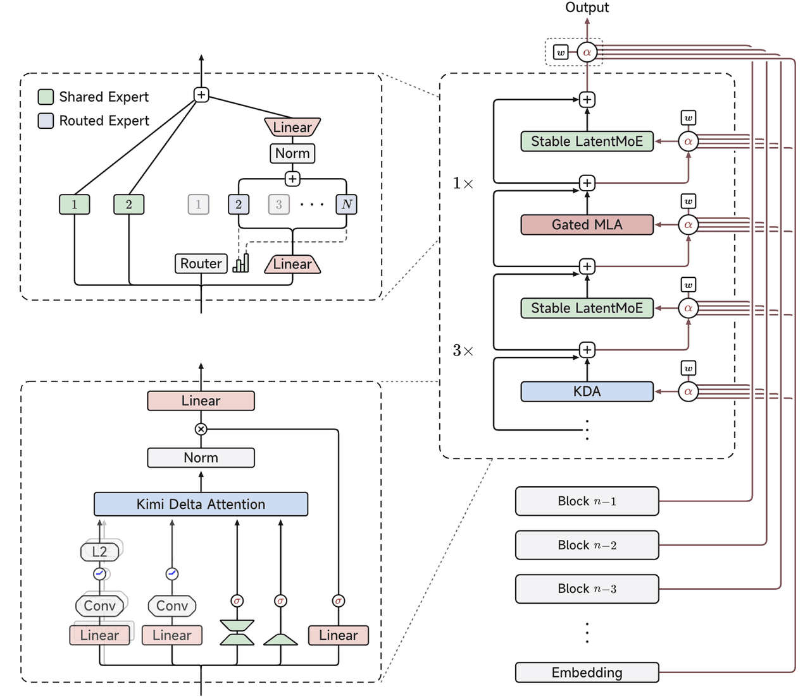

# Kimi K3 发布：2.8 万亿参数只是前菜，前端审美才是最狠的

> 来源: https://notes.kamacoder.com/llm/news/kimi-k3.html

# `# Kimi K3 发布：2.8 万亿参数只是前菜，前端审美才是最狠的 
 

前面写 Kimi K2.7-Code 时，我说月之暗面开始卷一件很实际的事：**让模型少想废话，把代码更快交出来。** 

现在 K3 来了。 

 

2.8 万亿总参数，100 万 Token 上下文，原生视觉理解，完整权重最晚在 2026 年 7 月 27 日放出。 

这些数字已经够夸张了。 

但卡哥看完第一批实测后，最想聊的反而不是参数。 

**会写代码的大模型已经很多了，能把前端写出审美的模型，依然很少。K3 这次真正打穿的，就是这块。** 

它不是只把按钮、卡片、导航栏拼出来。 

它开始知道页面哪里该留白，信息怎么分层，颜色怎么收，动效为什么要动，甚至能把一个模糊的美术想法做成可玩的交互产品。 

这才是 K3 最有意思的地方。 

## `# 先把发布信息说清楚：现在能用，完整权重还要等 

Kimi K3 是月之暗面新一代旗舰模型，核心规格很猛： 
  - 总参数量 2.8T，也就是 2.8 万亿   - MoE 架构，共 896 个专家，每次激活 16 个   - 100 万 Token 上下文   - 原生支持视觉理解   - 面向长程编程、知识工作、深度研究和复杂推理   - 已上线 Kimi、Kimi Work、Kimi Code 和 API   - 完整模型权重计划最晚于 2026 年 7 月 27 日发布 

所以这里要抠一下字眼。 

**截至发布当天，K3 是“已经能用、已经宣布开放权重”，但还不是“完整权重已经下载到手”。** 

别看到“全球首个开放的 3 万亿级模型”，就以为现在已经能在 Hugging Face 上把全部权重拉下来。 

另外，官方自己也没有喊“全面世界第一”。 

月之暗面的原话很坦诚：K3 整体表现仍然落后 Claude Fable 5 和 GPT-5.6 Sol，但在整套评测里达到前沿水平，并稳定超过其他受测模型。 

这句话反而让人更愿意继续看。 

**真正有长板的模型，不需要把每一项都吹成第一。** 

## `# 前端榜第一，这个成绩到底说明什么 

K3 发布后，最炸眼的成绩来自 Arena AI 的 Frontend Code Arena。 

 

K3 拿到 1679 分，排在第一。 

后面是 Claude Fable 5 的 1631 分、GPT-5.6 Sol 的 1618 分、GLM-5.2 的 1587 分和 Claude Opus 4.8 Thinking 的 1562 分。 

上一代 Kimi K2.6 还在第 18 名。 

这一代直接跳了 17 位。 

这个榜的价值，在于它不是让模型回答“React 的生命周期是什么”。 

它测的是更接近真实前端交付的东西：模型根据要求生成网页，用户实际打开两个匿名结果，比较视觉还原、交互体验和功能完成度，再投票。 

投票前不知道模型是谁，投完才揭晓。 

所以品牌滤镜会弱很多。 

不过也别把这个第一偷换成“编程世界第一”。 

**Frontend Code Arena 测的是前端，尤其看视觉和交互。它不能代替 SWE-Bench、Terminal-Bench，也不能证明 K3 修复杂后端 Bug 一定比所有模型强。** 

但它至少证明了一件事： 

**在“把需求变成一个好看、能用、愿意点下去的网页”这件事上，K3 已经进入最强一档。** 

## `# K3 的“美术好”，不是颜色调得漂亮这么简单 

很多人一说模型有审美，理解就是“配色不错”。 

太浅了。 

前端美术真正难的，是四件事同时成立： 
  - 画面有统一的视觉语言   - 信息层级清楚，用户知道先看哪里   - 动效和交互服务内容，不是乱飞   - 美术方案能被代码稳定实现 

K3 的优势，恰恰是把这四件事接起来了。 

### `# 它不只复刻画面，还能读懂画面背后的设计意图 

X 上的实测给了 K3 一个很简单的参考：一座中式屋檐，下方垂着大量竖排文字，鼠标划过时，文字像珠帘一样被拨开、摆动。 

第一版已经抓住了结构。 

再补一次提示后，K3 把屋檐比例、纸张质感、竖排节奏、文字密度和留白都收了回来。 

 

这张图看着安静，但背后不是一张静态海报。 

每列文字都要成为可计算、可响应的对象。鼠标经过时产生位移和摆动，离开后还要自然回弹。 

**它先理解“文字是一道帘子”，再用代码还原这个隐喻。** 

这就比“照着截图抄 CSS”高了一个层级。 

另一个生成式美术案例更明显。 

原作是一群蓝色小鱼形成水流，一条粉色小鱼逆向游动。K3 根据教程截图和效果图，用 p5.js 重建了 700 多条分层鱼群，做了摆尾、景深、颜色变化、循环游动和群体裹挟，还补了参数控制和导出能力。 

这里最重要的不是“鱼画得像不像”。 

是它理解了画面的情绪：**个体逆流，最后被群体吞没。** 

当模型开始把视觉隐喻、运动规律和代码实现连起来，前端就不再只是“搭页面”，而是美术表达的一部分。 

### `# 它能把一个好看的页面，继续做成完整产品 

爱范儿给 K3 的提示词只有一句：复刻 Forest，但界面更精美，动效像 Focus Flight。 

几个小时后，K3 做出了一个叫“云驰 Aeris”的专注 App 原型。 

 

这不是换个皮肤的番茄钟。 

它把“种树”换成了“飞行”： 
  - 专注时长对应航程   - 不同航线对应不同目的地   - 专注中途退出会触发返航   - 完成航程积累里程   - 里程继续解锁新城市   - 白噪音、巡航动效、机库和飞行日志保持同一套品牌语言 

**从命名、配色、插画、交互到成长体系，它给出的不是一个页面，是一个产品概念。** 

这就是很多编程模型和 K3 的差别。 

普通模型会先保证功能列表打勾。 

K3 会顺手问一句：这个产品应该让用户产生什么感觉？ 

## `# 写 3D 前端，K3 不只是会“堆模型” 

Three.js 一直是检验前端模型成色的好地方。 

因为场景能显示出来，只是第一关。 

相机、光照、材质、粒子、动画、碰撞、状态系统、交互控制和性能，任何一个地方没接好，页面都只是一个不能玩的空壳。 

爱范儿测试里的《Emberhold：熔火矿城》，要求 K3 同时实现多层矿井、轨道矿车、熔炉锻造、通风和塌方系统。 

挖得越深，矿越稀有，但温度和塌方风险也会升高；矿车还必须沿真实轨道运行。 

 

这类任务最怕“美术是美术，系统是系统”。 

画面很漂亮，按钮点了没反应；数值在变化，场景里什么都没发生。 

K3 的完成度高，是因为它把两边接上了：**经营数值推动场景状态，场景变化又反过来影响玩家决策。** 

另一个投石车案例里，K3 和 GPT-5.6 Sol 都做出了能玩的结果。 

但测试者认为，K3 的场景氛围、镜头、光影和交互反馈更有设计味道。 

 

这类评价当然带主观性，不能当标准跑分。 

但它指出了一个很真实的差别： 

**两个模型都能把功能做出来，K3 更愿意为“体验”多走一步。** 

它会安排光源，会控制画面节奏，会让操作反馈和世界观一致。 

这就是美术造诣落到前端代码里的样子。 

## `# 为什么 K3 突然这么会写前端 

这不是参数从 1T 涨到 2.8T，就自动掉下来的礼物。 

背后至少有三层原因。 

### `# 第一层：原生视觉，让它能“看懂再写” 

很多前端任务不是纯文本需求。 

录友丢给模型的，可能是一张 Figma 截图、一段视频、一个竞品页面，甚至只是几张小红书教程图。 

K3 原生支持视觉理解，意味着它可以先读构图、字体、色彩、组件关系和运动线索，再把这些东西翻译成 HTML、CSS、Canvas、p5.js 或 Three.js。 

**参考图复刻能力，本质上是视觉理解和代码生成的交叉能力。少一个都不行。** 

### `# 第二层：长上下文，让它能守住一整套产品语言 

100 万 Token 不是为了把 100 万 Token 的小说塞进去炫技。 

对长程前端项目，更实用的价值是：设计规范、组件库、业务代码、历史修改、测试结果和多智能体产出，可以在更长的任务里保持连续。 

X 上的真实项目测试中，K3 先读取运维文档和多智能体说明，再定位多个用户反馈，开 8 路 Agent 研究，筛出 7 个值得做的任务，随后开启 7 个工作区并行开发。 

 

测试者记录的是：约 1 个半小时完成开发，随后提 PR、过 CI、合入主分支，整个流程约 2 小时结束。 

这是个人项目实测，不是可重复的标准评测，不能直接换算成“替代几个程序员”。 

但它说明 K3 的前端能力不是只存在于一次性 Demo。 

**它能进入仓库、读规范、拆任务、并行修改，再走完交付流程。** 

### `# 第三层：新架构在撑住长度和深度 

K3 引入了 Kimi Delta Attention 和 Attention Residuals。 

简单理解： 
  - Kimi Delta Attention 负责让超长序列的计算更可控   - Attention Residuals 负责让信息穿过很深的网络时少失真   - Stable LatentMoE 用 896 个专家承载容量，每次只激活 16 个控制计算成本 

 

月之暗面称，这套结构和训练配方让 K3 相比 K2 的整体扩展效率提高约 2.5 倍。 

这能解释它为什么敢把模型推到 2.8T，也能解释百万上下文是怎么撑起来的。 

但要注意，**架构能提供能力上限，不会自动保证每次任务都做对。** 

真正落地，还要看模型后训练、Kimi Code 的工具编排、项目规范和测试闭环。 

## `# 先别急着喊“前端程序员没了” 

K3 的美术和前端确实很强。 

但强到什么边界，要说清楚。 

### `# 它很会做体验，不代表它不会漏系统约束 

X 上那次真实项目测试，K3 完成了多个需求，PR 和 CI 也都过了。 

但其中一个热点功能，上线后一次性回补了 9000 条数据，把只能同时处理 6 条资讯的队列堵满，导致网站接近一个小时没有新内容进站。 

代码没有语法错误，测试也能过。 

问题出在容量和系统边界。 

**这正是当前 Agent 最危险的地方：局部实现很漂亮，整体约束没看见。** 

所以复杂生产项目里，录友还是要明确写出并发上限、数据规模、回填策略、灰度方案和回滚条件。 

别只给一句“把热点功能做出来”。 

### `# 它现在默认只开放 max 思考，速度和成本都要算 

K3 发布时默认使用 max thinking，低思考和高思考档位要后续再上。 

这意味着哪怕任务不难，它也可能想得很久。 

API 价格是每百万 Token 输入 3 美元、输出 15 美元，缓存命中输入 0.3 美元。 

单价低于顶级闭源模型，但 K3 如果为了一个任务输出更多思考 Token，最终账单未必像看起来那么便宜。 

我们在 Kimi K2.7-Code 里刚聊过“少想废话”，K3 首发阶段反而又回到了“能力优先、先把思考拉满”。 

这两个模型定位不同，别混着看。 

### `# 它对历史思考和 Agent 框架比较挑 

官方明确提醒，K3 对历史思考内容敏感。 

如果 Agent 框架没有按要求回传完整思考历史，或者会话中途从其他模型切到 K3，生成质量可能不稳定。 

当前更稳的选择，是直接用适配过的 Kimi Code。 

而且 K3 在意图模糊时比较主动，可能替用户多做决定。 

所以项目里的 `AGENTS.md`、验收条件、禁止修改范围和操作权限要写清楚。 

**模型越能干，边界越要写明白。** 

### `# 前端第一，不等于综合能力第一 

K3 在 Frontend Code Arena 拿到第一，AA 综合智能指数则排第三，官方也承认整体仍落后 Fable 5 和 GPT-5.6 Sol。 

精准执行、复杂软件工程、写作、数学、长程 Agent，本来就是不同赛道。 

在 GPT-5.6 那篇里我们也说过，Sol 在终端任务和单位成本上很强，但 SWE-Bench Pro 仍然会输给 Claude。 

模型没有一个总分能解释全部。 

**K3 的前端长板是真的，别为了证明它强，硬把这块长板吹成全能。** 

## `# 哪些录友最值得现在就试 

如果你属于下面几类，K3 很值得立刻上手： 
  - 独立开发者：有产品想法，但缺设计和前端搭档   - 前端工程师：要快速做高完成度原型、交互动效和 3D 页面   - 设计师：想把 Figma、截图或视频效果直接变成可运行代码   - 内容团队：需要数据可视化、互动专题和品牌页面   - 国内团队：用不上 Claude 或 GPT，但又需要强多模态和长程编程 

用法也别只说“做个好看的页面”。 

把参考图、目标用户、情绪关键词、交互方式、技术限制和验收标准一起给它。 

例如： 

“参考这张图的东方纸张质感和竖排节奏，用 Canvas 做可拨动的文字珠帘；鼠标经过产生位移，离开后带阻尼回弹；移动端支持触摸；首屏 3 秒内可交互；不要使用外部 3D 模型。” 

这种提示比“复刻一下”更稳。 

如果是线上业务，再补五项：并发上限、数据规模、灰度比例、失败回滚、监控指标。 

前端可以让 K3 放开手脚。 

生产系统，别让它只顾着漂亮。 

## `# 写在最后 

K3 最让我意外的，不是 2.8 万亿。 

是一个国产开源模型，开始把“审美”变成自己的技术标签。 

以前我们评价 AI 写前端，标准是“能不能跑”。 

现在 K3 把标准往前推了一截：**不只要能跑，还要让人愿意看、愿意用、愿意继续玩。** 

这一步，比榜单第一更有意思。 

前端还没消失。 

只是以后，没审美的前端会更难混。 

加油。
