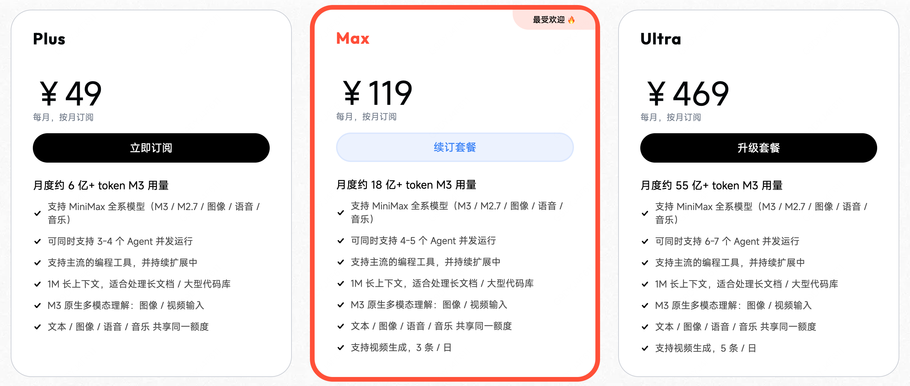

# MiniMax M3评测：SWE-Bench Pro 59.0，1M上下文，原生多模态，真能替代Claude Code吗？

> 来源: https://notes.kamacoder.com/llm/news/minimax-m3.html

# `# MiniMax M3评测：SWE-Bench Pro 59.0，1M上下文，原生多模态，真能替代Claude Code吗？ 
 

MiniMax M3 在 2026 06 01 正式发布。 

官方标题很猛： 

**前沿 Coding 能力，1M 上下文，原生多模态，一个模型全给你。** 

这句话不是普通宣传语。 

它背后其实是在抢一个位置：谁能做开发者日常用得起的 Agent 模型。 

过去这个位置基本被 Claude Code、GPT-5.5、Gemini 3.1 Pro 这些闭源模型占着。你想要强 Coding、长上下文、多模态、Computer Use，通常就得接受两个现实： 
  - 贵   - 封闭 

MiniMax M3 这次的打法很直接：**我也给你这些能力，而且价格打下来，权重也要开。** 

听起来很香。 

但录友别急着喊“Claude Code 平替”。 

我看完官方发布后，结论是： 

**M3 是一个非常值得测的模型，尤其适合长上下文 Coding、批量 Agent 任务和多模态工程自动化。但它还不是闭眼迁生产的模型。** 

我们拆开看。 

官方链接在这里：https://www.minimaxi.com/blog/minimax-m3 

## `# 一、M3 到底发了什么 

MiniMax M3 不是只发了一个聊天模型。 

它同时发了四件事： 
  - **MiniMax M3 模型**：主打 Coding、Agent、1M 上下文、原生多模态   - **MSA 架构**：MiniMax Sparse Attention，解决长上下文成本问题   - **MiniMax Code**：配套的编程 Agent 产品   - **Token Plan 和 API**：让开发者按订阅或 API 直接用 

官方说 M3 是国内第一个同时具备这三类能力的模型： 

**第一，前沿 Coding 和 Agent 能力。** 

不是只会写函数，而是要能跑长任务、调用工具、持续迭代。 

**第二，1M 超长上下文。** 

不是 128K、200K，而是直接打到百万 Token。 

**第三，原生多模态。** 

支持图片、视频输入，也能操作电脑桌面。 

这三个能力放在一起，才是 M3 真正想讲的故事。 

不是“我某个榜单赢了谁”，而是： 

**以后 Agent 不是只读文字，它要能看图、看视频、读长文档、操作软件，还要连续干很久。** 

这条路是对的。 

但要注意一个细节：官方文末说，技术报告和模型权重会在接下来 10 天内更新和开源。 

所以在 2026 年 6 月 1 日发布当天，M3 更准确的状态是： 

**API 已开放，权重承诺开放，但还没到“权重已经摆在那儿随便验”的阶段。** 

这个区别很重要。 

## `# 二、Coding 跑分：最亮的是 SWE-Bench Pro 

MiniMax M3 最容易传播的数字，是这个： 

**SWE-Bench Pro：59.0%。** 

官方给出的对比里，M3 超过 GPT-5.5 和 Gemini 3.1 Pro，接近 Claude Opus 4.7。 

这确实很强。 

SWE-Bench Pro 测的不是“写个二分查找”。 

它更接近真实软件工程：给模型一个真实工程问题，让它理解代码库、定位问题、改代码、跑验证。 

所以这个分数有含金量。 

官方还列了几项 Coding 和 Agent 相关指标： 

| 评测  MiniMax M3 
| SWE-Bench Pro  59.0% 
| Terminal Bench 2.1  66.0% 
| SWE-fficiency  34.8% 
| KernelBench Hard  28.8% 
| MCP Atlas  74.2% 

这里面要分开看。 

**SWE-Bench Pro 是亮点。** 

它说明 M3 在真实工程修复上已经不是“便宜但弱”的模型，而是能摸到闭源前沿模型边缘了。 

**Terminal Bench 2.1 没有领先。** 

官方图里，M3 是 66.0，Opus 4.7 是 66.1，GPT-5.5 是 78.2，Gemini 3.1 Pro 是 70.0。 

这说明 M3 在终端执行、复杂工具链、长链路操作上，还没到 GPT-5.5 那个层级。 

所以别把“M3 在 SWE-Bench Pro 接近 Opus”直接翻译成“M3 的 Agent 长任务全面接近 Opus/GPT”。 

这两个不是一回事。 

**一句话：M3 的代码修复能力很值得重视，但全链路 Agent 还要继续实测。** 

## `# 三、MSA：M3 真正值得看的技术点 

我觉得 M3 最值得看的不是某个单点跑分，而是 MSA。 

MSA 全称 MiniMax Sparse Attention。 

它想解决的是长上下文最难受的问题： 

**上下文越长，全注意力的计算和成本涨得越快。** 

100 万 Token 听起来很爽，但如果每次都按全注意力硬算，延迟和成本会直接劝退。 

MiniMax 的方案是做稀疏注意力。 

简单说，不是让每个 Query 都看所有 KV，而是先做一轮索引和筛选，找到更值得看的块，再对选中的块做注意力。 

 

官方给出的说法很激进： 
  - 在 100 万上下文下，M3 每 Token 计算量只有上代模型的 **1/20**   - Prefilling 阶段超过 **9 倍**加速   - Decoding 阶段超过 **15 倍**加速   - 多个对照实验里，MSA 大部分能力与全注意力打平 

这才是长上下文能不能进入日常开发的关键。 

录友要明白，**1M 上下文不是只看“能不能塞进去”，还要看“塞进去以后能不能用得起、等得起、找得准”。** 

如果 MSA 真能稳定成立，M3 的价值就不只是一个模型，而是把超长上下文 Agent 的成本曲线往下压了一截。 

这对大代码库、长文档、长视频、多轮工具调用都很关键。 

但也别神化 1M。 

上下文窗口大，不代表你可以把整个仓库无脑塞进去。 

我们之前讲 Claude Code 大代码库时也说过：大项目靠的不是“塞满上下文”，而是**上下文治理**。 

M3 降低了长上下文成本，但不会替你自动解决信息筛选、任务拆分、验证闭环这些工程问题。 

## `# 四、长任务 Demo 很猛，但要看清边界 

官方展示了几个实际任务。 

第一个是论文复现。 

MiniMax 把 ICLR 2025 Outstanding Paper Award 论文《Learning Dynamics of LLM Finetuning》丢给 M3，让它独立复现。 

结果是： 
  - 自主运行接近 12 小时   - 产出 18 次 commit   - 生成 23 张实验图表   - 跑通核心实验   - 复现 SFT 阶段趋势、DPO squeezing 效应和 Extend 缓解方法 

 

这个任务很适合展示 M3 的三件事： 

**长上下文**：论文、代码、日志、实验结果都要长期保留。 

**多模态**：论文里的曲线图、表格和公式不能只当纯文本看。 

**Agent 能力**：不是一次回答，而是持续实验、失败、调整、再验证。 

第二个是 CUDA 算子优化。 

官方让 M3 优化 Hopper 架构上的 FP8 GEMM kernel，起点只有任务描述、benchmark 脚本和一个跑不起来的 Triton 骨架。 

最终结果： 
  - 连续执行约 24 小时   - 147 次 benchmark 提交   - 1959 次工具调用   - 峰值利用率从 7.6% 提升到 71.3%   - 相比原始版本实现 9.4 倍加速 

这个 Demo 很硬。 

因为 CUDA kernel 优化不是普通 CRUD。 

它需要理解硬件、访存、流水线、autotune、CUDA Graph、persistent kernel，还要根据 benchmark 反馈持续调整。 

但我还是要泼一点冷水： 

**这些都是官方内部任务和官方展示结果。** 

不是说它假，而是说它还不等于你自己的业务一定能复现同样效果。 

Agent 模型最容易出现的问题就是： 
  - 官方 Demo 很顺   - 真实项目卡在环境、权限、依赖、脏数据、边界条件   - 最后人工接盘 

所以 M3 最正确的打开方式不是直接替换主力模型。 

而是拿你自己的任务集测： 
  - 修真实 bug   - 改多文件需求   - 跑单元测试   - 处理失败日志   - 读长文档后生成结构化结果   - 多轮需求变更后看它是否偏航 

**能过你自己的评测，才叫能用。** 

## `# 五、多模态和 Computer Use：想象空间很大，风险也很大 

M3 是原生多模态模型。 

官方说它从 Step 0 开始做多模态混合训练，支持图片和视频输入，还能操作电脑桌面。 

这点对 Coding Agent 很关键。 

以前很多 AI 编程工具主要读文本： 
  - 代码   - 日志   - 文档   - issue   - terminal 输出 

但真实工作里有大量东西不是纯文本： 
  - 页面截图   - 设计稿   - 报表   - PDF 图表   - Excel   - 监控面板   - 视频教程   - ERP、CRM、本地客户端 

如果 Agent 能看懂这些，再配合 Computer Use，就能做很多以前很别扭的自动化。 

比如官方举的场景： 

“帮我打开本地 ERP 客户端，按这份 Excel 批量录入发票信息。” 

这类任务不是单纯写代码。 

它是跨文件、跨应用、跨系统的自动操作。 

这也是未来 Agent 的方向。 

但录友一定要记住： 

**能操作电脑，不等于应该默认给它操作电脑。** 

Computer Use 场景必须配权限边界： 
  - 哪些软件能打开   - 哪些按钮能点   - 哪些数据能读   - 哪些动作必须人工确认   - 出错后怎么回滚   - 操作日志怎么审计 

越强的 Agent，越需要工程护栏。 

否则不是提效，是把事故自动化。 

## `# 六、价格：M3 最现实的杀伤力 

模型能力能不能打，要看评测。 

模型能不能进入日常，要看价格。 

MiniMax 这次的价格确实很有攻击性。 

Token Plan 三档： 

| 套餐  价格  M3 月度用量 
| Plus  ¥49/月  约 6 亿 token 
| Max  ¥119/月  约 18 亿 token 
| Ultra  ¥469/月  约 55 亿 token 

官方说，如果按相同价格算，约是 Claude 订阅的 15 倍用量。 

 

API 也按上下文长度分两档： 

| 模型上下文  输入价格  输出价格  缓存读取 
| MiniMax M3 ≤512K  ¥4.20 / 百万 tokens  ¥16.80 / 百万 tokens  ¥0.84 / 百万 tokens 
| MiniMax M3 512K-1M  ¥8.40 / 百万 tokens  ¥33.60 / 百万 tokens  ¥1.68 / 百万 tokens 

 

这个价格对两类人特别有吸引力。 

**第一类，高频 AI 编程用户。** 

每天让 Agent 读代码、改文件、跑测试、总结 PR，Token 消耗很大。 

如果 M3 质量够用，成本会明显下降。 

**第二类，批量任务用户。** 

比如批量审代码、批量处理文档、批量生成测试、批量做多模态理解。 

这类任务最怕单次效果不错，但跑一万次以后账单爆炸。 

M3 的价格让很多原来舍不得跑的任务，可以进入“先跑起来看看”的阶段。 

但价格便宜也有一个副作用： 

很多人会忍不住把任务全丢给它。 

我的建议是： 

**低风险、高频、可验证的任务先上 M3；高风险、强推理、强业务边界的任务先做 A/B 评测。** 

别拿生产环境当 benchmark。 

## `# 七、MiniMax Code：重点不是又一个代码编辑器 

MiniMax Code 这次也跟着更新。 

官方说它是专为 M3 设计、并与 M3 一起训练的 Agent 产品。 

它最值得看的不是“能不能补全代码”，而是 Agent Team。 

官方描述里，Agent Team 可以把大任务拆成多阶段、可并发、可动态调整的 Workflow，再通过 Producer + Verifier 的对抗式 Harness 循环持续产出、反思、纠错。 

这和 Claude Code 近期的 Dynamic Workflows 是同一个大方向。 

**未来 AI 编程工具不会只是一个模型从头干到尾，而是多个 Agent 分工协作。** 

一个负责读仓库。 

一个负责定位影响范围。 

一个负责改代码。 

一个负责跑测试。 

一个负责挑错。 

主 Agent 负责合并判断。 

这比单 Agent 长时间硬跑更像真实工程。 

不过这也意味着一个现实问题： 

**Agent 越多，Token 越多，错误传播链路也越长。** 

所以 Agent Team 的关键不是“看起来很智能”，而是： 
  - 子任务拆得准不准   - 中间结果能不能验证   - Verifier 有没有真的挑错   - 失败后能不能回滚   - 用户能不能插手纠偏 

M3 这次把模型、产品、价格一起推出来，是对的。 

因为单独一个模型不够。 

Coding Agent 拼到最后，拼的是模型能力、工具链、上下文管理、执行 Harness 和价格。 

## `# 八、M3 适合谁，不适合谁 

如果你问我 M3 值不值得试。 

答案是：**值得。** 

但怎么试，要分场景。 

**适合优先试 M3 的场景：** 
  - 日常代码生成、重构、小 bug 修复   - 大文档、大代码库的低风险分析   - 批量代码审查、批量测试生成   - 长上下文摘要、日志分析、资料归纳   - 带图片、视频、PDF 的多模态理解任务   - 成本敏感的 Agent 原型验证 

这些任务有一个共同点： 

**可以验证，失败成本相对可控。** 

比如生成测试，跑不过就退回来。 

比如代码审查，人工可以抽检。 

比如日志归纳，能和原始日志对照。 

**不建议直接迁 M3 的场景：** 
  - 线上高风险自动改代码   - 无人工确认的 Computer Use   - 金融、医疗、合同等强责任场景   - 强依赖通用知识准确性的问答   - 复杂长任务的唯一主模型 

这些任务不是不能用 M3。 

而是不能只看官方榜单就上。 

你至少要有自己的评测集、回归集、人工抽检和失败兜底。 

## `# 九、我的判断：M3 是价格战，也是 Agent 战 

MiniMax M3 这次最有意思的地方，不是“某个榜单赢了谁”。 

而是它把几个趋势合到了一起： 

**模型能力往 Agent 任务靠。** 

不只是回答问题，而是长期执行、工具调用、持续验证。 

**上下文窗口继续变大。** 

但重点从“最大能塞多少”变成“长上下文能不能便宜、快速、稳定地用”。 

**多模态进入开发者工作流。** 

Agent 不只读代码，还要看截图、看文档、看视频、操作软件。 

**价格开始逼近日常使用。** 

当 Token 便宜到一定程度，很多原来“不值得自动化”的任务，突然值得了。 

所以 M3 的意义，不是简单替代 Claude Code。 

它更像是在问整个市场一个问题： 

**如果一个模型同时给你 Coding、1M 上下文、多模态和低价格，你还愿意为闭源前沿模型付多少溢价？** 

这才是压力。 

最后给录友一个实用结论： 

**M3 可以进入你的模型候选池，但不要直接当成唯一主力。** 

先拿真实任务测。 

测三件事： 
  - 能不能完成任务   - 出错时能不能自救   - 成本和延迟是不是真的划算 

如果这三项都过了，M3 就不是“便宜玩具”。 

它会是一个很有竞争力的工程模型。 

但如果你只看 SWE-Bench Pro 59.0 就全量迁移，那不是拥抱 AI。 

那是把生产环境交给热搜。 

## `# 参考资料 
  - MiniMax M3 官方发布：https://www.minimaxi.com/blog/minimax-m3   - MiniMax M3 模型页：https://www.minimaxi.com/models/text/m3
