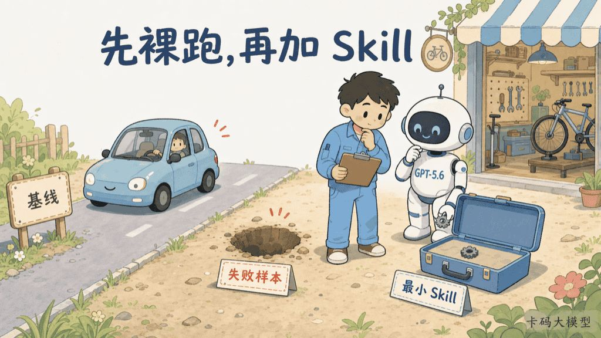

# 恭喜，还没学过Superpowers的录友：现在不用学了

> 来源: https://notes.kamacoder.com/llm/news/gpt-5-6-no-superpowers.html

# `# 恭喜，还没学过Superpowers的录友：现在不用学了 

AI时代变化太快了。 

有些东西，你学得慢一点，最后就可以不用学了。 

不少录友应该还没用过Superpowers吧？ 

甚至可能都不知道，过去一年里还有一大批非常火、非常好用的Agent Skill。 

恭喜你们。 

**不用补课了。** 

GPT-5.6发布之后，模型自己理解需求、规划步骤、调用工具、运行测试和检查结果的能力又往前走了一大截。 

过去用来“教模型怎么干活”的很多Skill，正在从必装插件变成重复说明。 

 

先把我的结论说清楚： 

**Superpowers没有消失，Skill也没有失去价值。** 

但从GPT-5.6开始，普通开发者已经没必要先装一大包Skill，再开始用Agent。 

默认顺序应该反过来： 

**先让模型直接做。它真的做不好，再补一个最小Skill。** 

## `# Superpowers过去解决了什么 

Superpowers  (opens new window)不是一个让模型突然变聪明的魔法插件。 

它是一套软件开发方法论，把开发过程拆成一组可以自动触发的Skill： 
  - 动手前先澄清需求、做brainstorming   - 设计确认后再写实施计划   - 按TDD推进，而不是先写完再补测试   - 把任务交给子Agent执行和审查   - 完成前必须验证，不能嘴上说“应该没问题” 

这套东西过去非常有价值。 

因为当时很多编码Agent有几个明显短板： 
  - 用户刚说一句需求，它就急着改代码   - 任务稍微长一点，中间约束就丢了   - 会写计划，但执行时不按计划   - 测试失败后容易猜着修   - 没跑验证，就宣布任务完成 

Superpowers相当于给模型装了一套外置工程纪律。 

模型不会主动停下来想，就用Skill强制它停。 

模型不会稳定测试，就把TDD写成铁律。 

模型容易跑偏，就把设计、计划、实现、审查拆成一道道门。 

我前面在AI增强开发三件套里还专门介绍过它。 

那篇文章在当时没有问题。 

**问题是，模型能力的保质期太短了。** 

## `# GPT-5.6把很多“外置纪律”吃进了模型 

GPT-5.6真正改变的，不只是代码跑分。 

OpenAI在GPT-5.6官方使用指南  (opens new window)里明确提到，模型现在更擅长从上下文理解用户真实意图，很多时候已经不需要人把每一步都规定出来。 

你仍然要告诉它： 
  - 最终目标是什么   - 哪些硬约束不能碰   - 哪些动作需要确认   - 什么证据才算完成 

但你不必再写： 

“先读文件，然后列计划，然后等我确认，然后一次改一个文件，然后解释每一步，然后再运行测试……” 

这正是很多通用Skill最喜欢做的事。 

更直接的证据，是OpenAI对编码Agent做的内部评测。 

官方指南称，在一组内部样本里，**更精简的系统Prompt让评测分数提高约10%～15%，总Token减少41%～66%，成本减少33%～67%。** 

这些数字不能直接套到所有项目，但方向已经很清楚： 

**模型变强以后，更多说明不一定带来更多能力，反而可能制造更多噪声。** 

 

GPT-5.6还新增了更强的工具编排、持续推理和多Agent能力。 

以前Skill要教它“怎么拆任务、怎么并行、怎么收结果”。 

现在Harness和模型本身已经能做其中很大一部分。 

如果Skill还在机械重复这些动作，就像给已经会骑车的人又装了六个辅助轮。 

不是更稳。 

是更重。 

## `# 最先没必要的，是这四类Skill 

### `# 第一类：只会提醒模型认真一点 

例如： 
  - 先思考再回答   - 先计划再执行   - 不要遗漏边界情况   - 写完一定要检查   - 遇到问题先找根因 

这些原则都对。 

但如果一个Skill的全部价值，就是把正确的废话写得更长，GPT-5.6已经不太需要它了。 

把“修复后相关测试必须通过”写进验收标准，比加载几百行“如何成为严谨工程师”更有效。 

### `# 第二类：重复Agent原生能力 

现在的Codex、Claude Code和其他Harness，已经普遍自带计划、子Agent、代码审查、浏览器、测试和工具调用能力。 

如果Skill只是把原生能力再包一层，就会出现三套流程互相打架： 
  - Harness想直接推进   - Skill要求先进入自己的规划仪式   - 项目规则又要求另一套验证顺序 

最后模型不是能力不够，而是忙着判断该听谁的。 

### `# 第三类：为了所有任务强制同一套重流程 

改一个错别字，也要先brainstorming。 

修一个明确的小Bug，也要先写完整设计。 

动两行CSS，也要拉子Agent实现、再拉两个Agent审查。 

这种流程在大任务上可能有价值，在小任务上就是纯开销。 

**任务复杂度不同，流程强度也应该不同。** 

### `# 第四类：从来没有被评测过的Skill 

很多人收藏Skill，和以前收藏Prompt模板一样。 

看到别人说好用，就装。 

装完从没对比过： 
  - 成功率有没有提高   - 返工次数有没有下降   - Token和时间增加了多少   - 是否出现误触发   - 简单任务是不是被过度流程化 

没有失败样本，也没有对照评测，这种Skill不是工程资产。 

它只是赛博护身符。 

## `# 但这不等于“所有Skill都该删” 

OpenAI目前仍然把Skill定义为可复用工作流，并通过渐进式加载避免一次性塞满上下文，详见官方Skill文档  (opens new window)。 

所以真正的分界线，不是“模型强不强”。 

而是这个Skill到底在补什么。 

下面几类，我会继续保留： 

| Skill类型  为什么模型强了仍然需要 
| 项目专属规则  模型不知道你公司的目录、发布规范、业务口径和历史约定 
| 确定性脚本  PDF渲染、图片压缩、数据迁移、制品打包不能只靠模型“理解” 
| 外部工具与连接  数据库、内部文档、设计工具和审批系统需要真实接口与权限 
| 高风险流程  上线、付款、删库、权限变更需要硬边界和人工确认 
| 失败样本沉淀  模型在同类任务上稳定犯错，才值得把纠错方法固化下来 

一句话： 

**通用常识交给模型，组织经验留在Skill，安全边界交给系统。** 

这和Agent Skill面试详解里讲的原则并不矛盾。 

Skill仍然是复用经验的方法。 

只是“模型已经会的事”，不再算值得复用的经验。 

## `# 新方法：先裸跑，再加最小Skill 

 

以后判断一个Skill要不要装，我建议用下面这套顺序。 

### `# 第一步：先定义结果，不定义仪式 

把目标、上下文、硬约束、验收标准说清楚。 

不要上来就规定模型必须走哪套方法论。 

如果你还在用GPT-5.5时期的长Prompt，可以先看GPT-5.6 Sol Prompt指南。 

### `# 第二步：让GPT-5.6裸跑 

不开Superpowers，不加载一堆通用Skill。 

直接让它完成几组真实任务，记录成功率、返工次数、Token、耗时和失败位置。 

这才是基线。 

### `# 第三步：只看可复现的失败 

偶尔一次写得不好，不值得立刻写Skill。 

只有同一类错误稳定出现，例如总漏掉数据库回滚、总用错内部组件、总忘记上传制品，才说明模型缺少项目经验或确定流程。 

### `# 第四步：只补一个最小Skill 

不要把整个开发方法论搬进去。 

只补那一个稳定缺口： 
  - 什么时候触发   - 需要读什么   - 必须执行什么脚本   - 怎样验收   - 什么时候停止 

### `# 第五步：再跑同一组任务 

如果质量没有提升，删掉。 

如果质量只提升一点，但Token和时间翻倍，也删掉。 

如果只对少数复杂任务有效，就改成显式调用，不要默认触发。 

**Skill不是装得越多越专业，而是每一个都要证明自己值得占用上下文。** 

## `# Superpowers还要不要装 

如果你是刚开始用GPT-5.6的普通开发者，我的建议很直接： 

**先别装。** 

先学会把目标、约束和验收说清楚，学会看Diff、跑测试、检查证据。 

这些能力比背一套Skill名字重要得多。 

如果你在带新人，希望用一套显式流程训练TDD、设计评审和根因分析，Superpowers仍然是很好的教材。 

如果你的项目很大、任务很长，而且对照评测证明它确实减少跑偏和返工，也可以继续用。 

但它应该从“开机必装”变成“按需工具”。 

这就是GPT-5.6之后最大的变化： 

**我们不再默认用Skill教模型如何工作，而是先相信模型能工作，再用证据决定哪里需要约束。** 

## `# 写在最后 

AI时代，学得慢不一定吃亏。 

有时候你还没爬完旧楼梯，电梯已经装好了。 

真正该学的，不是每一代最火的Prompt、插件和Skill名字。 

而是看清楚： 

**模型现在已经会什么，仍然不会什么，以及什么事情永远不能只相信模型。**
