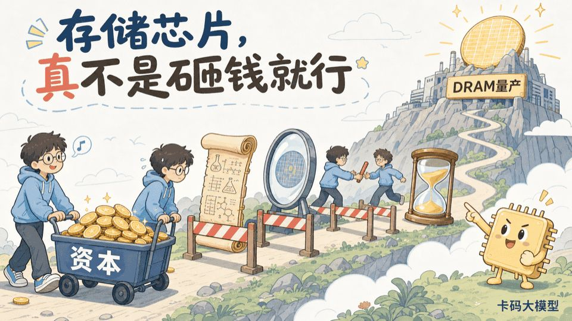
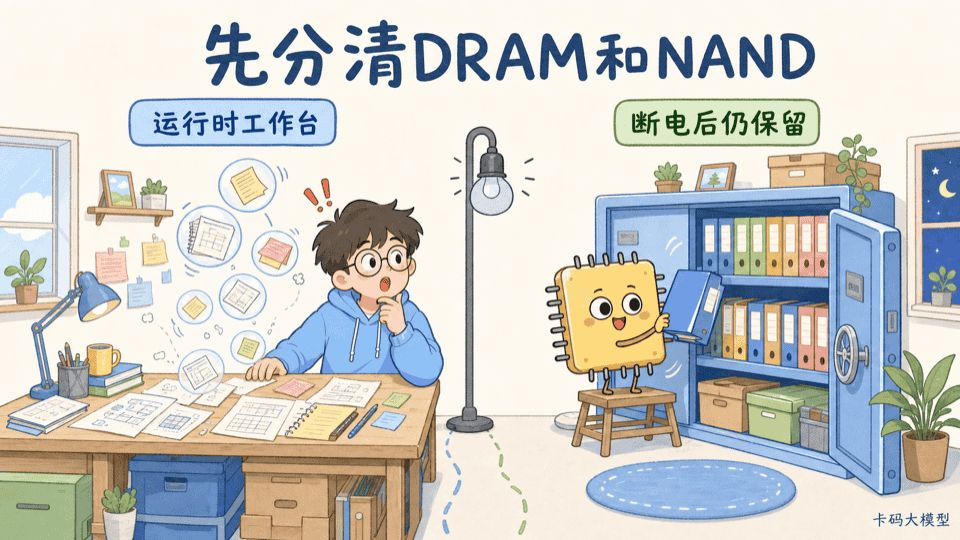
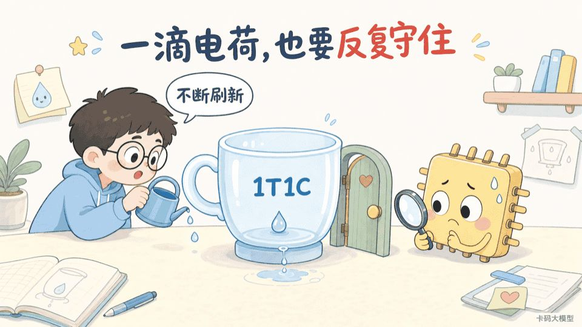
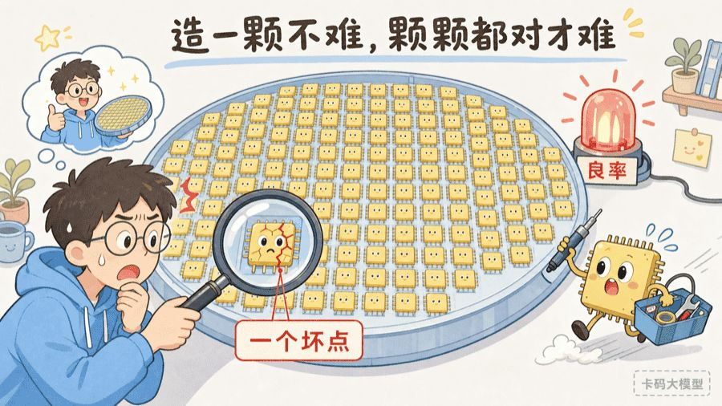
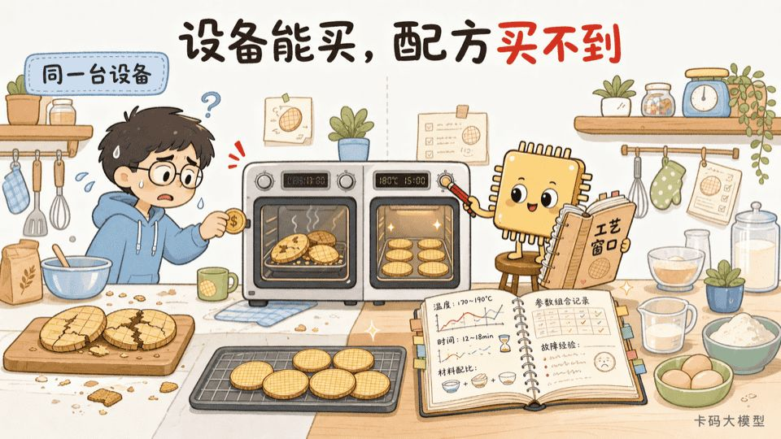
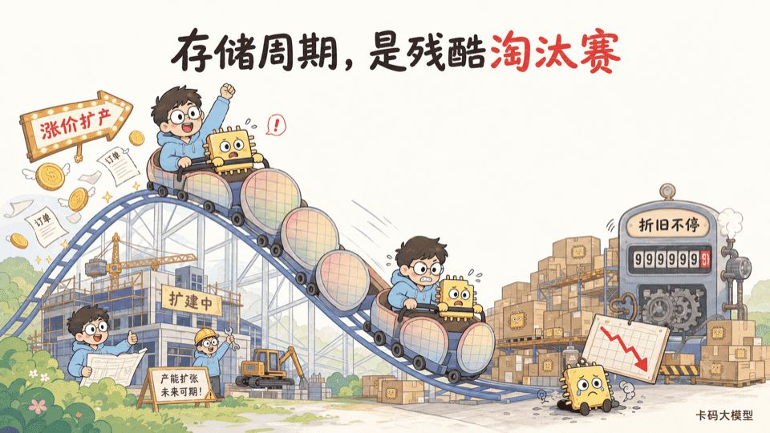
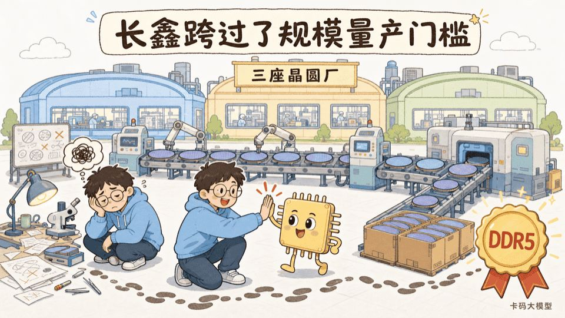
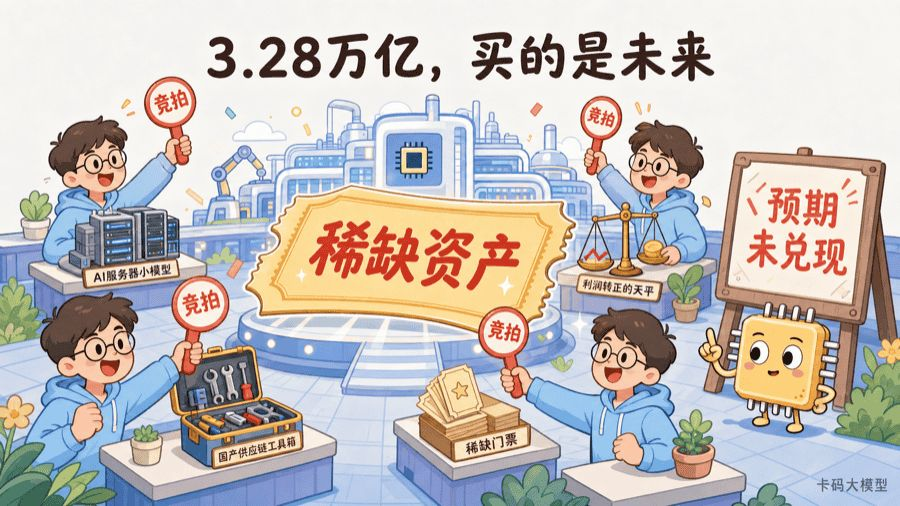
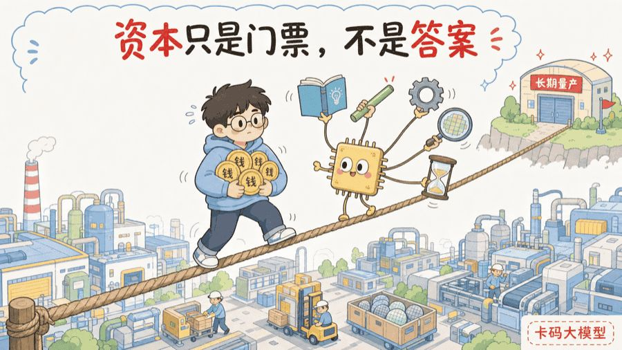

# 长鑫科技上市暴涨466%：存储芯片为什么不是有钱就能造

> 来源: https://notes.kamacoder.com/llm/news/cxmt-ipo-dram-barriers.html

# `# 长鑫科技上市暴涨466%：存储芯片为什么不是有钱就能造 
 

2026年7月27日，长鑫科技登陆科创板。 

发行价8.66元，首日收盘49元，上涨465.82%，总市值约3.28万亿元，直接坐上A股市值第一的位置。上海证券报  (opens new window)披露，当天成交额1411.87亿元，也创了A股个股单日成交纪录。 

这个数字确实夸张。 

于是很多录友会问： 

**长鑫科技为什么值这么多钱？存储芯片真的这么难吗？国内有钱的公司这么多，为什么不能多砸几座厂，直接把DRAM造出来？** 

 

先说结论：**钱当然重要，但钱只能买到入场券。** 

DRAM真正的壁垒，是把资金、设备、材料、人才、专利、工艺配方、良率数据、客户验证和十年以上的量产经验，压成一套每天稳定运转的系统。 

长鑫的稀缺性，也不在于“会设计一颗存储芯片”，而在于它已经跨过了最难的那一步：**规模化量产。** 

## `# 一、先分清：存储芯片不是一种芯片 

 

大家平时说“存储芯片”，其实经常把两类东西混在一起。 

| 类型  主要作用  断电后数据还在吗  常见产品  国内代表 
| DRAM  给CPU、GPU临时放正在处理的数据  不在  DDR4、DDR5、LPDDR5X、HBM  长鑫科技 
| NAND Flash  长期保存文件和程序  还在  SSD、手机闪存、UFS  长江存储 

DRAM像办公桌。桌子越大，CPU和GPU同时摊开的资料越多，程序跑得越顺。 

NAND像档案仓库。电脑关机了，照片、代码和系统文件还得继续放在里面。 

所以，**长鑫科技主要做的是DRAM，不是NAND。** 长江存储主要做NAND，也不是长鑫的同类公司。 

还有一个常见误区：卖内存条，不等于会造DRAM晶圆。 

很多内存品牌做的是颗粒采购、模组设计、封装测试和渠道销售。真正从电路设计、晶圆制造一路做到DRAM颗粒的原厂，数量少得多。 

## `# 二、DRAM到底怎么记住一个比特 

 

DRAM最基本的存储单元，可以粗略理解为 **一个晶体管加一个电容，也就是1T1C**。 

电容里有电荷，可以代表1；没有电荷，可以代表0。晶体管像一扇门，负责控制这点电荷什么时候被读取、什么时候被写入。 

问题是，电容会漏电。 

所以DRAM里的数据不能放着不管，控制器必须隔一段时间重新读取、重新写回，这就是“动态随机存取存储器”里“动态”两个字的来源。 

这个原理听起来不复杂，真正难的是把存储单元不断缩小。 

尺寸越小，留给电荷的空间越少，信号越弱；漏电、串扰、噪声和工艺波动却不会跟着老老实实缩小。工程师既要让电容足够小，又要让它存得住、读得准、功耗低、速度快。 

IBM对DRAM微缩的研究  (opens new window)很早就指出，DRAM的难点不是某一个孤立器件，而是电容、晶体管、布线、材料和制造工艺之间的联动。 

所以DRAM不是“把CPU工艺复制一份”。它有自己的一整套器件结构和工艺路线。 

## `# 三、难的不是造出一颗，是几十亿个单元都别出错 

 

实验室里造出一个能读写的存储单元，不等于能卖货。 

一颗DRAM芯片里有几十亿甚至更多存储单元，还有字线、位线、感应放大器、纠错和外围控制电路。它们要在不同温度、电压和频率下长期稳定工作。 

**任何一个微小颗粒、薄膜厚度偏差、刻蚀深度偏差，都可能让一部分单元失效。** 

一张晶圆不是只切一颗芯片。每多报废一颗，分摊到剩余好芯片上的设备、材料、人工和折旧成本都会上升。 

这就是良率。 

假设竞争对手一张晶圆能切出100颗合格芯片，你只能切出60颗。哪怕你的厂房和设备价格完全一样，单颗成本也已经被拉开。 

更麻烦的是，DRAM是标准化程度很高的商品。 

同样是DDR5，客户不会因为你“很努力”就多付一倍的钱。性能接近时，拼的就是成本、稳定性和供货能力。 

所以存储行业最后比的不是“能不能点亮”，而是：**能不能在海量出货下，把良率稳定在足以赚钱的位置。** 

## `# 四、设备可以买，工艺配方买不到 

 

很多人理解芯片制造，会把它简化成买光刻机、刻蚀机、沉积设备。 

这些设备当然重要，但两家公司买到类似设备，不代表能造出成本和性能一样的DRAM。 

同一台设备，温度差一点、气体流量差一点、压力差一点、清洗时间差一点，最后结果都可能不同。更别说上百道关键工序前后还会互相影响。 

真正值钱的是每台设备背后的工艺窗口： 
  - 什么材料和结构放在一起最稳定   - 每一步参数允许波动多少   - 上一步偏了，下一步怎么补偿   - 哪种缺陷来自设备，哪种来自设计   - 换了供应商的材料，整条产线要怎么重调 

这些知识有一部分写在专利里，有一部分写在内部规范里，还有很大一部分在工程师的经验和历史数据里。 

招股书显示，截至2025年底，长鑫拥有境内专利3929件，其中发明专利3165件，另有境外专利3043件；研发人员6259人，占员工总数32.43%。这些数字背后，就是工艺和人才壁垒。 

**买设备，是把厨房搭起来；能稳定做出同样的菜，靠的是配方、火候和厨师团队。** 

## `# 五、良率不是一个公式，是用量产数据喂出来的 

 

一批晶圆跑出来，工程才刚开始。 

团队要做失效分析：坏点集中在哪里？是某一层刻蚀有问题，还是某台设备漂移？是设计余量不够，还是材料批次变化？ 

找到原因后调参数，再跑下一批。 

下一批仍然会出现新问题，再继续回溯。 

美国司法部收录的一项DRAM学习曲线研究  (opens new window)直接把DRAM称为“learning-by-doing”的经典行业：产量本身会给厂商带来降本经验。 

这就形成一个很强的正反馈： 

**出货越多 → 缺陷数据越多 → 工艺改得越准 → 良率越高 → 成本越低 → 更有能力继续出货。** 

后来者有钱，可以一次买很多机器。但它没有办法把领先者过去十几年的晶圆、故障和客户反馈，瞬间复制到自己的数据库里。 

这也是为什么DRAM公司大多采用IDM模式：设计、制造、测试和销售放在一家公司里，问题才能快速从客户和产线回到设计端。 

长鑫2023年至2025年累计研发投入约206.05亿元，占同期累计营收21.67%。这不是一次性买技术，而是在持续购买“下一轮学习机会”。 

## `# 六、存储周期是一台残酷的淘汰机器 

 

如果DRAM只是在技术上难，或许还有很多有钱公司愿意试。 

真正把玩家越筛越少的，是周期。 

存储芯片很像大宗商品。需求突然增长，价格上涨，厂商赚钱；大家看到利润后开始扩产；但晶圆厂建设和产能爬坡要很久，等新产能真正出来，市场又可能供过于求，价格开始暴跌。 

价格跌了，工厂不能说停就停。 

设备折旧、研发工资、厂房维护和贷款利息还在每天发生。长鑫2025年底固定资产账面价值约1830.24亿元，其中机器设备约1692.87亿元。 

长鑫招股书  (opens new window)披露，2015年至2025年，DRAM市场价格最高达到7.89美元/GB，2023年上半年最低只有1.78美元/GB。 

同一门生意，景气高点和低点完全是两个世界。 

德国DRAM厂商Qimonda  (opens new window)在2009年进入破产程序；日本Elpida在重组后于2013年被美光收购  (opens new window)。它们不是没技术，而是没能继续扛住资本投入和行业低谷。 

所以今天的寡头格局，不是三家公司开会决定的。是几十年技术竞赛、资本开支和价格周期，一轮轮淘汰出来的。 

## `# 七、到底有哪些公司能造DRAM 

 

这里必须纠正题目里的一个说法。 

**不是只有三星、SK海力士和长鑫能造DRAM。美光才是长期的全球前三之一，长鑫目前是第四。** 

根据长鑫招股书  (opens new window)引用的Omdia数据，2025年全球DRAM销售额份额大致为：SK海力士34.48%、三星33.96%、美光23.41%。前三家合计超过90%。 

长鑫在2025年第四季度按销售额计算达到7.67%，位居全球第四、中国第一。 

市场里还有其他玩家，只是“能造”和“在先进主流产品上大规模量产”不是同一个概念。 

| 厂商  大致位置  主要特点 
| 三星电子  全球第一梯队  DRAM产品完整，覆盖DDR、LPDDR、GDDR和HBM 
| SK海力士  全球第一梯队  DRAM全产品线，HBM竞争力很强 
| 美光科技  全球第一梯队  美国主要DRAM原厂，覆盖通用DRAM和HBM 
| 长鑫科技  全球第四、中国第一  已覆盖DDR4、DDR5、LPDDR4X、LPDDR5/5X，快速扩产 
| 南亚科技  较小份额DRAM IDM  自研DRAM，产品覆盖DDR5、LPDDR5等 
| 华邦电  利基型DRAM  侧重中低密度、工业、汽车和消费类Specialty DRAM 
| 力积电、福建晋华等  更小规模或特定市场  成熟制程、代工或利基产品，公开口径和量产规模各不相同 

南亚科技官网  (opens new window)明确列有自研DRAM和10nm级工艺；华邦电官网  (opens new window)也列出了Mobile RAM和Specialty DRAM产品。 

所以更准确的说法是： 

**全球能造DRAM的公司不止四家，但能在主流高密度DRAM上持续大规模量产、不断追赶先进工艺的，已经高度集中到三星、SK海力士、美光和长鑫四家。** 

HBM还要再加一道门槛。它不只是把普通DRAM改个名字，而是要筛选高质量DRAM裸片，再做TSV、堆叠、先进封装和热管理。能做DDR5，不等于已经具备同等级的HBM量产能力。 

## `# 八、长鑫真正跨过了什么门槛 

 

长鑫成立于2016年。不到十年，它最重要的成绩不是发布了一张参数表，而是把DRAM做成了一门规模化生意。 

公开材料显示，公司在合肥和北京拥有三座12英寸DRAM晶圆厂，产品覆盖DDR4、DDR5、LPDDR4X、LPDDR5/5X，应用进入服务器、手机、个人电脑和汽车等市场。 

几组数据能更直观地看出它跨过了什么： 
  - 2025年营业收入617.99亿元，归母净利润18.75亿元   - 2026年第一季度营业收入508亿元，同比增长719.13%   - 2026年第一季度归母净利润247.62亿元，实现大幅转正   - 2025年研发投入95.93亿元   - 2025年底固定资产账面价值1830.24亿元   - 2025年第四季度全球DRAM销售额份额7.67% 

2026年一季度业绩暴增，主要来自DRAM价格上涨、产销规模扩大和产品结构改善。招股书  (opens new window)自己也写得很直接。 

这说明长鑫已经吃到了规模效应。 

但别把“全球第四”误读成“已经追平前三”。 

公司同样在招股书风险提示中承认，工艺技术、产品结构和毛利率与三星、SK海力士、美光仍有差距。全球第四的7.67%，离前三家各自二三十个百分点的份额也很远。 

**长鑫已经跨过生死线，但前面还有技术、成本、HBM和全球客户四座山。** 

## `# 九、为什么上市第一天就值3.28万亿元 

 

先把几个容易混淆的估值数字拆开。 

发行资料  (opens new window)显示，长鑫发行价8.66元，对应发行后市值约5791.9亿元，按2025年利润计算的摊薄市盈率是308.92倍。 

上市首日收盘价49元，总市值约3.28万亿元。再拿2025年归母净利润去除，静态市盈率已经接近1750倍。 

但市场买的显然不是2025年那18.75亿元利润。 

如果非常粗暴地把2026年一季度247.62亿元归母净利润乘以4，得到约990亿元，3.28万亿元对应约33倍市盈率。 

这两个数字一个接近1750倍，一个只有33倍，差了五十多倍。 

问题不在数学，而在分母：**市场正在赌2026年一季度代表一个新盈利台阶，而不是一次存储价格高点。** 

长鑫的高估值，大概由六层预期叠起来： 

**第一，盈利拐点。** 2025年还只是小幅盈利，2026年一季度已经爆发，静态利润严重低估了当前景气度。 

**第二，AI存储周期。** AI服务器不只需要GPU，还需要HBM、服务器DRAM和更大的内存容量。市场相信存储供需偏紧会持续。 

**第三，国产替代。** 中国是DRAM大市场，但长期高度依赖进口。长鑫是国内唯一实现规模化DRAM量产的IDM，战略价值不能只按普通周期股计算。 

**第四，份额扩张。** 7.67%还不算高，但也意味着每抢下一个百分点，都是很大的收入空间。 

**第五，A股稀缺性。** A股有芯片设计、设备和材料公司，但此前没有同体量的纯DRAM制造龙头。很多资金想配，能选的标的只有一个。 

**第六，上市初期流通盘较小。** 首批无限售流通股约占发行后总股本6.73%。大量资金追逐相对有限的流通筹码，会放大首日价格。 

所以3.28万亿元不是在给现有工厂贴价签。 

**它是在一次性给未来几年价格、产能、良率、份额、国产替代和HBM可能性提前付款。** 

这也正是估值最大的风险来源。 

## `# 十、有钱为什么还是堆不出存储芯片 

 

现在可以回答最开始的问题了。 

国内有钱的公司很多，为什么不一起造DRAM？ 

因为一家新公司面对的不是一张采购清单，而是一串必须同时成立的条件： 
  - 愿意先投入上千亿元建厂和买设备   - 能组织几千名研发人员长期迭代   - 能拿到设备、材料、软件和零部件   - 能在海量跑片中持续爬良率   - 能绕过或获得必要的知识产权   - 能通过PC、手机、服务器和汽车客户的长期验证   - 能在价格暴跌时继续研发、折旧和扩产   - 还要保证下一代DDR、LPDDR和HBM没有掉队 

少一个都可能失败。 

钱能买设备，但买不到昨天的良率数据；能高薪挖来工程师，但买不到一个团队多年磨合形成的协作方式；能补贴第一座厂，却不一定扛得过两轮价格下跌。 

这就是DRAM最深的壁垒：**技术、规模和时间会互相复利。** 

对长鑫来说，上市不是已经打赢了。 

3.28万亿元的市值，意味着市场把很高的期待压在了它身上。只要DRAM价格回落、产能爬坡不及预期、技术差距收窄太慢、HBM推进不顺或设备供应受限，估值里的任何一层都可能松动。 

所以我不建议拿“国产替代”四个字直接推导股价。 

但从产业角度看，长鑫确实做成了一件极难的事：**它让中国第一次拥有了能在全球主流DRAM市场坐上牌桌的规模化玩家。** 

资本只是门票。 

真正值钱的，是十年以后还在牌桌上。 
> 

本文只做产业科普和公开信息分析，不构成任何投资建议。存储芯片价格和公司估值都具有很强周期性。
