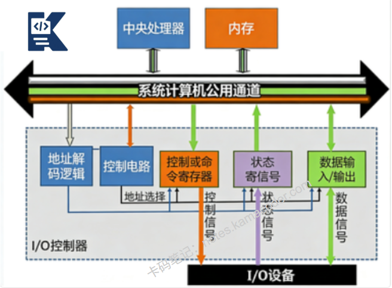

# I/O控制方式有什么？

> 来源: https://notes.kamacoder.com/base/io-control-methods.html

# I/O控制方式有什么？

## 简要回答

专业版：**I/O控制方式**是指**CPU**与**外部设备**进行**数据交换**的管理机制。

主要包括四种方式：**程序直接控制（轮询）、中断驱动、DMA（直接内存访问）和通道控制**。

它们代表了**从CPU高度参与**到**CPU几乎不参与的演进**过程，核心目标是**提高系统效率**和**减少CPU干预**。

## 专业回答

I/O控制方式的核心演进逻辑

随着计算机系统发展，I/O控制方式从CPU高度
参与向CPU低度参与演进，主要解决两个核心矛盾：

**CPU高速与I/O低速**的矛盾（CPU速度>>I/O速度）

**CPU计算与I/O管理**的矛盾（CPU应该专注于计算）

四种方式的原理详解

  1. 程序直接控制方式（轮询Polling）

工作原理：

CPU通过程序**主动、持续**检查设备状态寄存器

**设备就绪后，CPU执行数据传输**

数据传输**完全由CPU指令**完成

特点：
实现简单，不需要特殊硬件，
CPU利用率极低（忙等待），
无法实现设备并行操作，
适合简单、低速设备

  1. 中断驱动方式

工作原理：

CPU启动I/O操作后继**续执行其他任务**

设备**完成操作后向CPU发送中断信号**

**CPU暂停当前任务**，处理I/O中断

中断处理流程：

1）设备控制器发**送中断请求**(IRQ)

2）CPU完成当前指令后**响应中断**

3）**保存当前程序上下文**(PC、寄存器等)

4）**跳转到中断处理程序**(ISR)

5）**ISR处理I/O操作**

6）**恢复上下文，返回原程序**

特点：
CPU利用率提高（不忙等待），
能实现设备并行操作，
中断处理有开销，
适合中低速设备

  1. DMA方式（Direct Memory Access）

工作原理：

DMA控制器**接管数据传输**

CPU**只需初始化DMA**（设置**源地址、目标地址、数据量**）

DMA控制器在**设备**和**内存**间**直接传输数据**

传输完成后**DMA向CPU发送中断**

DMA传输模式：

周期窃取(Cycle Stealing)：**DMA在CPU不使用总线时传输**
块传输(Block Transfer)：**传输整个数据块**
透明传输(Transparent)：**CPU完全无感知**

特点：

大大减少CPU干预，
适合**高速、大批量**数据传输，
需要**额外的DMA控制器**硬件，
可能**引起总线竞争**

  1. 通道控制方式（Channel）

工作原理：

通道是**专用的I/O处理器**

通道**有自己的指令系统**（通道程序）

**CPU只需发出通道命令，通道独立执行**I/O

**通道可连接多个设备**，形成I/O子系统

通道类型：

**字节多路通道**：分时服务多个低速设备，
**选择通道**：独占方式服务高速设备，
**数组多路通道**：结合前两者优点

特点：

CPU几乎完全解放，
通道可并行处理多个I/O，
硬件成本高，
适合大型机、服务器

## 代码示例

```
#include <iostream>
#include <thread>
#include <chrono>
#include <queue>
#include <atomic>
#include <functional>
#include <vector>
#include <memory>
#include <random>

using namespace std;

// 设备状态枚举
enum DeviceStatus {
    IDLE,
    BUSY,
    READY,
    ERROR
};

// 设备基类
class Device {
protected:
    string name;
    DeviceStatus status;
    int data;

public:
    Device(const string& n) : name(n), status(IDLE), data(0) {}
    virtual ~Device() {}

    string getName() const { return name; }
    DeviceStatus getStatus() const { return status; }
    virtual void processRequest() = 0;
};

// 1. 轮询方式控制
class PollingController {
private:
    vector<Device*> devices;

public:
    void addDevice(Device* dev) {
        devices.push_back(dev);
    }

    // 轮询检查设备状态
    bool pollDevice(const string& devName) {
        for (auto dev : devices) {
            if (dev->getName() == devName) {
                // 模拟设备处理延迟
                this_thread::sleep_for(chrono::milliseconds(100));
                return dev->getStatus() == READY;
            }
        }
        return false;
    }

    // 轮询方式读取数据
    int readWithPolling(const string& devName) {
        cout << "[轮询] 开始读取设备 " << devName << "..." << endl;
        int pollCount = 0;

        // 持续轮询直到设备就绪
        while (!pollDevice(devName)) {
            pollCount++;
            cout << "[轮询] 第" << pollCount << "次检查，设备未就绪" << endl;
            this_thread::sleep_for(chrono::milliseconds(50));

            if (pollCount > 10) {
                cout << "[轮询] 超时，设备可能故障" << endl;
                return -1;
            }
        }

        cout << "[轮询] 设备就绪，读取数据完成" << endl;
        return 0;
    }
};

// 2. 中断方式控制
class InterruptController {
private:
    struct InterruptRequest {
        int irqNumber;
        string deviceName;
        function<void()> handler;
    };

    queue<InterruptRequest> irqQueue;
    atomic<bool> interruptEnabled{true};
    thread interruptThread;

public:
    InterruptController() {
        // 启动中断处理线程
        interruptThread = thread([this]() {
            this->interruptHandler();
        });
    }

    ~InterruptController() {
        interruptEnabled = false;
        if (interruptThread.joinable()) {
            interruptThread.join();
        }
    }

    // 设备触发中断
    void triggerInterrupt(int irq, const string& devName, function<void()> handler) {
        cout << "[中断] 设备 " << devName << " 触发中断 IRQ" << irq << endl;
        irqQueue.push({irq, devName, handler});
    }

    // 中断处理程序
    void interruptHandler() {
        while (interruptEnabled) {
            if (!irqQueue.empty()) {
                auto irq = irqQueue.front();
                irqQueue.pop();

                cout << "[中断] 处理中断 IRQ" << irq.irqNumber
                     << " (来自 " << irq.deviceName << ")" << endl;

                // 保存上下文（模拟）
                cout << "[中断] 保存CPU上下文..." << endl;

                // 执行中断服务程序
                if (irq.handler) {
                    irq.handler();
                }

                // 恢复上下文（模拟）
                cout << "[中断] 恢复CPU上下文，返回原程序" << endl;
            }
            this_thread::sleep_for(chrono::milliseconds(10));
        }
    }

    // 中断方式读取数据
    void readWithInterrupt(Device* device) {
        cout << "[中断] 启动设备 " << device->getName() << " 读取操作" << endl;
        cout << "[中断] CPU可以继续执行其他任务..." << endl;

        // 模拟设备异步操作
        thread([this, device]() {
            // 模拟设备处理时间
            this_thread::sleep_for(chrono::milliseconds(300));

            // 设备完成，触发中断
            this->triggerInterrupt(1, device->getName(), [device]() {
                cout << "[中断] 执行中断服务程序: 处理设备 "
                     << device->getName() << " 的数据" << endl;
                device->processRequest();
            });
        }).detach();
    }
};

// 3. DMA方式控制
class DMAController {
private:
    struct DMARequest {
        void* source;
        void* destination;
        size_t size;
        function<void()> callback;
    };

    queue<DMARequest> dmaQueue;
    atomic<bool> dmaEnabled{true};
    thread dmaThread;

public:
    DMAController() {
        dmaThread = thread([this]() {
            this->dmaHandler();
        });
    }

    ~DMAController() {
        dmaEnabled = false;
        if (dmaThread.joinable()) {
            dmaThread.join();
        }
    }

    // 启动DMA传输
    void startTransfer(void* src, void* dst, size_t size, function<void()> callback) {
        cout << "[DMA] CPU初始化DMA传输:" << endl;
        cout << "[DMA]   源地址: " << src << endl;
        cout << "[DMA]   目标地址: " << dst << endl;
        cout << "[DMA]   传输大小: " << size << " 字节" << endl;

        dmaQueue.push({src, dst, size, callback});
        cout << "[DMA] DMA传输已启动，CPU继续执行其他任务..." << endl;
    }

    // DMA处理程序
    void dmaHandler() {
        while (dmaEnabled) {
            if (!dmaQueue.empty()) {
                auto req = dmaQueue.front();
                dmaQueue.pop();

                cout << "[DMA] DMA控制器开始传输 " << req.size << " 字节数据..." << endl;

                // 模拟数据传输过程
                for (size_t i = 0; i < 5; i++) {
                    cout << "[DMA] 传输中... " << (i + 1) * 20 << "%" << endl;
                    this_thread::sleep_for(chrono::milliseconds(100));
                }

                cout << "[DMA] 传输完成，向CPU发送完成中断" << endl;

                // 传输完成，调用回调（模拟中断）
                if (req.callback) {
                    req.callback();
                }
            }
            this_thread::sleep_for(chrono::milliseconds(10));
        }
    }
};

// 4. 通道方式控制
class ChannelController {
private:
    struct ChannelProgram {
        vector<string> commands;
        function<void()> completionCallback;
    };

    vector<ChannelProgram> programs;
    atomic<bool> channelRunning{true};
    thread channelThread;

public:
    ChannelController() {
        channelThread = thread([this]() {
            this->channelExecutor();
        });
    }

    ~ChannelController() {
        channelRunning = false;
        if (channelThread.joinable()) {
            channelThread.join();
        }
    }

    // 提交通道程序
    void submitProgram(const vector<string>& commands, function<void()> callback) {
        cout << "[通道] CPU提交通道程序:" << endl;
        for (const auto& cmd : commands) {
            cout << "[通道]   " << cmd << endl;
        }

        programs.push_back({commands, callback});
        cout << "[通道] 通道程序已提交，CPU完全解放" << endl;
    }

    // 通道执行器
    void channelExecutor() {
        while (channelRunning) {
            if (!programs.empty()) {
                auto program = programs.front();
                programs.erase(programs.begin());

                cout << "[通道] 通道开始执行程序..." << endl;

                // 执行通道程序中的每条命令
                for (const auto& cmd : program.commands) {
                    cout << "[通道] 执行: " << cmd << endl;
                    this_thread::sleep_for(chrono::milliseconds(200));
                }

                cout << "[通道] 程序执行完成，通知CPU" << endl;

                // 执行完成回调
                if (program.completionCallback) {
                    program.completionCallback();
                }
            }
            this_thread::sleep_for(chrono::milliseconds(10));
        }
    }
};

// 模拟设备：硬盘
class HardDisk : public Device {
private:
    vector<int> storage;

public:
    HardDisk() : Device("HardDisk") {
        // 初始化一些测试数据
        for (int i = 0; i < 100; i++) {
            storage.push_back(i * 10);
        }
    }

    void processRequest() override {
        cout << "[设备] 硬盘处理请求..." << endl;
        status = BUSY;

        // 模拟硬盘操作
        this_thread::sleep_for(chrono::milliseconds(500));

        // 读取数据
        if (!storage.empty()) {
            data = storage.back();
            storage.pop_back();
            cout << "[设备] 硬盘读取数据: " << data << endl;
        }

        status = READY;
    }
};

// 模拟设备：键盘
class Keyboard : public Device {
public:
    Keyboard() : Device("Keyboard") {}

    void processRequest() override {
        cout << "[设备] 键盘处理请求..." << endl;
        status = BUSY;

        // 模拟按键输入
        this_thread::sleep_for(chrono::milliseconds(100));
        data = rand() % 256;  // 模拟按键值
        cout << "[设备] 键盘输入: " << data << endl;

        status = READY;
    }
};

// 演示程序
void demonstrateIOMethods() {
    cout << "====== I/O控制方式演示 ======" << endl << endl;

    // 创建设备
    HardDisk hdd;
    Keyboard kb;

    // 1. 演示轮询方式
    cout << "1. 程序直接控制方式（轮询）演示：" << endl;
    cout << string(50, '-') << endl;

    PollingController pollCtrl;
    pollCtrl.addDevice(&hdd);

    // 启动设备
    thread([&hdd]() {
        this_thread::sleep_for(chrono::milliseconds(200));
        hdd.processRequest();
    }).detach();

    // CPU轮询等待
    pollCtrl.readWithPolling("HardDisk");

    cout << endl << string(50, '=') << endl << endl;

    // 2. 演示中断方式
    cout << "2. 中断驱动方式演示：" << endl;
    cout << string(50, '-') << endl;

    InterruptController intCtrl;

    // CPU启动I/O后继续工作
    cout << "[主程序] CPU启动键盘输入操作" << endl;
    intCtrl.readWithInterrupt(&kb);

    // 模拟CPU执行其他任务
    for (int i = 0; i < 3; i++) {
        cout << "[主程序] CPU执行计算任务 " << i + 1 << endl;
        this_thread::sleep_for(chrono::milliseconds(200));
    }

    // 等待中断处理
    this_thread::sleep_for(chrono::milliseconds(1000));

    cout << endl << string(50, '=') << endl << endl;

    // 3. 演示DMA方式
    cout << "3. DMA方式演示：" << endl;
    cout << string(50, '-') << endl;

    DMAController dmaCtrl;

    // 模拟数据缓冲区
    vector<int> sourceData(1000, 42);  // 源数据
    vector<int> destData(1000, 0);     // 目标缓冲区

    // CPU初始化DMA传输
    dmaCtrl.startTransfer(
        sourceData.data(),
        destData.data(),
        sourceData.size() * sizeof(int),
        []() {
            cout << "[主程序] 收到DMA完成中断，处理传输完成" << endl;
        }
    );

    // CPU继续执行其他任务
    for (int i = 0; i < 5; i++) {
        cout << "[主程序] CPU执行其他任务 " << i + 1 << endl;
        this_thread::sleep_for(chrono::milliseconds(150));
    }

    // 等待DMA完成
    this_thread::sleep_for(chrono::milliseconds(2000));

    cout << endl << string(50, '=') << endl << endl;

    // 4. 演示通道方式
    cout << "4. 通道控制方式演示：" << endl;
    cout << string(50, '-') << endl;

    ChannelController channelCtrl;

    // CPU提交通道程序
    vector<string> channelProgram = {
        "READ SECTOR 100 TO MEMORY 0x1000",
        "WRITE MEMORY 0x2000 TO SECTOR 200",
        "VERIFY SECTOR 150",
        "READ SECTOR 300 TO MEMORY 0x3000"
    };

    channelCtrl.submitProgram(channelProgram, []() {
        cout << "[主程序] 收到通道操作完成通知" << endl;
        cout << "[主程序] 所有I/O操作已完成" << endl;
    });

    // CPU完全解放，执行计算密集型任务
    cout << "[主程序] CPU开始执行复杂计算任务..." << endl;
    for (int i = 0; i < 10; i++) {
        cout << "[主程序] 计算步骤 " << i + 1 << endl;
        this_thread::sleep_for(chrono::milliseconds(100));
    }

    // 等待通道操作完成
    this_thread::sleep_for(chrono::milliseconds(3000));

    cout << endl << string(50, '=') << endl;
    cout << "演示完成！" << endl;
}

int main() {
    demonstrateIOMethods();
    return 0;
}

```


## 知识拓展

**现代I/O技术的发展**

  1.

I/O多路复用：
select/poll/epoll（Linux）
IOCP（Windows）
单个线程监控多个I/O事件

   2.

异步I/O：
AIO（Linux异步I/O）
重叠I/O（Windows）
真正的异步，无需轮询或中断

   3.

RDMA（远程直接内存访问）：
网络设备直接访问内存
零拷贝技术
超低延迟，用于高性能计算

  - 知识图解



  - 面试官很能追问

Q1：DMA传输过程会占用CPU吗？为什么还需要CPU？

A1：
DMA传输期间：

DMA控制器占用系统总线进行数据传输
CPU可以继续执行不访问总线的操作（缓存命中、寄存器操作）
如果CPU需要访问总线，则必须等待（周期窃取）

为什么需要CPU：

初始化设置：CPU配置DMA控制器（源地址、目标地址、数据量）
启动传输：CPU发送启动命令
传输完成处理：DMA完成时通过中断通知CPU
错误处理：传输错误需要CPU介入
缓冲区管理：CPU管理DMA使用的内存区域

Q2：什么是零拷贝技术？与DMA有什么关系？

A2：零拷贝技术避免数据在内存中的多次复制,DMA是实现零拷贝的基础：

传统方式：设备→内核缓冲区→用户缓冲区（2次DMA+1次CPU复制）

零拷贝：设备直接→用户缓冲区（1次DMA）
