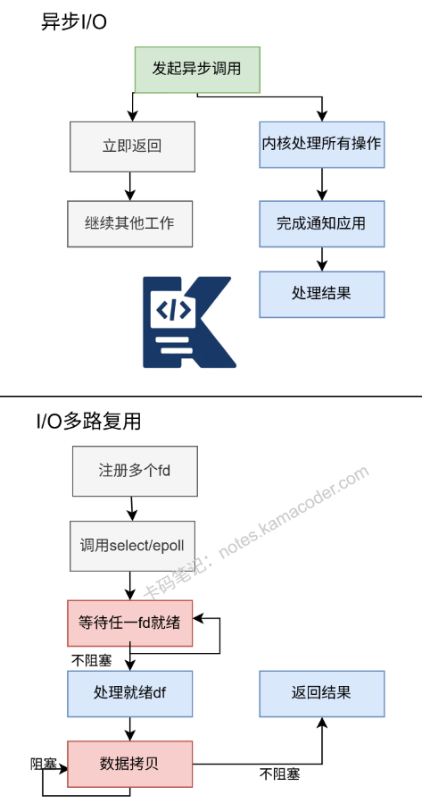

# IO模型有哪些？

> 来源: https://notes.kamacoder.com/base/io-models.html

# IO模型有哪些？

## 简要回答

常见的IO模型有5种**：阻塞IO、非阻塞IO、IO多路复用、信号驱动IO和异步IO**。

这些模型定义了应用程序与操作系统内核在数据读写过程中的交互方式，核心差异在于**等待数据就绪阶段**和**数据拷贝阶段**的处理策略。

## 详细回答

IO模型分类详解：

1.**阻塞IO** (Blocking IO)
**进程在IO操作完成前一直等待**，
**简单**但**并发性能差**，
默认的socket read/write行为

2.**非阻塞IO** (Non-blocking IO)
**立即返回**，成功或EAGAIN/EWOULDBLOCK，
**需要轮询检查状态**，
**CPU占用率高**

3.**IO多路复用** (IO Multiplexing)
select/poll：**一次监控多个fd**，
epoll/kqueue：**事件驱动，更高效**，
单线程处理多个连接

4.**信号驱动IO** (Signal-driven IO)
内核**在数据准备好时发送SIGIO信号**，
**不常**用，**信号处理复杂**

5.**异步IO** (Asynchronous IO)
**发起IO后立即返回**，**内核完成所有工作后通知**，
POSIX aio接口，Linux io_uring
**真正的异步**，**用户态不参与**

IO模型的核心在于**两个阶段**的处理方式：

**等待数据就绪阶段**：数据从**网络**到达**内核缓冲区** **数据拷贝阶段**：数据从内核缓冲区**拷贝到用户空间**

关键概念澄清：
同步IO：**前4种都是同步IO**，因为**数据拷贝阶段需要进程参与**

异步IO：只有最后1种，因为**整个IO过程进程都不需要参与等待**

## 代码示例

阻塞IO

```
#include <iostream>
#include <sys/socket.h>
#include <netinet/in.h>
#include <unistd.h>

int main() {
    int server_fd = socket(AF_INET, SOCK_STREAM, 0);
    sockaddr_in address{};
    address.sin_family = AF_INET;
    address.sin_addr.s_addr = INADDR_ANY;
    address.sin_port = htons(8080);

    bind(server_fd, (sockaddr*)&address, sizeof(address));
    listen(server_fd, 3);

    // 阻塞等待连接
    int addrlen = sizeof(address);
    int client_fd = accept(server_fd, (sockaddr*)&address, (socklen_t*)&addrlen);

    char buffer[1024] = {0};
    // 阻塞等待数据
    int valread = read(client_fd, buffer, 1024);
    std::cout << "收到: " << buffer << std::endl;

    send(client_fd, "Hello from server", 18, 0);
    close(client_fd);
    close(server_fd);
    return 0;
}

```


IO多路复用 - epoll

```
#include <iostream>
#include <sys/socket.h>
#include <netinet/in.h>
#include <unistd.h>
#include <sys/epoll.h>
#include <fcntl.h>
#include <vector>

#define MAX_EVENTS 10

void set_nonblocking(int fd) {
    int flags = fcntl(fd, F_GETFL, 0);
    fcntl(fd, F_SETFL, flags | O_NONBLOCK);
}

int main() {
    int server_fd = socket(AF_INET, SOCK_STREAM, 0);
    set_nonblocking(server_fd);

    sockaddr_in address{};
    address.sin_family = AF_INET;
    address.sin_addr.s_addr = INADDR_ANY;
    address.sin_port = htons(8080);

    bind(server_fd, (sockaddr*)&address, sizeof(address));
    listen(server_fd, SOMAXCONN);

    // 创建epoll实例
    int epoll_fd = epoll_create1(0);
    epoll_event event{};
    event.events = EPOLLIN | EPOLLET;  // 边缘触发
    event.data.fd = server_fd;
    epoll_ctl(epoll_fd, EPOLL_CTL_ADD, server_fd, &event);

    epoll_event events[MAX_EVENTS];

    while (true) {
        int nfds = epoll_wait(epoll_fd, events, MAX_EVENTS, -1);

        for (int i = 0; i < nfds; ++i) {
            if (events[i].data.fd == server_fd) {
                // 新连接
                while (true) {
                    int client_fd = accept(server_fd, nullptr, nullptr);
                    if (client_fd < 0) {
                        if (errno == EAGAIN || errno == EWOULDBLOCK) {
                            break;  // 已接受所有连接
                        }
                        perror("accept");
                        break;
                    }

                    set_nonblocking(client_fd);
                    epoll_event client_event{};
                    client_event.events = EPOLLIN | EPOLLET;
                    client_event.data.fd = client_fd;
                    epoll_ctl(epoll_fd, EPOLL_CTL_ADD, client_fd, &client_event);
                    std::cout << "新客户端: " << client_fd << std::endl;
                }
            } else {
                // 客户端数据
                int client_fd = events[i].data.fd;
                char buffer[1024];

                // ET模式需要读取所有数据
                while (true) {
                    int valread = read(client_fd, buffer, sizeof(buffer));
                    if (valread > 0) {
                        std::cout << "从" << client_fd << "收到: "
                                  << std::string(buffer, valread) << std::endl;
                        send(client_fd, "Response", 8, 0);
                    } else if (valread == 0) {
                        // 连接关闭
                        epoll_ctl(epoll_fd, EPOLL_CTL_DEL, client_fd, nullptr);
                        close(client_fd);
                        std::cout << "客户端" << client_fd << "断开" << std::endl;
                        break;
                    } else if (errno == EAGAIN || errno == EWOULDBLOCK) {
                        // 本次数据已读完
                        break;
                    } else {
                        perror("read error");
                        epoll_ctl(epoll_fd, EPOLL_CTL_DEL, client_fd, nullptr);
                        close(client_fd);
                        break;
                    }
                }
            }
        }
    }

    close(epoll_fd);
    close(server_fd);
    return 0;
}

```


## 知识拓展

各种IO复用机制性能对比

| 特性  select  poll  epoll(LT)  epoll(ET)
| 时间复杂度  O(n)  O(n)  O(1)  O(1)
| 连接数限制  1024  无  无  无
| 内存拷贝  每次调用都拷贝  每次调用都拷贝  内核-用户共享  内核-用户共享
| 触发方式  水平触发  水平触发  水平触发  边缘触发
| 编程复杂度  简单  简单  中等  复杂
  - 同步IO vs 异步IO

同步IO：**阻塞IO、非阻塞IO、IO多路复用、信号驱动IO**

异步IO：**真正的异步操作**，如Linux AIO、Windows IOCP

  - Reactor vs Proactor模式

Reactor：基于**IO多路复用**，通知应用"**何时可以开始操作**"
Proactor：**基于异步IO**，通知应用"**操作已完成**"

  - 知识图解



  - 适用场景

阻塞IO适用场景：

简单的客户端应用程序
低并发的教学示例
批处理脚本
不需要高并发的工具程序

非阻塞IO适用场景：

需要快速响应的GUI应用程序
简单的游戏服务器（连接数<1000）
需要与其他计算任务交织的IO操作
实时控制系统

IO多路复用适用场景（最广泛）：

高并发网络服务器（Nginx、Redis）
即时通讯服务器
实时数据推送服务
代理服务器和负载均衡器
WebSocket服务器

信号驱动IO适用场景：

UDP服务器（如DNS服务器）
嵌入式系统
特殊设备驱动程序
需要低延迟响应的监控系统

异步IO适用场景：

高性能文件服务器
数据库管理系统
Windows平台的高性能服务器（IOCP）
需要极致性能的大数据处理
视频流处理服务器

  - 面试官很能追问

Q1: 同步IO和异步IO的根本区别是什么？

答1：同步IO和异步IO的根本区别在于数据拷贝阶段由谁完成：

同步IO：数据就绪后，应用程序进程需要主动调用系统调用，将数据从内核缓冲区拷贝到用户空间。

应用程序在数据拷贝阶段是阻塞的（即使之前轮询不阻塞）。

异步IO：整个IO操作（包括数据拷贝）都由操作系统内核完成，内核完成所有操作后通过回调、信号或完成端口通知应用程序。

应用程序完全不参与数据拷贝过程。

POSIX标准定义：
同步IO操作导致请求进程阻塞，直到IO操作完成
异步IO操作不导致请求进程阻塞

技术实现差异：

同步IO：read()/write(), recv()/send() 等系统调用

异步IO：aio_read()/aio_write()（Linux），IOCP（Windows）

Q2: 边缘触发(ET)和水平触发(LT)在实际编程中要注意什么？

A2:答

水平触发（LT）特点：
默认模式，编程简单
只要文件描述符可读/可写，就会持续触发事件，可以分多次处理数据，可能造成不必要的重复通知

边缘触发（ET）特点：
只有文件描述符状态变化时触发一次，
需要一次处理完所有数据，
必须使用非阻塞IO，
性能更高，但编程复杂
