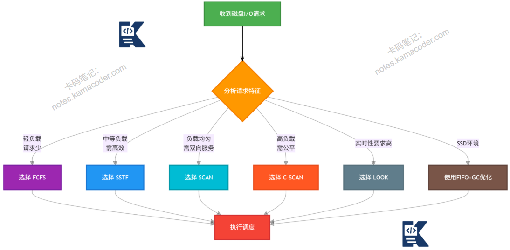

# 磁盘调度算法有什么？

> 来源: https://notes.kamacoder.com/base/disk-scheduling-algorithms.html

# 磁盘调度算法有什么？

## 简要回答

磁盘调度算法是**操作系统**优化**磁盘I/O性能**的核心技术，通过合理安排**磁头移动顺序减少寻道时间**。

主要算法包括：**先来先服务**（FCFS）、**最短寻道时间优先**（SSTF）、**扫描算法**（SCAN）、**循环扫描算法**（C-SCAN）、**LOOK算法**、**C-LOOK算法**。

评估指标包括平均**寻道长度**、**响应时间**和**吞吐量**。

## 专业回答

磁盘访问时间由**三部分**组成：

**寻道时间**：**磁头**移动到**目标柱面**（≈5-15ms）

**旋转延迟**：**磁盘旋转到目标扇区**（≈4-8ms）

**传输时间**：**读写数据时间**（相对很短）

磁盘调度算法主要优**化寻道时间**，因为它是**主要瓶颈**。

假设一个典型硬盘有1000个柱面（0-999），磁头初始位置在**不同算法下移动方式不同**。

**七大算法**详解

  1. 先来先服务（FCFS, First Come First Serve）

原理：按照请求到达顺序服务，磁头按**请求顺序移动**。

特点：
**公平性最好，实现最简单**，
**性能最差**，平均寻道距离最大，
磁头可能来回震荡，产生"抖动"

  1. 最短寻道时间优先（SSTF, Shortest Seek Time First）

原理：每次选择离当**前磁头位置最近**的请求服务。

特点：
**贪心算法**，局部最优，
比FCFS性能好，**平均寻道距离小**，
**可能产生"饥饿**"：边缘请求长时间得不到，服务，**响应时间波动大**

  1. 扫描算法（SCAN，电梯算法）

原理：磁头**单向移动**，**到尽头后反向**，像电梯上下运行。

工作方式：
磁头**从一端开始向另一端移动**，
途中服务所有请求，
**到达另一端后反向移动**，
重复此过程

特点：
**无饥饿问题，公平性好**
平均寻道距离**介于FCFS和SSTF之间** **边缘请求等待时间较长**（磁头必须到尽头）

变体：
LOOK算法：**到最远请求就反向，不必到尽头**，
C-SCAN：**单向服务，返回时不服务请求**，

  1. 循环扫描算法（C-SCAN, Circular SCAN）

原理：**磁头单向移动，到尽头后快速返回起点**（不服务请求），重新开始。

特点：
**等待时间更均匀**，
对边缘**请求更公平**（不会长时间等待），
牺牲一定性能换取公平性

  1. N步扫描算法（N-Step-SCAN）

原理：将**请求队列分成N个子队列**，**每个队列使用SCAN算法**。

特点：
**减少磁臂粘着**（arm stickiness），
折中响应时间和吞吐量，
**实现较复杂**

  1. FSCAN算法

原理：**将请求分为两个队列**，一个当前服务队列使用SCAN，新请求进入另一个队列。

特点：
避免新请求影响当前扫描
减少响应时间波动

## 代码示例

```
#include <iostream>
#include <vector>
#include <algorithm>
#include <cmath>
#include <queue>
#include <iomanip>
#include <limits>

using namespace std;

// 磁盘调度算法基类
class DiskScheduler {
protected:
    vector<int> requests;    // 请求队列
    int head;                // 当前磁头位置
    int maxCylinder;         // 最大柱面号

public:
    DiskScheduler(vector<int> req, int start, int max = 199)
        : requests(req), head(start), maxCylinder(max) {}

    virtual void schedule() = 0;
    virtual string getName() = 0;

    // 计算平均寻道长度
    double calculateAvgSeek(const vector<int>& order) {
        if (order.empty()) return 0;

        int totalSeek = 0;
        int current = head;

        cout << "调度顺序: " << current;
        for (int pos : order) {
            totalSeek += abs(pos - current);
            cout << " -> " << pos;
            current = pos;
        }
        cout << endl;

        double avg = (double)totalSeek / order.size();
        cout << "总寻道长度: " << totalSeek
             << ", 平均寻道长度: " << fixed << setprecision(2) << avg << endl;
        return avg;
    }
};

// 1. 先来先服务算法
class FCFS : public DiskScheduler {
public:
    FCFS(vector<int> req, int start, int max = 199)
        : DiskScheduler(req, start, max) {}

    string getName() override { return "FCFS (先来先服务)"; }

    void schedule() override {
        cout << "\n=== " << getName() << " ===" << endl;
        cout << "初始磁头位置: " << head << endl;
        cout << "请求序列: ";
        for (int r : requests) cout << r << " ";
        cout << endl;

        // 直接按请求顺序服务
        calculateAvgSeek(requests);
    }
};

// 2. 最短寻道时间优先算法
class SSTF : public DiskScheduler {
public:
    SSTF(vector<int> req, int start, int max = 199)
        : DiskScheduler(req, start, max) {}

    string getName() override { return "SSTF (最短寻道优先)"; }

    void schedule() override {
        cout << "\n=== " << getName() << " ===" << endl;
        cout << "初始磁头位置: " << head << endl;
        cout << "请求序列: ";
        for (int r : requests) cout << r << " ";
        cout << endl;

        vector<int> temp = requests;
        vector<int> order;
        int current = head;

        while (!temp.empty()) {
            // 找到距离当前位置最近的请求
            auto closest = min_element(temp.begin(), temp.end(),
                [current](int a, int b) {
                    return abs(a - current) < abs(b - current);
                });

            order.push_back(*closest);
            current = *closest;
            temp.erase(closest);
        }

        calculateAvgSeek(order);
    }
};

// 3. SCAN算法（电梯算法）
class SCAN : public DiskScheduler {
private:
    bool direction;  // true: 向外(增大), false: 向内(减小)

public:
    SCAN(vector<int> req, int start, bool dir = true, int max = 199)
        : DiskScheduler(req, start, max), direction(dir) {}

    string getName() override {
        return string("SCAN (扫描算法) - ") +
               (direction ? "向外移动" : "向内移动");
    }

    void schedule() override {
        cout << "\n=== " << getName() << " ===" << endl;
        cout << "初始磁头位置: " << head << endl;
        cout << "请求序列: ";
        for (int r : requests) cout << r << " ";
        cout << endl;

        vector<int> left, right;
        vector<int> order;

        // 分离左右请求
        for (int req : requests) {
            if (req < head) left.push_back(req);
            if (req > head) right.push_back(req);
        }

        // 排序
        sort(left.begin(), left.end(), greater<int>());  // 降序
        sort(right.begin(), right.end());                // 升序

        int current = head;

        if (direction) {  // 向外移动
            // 先服务右侧（增大方向）
            for (int r : right) {
                order.push_back(r);
                current = r;
            }

            // 到尽头后反向
            if (current != maxCylinder) {
                order.push_back(maxCylinder);
                current = maxCylinder;
            }

            // 服务左侧
            for (int r : left) {
                order.push_back(r);
                current = r;
            }
        } else {  // 向内移动
            // 先服务左侧（减小方向）
            for (int r : left) {
                order.push_back(r);
                current = r;
            }

            // 到尽头后反向
            if (current != 0) {
                order.push_back(0);
                current = 0;
            }

            // 服务右侧
            for (int r : right) {
                order.push_back(r);
                current = r;
            }
        }

        calculateAvgSeek(order);
    }
};

// 4. C-SCAN算法（循环扫描）
class CSCAN : public DiskScheduler {
public:
    CSCAN(vector<int> req, int start, int max = 199)
        : DiskScheduler(req, start, max) {}

    string getName() override { return "C-SCAN (循环扫描)"; }

    void schedule() override {
        cout << "\n=== " << getName() << " ===" << endl;
        cout << "初始磁头位置: " << head << endl;
        cout << "请求序列: ";
        for (int r : requests) cout << r << " ";
        cout << endl;

        vector<int> left, right;
        vector<int> order;

        // 分离左右请求
        for (int req : requests) {
            if (req < head) left.push_back(req);
            if (req >= head) right.push_back(req);
        }

        // 排序
        sort(left.begin(), left.end());      // 升序
        sort(right.begin(), right.end());    // 升序

        // 先服务右侧（当前及以后）
        for (int r : right) {
            if (r != head || order.empty()) {  // 避免重复添加当前位置
                order.push_back(r);
            }
        }

        // 快速返回到起点
        if (!order.empty() && order.back() != maxCylinder) {
            order.push_back(maxCylinder);
        }

        // 回到0柱面（快速返回，不服务请求）
        if (!left.empty()) {
            order.push_back(0);
        }

        // 服务左侧请求
        for (int r : left) {
            order.push_back(r);
        }

        calculateAvgSeek(order);
    }
};

// 5. LOOK算法（改进的SCAN）
class LOOK : public DiskScheduler {
private:
    bool direction;

public:
    LOOK(vector<int> req, int start, bool dir = true, int max = 199)
        : DiskScheduler(req, start, max), direction(dir) {}

    string getName() override {
        return string("LOOK算法 - ") +
               (direction ? "向外移动" : "向内移动");
    }

    void schedule() override {
        cout << "\n=== " << getName() << " ===" << endl;
        cout << "初始磁头位置: " << head << endl;
        cout << "请求序列: ";
        for (int r : requests) cout << r << " ";
        cout << endl;

        vector<int> left, right;
        vector<int> order;

        // 分离左右请求
        for (int req : requests) {
            if (req < head) left.push_back(req);
            if (req > head) right.push_back(req);
        }

        // 排序
        sort(left.begin(), left.end(), greater<int>());  // 降序
        sort(right.begin(), right.end());                // 升序

        if (direction) {  // 向外移动
            // 服务右侧请求
            for (int r : right) {
                order.push_back(r);
            }

            // 反向服务左侧请求
            for (int r : left) {
                order.push_back(r);
            }
        } else {  // 向内移动
            // 服务左侧请求
            for (int r : left) {
                order.push_back(r);
            }

            // 反向服务右侧请求
            for (int r : right) {
                order.push_back(r);
            }
        }

        calculateAvgSeek(order);
    }
};

// 6. C-LOOK算法（改进的C-SCAN）
class CLOOK : public DiskScheduler {
public:
    CLOOK(vector<int> req, int start, int max = 199)
        : DiskScheduler(req, start, max) {}

    string getName() override { return "C-LOOK算法"; }

    void schedule() override {
        cout << "\n=== " << getName() << " ===" << endl;
        cout << "初始磁头位置: " << head << endl;
        cout << "请求序列: ";
        for (int r : requests) cout << r << " ";
        cout << endl;

        vector<int> left, right;
        vector<int> order;

        // 分离左右请求
        for (int req : requests) {
            if (req < head) left.push_back(req);
            if (req >= head) right.push_back(req);
        }

        // 排序
        sort(left.begin(), left.end());      // 升序
        sort(right.begin(), right.end());    // 升序

        // 服务右侧请求
        for (int r : right) {
            if (r != head || order.empty()) {  // 避免重复添加当前位置
                order.push_back(r);
            }
        }

        // 快速返回到左侧最小请求处（不经过中间柱面）
        if (!left.empty()) {
            // 直接跳到最小请求处
            order.push_back(left.front());

            // 服务剩余左侧请求
            for (size_t i = 1; i < left.size(); i++) {
                order.push_back(left[i]);
            }
        }

        calculateAvgSeek(order);
    }
};

// 测试函数
void testAllAlgorithms() {
    // 测试数据
    vector<int> requests = {98, 183, 37, 122, 14, 124, 65, 67};
    int initialHead = 53;
    int maxCylinder = 199;

    cout << "===== 磁盘调度算法对比 =====" << endl;
    cout << "初始磁头位置: " << initialHead << endl;
    cout << "请求序列: ";
    for (int r : requests) cout << r << " ";
    cout << "\n最大柱面号: " << maxCylinder << endl;

    // 测试各种算法
    vector<DiskScheduler*> schedulers;

    schedulers.push_back(new FCFS(requests, initialHead, maxCylinder));
    schedulers.push_back(new SSTF(requests, initialHead, maxCylinder));
    schedulers.push_back(new SCAN(requests, initialHead, true, maxCylinder));
    schedulers.push_back(new CSCAN(requests, initialHead, maxCylinder));
    schedulers.push_back(new LOOK(requests, initialHead, true, maxCylinder));
    schedulers.push_back(new CLOOK(requests, initialHead, maxCylinder));

    vector<double> results;

    for (auto scheduler : schedulers) {
        scheduler->schedule();
        cout << endl;
        delete scheduler;
    }
}

// 交互式演示
void interactiveDemo() {
    cout << "===== 磁盘调度算法交互演示 =====" << endl;

    int maxCylinder, headPos, n;

    cout << "请输入最大柱面号(默认199): ";
    string input;
    getline(cin, input);
    maxCylinder = input.empty() ? 199 : stoi(input);

    cout << "请输入初始磁头位置: ";
    cin >> headPos;

    cout << "请输入请求数量: ";
    cin >> n;

    vector<int> requests;
    cout << "请输入" << n << "个请求柱面号(0-" << maxCylinder << "):" << endl;
    for (int i = 0; i < n; i++) {
        int req;
        cin >> req;
        if (req < 0 || req > maxCylinder) {
            cout << "无效输入，请重新输入: ";
            i--;
            continue;
        }
        requests.push_back(req);
    }

    cout << "\n选择算法:" << endl;
    cout << "1. FCFS (先来先服务)" << endl;
    cout << "2. SSTF (最短寻道优先)" << endl;
    cout << "3. SCAN (扫描算法)" << endl;
    cout << "4. C-SCAN (循环扫描)" << endl;
    cout << "5. LOOK算法" << endl;
    cout << "6. C-LOOK算法" << endl;
    cout << "7. 全部测试" << endl;
    cout << "请选择(1-7): ";

    int choice;
    cin >> choice;

    DiskScheduler* scheduler = nullptr;

    switch (choice) {
        case 1:
            scheduler = new FCFS(requests, headPos, maxCylinder);
            break;
        case 2:
            scheduler = new SSTF(requests, headPos, maxCylinder);
            break;
        case 3:
            scheduler = new SCAN(requests, headPos, true, maxCylinder);
            break;
        case 4:
            scheduler = new CSCAN(requests, headPos, maxCylinder);
            break;
        case 5:
            scheduler = new LOOK(requests, headPos, true, maxCylinder);
            break;
        case 6:
            scheduler = new CLOOK(requests, headPos, maxCylinder);
            break;
        case 7:
            testAllAlgorithms();
            return;
        default:
            cout << "无效选择!" << endl;
            return;
    }

    if (scheduler) {
        scheduler->schedule();
        delete scheduler;
    }
}

int main() {
    int choice;
    cout << "磁盘调度算法演示程序" << endl;
    cout << "1. 使用预设数据测试所有算法" << endl;
    cout << "2. 交互式演示" << endl;
    cout << "请选择(1-2): ";
    cin >> choice;

    if (choice == 1) {
        testAllAlgorithms();
    } else if (choice == 2) {
        interactiveDemo();
    } else {
        cout << "无效选择!" << endl;
    }

    return 0;
}

```


## 知识拓展

现代磁盘技术影响

**固态硬盘**(SSD)：
无机械部件，寻道时间几乎为0，
调度算法重要性降低，
但仍有优化空间（并发请求、垃圾回收）

**多磁头磁盘**：
多个磁头可同时移动，
更复杂的调度算法，
区域位记录(ZBR)技术

**RAID阵列**：
多个磁盘并行工作，
需要跨磁盘调度，
负载均衡和数据分布

  - 适用场景

不同算法的适用场景

**FCFS（先来先服务）：**
负载很轻的系统，
SSD固态硬盘（寻道时间不重要），
测试和基准对比，
简单嵌入式系统

**SSTF（最短寻道优先）：**
中等负载的个人计算机，
需要快速响应的交互式系统，
随机访问为主的工作负载，
不适合高负载服务器（有饥饿风险）

**SCAN/LOOK（扫描算法）：**
负载较重的多用户系统，
文件服务器、数据库服务器，
需要兼顾吞吐量和公平性，
避免磁臂粘着的场景

**C-SCAN/C-LOOK（循环扫描）：**
实时系统，
需要更均匀响应时间的系统，
多媒体服务器，
交易处理系统

  - 知识图解



  - 面试官很能追问

Q1：为什么SSTF可能产生饥饿？如何解决？

A1：
**饥饿原因**：
新请求总是选择离当前磁头最近的，
边缘柱面的请求可能永远没有机会成为"最近"，
如果有密集请求在中间区域，边缘请求长时间等待

**解决方案**

FSCAN：将请求分为两个队列，一个服务时另一个积累，

时间片限制：设置最大等待时间，超时后优先服务

Q2:**现代操作系统（如Linux）实际使用什么调度算法？**

A2：有以下几种

1.Linus电梯：早期，基于SCAN

2.Deadline调度器：

3.Anticipatory调度器：

4.CFQ（完全公平队列）：

5.NOOP调度器：

6.BFQ（预算公平队列）：
