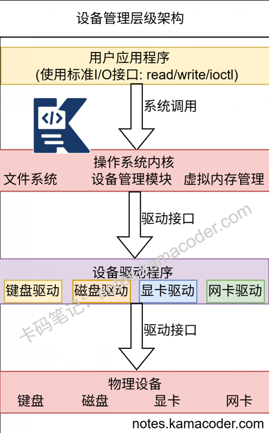

# 设备管理的主要功能有哪些？

> 来源: https://notes.kamacoder.com/base/device-management.html

# 设备管理的主要功能有哪些？

## 简要回答

设备管理主要**负责计算机外设的分配**、**控制和管理**，核心功能包括：

**设备分配** - 管理设备共享与独占

**设备驱动** - 提供硬件抽象接口

**缓冲管理** - 平衡CPU与I/O速度差异

**中断处理** - 响应设备事件

**错误处理** - 检测和处理设备故障

**虚拟化** - 抽象物理设备为逻辑设备

## 详细回答

  1. 设备分配与调度

分配策略有**独占，共享，虚拟**

独占分配：打印机等设备**一次只供一个**进程使用，
共享分配：磁盘等设备**可多进程并发**访问，
虚拟分配：**通过SPOOLing技术虚拟独占**设备

调度算法：
**先来先服务**（FCFS），
**最短寻道时间**优先（SSTF，磁盘），
S**CAN/C-SCAN算法**（磁盘电梯算法）

  1. 设备驱动与抽象

**统一接口**：为应用程序**提供一致的设备访问接口**，

**硬件抽象**：**隐藏设备硬件细节**，提供read/write/ioctl等标准操作

驱动模型：
**字符设备**：键盘、鼠标（流式访问）
**块设备**：磁盘、USB（块式访问）
**网络设备**：网卡（报文传输）

  1. 缓冲管理

目的：**解决CPU与I/O设备速度不匹配问题**

缓冲类型有**单缓冲，双缓冲，循环缓冲，缓冲池**

单缓冲：一个缓冲区交替使用，
双缓冲：两个缓冲区提高并行度，
循环缓冲：多个缓冲区组成环形队列，
缓冲池：系统级共享缓冲区

  1. 中断处理机制

中断分类：**硬件中断、软件中断、异常**

处理流程：
设备**产生中断请求**，
**CPU保存现场**，识别中断源，
**执行中断服务程序**（ISR），
**恢复现场**继续执行，
**中断屏蔽**：处理关键代码时临时禁用中断

  1. 错误检测与恢复

错误类型有
**临时错误**：可通过重试恢复
**永久错误**：需要人工干预

处理机制：
**ECC校验**（内存、磁盘）
**重传机制**（网络设备）
**坏块管理**（磁盘）
设备**热插拔支持**

  1. 设备虚拟化

目的：**提高设备利用率和灵活性**
技术：
SPOOLing：**将独占设备虚拟为共享设备**
设备透传：**虚拟机直接访问物理设备**
虚拟设备：**完全由软件模拟的设备**

## 代码示例

```

// 设备管理器
class DeviceManager {
private:
    std::vector<std::unique_ptr<Device>> devices;

public:
    void register_device(std::unique_ptr<Device> device) {
        devices.push_back(std::move(device));
    }

    Device* get_device(int index) {
        if (index < 0 || index >= devices.size()) return nullptr;
        return devices[index].get();
    }
};

```


## 知识拓展

  1. 现代设备管理技术

即插即用：自动检测和配置新设备
热插拔：运行时添加/移除设备
电源管理：动态调整设备功耗状态
虚拟设备：Docker容器中的设备虚拟化
IOMMU：设备直接内存访问的安全管理

  1. 设备驱动模型发展

monolithic驱动：传统单一驱动
微内核驱动：驱动运行在用户空间
总线驱动模型：PCIe、USB等总线标准
设备树：嵌入式系统硬件描述

  1. 性能优化技术

DMA：直接内存访问，减少CPU干预
中断合并：合并多个小中断
零拷贝：避免数据在内核和用户空间多次拷贝
异步I/O：非阻塞I/O操作

  - 知识图解



  - 使用场景

操作系统开发：Linux/Windows内核设备管理
嵌入式系统：资源受限设备的驱动开发
高性能计算：优化I/O密集型应用性能
云计算：虚拟机设备虚拟化和透传

  - 面试官很能追问

Q1：字符设备和块设备的主要区别？

A1：
**字符设备**：
流式访问，无固定大小
通常不支持随机访问
示例：键盘、鼠标、串口

**块设备**：
块式访问，固定块大小
支持随机访问
有缓冲区缓存
示例：磁盘、SSD、USB存储

Q2：什么是DMA？为什么重要？

A2：
DMA：直接内存访问，允许设备直接与内存交换数据

优势：
减少CPU负担，提高系统并行性
提高大数据传输效率
支持设备到设备直接传输

实现：DMA控制器管理数据传输
