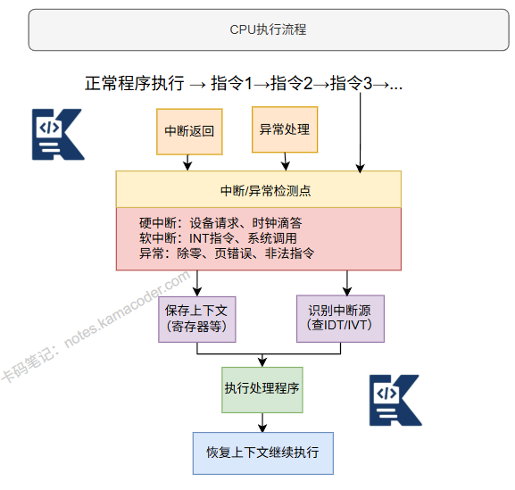

# 什么是中断、异常？

> 来源: https://notes.kamacoder.com/base/interrupts-exceptions.html

# 什么是中断、异常？

## 简要回答

**中断**和**异常**都是**CPU响应特殊事件**的机制，会**打断当前执行流程**：

中断（Interrupt）：来自**CPU外部的异步事件**，如I/O设备请求、时钟信号

异常（Exception）：来自**CPU内部的同步事件**，如指令执行错误、系统调用

两者都会触发CPU从**用户态切换到内核态**，执行相应的处理程序。

## 专业回答

**中断**和**异常**是处理器响应**突发事件**的核心机制，统称为**中断向量**（Interrupt Vector）

  - 中断（Interrupt）

定义：由**外部硬件设备产生的异步事件信号**，用于通知**CPU有需要处理的事件**。

特性：
异步性：与**CPU当前执行指令无关**，**随时可能发生**；可屏蔽：可以**通过中断屏蔽位暂时禁止某些中断**；可嵌套：**高级中断可以打断低级中断处理**

分类：
**硬件中断**（Hardware Interrupt）
可屏蔽中断（INTR）：可**通过CLI指令屏蔽
非屏蔽中断**（NMI）：**不可屏蔽**，如内存奇偶校验错

**软件中断**（Software Interrupt）
**INT指令触发**，如系统调用（Linux的int 0x80）

  - 异常（Exception）

定义：由CPU内部执行指令时检测到的同步事件。

特性：
同步性：**特定指令**执行必然产生；不可屏蔽：**无法通过软件屏蔽**；精确性：可以精确定位到出错指令

分类：
**故障**（Fault）：**可恢复错误**，如缺页异常、除零异常
**陷阱**（Trap）：**有意产生**，如断点调试、系统调用
**终止**（Abort）：**严重错误**，无法恢复，如硬件故障

## 代码示例

中断处理示示例

```
#include <iostream>
#include <functional>
#include <queue>
#include <map>
#include <thread>
#include <chrono>
#include <atomic>
#include <mutex>

// 中断类型枚举
enum InterruptType {
    IRQ_TIMER = 0,      // 时钟中断
    IRQ_KEYBOARD = 1,   // 键盘中断
    IRQ_NETWORK = 2,    // 网络中断
    IRQ_DISK = 3        // 磁盘中断
};

// 异常类型枚举
enum ExceptionType {
    EX_DIVIDE_ERROR = 0,     // 除零异常
    EX_PAGE_FAULT = 1,       // 缺页异常
    EX_GENERAL_PROTECTION = 2, // 一般保护异常
    EX_SYSCALL = 3           // 系统调用
};

// 中断描述符表条目
struct IDTEntry {
    uint32_t handler_address;
    uint16_t segment_selector;
    uint8_t type : 4;
    uint8_t storage_segment : 1;
    uint8_t privilege_level : 2;
    uint8_t present : 1;

    IDTEntry() : handler_address(0), segment_selector(0),
                type(0), storage_segment(0),
                privilege_level(0), present(0) {}
};

// 中断描述符表
class InterruptDescriptorTable {
private:
    IDTEntry entries[256];

public:
    void set_entry(int index, uint32_t handler, uint8_t type, uint8_t privilege) {
        entries[index].handler_address = handler;
        entries[index].segment_selector = 0x08; // 内核代码段
        entries[index].type = type;
        entries[index].storage_segment = 0;
        entries[index].privilege_level = privilege;
        entries[index].present = 1;
        std::cout << "设置IDT条目[" << index << "] 处理器地址: 0x"
                  << std::hex << handler << std::dec << std::endl;
    }

    IDTEntry get_entry(int index) const {
        return entries[index];
    }
};

// CPU状态保存区（中断上下文）
struct CPUContext {
    uint32_t eax, ebx, ecx, edx;
    uint32_t esi, edi, ebp, esp;
    uint32_t eip, eflags;
    uint32_t cs, ds, es, fs, gs, ss;

    void print() const {
        std::cout << "=== CPU上下文 ===" << std::endl;
        std::cout << "EIP: 0x" << std::hex << eip << std::dec
                  << " EFLAGS: 0x" << std::hex << eflags << std::dec << std::endl;
        std::cout << "EAX: 0x" << std::hex << eax
                  << " EBX: 0x" << ebx
                  << " ECX: 0x" << ecx
                  << " EDX: 0x" << edx << std::dec << std::endl;
    }
};

// 中断控制器（模拟8259A PIC）
class InterruptController {
private:
    std::atomic<bool> interrupts_enabled;
    std::queue<InterruptType> interrupt_queue;
    std::mutex queue_mutex;

public:
    InterruptController() : interrupts_enabled(true) {}

    // 触发中断
    void trigger_interrupt(InterruptType type) {
        std::lock_guard<std::mutex> lock(queue_mutex);
        interrupt_queue.push(type);
        std::cout << "[PIC] 中断触发: " << get_interrupt_name(type) << std::endl;
    }

    // 检查是否有待处理中断
    bool has_pending_interrupt() {
        std::lock_guard<std::mutex> lock(queue_mutex);
        return !interrupt_queue.empty();
    }

    // 获取最高优先级中断
    InterruptType get_next_interrupt() {
        std::lock_guard<std::mutex> lock(queue_mutex);
        if (interrupt_queue.empty()) {
            throw std::runtime_error("无待处理中断");
        }
        InterruptType type = interrupt_queue.front();
        interrupt_queue.pop();
        return type;
    }

    // 启用中断
    void enable_interrupts() {
        interrupts_enabled = true;
        std::cout << "[PIC] 中断已启用" << std::endl;
    }

    // 禁用中断
    void disable_interrupts() {
        interrupts_enabled = false;
        std::cout << "[PIC] 中断已禁用" << std::endl;
    }

    bool are_interrupts_enabled() const {
        return interrupts_enabled;
    }

private:
    std::string get_interrupt_name(InterruptType type) {
        switch (type) {
            case IRQ_TIMER: return "时钟中断";
            case IRQ_KEYBOARD: return "键盘中断";
            case IRQ_NETWORK: return "网络中断";
            case IRQ_DISK: return "磁盘中断";
            default: return "未知中断";
        }
    }
};

// 异常处理器
class ExceptionHandler {
public:
    static void handle_divide_error(CPUContext& context) {
        std::cout << "[异常] 除零错误! EIP=0x" << std::hex << context.eip << std::dec << std::endl;
        // 实际系统中可能会终止进程或发送SIGFPE信号
        std::cout << "修复状态并继续..." << std::endl;
        context.eax = 0; // 设置结果为0
    }

    static void handle_page_fault(uint32_t fault_address, CPUContext& context) {
        std::cout << "[异常] 缺页异常! 地址: 0x" << std::hex << fault_address
                  << " EIP: 0x" << context.eip << std::dec << std::endl;
        // 模拟页面调入
        std::cout << "从磁盘加载页面..." << std::endl;
        // 设置页表项并继续执行
    }

    static void handle_general_protection(CPUContext& context) {
        std::cout << "[异常] 一般保护错误! EIP=0x" << std::hex << context.eip << std::dec << std::endl;
        std::cout << "通常导致进程终止(SIGSEGV)" << std::endl;
    }

    static void handle_syscall(int syscall_num, CPUContext& context) {
        std::cout << "[系统调用] 编号: " << syscall_num
                  << " 参数: EAX=0x" << std::hex << context.eax
                  << " EBX=0x" << context.ebx
                  << " ECX=0x" << context.ecx
                  << " EDX=0x" << context.edx << std::dec << std::endl;

        // 模拟系统调用处理
        switch (syscall_num) {
            case 1: // write
                std::cout << "系统调用: write(" << context.ebx << ", "
                          << reinterpret_cast<const char*>(context.ecx)
                          << ", " << context.edx << ")" << std::endl;
                context.eax = context.edx; // 返回写入字节数
                break;
            case 2: // read
                std::cout << "系统调用: read(" << context.ebx << ")" << std::endl;
                context.eax = 0; // 返回读取字节数
                break;
            default:
                std::cout << "未知系统调用" << std::endl;
                context.eax = -1; // 错误返回
        }
    }
};

// 中断处理器
class InterruptHandler {
public:
    static void handle_timer_interrupt(CPUContext& context) {
        static int tick = 0;
        tick++;
        std::cout << "[时钟中断] 嘀嗒 " << tick
                  << " 当前EIP: 0x" << std::hex << context.eip << std::dec << std::endl;

        // 模拟进程调度
        if (tick % 10 == 0) {
            std::cout << "  可能进行进程调度..." << std::endl;
        }
    }

    static void handle_keyboard_interrupt(CPUContext& context) {
        // 模拟从键盘读取扫描码
        uint8_t scancode = 0x1E; // 模拟按下'A'键
        std::cout << "[键盘中断] 扫描码: 0x" << std::hex << (int)scancode
                  << " ('" << static_cast<char>(scancode + 0x60) << "')" << std::dec << std::endl;

        // 将字符放入输入缓冲区
        // keyboard_buffer.push(scancode_to_ascii(scancode));
    }

    static void handle_network_interrupt(CPUContext& context) {
        std::cout << "[网络中断] 数据包到达" << std::endl;
        // 从网络设备读取数据包
        // process_network_packet();
    }

    static void handle_disk_interrupt(CPUContext& context) {
        std::cout << "[磁盘中断] IO操作完成" << std::endl;
        // 标记IO操作为完成状态
        // wakeup_waiting_process();
    }
};

// 模拟CPU类
class CPU {
private:
    InterruptDescriptorTable idt;
    InterruptController pic;
    CPUContext current_context;
    bool running;

    // 中断向量表：中断号->处理函数
    std::map<int, std::function<void(CPUContext&)>> interrupt_handlers;

public:
    CPU() : running(true) {
        setup_idt();
        setup_interrupt_handlers();
    }

    void setup_idt() {
        // 设置异常处理程序（0-31）
        idt.set_entry(0, reinterpret_cast<uint32_t>(&divide_error_handler), 0xE, 0);
        idt.set_entry(14, reinterpret_cast<uint32_t>(&page_fault_handler), 0xE, 0);
        idt.set_entry(13, reinterpret_cast<uint32_t>(&general_protection_handler), 0xE, 0);
        idt.set_entry(0x80, reinterpret_cast<uint32_t>(&syscall_handler), 0xF, 3);

        // 设置硬件中断处理程序（32-47）
        idt.set_entry(32, reinterpret_cast<uint32_t>(&timer_interrupt_handler), 0xE, 0);
        idt.set_entry(33, reinterpret_cast<uint32_t>(&keyboard_interrupt_handler), 0xE, 0);
        idt.set_entry(34, reinterpret_cast<uint32_t_t>(&network_interrupt_handler), 0xE, 0);
        idt.set_entry(35, reinterpret_cast<uint32_t>(&disk_interrupt_handler), 0xE, 0);
    }

    void setup_interrupt_handlers() {
        // 注册异常处理函数
        interrupt_handlers[0] = [](CPUContext& ctx) {
            ExceptionHandler::handle_divide_error(ctx);
        };
        interrupt_handlers[14] = [](CPUContext& ctx) {
            ExceptionHandler::handle_page_fault(0x400000, ctx); // 模拟地址
        };
        interrupt_handlers[13] = [](CPUContext& ctx) {
            ExceptionHandler::handle_general_protection(ctx);
        };
        interrupt_handlers[0x80] = [](CPUContext& ctx) {
            ExceptionHandler::handle_syscall(ctx.eax, ctx);
        };

        // 注册中断处理函数
        interrupt_handlers[32] = [](CPUContext& ctx) {
            InterruptHandler::handle_timer_interrupt(ctx);
        };
        interrupt_handlers[33] = [](CPUContext& ctx) {
            InterruptHandler::handle_keyboard_interrupt(ctx);
        };
        interrupt_handlers[34] = [](CPUContext& ctx) {
            InterruptHandler::handle_network_interrupt(ctx);
        };
        interrupt_handlers[35] = [](CPUContext& ctx) {
            InterruptHandler::handle_disk_interrupt(ctx);
        };
    }

    // 模拟执行指令
    void execute_instruction(const std::string& instruction) {
        if (!running) return;

        std::cout << "\n[执行] " << instruction << std::endl;

        // 模拟执行过程中可能发生异常
        if (instruction.find("DIV 0") != std::string::npos) {
            trigger_exception(EX_DIVIDE_ERROR);
        } else if (instruction.find("访问 0x400000") != std::string::npos) {
            trigger_exception(EX_PAGE_FAULT);
        } else if (instruction.find("INT 0x80") != std::string::npos) {
            trigger_exception(EX_SYSCALL);
        } else if (instruction.find("非法指令") != std::string::npos) {
            trigger_exception(EX_GENERAL_PROTECTION);
        } else {
            // 正常指令执行
            current_context.eip += 4; // 模拟指令指针前进
            check_interrupts(); // 检查是否有中断
        }
    }

    // 触发异常
    void trigger_exception(ExceptionType type) {
        std::cout << ">>> 触发异常 <<<" << std::endl;

        // 保存上下文
        CPUContext saved_context = current_context;

        // 根据异常类型调用处理程序
        switch (type) {
            case EX_DIVIDE_ERROR:
                interrupt_handlers[0](current_context);
                break;
            case EX_PAGE_FAULT:
                interrupt_handlers[14](current_context);
                break;
            case EX_GENERAL_PROTECTION:
                interrupt_handlers[13](current_context);
                break;
            case EX_SYSCALL:
                // 设置系统调用参数
                current_context.eax = 1; // write系统调用
                current_context.ebx = 1; // stdout
                current_context.ecx = reinterpret_cast<uint32_t>("Hello from syscall\n");
                current_context.edx = 20;
                interrupt_handlers[0x80](current_context);
                break;
        }

        std::cout << "<<< 异常处理完成 >>>" << std::endl;
    }

    // 触发硬件中断
    void trigger_hardware_interrupt(InterruptType type) {
        pic.trigger_interrupt(type);
    }

    // 检查并处理中断
    void check_interrupts() {
        if (pic.are_interrupts_enabled() && pic.has_pending_interrupt()) {
            handle_interrupt();
        }
    }

    // 处理中断
    void handle_interrupt() {
        // 获取中断号
        InterruptType type = pic.get_next_interrupt();
        int vector = irq_to_vector(type);

        std::cout << "\n>>> 处理中断: " << get_interrupt_name(type)
                  << " (向量: " << vector << ") <<<" << std::endl;

        // 保存上下文
        CPUContext saved_context = current_context;

        // 禁用中断（防止嵌套）
        bool was_enabled = pic.are_interrupts_enabled();
        pic.disable_interrupts();

        // 调用中断处理程序
        if (interrupt_handlers.count(vector)) {
            interrupt_handlers[vector](current_context);
        }

        // 恢复中断状态
        if (was_enabled) {
            pic.enable_interrupts();
        }

        // 发送EOI（中断结束）命令
        send_eoi(type);

        std::cout << "<<< 中断处理完成 >>>" << std::endl;
    }

    void run() {
        std::cout << "=== CPU开始执行 ===" << std::endl;

        // 模拟定时器中断线程
        std::thread timer_thread([this]() {
            for (int i = 0; i < 5; ++i) {
                std::this_thread::sleep_for(std::chrono::seconds(2));
                trigger_hardware_interrupt(IRQ_TIMER);
            }
        });

        // 模拟键盘中断线程
        std::thread keyboard_thread([this]() {
            std::this_thread::sleep_for(std::chrono::seconds(3));
            trigger_hardware_interrupt(IRQ_KEYBOARD);
            std::this_thread::sleep_for(std::chrono::seconds(4));
            trigger_hardware_interrupt(IRQ_KEYBOARD);
        });

        // 模拟磁盘中断线程
        std::thread disk_thread([this]() {
            std::this_thread::sleep_for(std::chrono::seconds(5));
            trigger_hardware_interrupt(IRQ_DISK);
        });

        // 主执行循环
        std::vector<std::string> program = {
            "MOV EAX, 10",
            "MOV EBX, 20",
            "ADD EAX, EBX",
            "DIV 0",  // 触发除零异常
            "访问 0x400000",  // 触发缺页异常
            "MOV ECX, EAX",
            "INT 0x80",  // 触发系统调用
            "非法指令",  // 触发一般保护异常
            "RET"
        };

        for (const auto& instr : program) {
            if (!running) break;
            execute_instruction(instr);
            std::this_thread::sleep_for(std::chrono::milliseconds(500));
        }

        timer_thread.join();
        keyboard_thread.join();
        disk_thread.join();

        std::cout << "\n=== CPU执行结束 ===" << std::endl;
    }

private:
    int irq_to_vector(InterruptType type) {
        switch (type) {
            case IRQ_TIMER: return 32;
            case IRQ_KEYBOARD: return 33;
            case IRQ_NETWORK: return 34;
            case IRQ_DISK: return 35;
            default: return -1;
        }
    }

    std::string get_interrupt_name(InterruptType type) {
        switch (type) {
            case IRQ_TIMER: return "时钟中断";
            case IRQ_KEYBOARD: return "键盘中断";
            case IRQ_NETWORK: return "网络中断";
            case IRQ_DISK: return "磁盘中断";
            default: return "未知中断";
        }
    }

    void send_eoi(InterruptType type) {
        std::cout << "[PIC] 发送EOI命令，中断处理完成" << std::endl;
    }

    // 处理函数声明（模拟）
    static void divide_error_handler() {}
    static void page_fault_handler() {}
    static void general_protection_handler() {}
    static void syscall_handler() {}
    static void timer_interrupt_handler() {}
    static void keyboard_interrupt_handler() {}
    static void network_interrupt_handler() {}
    static void disk_interrupt_handler() {}
};

// 主函数
int main() {
    CPU cpu;
    cpu.run();
    return 0;
}

```


## 知识拓展

  - 知识图解



  - 适用场景

**中断适用场景**
实时响应：键盘输入、网络包到达，
周期性处理：系统时钟、任务调度，
异步通知：DMA传输完成，
设备管理：磁盘I/O完成

**异常适用场景**
错误处理：除零、溢出、非法内存访问，
调试支持：断点、单步执行，
资源管理：页错误（虚拟内存），
系统调用：从用户态陷入内核态

  - 面试官很能追问

Q1：中断处理为什么分上下半部？

A1：上半部（硬中断处理）快速响应，只做必要操作（保存数据），下半部（软中断/任务队列）处理耗时操作，减少中断屏蔽时间，提高系统响应性。

Q2：中断和异常处理时，CPU保存哪些上下文？

A2：至少包括程序计数器（PC）、处理器状态字（PSW）、关键寄存器。x86会保存EFLAGS、CS、EIP；ARM保存CPSR和返回地址。

Q3：页错误是中断还是异常？为什么？

A3：是异常（故障类）。因为它是同步的——访问无效页时立即触发，与当前指令直接相关，且必须处理才能继续执行。
