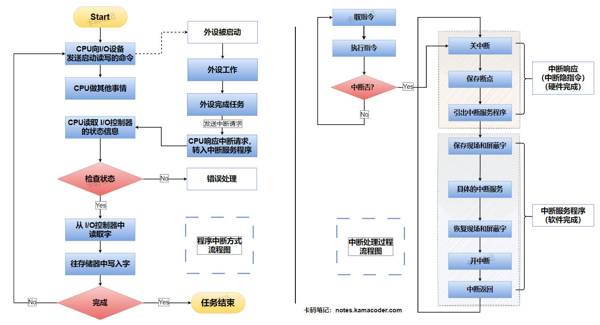

# 什么是中断和异常，它们有什么区别？

> 来源: https://notes.kamacoder.com/base/interrupts-vs-exceptions.html

# 什么是中断和异常，它们有什么区别？

## 简要回答

### 异常和中断的基本概念

  - 当一条指令执行结束时，需要进行内部异常和外部中断请求的判断。如果存在异常或中断请求，需要进入异常或中断响应过程，主要任务是**保存断点和程序状态**，**识别异常事件或中断源**，并**进入相应的服务程序**进行处理。
   - 异常和中断机制是**操作系统获得CPU控制权的唯一方式**，当中断或者异常事件发生时，CPU切换至**内核态**，操作系统得以获得所有特权指令的权限，通过执行操作系统提供的 异常或中断处理程序 来处理异常或中断事件。
   - **异常**：是指CPU执行一条指令时，由CPU在其**内部**检测到的、与正在执行的指令相关的**同步事件**。
   - **中断**：是指一种典型的由**外部**设备触发的、与当前正在执行的指令无关的**异步事件**。

### 异常和中断的分类

  1. **内部异常（Exception）** ：

    - 也被称为**内部中断** 或者 **软件中断**，异常是CPU执行当前指令产生的事件，是同步发生的，与CPU正在执行的指令密切相关。
     - 异常事件可进一步划分为**故障（Fault）**，**自陷（Trap）**，**终止（Abort）**。

   2. **外部中断（Interrupt）** ：

    - **外部中断来自CPU外部，与具体的指令无关，是随机事件**，中断是指外部设备向CPU发出的中断请求（如鼠标点击、键盘按键等），中断提供了外设与CPU交流的机制，它也是一种重要的**I/O方式**。CPU会在当前指令执行完毕后响应中断请求，进而转移到对应的中断处理程序，处理完毕后返回到发生中断的那条指令的下一条指令（因为被中断指令已经执行完毕）。
     - 按中断请求是否可被屏蔽分类，可分为**可屏蔽中断** 和 **非屏蔽中断**。
     - 按中断事件能否直接提供中断服务地址分类，可分为**向量中断** 和 **非向量中断**。
     - 按中断处理过程能否被打断分类，可分为**单重中断** 和 **多重中断**。

### 异常和中断的处理

  - 异常与中断的处理方式基本一致，当发生中断事件时，CPU接收到中断请求，在当前指令结束时CPU进入**中断周期**进行中断响应，并在**中断响应**中引入中断服务程序，由中断服务程序执行后续的**中断处理**。当然也有例外，例如产生故障异常的指令并没有执行完毕，但必须立即进行中断响应。

## 详细回答

### 异常和中断的基本概念

  - 当一条指令执行结束时，需要进行内部异常和外部中断请求的判断。如果存在异常或中断请求，需要进入异常或中断响应过程，主要任务是**保存断点和程序状态**，**识别异常事件或中断源**，并**进入相应的服务程序**进行处理。
   - 异常和中断机制是**操作系统获得CPU控制权的唯一方式**，当中断或者异常事件发生时，CPU切换至**内核态**，操作系统得以获得所有特权指令的权限，通过执行操作系统提供的 异常或中断处理程序 来处理异常或中断事件。
   - **异常**：是指CPU执行一条指令时，由CPU在其**内部**检测到的、与正在执行的指令相关的**同步事件**。
   - **中断**：是指一种典型的由**外部**设备触发的、与当前正在执行的指令无关的**异步事件**。

### 异常和中断的分类

  1. **内部异常（Exception）** ：

    - 也被称为**内部中断** 或者 **软件中断**，异常是CPU执行当前指令产生的事件，是同步发生的，与CPU正在执行的指令密切相关。异常事件可进一步划分为**故障（Fault）**，**自陷（Trap）**，**终止（Abort）**。
     - **故障（Fault）** ：通常是由**指令执行**引起的异常，如未定义指令、越权指令、段故障、缺页故障、除数为零、浮点溢出、整数溢出等。对于**可恢复的故障**（如数据缺页），可以由操作系统进行页面调度修复故障，再回到发生缺页故障的指令继续执行。此时的断点是当前指令而不是当前指令的下一条指令。对于**不可恢复的故障**（如未定义指令、越权指令），由操作系统终止当前进程的执行。
     - **自陷（Trap）** ：是一种事先安排的“异常”事件，通过在程序中显式地调用**自陷指令**来触发异常，用于在用户态调用操作系统内核程序，以请求内核的服务，如系统调用，条件陷阱指令。自陷异常是由自陷指令执行触发的，类似于函数调用，但不存在程序断点（自陷指令**不会在用户栈上**保存返回地址），执行这些指令就会有条件地或无条件地调用操作系统内核程序并执行，执行完毕后返回自陷指令的下一条指令。
     - **终止（Abort）** ：是指使CPU无法继续执行的**硬件故障**，和具体的指令无关。如机器校验错、总线错误、异常错误、异常处理中再次异常的双错等。此时当前程序无法继续执行，只能由操作系统终止，并由异常服务处理程序来重启系统。

   2. **外部中断（Interrupt）** ：

    - **外部中断来自CPU外部，与具体的指令无关，是随机事件**，中断是指外部设备向CPU发出的中断请求（如鼠标点击、键盘按键等），中断提供了外设与CPU交流的机制，它也是一种重要的**I/O方式**。CPU会在当前指令执行完毕后响应中断请求，进而转移到对应的中断处理程序，处理完毕后返回到发生中断的那条指令的下一条指令（因为被中断指令已经执行完毕）。
     - 按中断请求是否可被屏蔽分类，可分为**可屏蔽中断** 和 **非屏蔽中断**。

① 可屏蔽中断在**关中断**情况下不会被响应，属于硬件中断。

② 非屏蔽中断即使在**关中断**的情况下也会被响应，属于硬件中断。
     - 按中断事件能否直接提供中断服务地址分类，可分为**向量中断** 和 **非向量中断**。

① 向量中断是指中断事件可以提供**中断服务程序入口地址**的中断。

② 非向量中断是指中断事件不能直接提供**中断服务程序入口地址**的中断。
     - 按中断处理过程能否被打断分类，可分为**单重中断** 和 **多重中断**。

① 单重中断是指CPU执行中断服务程序过程中**不能被其他中断请求打断**的中断。

② 多重中断是指CPU执行中断服务程序过程中**可以去响应更高优先级的中断请求**的中断，又称为 “**中断嵌套**”。

### 异常和中断的处理

  - 异常与中断的处理方式基本一致，当发生中断事件时，CPU接收到中断请求，在当前指令结束时CPU进入**中断周期**进行中断响应，并在**中断响应**中引入中断服务程序，由中断服务程序执行后续的**中断处理**。当然也有例外，例如产生故障异常的指令并没有执行完毕，但必须立即进行中断响应。
   - **中断响应**：当CPU检测到未被屏蔽的中断请求信号时，进入中断响应阶段，这一阶段**由硬件自动完成**。中断响应阶段主要有以下三个步骤：

    1. **关中断**：CPU首先要关中断，禁止在进行中断处理时又去响应新的中断，防止保存的断点、程序状态字、现场信息被破坏。
     2. **保存断点和程序状态字**：断点就是程序的返回地址，程序状态字是一个进程产生的各种状态信息。断点和程序状态字信息分别保存在特殊的寄存器PC 和 PSW中，CPU会将这两个寄存器内容压栈，以便后续恢复被中断进程的执行流和状态。
     3. **引出中断服务程序**：CPU检测到中断信号后对具体中断源进行识别，以此引出对应的中断服务程序。

   - **中断处理**：当中断响应引出中断服务程序后，CPU控制权交由操作系统，通过执行操作系统提供的中断服务程序完成中断处理过程。中断处理阶段主要有以下三个步骤：

    1. **保护现场**：保存一些通用寄存器信息，防止接下来执行中断处理程序后寄存器内容被破坏。
     2. **执行中断处理程序**：也就是具体的中断服务。
     3. **恢复现场**：恢复保存的通用寄存器信息，开中断，恢复PC 和 PSW的信息，使得被中断进程完全恢复原来的状态。

## 知识拓展

  1. **程序中断方式流程图** 和 **中断处理流程图**，如下图所示：
 

   2. “中断”和“异常”的不同定义版本：

    - 不同计算机体系或不同教材，对于**中断** 和 **异常**的定义不尽相同。例如在 **MIPS** CPU体系结构中把内部异常和外部中断都称为异常；而在 **X86** CPU中则将二者都称为**中断**，并把来自CPU内部的中断称为**内部中断** 或 **软件中断**，而把来自CPU外部的中断称为**外部中断** 或 **硬件中断**。
     - 还有部分教材则将内部异常中的**故障（Fault）** 和 **自陷（Trap）** 归为**程序性异常**，即**软件中断**；而把内部异常中的**终止（Abort）** 和 **外部中断**归为**硬件中断**。
