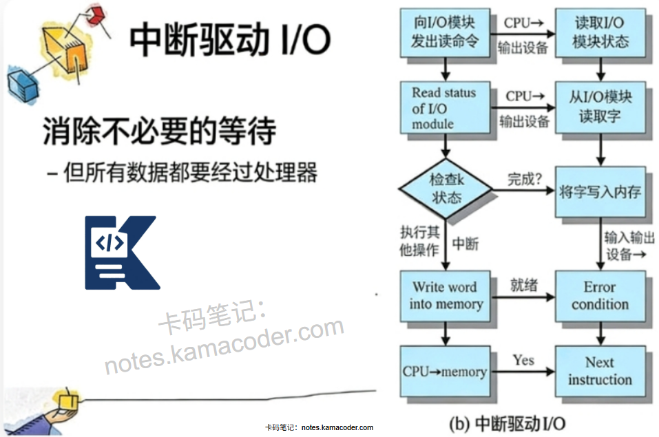

# 计算机中中断的过程是什么？

> 来源: https://notes.kamacoder.com/base/interrupt-handling.html

# 计算机中中断的过程是什么？

## 简要回答

中断是计算机系统中由硬件或软件触发的一种异步事件处理机制，它**打断CPU当前**正在执行的程序，转而**执行预先定义好的中断处理程序**，处理完毕后再恢复原程序的执行。

中断过程包括**中断请求、中断响应、中断处理、中断返回**四个阶段，涉及**中断控制器、中断向量表、程序状态字、现场保护与恢复**等关键组件和操作。

**中断机制是**实现**CPU与外部设备**并行工作、提高系统效率、处理紧急事件**的基础**。

## 专业回答

计算机中断过程是一个精心设计的**硬件与软件协同机制**，其本质**是CPU对外部或内部**事件的异步响应。

整个过程始于**中断源**的产生，这些源可以是**外部硬件**设备如键盘敲击、网络包到达、定时器超时，也可以是**内部软件**条件如除**零错误、页故障、系统调用**请求。

当中断事件发生时，**中断控制器**接收并仲裁**多个**同时发生的中断，根据**优先级**决定**哪个中断被首先服务**，然后**向CPU发出中断请求信号**。

CPU在每条指令执行结束时检查是**否有待处理的中断请求**，如果**中断允许且当前优先级允许响应，则进入中断响应周期**：

首先**完成当前指令的执行**，然后保存关键的**处理器状态**，包括**程序计数器**（指向下一条要执行的指令）和**程序状态字**（包含条件码、中断允许位等标志），接着根据**中断类型**从**中断向量表**中获取对应的**中断处理程序入口地址**，同时**自动关闭中断允许**（防止嵌套中断干扰）。

随后**CPU跳转到中断服务程序**开始执行，此时进入中断处理阶段，**处理程序首先保存被中断程序的完整现场**，然后根据中断原因**执行相应的处理逻辑**，处理过程中可能**需要与设备控制器交互以清除中断源**。

处理完成后，中断服务程序恢复之前保存的现场，**执行中断返回**指令，该指令**将恢复之前保存的程序状态字和程序计数器**，CPU由此**返回到被中断的程序继续执行**，整个过程对原程序透明，仿佛从未被打断过。

中断机制的精妙之处在于它**通过硬件自动化的状态保存与恢复**，以及**分层的中断优先级管理**，实现了**CPU计算与I/O操作的高度重叠**，极大**提高了系统吞吐率和响应实时性**。

## 代码示例

```
// 简化版中断系统模拟
class InterruptSystem {
    std::map<int, std::function<void()>> handlers;  // 中断向量表
    bool interruptEnabled = true;                    // 中断允许标志
    int programCounter = 0;                          // 程序计数器
    bool inInterrupt = false;                        // 是否正在处理中断

    struct InterruptRequest {
        int irq;          // 中断号
        int priority;     // 优先级
        bool operator<(const InterruptRequest& other) const {
            return priority < other.priority;  // 优先级高的先处理
        }
    };

    std::priority_queue<InterruptRequest> pendingIRQs;  // 待处理中断队列

public:
    // 注册中断处理程序
    void registerHandler(int irq, std::function<void()> handler) {
        handlers[irq] = handler;
    }

    // 模拟中断请求
    void requestInterrupt(int irq, int priority = 0) {
        std::cout << "设备请求中断 IRQ" << irq << " (优先级: " << priority << ")\n";
        pendingIRQs.push({irq, priority});
    }

    // 模拟CPU执行指令
    void execute(const std::string& instruction) {
        std::cout << "执行: " << instruction << " (PC=" << programCounter++ << ")\n";

        // 如果不是在中断中，并且允许中断，则检查并处理中断
        if (!inInterrupt && interruptEnabled && !pendingIRQs.empty()) {
            handleInterrupt();
        }
    }

    // 中断处理过程
    void handleInterrupt() {
        if (pendingIRQs.empty()) return;

        auto req = pendingIRQs.top();
        pendingIRQs.pop();

        std::cout << "\n=== 开始处理中断 IRQ" << req.irq << " ===\n";

        // 1. 硬件自动保存PC和状态
        std::cout << "硬件自动保存: PC=" << programCounter << "\n";

        // 2. 关中断（防止嵌套）
        bool oldState = interruptEnabled;
        interruptEnabled = false;
        inInterrupt = true;

        // 3. 查找并执行中断处理程序
        auto it = handlers.find(req.irq);
        if (it != handlers.end()) {
            it->second();  // 执行中断服务程序
        } else {
            std::cout << "未知中断，使用默认处理\n";
        }

        // 4. 恢复中断状态
        interruptEnabled = oldState;
        inInterrupt = false;

        // 5. 恢复现场（硬件自动恢复PC）
        std::cout << "硬件恢复PC，返回原程序\n";
        std::cout << "=== 中断处理完成 ===\n\n";
    }

    // 系统调用（软中断）
    void systemCall(int callNum) {
        std::cout << "\n[系统调用] INT 0x80, 调用号: " << callNum << "\n";
        requestInterrupt(0x80, 10);  // 系统调用优先级较高
        execute("iret");  // 模拟返回
    }
};

```


## 知识拓展

  - 中断分类

**硬中断**：来自硬件设备（IRQ）

**软中断**：由INT指令触发

**异常**：执行指令时错误（除零、缺页）

**不可屏蔽中断（NMI）**：必须立即处理

  - 知识图解



  - 面试官很能追问

Q1：中断和轮询的区别？
A2：
中断：事件驱动，设备准备好后主动通知CPU，CPU利用率高，响应及时

轮询：CPU定期检查设备状态，实现简单但浪费CPU周期
现代系统通常混合使用：高频事件用中断，低频用轮询

Q2：中断嵌套如何处理？
A2：
进入中断时自动/手动关中断（CLI）
处理关键代码后重新开中断（STI）
中断控制器管理优先级：
固定优先级：IRQ0>IRQ1...
循环优先级
非屏蔽中断可打断任何中断

Q3：什么是中断描述符表（IDT）？
A3：
x86架构的中断向量表，256个条目
每个条目8字节，包含处理程序地址和权限
通过LIDT指令加载
包含门描述符：任务门、中断门、陷阱门
