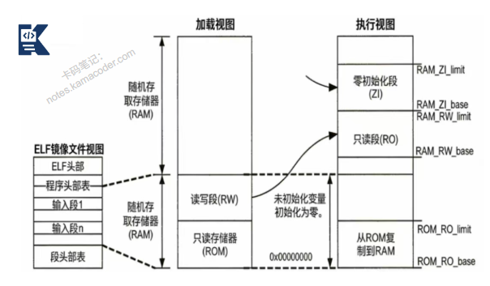

# 如何将用户程序变为可执行程序？

> 来源: https://notes.kamacoder.com/base/program-compilation.html

# 如何将用户程序变为可执行程序？

## 简要回答

将用户程序（源代码）变为可执行程序需要经过**编译、链接**两个主要阶段：

**编译**：将**高级语言源代码**翻译成**机器相关的目标代码**

**链接**：将**多个目标文件**和**库文件**组合成**最终可执行文件**

## 详细回答

完整构建过程：

  1.

**预处理**（Preprocessing）
处理以#开头的**预处理指令**，
**展开头文件**（#include），
**宏替换**（#define），
**条件编译**（#ifdef等），
生成**纯C/C++文件**

   2.

**编译**（Compilation）
词法分析：将**源代码分解为token**（关键字、标识符、常量等），
语法分析：构建**抽象语法树（AST）**，
**语义分析**：类型检查、作用域分析，
代码优化：**中间代码生成和优化**，
代码生成：生成特**定目标机器的汇编代码**

   3.

**汇编**（Assembly）
将**汇编代码**翻译成**机器指令**
生成**目标文件**（.o或.obj）
包含**代码段、数据段、符号表、重定位信息**

   4.

**链接**（Linking）
符号解析：**解析函数和变量的引用**，
地址分配：为**各段分配运行时内存地址**，
**重定位**：修正目标文件中的相对地址，
库链接：**链接静态库或动态库**，
生成**最终可执行文件**

## 代码示例

```
# 1. 预处理（生成main.i和math_utils.i）
g++ -E main.cpp -o main.i
g++ -E math_utils.cpp -o math_utils.i

# 2. 编译为汇编代码（生成main.s和math_utils.s）
g++ -S main.cpp -o main.s
g++ -S math_utils.cpp -o math_utils.s

# 3. 汇编为目标文件（生成main.o和math_utils.o）
g++ -c main.cpp -o main.o
g++ -c math_utils.cpp -o math_utils.o

# 4. 链接为可执行文件（生成main）
g++ main.o math_utils.o -o main

# 或者一步完成（不推荐用于学习）
g++ main.cpp math_utils.cpp -o main

```


## 知识拓展

  - 静态链接 vs 动态链接

**静态链接**：
库代码直接复制到可执行文件中,
文件较大，但运行时不依赖外部库,
使用-static选项

**动态链接**：
可执行文件只包含库引用,
运行时由动态链接器加载库,
节省磁盘和内存空间,
便于库更新

  - 知识图解



  - 面试官很能追问

Q1：编译和解释的区别？

A1：
编译：一次性将源代码翻译成机器码，执行效率高
解释：逐行翻译执行，便于调试，执行效率较低
即时编译：运行时编译热点代码，结合两者优点

Q2：什么是重定位？

A2：
链接器将多个目标文件的相同段合并时，需要调整相对地址
重定位表记录所有需要修正的地址引用
分为链接时重定位和加载时重定位

Q3：如何减少编译时间？

A3：
使用预编译头文件,
增量编译（make, ninja）,
分布式编译（distcc, icecc）,
前向声明替代包含头文件,
使用编译缓存（ccache)
