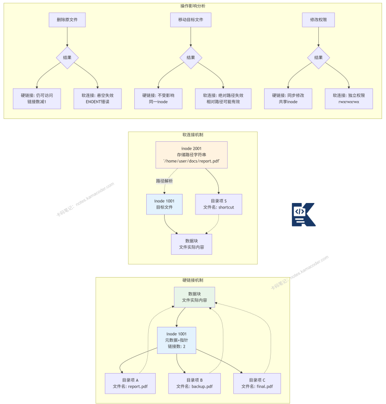

# 软连接和硬链接的区别

> 来源: https://notes.kamacoder.com/base/hard-link-vs-soft-link.html

# 软连接和硬链接的区别

## 简要回答

软连接（符号链接）是独立的文件，存储目标文件的路径，可跨文件系统，删除原文件后软连接失效。

硬链接是原文件的别名，与原文共享相同的inode和数据块，不可跨文件系统，删除原文件不影响硬链接。

## 详细回答

技术原理对比：

  1.

inode层面
硬链接：**共享相同的inode**，链接**计数递增**
软链接：**拥有独立的inode**，类型为**符号链接**

   2.

文件系统限制
硬链接：**必须位于同一文件系统内**
软链接：可**跨不同文件系统**

   3.

删除行为
硬链接：**删除原始文件，硬链接仍可访问数据**，直到链接**计数为0**
软链接：**删除原始文件，软链接成为悬空链接**

   4.

链接目标
硬链接：**只能链接文件，不能链接目录**
软链接：**可链接文件和目录**

   5.

存储内容
硬链接：**目录项直接引用inode**
软链接：**存储目标路径字符串**

硬链接工作原理：
**创建新目录项指向相同inode**，
inode的i_links_count**递增**，
只有**当i_links_count为0时，inode和数据块才被释放**

软链接工作原理：
**创建新inode，类型为S_IFLNK**，
数据块存储目标路径字符串，
文件大小等于路径字符串长度

## 代码示例

linux命令执行案例

```
#!/bin/bash
# 软链接与硬链接完整演示脚本

echo "========== 1. 创建测试环境 =========="
# 创建测试目录和文件
mkdir -p test_links
cd test_links

# 创建原始文件
echo "这是原始文件的第一行内容" > original.txt
echo "这是第二行内容" >> original.txt

echo "原始文件内容:"
cat original.txt
echo ""

echo "原始文件详细信息:"
ls -li original.txt
# 示例输出: 123456 -rw-r--r-- 1 user group 45 Jan 1 10:00 original.txt
# ↑ inode: 123456, 链接数: 1

echo ""
echo "========== 2. 创建硬链接 =========="
ln original.txt hard_link.txt

echo "创建硬链接后查看:"
ls -li original.txt hard_link.txt
# 示例输出:
# 123456 -rw-r--r-- 2 user group 45 Jan 1 10:00 hard_link.txt
# 123456 -rw-r--r-- 2 user group 45 Jan 1 10:00 original.txt
# ↑ 相同inode(123456)，链接数变为2

echo ""
echo "通过硬链接修改文件:"
echo "通过硬链接添加的内容" >> hard_link.txt
echo "修改后原始文件内容:"
cat original.txt

echo ""
echo "========== 3. 创建软链接 =========="
ln -s original.txt soft_link.txt

echo "创建软链接后查看:"
ls -l soft_link.txt
# 示例输出: lrwxrwxrwx 1 user group 11 Jan 1 10:00 soft_link.txt -> original.txt
# ↑ 文件类型为 'l' (链接文件)

ls -li soft_link.txt
# 示例输出: 789012 lrwxrwxrwx 1 user group 11 Jan 1 10:00 soft_link.txt -> original.txt
# ↑ 不同inode(789012)，独立文件

echo ""
echo "软链接大小（存储的路径长度）:"
stat -c "%n: %s bytes" soft_link.txt

echo ""
echo "========== 4. 删除测试 =========="
echo "删除原始文件:"
rm original.txt

echo "尝试通过硬链接访问:"
if [ -f hard_link.txt ]; then
    echo "硬链接仍然存在，内容:"
    cat hard_link.txt
    ls -li hard_link.txt
# 链接数变回1
else
    echo "硬链接不存在"
fi

echo ""
echo "尝试通过软链接访问:"
if [ -L soft_link.txt ]; then
    echo "软链接文件存在"
    if [ -e soft_link.txt ]; then
        echo "但指向的目标文件不存在"
    fi
# 尝试读取会失败
    cat soft_link.txt 2>&1 || echo "读取软链接失败: 目标文件不存在"

    echo "悬空软链接显示:"
    ls -l soft_link.txt
# 通常显示为红色
fi

echo ""
echo "========== 5. 跨文件系统测试 =========="
# 假设有另一个文件系统挂载在 /mnt/other_fs
echo "创建跨文件系统链接测试:"
touch /tmp/test_cross_fs.txt

# 尝试创建硬链接到不同文件系统（会失败）
ln /tmp/test_cross_fs.txt hard_cross.txt 2>&1 | grep -v "ln:" || echo "硬链接跨文件系统失败（预期行为）"

# 创建软链接到不同文件系统（会成功）
ln -s /tmp/test_cross_fs.txt soft_cross.txt && echo "软链接跨文件系统成功"

echo ""
echo "========== 6. 目录链接测试 =========="
mkdir test_dir
echo "文件在目录中" > test_dir/file.txt

# 尝试创建目录的硬链接（会失败）
ln test_dir hard_dir 2>&1 | grep -v "ln:" || echo "目录硬链接失败（大多数系统不支持）"

# 创建目录的软链接（会成功）
ln -s test_dir soft_dir && echo "目录软链接创建成功"

echo "通过目录软链接访问:"
ls -l soft_dir/

echo ""
echo "========== 7. 清理 =========="
cd ..
rm -rf test_links
rm -f /tmp/test_cross_fs.txt
echo "测试完成"

```


## 知识拓展

  - 知识图解



  - 适用场景

**软件版本管理**：java -> java-11这样的版本符号链接

**快捷方式**：创建常用目录或文件的快捷访问

**路径重定向**：将旧路径重定向到新位置

**配置文件管理**：链接到统一的配置文件

**开发环境**：链接到共享的工具或库

  - 面试官很能追问

Q1: 硬链接为什么不能跨文件系统？

A1: 因为**硬链接**直接引用**inode号**，而inode号**只在同一个文件系统内唯一**，**不同文件系统有各自独立的inode编号空间**，跨文件系统引用inode会导致歧义。

文件系统通常将**inode与具体存储设备关联**。

Q2: 如何查看文件的硬链接数量？

A2: 有多种方法：
ls -l：**第二列的数字就是链接计数**
stat命令：**显示详细的链接数信息**
ls -i：**显示inode号**，相同inode的文件互为硬链接
find命令查找**相同inode的文件**

Q3: 硬链接会不会造成循环引用？

A3: 对于文件，**硬链接不会造成循环引用**，因为：

**硬链接**只是**增加inode的引用计数**

所有硬链接**地位平等，没有层级关系**

但对于**目录**，大多数系统**禁止硬链接**，正是**为了防止目录环**
