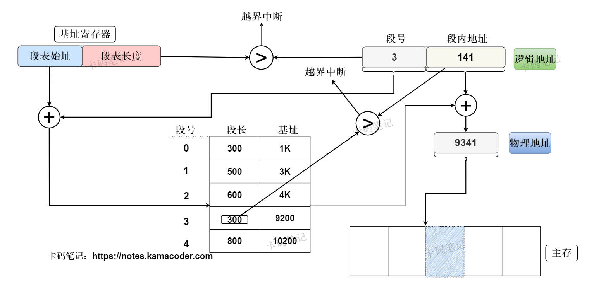

# 什么是内存分段和分页？作用是什么？

> 来源: https://notes.kamacoder.com/base/memory-segmentation-paging.html

# 什么是内存分段和分页？作用是什么？

## 简要回答

### 分段存储管理和分页存储管理的定义

  1. **分段存储管理（Segmentation）**：

    - 将程序的逻辑地址空间划分为多个**可变长度的段**（如代码段、数据段、堆栈段），每个段对应程序的一个功能模块，操作系统通过**段表**记录段的基址和段长。
     - 分段管理方式**方便用户编程**，利于编程人员组织程序的逻辑结构；但由于分段管理方式使用可变大小的段，从而导致**外部碎片**，且内存分配和回收较为**复杂**，不易实现虚拟内存。

   2. **分页存储管理（Paging）**：

    - 将物理内存和逻辑地址空间划分为**固定大小的页框（Frame）和页面（Page）** （页框的大小与页面相同），操作系统通过页表实现逻辑页面到物理页框的映射，整个过程对用户透明。
     - 分页存储管理使用**固定大小的页面**，简化了内存管理，消除了外部碎片，支持高效的虚拟内存实现；但有可能导致**内部碎片**。

### 分段存储管理和分页存储管理的区别

  -

如下表所示：

| **维度**  **分段**  **分页**
| **管理单元**  可变长度段（逻辑模块）  固定大小页（页框和页面大小相等）
| **用户可见性**  对用户不透明，用户显式地控制段的定义与访问  对用户透明，由操作系统对页面进行管理
| **地址空间**  二维地址（段号 + 段内地址）  一维地址（页号 + 页面偏移量）
| **碎片问题**  存在外部碎片（需内存紧凑）  存在内部碎片（如最后一页未满）
| **共享与保护**  段级保护（如代码段只读）  页级保护（如读写权限位）
| **硬件开销**  段表 + 段长检查  TLB + 页表 + MMU
| **典型应用**  早期系统（如x86实模式）  现代操作系统（如Linux、Windows）

## 详细回答

### 分段存储管理和分页存储管理的概念

  1. **分段存储管理**：

    - **定义**：

将程序的逻辑地址空间按功能模块划分为多个**可变长度段**（如代码段、数据段、堆栈段），每个段独立管理。
     - **特点**：

① 对用户不透明，程序员**可显式定义**段。

② 可支持段级共享和保护（如代码段只读）。

③ 会产生外部碎片（需内存紧凑合并）。
     - **核心机制**：

① **段表**：存储段基址（段起始地址）和段长。

② **地址转换**：首先将逻辑地址的高位段号取出，与段表长度作比较，若段号大于表长则发生越界；若未越界，则找到相应段表项，检查偏移是否 ≤ 段长，否则触发越界；若段长也未越界，则物理地址 = 段基址 + 段内地址。

   2. **分页存储管理**：

    - **定义**：

将物理内存和逻辑地址空间划分为**固定大小的页框（Frame）和页面（Page）** （页框的大小与页面相同），操作系统通过页表实现逻辑页面到物理页框的映射
     - **特点**：

① 对用户透明，由操作系统对页面进行管理。

② 会产生内部碎片（如最后一页未满）。

③ 可通过硬件支持（MMU、TLB）加速地址转换。
     - **核心机制**：

① **页表**：每个进程一个页表，记录逻辑页号到物理页框号的映射。

② **地址转换**：首先将逻辑地址的页号与页表长度作比较，若页号大于页表长度，则发生越界；若未越界，则通过页号在页表中定位到相应的页表项，获得页框号；最后，物理地址 = 页框号 + 页内偏移量。（虚拟页号通过页表映射到物理页框号，在映射过程中已经考虑了页面大小，所以物理地址直接由页框号加上页内偏移量组成。）

### 分段存储管理和分页存储管理的区别：

  1. **管理单元**：

    - 分段管理方式基于逻辑功能模块（如代码段、数据段）来分段，每个段长度不一定相等，并且段长度可变。
     - 分页管理方式基于物理大小固定的块（如4KB大小的页）来分页，且页面和页框的大小相同，简化了内存分配。

   2. **用户可见性**：

    - 分段对用户**不透明**，需要程序员**显式**管理段，如汇编中定义 `.text` 和 `.data` 段。
     - 分页对用户**透明**，页面统一由操作系统管理，程序员无需关心分页细节。

   3. **地址空间**：

    - 分段使用**二维地址**（段号 + 偏移），需查段表获取基址。
     - 分页使用**一维地址**（页号 + 偏移），页内偏移直接映射。

   4. **碎片问题**：

    - 分段因段长度不固定而产生外部碎片，需内存紧凑。
     - 分页因页面大小固定而产生内部碎片，最后一页可能未满。

   5. **共享与保护**：

    - 分段支持段级保护（如代码段只读），段共享时需对齐基址。
     - 分页支持页级保护（如读写/执行权限位），共享页需映射到不同进程页表。

   6. **硬件开销**：

    - 分段需**段表和段长检查硬件**，地址转换效率较低。
     - 分页需**页表、TLB（快表）和MMU（内存管理单元）**，硬件优化成熟。

   7. **典型应用**：

    - 分段用于早期系统（如x86实模式），现代系统已淘汰纯分段。
     - 分页是现代操作系统（Linux、Windows）的核心机制。

## 知识拓展

  1. **不带快表的分段管理地址变换机构**示意图如下：
 

   2. **分段与分页的保护机制**：分页和分段的主要保护方式都为 界地址保护 和 存取控制保护。

    - **界地址保护**：通过逻辑地址与段（页）表信息的比较来防止进程的越界访问。在分页方式中，将页号与页表长度作比较，若页号 > 页表长度则产生越界中断（由于分页方式的页内偏移量与页表大小严格对应，因此不存在页面偏移量的越界）。而在分段方式中，段号和段内地址都需要显式地给出，因此判断访问越界也需要进行两次——①判断是否段号 ≥ 段表长度，若是则产生越界中断；②查询段表时，判断是否段内地址 > 段长，若是则产生越界中断。
     - **存取控制保护**：通过对进程的段（页）进行访问权限设置以保护其信息。例如，对系统内存中的段 / 页设置只读、读写、不可访问等限制，访问相关段 / 页面时需要进行权限检查。

   3. **分段与分页的共享机制**：

    - **分段共享**：共享段需在不同进程的段表中映射到同一基址和段长（即共享段的物理地址是唯一的，但其在不同进程段表中的逻辑地址是不同的）。
     - **分页共享**：共享页需在不同进程的页表中映射到同一物理页框。

   4. **Modern Memory Management in Operating Systems** ：Modern operating systems primarily use **paging** as the core memory management mechanism, with the following key features:

    - **Virtual Memory**: Logical address spaces larger than physical memory, enabled by demand paging and swapping.
     - **Page Replacement Algorithms**: OPT，FIFO，LRU，LFU，Clock，Clock-EX.
     - **Combined Segmentation and Paging**: Some architectures (like X86) combine segmentation and paging for backward compatibility, but segmentation is often minimized.
     - **Hardware Acceleration**: TLB (Translation Lookaside Buffer) caches frequently used page table entries to reduce address translation latency.
     - **Memory Protection**: Read/Write/Execute permissions at the page level, enforced by the MMU.
