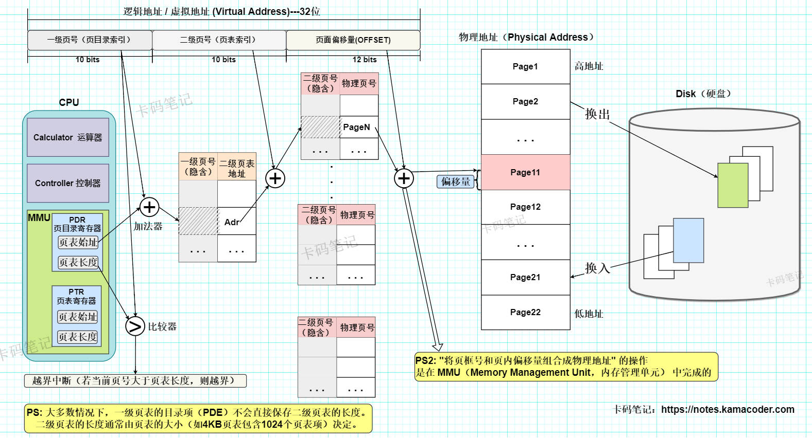

# 什么是虚拟内存

> 来源: https://notes.kamacoder.com/base/virtual-memory.html

# 什么是虚拟内存

## 简要回答

  1. **概念**：

虚拟内存是操作系统提供的一种从**逻辑上**扩充内存的方法，具有**请求调入**功能 和 **内存置换**功能。“虚拟内存”技术为每个进程提供一个独立的、连续的地址空间，使得每个进程都认为自己独占整个内存。虚拟内存通过**将物理内存和磁盘空间结合起来**，扩展了可用的内存空间，并实现了内存隔离和简化内存管理。虚拟内存广泛应用于现代操作系统中，如 Windows、Linux 和 macOS。
   2. **实现方式**：

主要实现方式包括**分页**（将内存划分为固定大小的页）和**分段**（将内存划分为不同大小的段）。
   3. **优缺点**：

虚拟内存的优点包括提高内存利用率、支持多任务和简化编程，但也存在性能开销（如缺页中断）和复杂性等缺点。

## 详细回答

  1. **概念**：

  虚拟内存是操作系统提供的一种从**逻辑上**扩充内存的方法，具有**请求调入**功能 和 **内存置换**功能。它为每个进程提供一个独立的、连续的地址空间，使得每个进程都认为自己独占整个内存。

  虚拟内存的核心思想是通过**将物理内存和磁盘空间结合起来**，扩展可用的内存空间，并实现内存隔离。

  在采用**非连续存储管理方式**的基础上，只调入程序文件的一部分页面进入内存，当进程需要用到未调入内存的程序文件页时，再从磁盘中调入，这一过程称为**请求调入**。

  当请求调入遇到“内存已满”的情况时，系统需要从内存中选择一部分暂时用不上的页面调出，腾出的空间用来调入当前需要的页面，这一过程称为**内存置换**。

  PS：请求分页存储管理方式就是在分页管理的基础上，增加了请求调入和内存置换两个功能。
   2. **主要作用**：

    - **内存扩展**：

通过将部分内存数据交换到磁盘，虚拟内存可以扩展可用的内存空间，使得程序可以运行在比物理内存更大的地址空间中；虚拟内存大小与较大的外存相近，而运行速度与较快的内存相近。
     - **内存隔离**：

每个进程都有自己的虚拟地址空间，避免了进程间的内存冲突，提高了系统的安全性和稳定性。
     - **简化内存管理**：

内存置换和请求调入都由**操作系统**完成，使得内存管理对于用户是透明的，用户不需要去关心虚拟内存的具体运作。

   3. **实现方式**：虚拟内存的实现方式主要包括——

    - **请求分页（Paging）**：

① 将虚拟内存和物理内存划分为**固定大小**的页（如4KB），通过**页表**映射虚拟地址和物理地址。

② 页表由操作系统维护，TLB（快表）则由硬件直接维护，用于加速地址转换。

③ 当访问的页不在物理内存中时，会发生缺页中断（Page Fault），此时操作系统会将所需的页从磁盘加载到内存。
     - **请求分段（Segmentation）**：

① 将虚拟内存划分为**不同大小**的段（如代码段、数据段），通过段表映射虚拟地址和物理地址。

② 分段可以更好地支持程序的逻辑结构，但管理起来比分页更复杂。

   4. **硬件支持**：

    - **请求页表机制**：

请求页表**在传统页表的基础上**增加了**状态位、访问字段、修改位和外存地址**四个新字段，用于支持请求调入和内存置换的功能实现。其中，用于支持请求调入的状态位 和 外存地址，这两个字段是必须要有的，而修改位和访问字段则需要根据具体的写回策略和置换策略来决定是否需要设置。
     - **缺页中断机构**：

CPU访问的页面不存在于内存中时，会产生缺页中断来调入相应的页面。与一般中断不同的是，当缺页中断在指令的**执行周期**内被触发后，CPU会**立即**停止当前指令的执行，并**跳转到**操作系统的缺页中断处理程序。操作系统会负责将所需的页加载到内存中，并更新页表，以确保指令能够继续执行。如果所需的页没有被加载到内存中，指令将无法正常执行。
     - **地址变换机构**：

将虚拟地址转换为物理地址，通常通过页表和TLB（快表）实现。

   5. **优缺点**：

    - **优点**：

① 提高内存利用率：通过将不常用的内存数据交换到磁盘，释放物理内存供其他进程使用。

② 简化编程：内存管理对于程序员是透明的，程序员无需关心物理内存的分配和管理。

③ 支持多任务：每个进程都有自己的虚拟地址空间，支持多任务并发执行。
     - **缺点**：

① 性能开销：频繁的页表查找和缺页中断会影响系统性能。

② 复杂性：虚拟内存的实现增加了操作系统的复杂性。

   6. **实际应用**：

    - **Linux**：
使用分页机制管理虚拟内存，通过页表和 TLB 加速地址转换。
     - **Windows**：
使用**分页和分段结合**的方式管理虚拟内存（即“请求段页式存储管理方式”），支持大内存和多任务。

## 知识拓展

  -

以32位计算机为例，由**虚拟地址**通过二级页表**得到物理地址**的示意图如下：
 

   -

**页框分配策略**：

    1. **固定分配局部置换**：

为每个进程分配固定数量页框，页面置换也只在这些页框上进行。**PS**：由于全局置换一定会导致进程所拥有的页框数量（驻留集）发生变化，所以不存在“固定分配全局置换”的策略。
     2. **可变分配局部置换**：

只能在进程所拥有的页框中进行置换（这可以有效保护进程之间互不干扰）；但在分配角度，这一策略会根据进程运行情况动态地增加或减少分配给进程的页框数。
     3. **可变分配全局置换**：

系统可以维护一个空闲页框队列，每当有程序发生缺页时就为其分配一个空闲页框。当不存在空闲页框时，就从整个内存空间中选出一个合适的页面换出。
