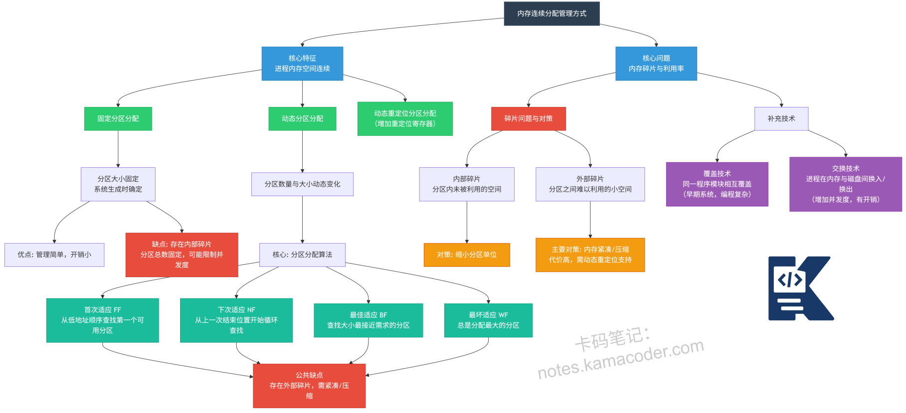

# 内存连续分配管理方式有什么？

> 来源: https://notes.kamacoder.com/base/memory-allocation-methods.html

# 内存连续分配管理方式有什么？

## 简要回答

内存连续分配管理方式是指：每个进程在主存中占用一段连续的物理地址空间。

典型方式包括：

**单一连续**分配

**固定分区**分配

**动态分区**分配（**首次适应、最佳适应、最坏适应、邻近适应**）

该类方法**实现简单**，但**容易产生内部碎片或外部碎片**，已逐渐被分页、分段机制取代

## 专业回答

内存连续分配要求：

进程在内存中所占用的地址空间是**一段连续的物理内存区域**

内存地址必须： **start ~ start + size - 1**

连续分配的**三大类方式**（重点）

（一）**单一连续分配**（Single Contiguous Allocation）

原理：内存被分为两部分，**操作系统，用户程序**

**内存中只能同时存在一个用户进程**

特点：**无内存管理复杂性**，**无碎片问题**，**CPU利用率极低**

（二）**固定分区分配**（Fixed Partition Allocation）

原理：内存启动时被划分为**若干个固定大小的分区**，**每个分区只能装一个进程**

可以分为：**等大小分区，不等大小分区**

它的核心问题是**内部碎片**

（三）**动态分区分配**（Dynamic Partition Allocation）

原理：不提前**固定划分分区**，**进程来时才分配恰当大小的连续内存**

四种典型的分配算法：首次适应，最佳适应，最坏适应，邻近适应

## 代码示例

动态分区 + 首次适应算法（First Fit）

```
#include <stdio.h>

#define MEM_SIZE 1024

typedef struct block {
    int start;
    int size;
    int free; // 1表示空闲，0表示已分配
    struct block *next;
} Block;

Block *head = NULL;

void init_memory() {
    head = (Block *)malloc(sizeof(Block));
    head->start = 0;
    head->size = MEM_SIZE;
    head->free = 1;
    head->next = NULL;
}

Block* first_fit(int request_size) {
    Block *curr = head;
    while (curr != NULL) {
        if (curr->free && curr->size >= request_size) {
            return curr;
        }
        curr = curr->next;
    }
    return NULL; // 没有足够大的空闲块
}

int main() {
    init_memory();
    // 模拟分配过程...
    return 0;
}

```


## 知识拓展

为什么连续分配被淘汰？

**需要连续空间,易产生碎片,内存利用率低**

分页机制

**逻辑连续,物理可不连续,从根本上解决碎片问题**

  - 适用场景

早期操作系统,教学实验,嵌入式/资源简单系统

  - 知识图解




  - 面试官很能追问

Q1：连续分配最大的缺点是什么？

答：
容易产生碎片，尤其是外部碎片，导致内存利用率低。

Q2：为什么固定分区会产生内部碎片？

答：
因为分区大小固定，进程往往小于分区，剩余空间无法再利用。

Q3：动态分区为什么还会有问题？

答：
虽然分配灵活，但多次分配释放后，空闲内存被切碎，形成外部碎片
