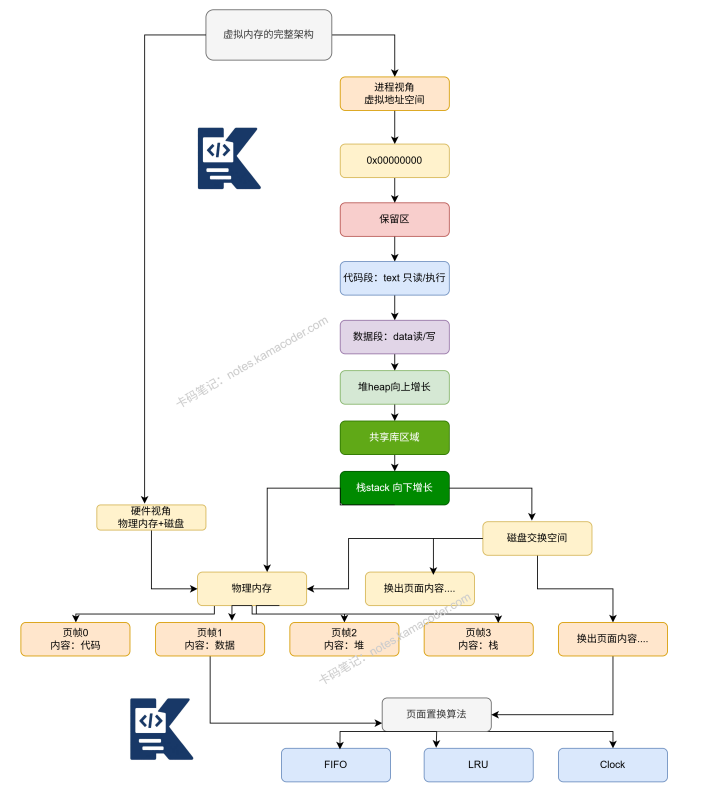

# 虚拟内存的作用及页面置换算法？

> 来源: https://notes.kamacoder.com/base/virtual-memory-page-replacement.html

# 虚拟内存的作用及页面置换算法？

## 简要回答

**虚拟内存**是一种**内存管理**技术，通过**分页机制**为**每个进程**提供**独立**的**虚拟地址空间**，将**物理内存**与**硬盘空间**结合，实现**内存的逻辑扩展**。

页面置换算法是**当物理内存不足时**，**选择**哪些**页面被换出到磁盘**的策略，包括**OPT、FIFO、LRU、Clock**等，目标是**最大化命中**率和**最小化缺页中断**。

## 详细回答

  - 虚拟内存的核心机制：

  1.

地址空间隔离：**每个进程拥有独立的虚拟地址空间**（32位系统通常4GB），**防止进程间相互干扰**

   2.

**分页机制**：将**虚拟内存**和**物理内存**划分为**固定大小的页**（通常4KB），通过**页表**进行映射

   3.

**按需调页**：**仅在实际访问**时才**将页面加载到物理内存**

   4.

**写时复制**：**多个进程共享只读页面**，写操作时**再创建副本**

   5.

内存映射文件：将**文件直接映射到进程地址空间**

页面置换算法关键特性：

局部性原理：**时间局部性**（**最近访问的可能再次**访问）和**空间局部性**（**访问位置附近可能被**访问）

缺页率：**衡量算法优劣的关键指标**

Belady异常：**增加物理页框数**反而**导致缺页率上升**的现象

实现开销：**硬件支持**和**软件复杂度的平衡**

## 代码示例

```
#include <iostream>
#include <vector>
#include <queue>
#include <unordered_map>
#include <unordered_set>
#include <list>
#include <algorithm>

class PageReplacementSimulator {
private:
    std::vector<int> page_sequence;
    int frame_count;

public:
    PageReplacementSimulator(const std::vector<int>& seq, int frames)
        : page_sequence(seq), frame_count(frames) {}

    // FIFO算法
    int simulateFIFO() {
        std::queue<int> fifo_queue;
        std::unordered_set<int> frames;
        int page_faults = 0;

        for (int page : page_sequence) {
            if (frames.find(page) != frames.end()) {
                continue;  // 页面命中
            }

            page_faults++;

            if (frames.size() == frame_count) {
                int victim = fifo_queue.front();
                fifo_queue.pop();
                frames.erase(victim);
            }

            frames.insert(page);
            fifo_queue.push(page);

            printState("FIFO", frames, page, page_faults);
        }
        return page_faults;
    }

    // LRU算法（使用链表实现）
    int simulateLRU() {
        std::list<int> lru_list;
        std::unordered_map<int, std::list<int>::iterator> page_map;
        int page_faults = 0;

        for (int page : page_sequence) {
            auto it = page_map.find(page);

            if (it != page_map.end()) {
                // 页面命中，移动到链表头部（最近使用）
                lru_list.erase(it->second);
                lru_list.push_front(page);
                page_map[page] = lru_list.begin();
                continue;
            }

            page_faults++;

            if (lru_list.size() == frame_count) {
                // 移除链表尾部（最近最久未使用）
                int victim = lru_list.back();
                lru_list.pop_back();
                page_map.erase(victim);
            }

            lru_list.push_front(page);
            page_map[page] = lru_list.begin();

            printState("LRU", std::unordered_set<int>(lru_list.begin(), lru_list.end()),
                      page, page_faults);
        }
        return page_faults;
    }

    // Clock算法（第二次机会算法）
    int simulateClock() {
        std::vector<int> frames(frame_count, -1);
        std::vector<bool> reference_bits(frame_count, false);
        int hand = 0;
        int page_faults = 0;

        for (int page : page_sequence) {
            bool page_found = false;

            // 检查页面是否在内存中
            for (int i = 0; i < frame_count; i++) {
                if (frames[i] == page) {
                    reference_bits[i] = true;
                    page_found = true;
                    break;
                }
            }

            if (page_found) continue;

            page_faults++;

            // 寻找置换页面
            while (true) {
                if (frames[hand] == -1) {
                    break;  // 找到空闲帧
                }

                if (reference_bits[hand]) {
                    reference_bits[hand] = false;  // 给第二次机会
                    hand = (hand + 1) % frame_count;
                } else {
                    break;  // 找到置换目标
                }
            }

            frames[hand] = page;
            reference_bits[hand] = true;
            hand = (hand + 1) % frame_count;

            printClockState(frames, reference_bits, page, page_faults);
        }
        return page_faults;
    }

    // OPT（最优）算法 - 理论上最优但需要预知未来
    int simulateOPT() {
        std::unordered_set<int> frames;
        int page_faults = 0;
        int n = page_sequence.size();

        for (int i = 0; i < n; i++) {
            int page = page_sequence[i];

            if (frames.find(page) != frames.end()) {
                continue;  // 页面命中
            }

            page_faults++;

            if (frames.size() < frame_count) {
                frames.insert(page);
            } else {
                // 寻找最久不会使用的页面
                int farthest = -1;
                int victim = -1;

                for (int frame_page : frames) {
                    int next_use = n + 1;  // 默认设为无穷大

                    for (int j = i + 1; j < n; j++) {
                        if (page_sequence[j] == frame_page) {
                            next_use = j;
                            break;
                        }
                    }

                    if (next_use > farthest) {
                        farthest = next_use;
                        victim = frame_page;
                    }
                }

                frames.erase(victim);
                frames.insert(page);
            }

            printState("OPT", frames, page, page_faults);
        }
        return page_faults;
    }

private:
    void printState(const std::string& algo, const std::unordered_set<int>& frames,
                   int current_page, int faults) {
        std::cout << algo << " - 访问 " << current_page << " | 内存: ";
        for (int page : frames) std::cout << page << " ";
        std::cout << "| 缺页次数: " << faults << std::endl;
    }

    void printClockState(const std::vector<int>& frames,
                        const std::vector<bool>& ref_bits,
                        int current_page, int faults) {
        std::cout << "Clock - 访问 " << current_page << " | 内存: ";
        for (int i = 0; i < frames.size(); i++) {
            if (frames[i] != -1) {
                std::cout << frames[i] << "(" << (ref_bits[i] ? "1" : "0") << ") ";
            }
        }
        std::cout << "| 缺页次数: " << faults << std::endl;
    }
};

int main() {
    // 测试不同访问序列
    std::vector<int> seq1 = {7, 0, 1, 2, 0, 3, 0, 4, 2, 3, 0, 3, 2, 1, 2, 0, 1, 7, 0, 1};
    std::vector<int> seq2 = {1, 2, 3, 4, 1, 2, 5, 1, 2, 3, 4, 5};

    std::cout << "=== 页面置换算法性能比较 ===" << std::endl;
    std::cout << "测试序列1: ";
    for (int p : seq1) std::cout << p << " ";
    std::cout << "\n物理帧数: 3\n" << std::endl;

    PageReplacementSimulator sim1(seq1, 3);

    std::cout << "1. FIFO算法:" << std::endl;
    int fifo_faults = sim1.simulateFIFO();
    std::cout << "总缺页次数: " << fifo_faults << "\n" << std::endl;

    std::cout << "2. LRU算法:" << std::endl;
    int lru_faults = sim1.simulateLRU();
    std::cout << "总缺页次数: " << lru_faults << "\n" << std::endl;

    std::cout << "3. Clock算法:" << std::endl;
    int clock_faults = sim1.simulateClock();
    std::cout << "总缺页次数: " << clock_faults << "\n" << std::endl;

    std::cout << "4. OPT算法:" << std::endl;
    int opt_faults = sim1.simulateOPT();
    std::cout << "总缺页次数: " << opt_faults << std::endl;

    return 0;
}

```


## 知识拓展

  - 知识图解



  - 适用场景

  1. 虚拟内存适用场景

**通用操作系统**：Windows、Linux、macOS等桌面/服务器系统

**内存密集型应用**：大型数据库、科学计算、虚拟化

**程序开发与调试**：内存错误检测、性能分析工具

**安全沙箱**：进程隔离、权限控制

**内存映射文件**：大数据处理、数据库系统

  1. 页面置换算法选择场景

FIFO适用：
**嵌入式系**统（实现简单），
**访问模式无规律**的应用，
对**性能要求不苛刻的**环境

LRU适用：
**数据库缓存管理系统**，
**Web服务器缓存**，
**有明显访问局部性**的应用，
需**要良好命中率**的场景

Clock算法适用：
通**用操作系统内核**，
**需要平衡性能与开销的系统**，
有**硬件引用位支持**的架构

工作集算法适用：
**交互式系统**，
需要防**止颠簸的系统**，
**工作负载变化频繁**的环境

  - 面试官很能追问

Q1: 什么是Belady异常？哪些算法会出现？

A1: **Belady异常**是指**增加物理页框数**反而**导致缺页率上升**的**反常现象**。

会出现的算法：**FIFO、某些随机置换**算法

不会出现的算法：**LRU、OPT、LFU等基于堆栈**的算法

原因：**FIFO只考虑进入时间，可能置换掉即将频繁访问的页面**
示例：特定访问序列下，3个页框缺页15次，4个页框缺页16次

Q2: LRU算法的实现难点？

A2: 实现难点：
**精确时间戳开销大**：每次访问都**需要记录精确时间**

**链表操作频繁**：需要维护访问顺**序链表**

**硬件支持需求**：纯软件实现性能差

**多核同步问题**：并发访问时的**锁开销**

Q3: 虚拟内存如何支持内存共享？

A3: 通过以下机制：

**写时复制**：多个进程**共享只读页面**，写操作时复制

**共享内存段**：**不同进程的页表项映射到相同物理帧**

**内存映射文件**：**多个进程映射同一文件到各自地址空间**

**动态链接库**：**共享库代码段在进程间共享**
