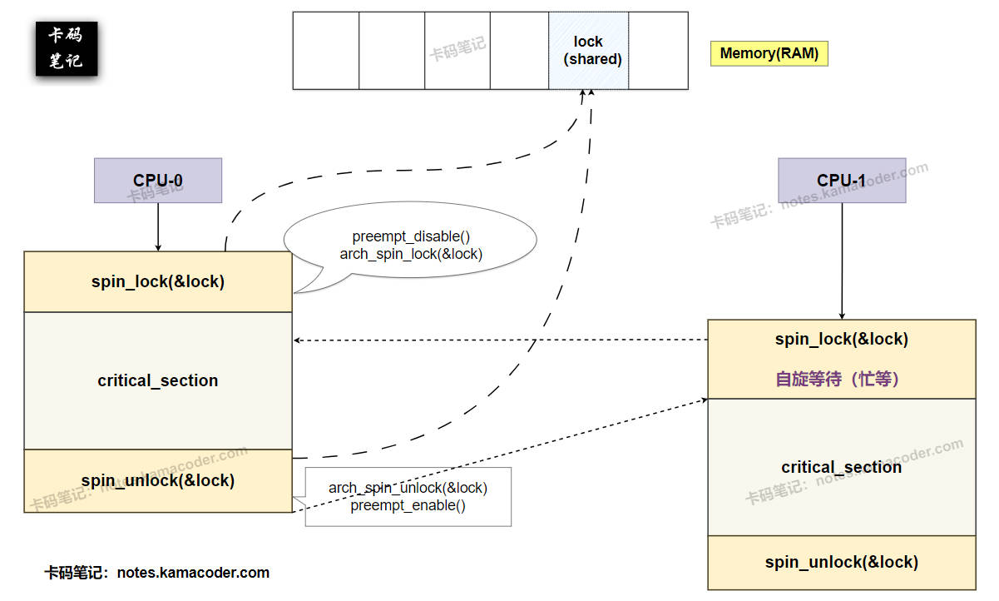
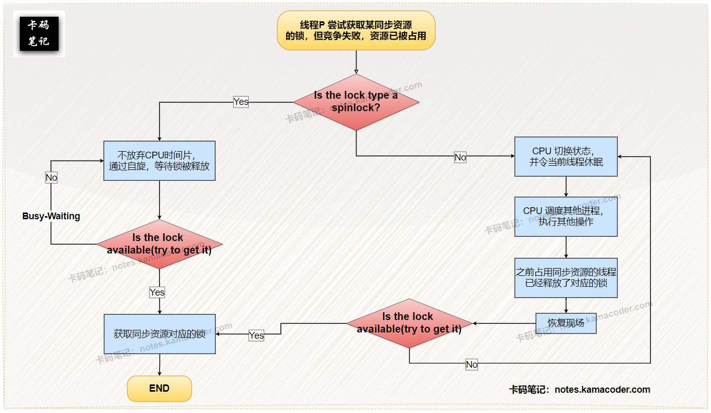

# 你知道的线程的同步方式有哪些？

> 来源: https://notes.kamacoder.com/base/thread-synchronization.html

# 你知道的线程的同步方式有哪些？

## 简要回答

  1. **内核级线程（KLT）的同步方式**：

    - **互斥锁（Mutex）**：确保同一时间只有一个线程进入临界区。
     - **信号量（Semaphore）**：控制资源访问数量，支持计数和二进制模式。
     - **条件变量（Condition Variable）**：用于线程间状态通知，基于特定条件阻塞或唤醒线程，需搭配互斥锁使用。
     - **读写锁（Read-Write Lock）**：允许多读单写，提高读多写少场景的性能。
     - **自旋锁（Spinlock）**：忙等待锁，适用于短临界区。

   2. **用户级线程（ULT）的同步方式**：

    - **原子操作（Atomic）**：通过原子指令如CAS（Compare-And-Swap），避免锁开销。
     - **协程同步原语**：通过调度器协作式切换，如Go的`channel`，通过消息传递替代共享内存。
     - **轻量级锁**：用户态实现的互斥锁（如Java的偏向锁）。
     - **非阻塞数据结构**：如无锁队列，依赖硬件指令实现并发安全。

## 详细回答

  1. **内核级线程（KLT）的同步方式**：

    - **互斥锁（Mutex）**：

① **实现**：通过系统调用（如`pthread_mutex_lock`）获取锁，竞争失败的线程被阻塞并移出调度队列。

② **优化**：可配置为自适应自旋（如Linux的`futex`），减少上下文切换。

③ **适用场景**：长临界区（如文件操作），避免忙等待浪费CPU。
     - **信号量（Semaphore）**：

① **计数信号量**：管理资源池（如数据库连接池）。

② **二进制信号量**：等价于互斥锁，但支持跨进程（`System V`信号量）。
     - **条件变量（Condition Variable）**：

① **实现**：需与互斥锁配合，`wait()`释放锁并阻塞，`signal()`唤醒等待线程。

② **典型场景**：生产者-消费者模型中的缓冲区空/满通知。
     - **读写锁（Read-Write Lock）**：

① **实现**：读锁共享（允许多线程同时读），写锁独占（仅允许单线程写）。

② **适用场景**：配置文件读取（多读）与更新（单写）。
     - **自旋锁（Spinlock）**：

① **实现**：线程循环检测锁状态（如`while(lock == BUSY);`），不主动让出CPU。

② **适用场景**：多核短临界区（如Linux内核中断处理）。

③ **风险**：长时间自旋浪费CPU，需配合抢占式调度使用。

   2. **用户级线程（ULT）的同步方式**：

    - **原子操作（Atomic）**：

① **实现**：通过CPU指令（如`CAS`、`LL/SC`）直接操作内存，无需锁。

② **适用场景**：无锁计数器（如`atomic.AddInt32`）、标志位更新。

③ **局限性**：仅适用于简单操作，复杂逻辑仍需锁。
     - **协程同步原语**：

① **实现**：如Go的`channel`，通过通信传递数据所有权，避免共享内存。

② **适用场景**：高并发I/O密集型任务（如网络服务器）。

② **优势**：无锁竞争，依赖调度器协作切换（非抢占式）。
     - **轻量级锁**：

① **实现**：先尝试用户态自旋，失败后升级为内核锁（如Java的锁膨胀）。

② **优势**：减少内核切换次数，平衡性能与公平性。
     - **非阻塞数据结构**：

① **无锁队列**：**基于原子操作**设计无锁队列、栈等数据结构（如Java的`ConcurrentLinkedQueue`）。
     - **协作式调度同步**：

① **示例**：用户态调度器主动让出CPU（如协程`yield`），通过事件循环协调任务，避免竞态条件。

② **缺点**：依赖开发者手动控制切换时机，易引发死锁。

## 知识拓展

  -

**自旋锁（Spinlock）的工作示意图**，如下所示：
 

   -

**自旋与非自旋的流程图**，如下图所示：
 

   -

**面试官可能的追问1 — 用户级线程（如Go的Goroutine）如何避免内核级同步的开销？**：

    - Go通过`channel`通信替代锁，由调度器**在用户态管理协程切换**，仅在必要时（如系统调用）才进入内核态。

   -

**面试官可能的追问2 — 自旋锁在什么场景下会失效？如何优化？**：

    - **失效场景**：单核环境（忙等待浪费CPU）、长临界区（自旋时间过长）。
     - **优化**：设置最大自旋次数后转为阻塞锁，或结合自适应自旋（动态预测等待时间）。

   -

**面试官可能的追问3：自旋锁在内核线程和用户线程中的使用有何差异？**

    - **内核线程**：可禁用中断确保原子性，防止死锁；支持多核并发自旋。
     - **用户线程**：依赖原子指令或`futex`；单核环境需主动让出CPU（如调用`sched_yield`）。
