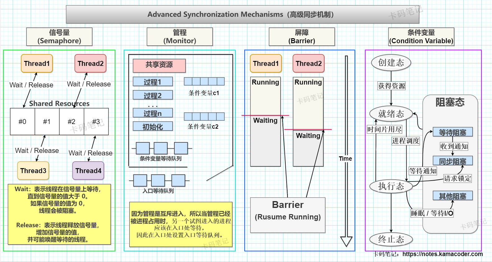
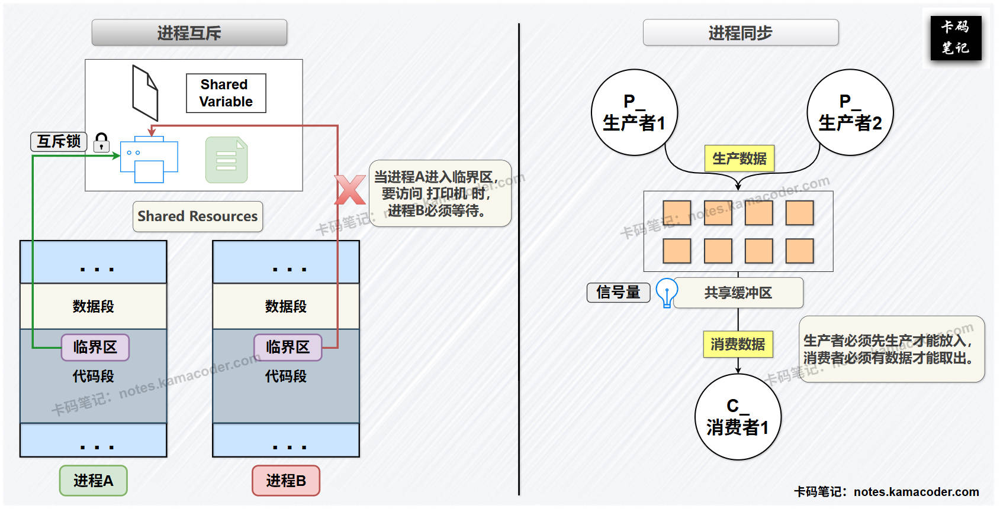

# 解释一下进程的同步与互斥，以及解决这些问题的方法

> 来源: https://notes.kamacoder.com/base/process-synchronization-mutex.html

# 解释一下进程的同步与互斥，以及解决这些问题的方法

## 简要回答

### 同步和互斥的概念

  1. **同步**：

进程同步是指多个进程按照**一定的顺序**执行，以确保数据的正确性和一致性；当多个进程共享资源或需要协作完成任务时，如果没有同步机制，可能会导致数据不一致或逻辑错误。
   2. **互斥**：

进程互斥是指多个进程**不能同时访问共享资源**，以确保资源的独占性；当多个进程需要访问共享资源（如文件、内存、设备）时，如果没有互斥机制，可能会导致数据竞争（Race Condition）。

### 如何实现进程同步和互斥

  1. **软件实现方法**：

    - **①单标志法**：

仅适用于两个进程之间的同步，通过一个标志位实现互斥（例如设置一个共享的整型变量标志turn，用于表示程序进入临界区的权限），但通常不符合实际需求，违背了“**空闲让进**”准则。
     - **②双标志先检查法**：

仅适用于两个进程的同步，进程在进入临界区前**先检查对方标志位**，如果对方标志位为TRUE则等待，否则将自身标志位置为TRUE，该方法不能保证进程对临界资源的互斥使用，违背了“**忙则等待**”准则。
     - **③双标志后检查法**：
仅适用于两个进程的同步，相比于“双标志法先检查法”，调整了检查对方标志位 和 设置自身标志位的顺序，避免了进程同时进入临界区的情况；但可能导致两个进程均陷入无限等待，违背了“**有限等待**” 和 “**空闲让进**”准则。
     - **④Peterson算法**：

结合 单标志位 和 双标志后检查法，解决忙等待和死锁问题，但不满足“**让权等待**”准则，且**只能**处理**两个进程之间**的临界区问题。

   2. **硬件实现方法**：

    - **①关中断方法**：在进入临界区前关中断，退出临界区后开中断。
     - **②硬件指令方法**：TSL（Test and Set Lock）：通过硬件指令实现原子操作。Swap：通过硬件指令交换两个变量的值。

   3. **高级同步机制**：

    - **①信号量**：用于实现同步和互斥，支持P()和V()操作。
     - **②管程**：将共享资源和操作封装在一起，提供了一种结构化的同步方式。
     - **③屏障**：用于确保多个进程或线程在某个点之前不会继续执行。
     - **④条件变量**：用于在多个进程或线程之间传递状态信息。

## 详细回答

### 同步和互斥的概念

  1. **同步**：

同步关系，又称进程的**直接相互制约关系**（程序 --- 程序模式），是多个**协作**进程在工作中相互等待或通信的**协作关系**。
   2. **互斥**：

互斥关系，又称进程的**间接相互制约关系**（程序 --- 资源 --- 程序模式），当一个进程进入临界区访问临界资源时，另一进程必须等待，当访问临界资源的进程退出临界区后另一个进程才被允许访问该临界资源，体现的是进程间的**竞争关系**。

### 如何实现进程同步和互斥

  1.

**软件实现方法**：

    -

**①单标志法**：设置一个**共享**的变量标志，比如整型变量turn，表示程序进入临界区的权限，可以取值为0或1；**单标志法适用于两个进程之间的同步**，以P0进程和P1进程为例，当turn取0时，进程P0可以进入临界区；当turn取1时，进程P1可以进入临界区；当进程P0退出临界区时，通过将turn置为1将**进入临界区的权限**转让给进程P1，进程P1的退出同理。算法可用伪代码描述如下：

```
//进程P0
while (TRUE) {
	while (turn != 0);	//"进入区";如果turn = 1，说明进程P1还未退出临界区，此时进程P0会阻塞在while循环中。
	临界区;
	turn = 1;			//"退出区";允许进程P1进入临界区，将 进入临界区的权限 转让给进程P1。
	剩余区;				//其余部分代码
}
//进程P1
while (TRUE) {
	while (turn != 1);	//"进入区"; 检查标志
	临界区;
	turn = 0;			//"退出区"; 转让权限
	剩余区;
}

```


该方法的问题在于**强制要求进程轮流进入临界区**，但这样不符合实际需求，违背了“**空闲让进**”准则。

     -

**②双标志先检查法**：与“单标志法”相比，将共享变量turn改为数组flag[2]，进程在进入临界区前**先检查对方标志位**——如果对方标志位为TRUE则等待，否则将自身标志位 置为TRUE，表示自己正在使用临界资源，退出临界区后再将自身标志位置为FALSE，表示自己已经退出临界区，以进程Pi和进程Pj为例，双标志先检查法用伪代码描述如下：

```
while (TRUE) {
	while (flag[j]);		//检查对方进程是否正在使用临界资源。
	flag[i] = TRUE;			//将自身flag标志位置为TRUE，表示本进程已进入临界区。
	临界区;
	flag[i] = FALSE;		//将自身flag标志位置为FALSE，表示本进程已经退出临界区。
	剩余区;
}

```


该方法的问题在于，两个进程可能同时进入临界区，违背了“**忙则等待**”准则，因此该方法不能保证进程对临界资源的互斥使用。

     -

**③双标志后检查法**：调整了“双标志先检查法”中更改自身标志位和准入检测的顺序，**先设置标志，再进行准入检测，避免了进程同时进入临界区的情况**。以进程Pi和进程Pj为例，双标志后检查法用伪代码描述如下：

```
while (TRUE) {
	flag[i] = TRUE;		//调整了前两条语句的执行顺序。
	while (flag[j]);
	临界区;
	flag[i] = FALSE;
	剩余区;
}

```


该方法的问题在于，可能导致两个进程均陷入无限等待（两个进程均无法跳出while循环），违背了“**有限等待**” 和 “**空闲让进**”准则。

     -

**④Peterson算法**：结合 单标志位 和 双标志后检查法，既设置flag标志，用于表明进程是否希望进入临界区，又设置共享变量turn，用于规定进程进入临界区的顺序。Peterson算法**满足互斥条件，空闲让进条件 和 有限等待条件**，但不满足“**让权等待**”准则，且**只能**处理**两个进程之间**的临界区问题，不符合实际需求。Peterson算法可用伪代码描述如下：

```
while (TRUE) {
	flag[i] = TRUE;		//先表示当前进程希望进入临界区。
	turn = j;			//再进行谦让，允许对方进入临界区。
	while (flag[j] && turn == j);	//如果对方也想进入临界区，而自己又表示了谦让，那就让对方先进临界区，自己则等待。
	临界区;
	flag[i] = FALSE;	//退出临界区时，将自身flag标志置为FALSE，表示退出临界区。
	剩余区;
}

```


可见，仅凭软件机制仍有不足之处。

   2.

**硬件实现方法**：

    - **①关中断方法**：在进入临界区前关中断，暂停进程调度，让进程独占处理机，当进程退出临界区后开中断；关中断方法满足了“空闲让进”，“忙则等待” 和 “有限等待”；关中断方法不适用于多处理器环境，因为即使同时关闭了所有核心的中断，也不能阻止其他核心上正在执行的进程。
     - **②硬件指令方法**：TSL（Test and Set Lock）：通过硬件指令实现原子操作。Swap：又称exchange指令，通过硬件指令交换两个变量的值。

   3.

**高级同步机制**：

    - **①信号量（Semaphore）**：
 **Δ** 其基本原理是在几个进程之间使用简单的信号来实现同步；在操作系统中，信号量是一种关联一类临界资源的**数据结构**，**信号量的不同值表示一个临界资源的不同状态**；信号量机制可以用于实现同步和互斥，支持**P()和V()** 操作。
 **Δ** P(S)表示申请一个资源S，若资源不够则阻塞等待（wait）；V(S)表示释放一个资源S，若有进程在等待该资源，则唤醒一个正在等待的进程（release）。
 **Δ** 若从用途和取值范围出发，信号量可分为**二进制信号量** 和 **计数信号量**。若从实现机制和行为特性出发，信号量可分为**整型信号量** 和 **记录型信号量**。
     - **②管程（Monitor）**：
 **Δ** 引入管程的目的主要是集中管理分散于不同进程的临界区，防止进程违反同步操作。管程是一个软件模块，由一些公共变量及其描述和访问所有这些变量的函数组成。
 **Δ** 进程对共享资源的请求、释放和其他操作必须通过同一个管程来实现。当多个进程请求访问同一资源时，会**根据资源的情况接受或拒绝**，**确保每次只有一个进程进入临界区**，有效实现进程互斥。
 **Δ** 管程包含了**面向对象**的思想，它将表达共享资源的数据结构 和 对其进行操作的进程封装在一个对象中，并封装了同步操作，从而对进程隐藏同步的细节，简化了调用同步功能的接口。
     - **③屏障（Barrier）**：
 **Δ** 屏障是一种高级同步机制，用于确保多个进程或线程在某个点之前不会继续执行；当进程或线程**到达屏障时**，它会**等待**，直到所有进程或线程都到达屏障后才继续执行；
 **Δ** 屏障机制适合需要多个进程或线程同步执行的场景，如并行计算、多阶段任务。
     - **④条件变量（Condition Variable）**：
 **Δ** 条件变量是一种同步机制，用于在多个进程或线程之间传递状态信息，特别适合于"等待某条件成立"的场景。条件变量通常**与互斥锁一起使用**，以避免竞争条件。
 **Δ** 条件变量本质上是一个**抽象对象**，其内部维护了一个**等待队列**，允许线程在特定条件不满足时进入睡眠状态，并在条件满足时被唤醒。

## 知识图解

  - **进程高级同步机制**，如下图所示：
 

   - **进程同步 和 进程互斥 的区别**，如下图所示：
 

## 知识拓展

  - **临界资源 和 临界区的概念**：

    1. **临界资源**：同一**时刻**只能由一个进程使用的资源称为**临界资源**。打印机、磁带机、绘图仪等物理设备属于临界资源，由不同进程共享的消息队列、变量、数据、文件等软件资源也属于临界资源。
     2. **临界区**：程序中**访问临界资源的**那一部分**代码**称为临界区。进程的运行是异步并发的，为了避免与推进顺序有关的错误，进程必须**互斥**访问临界区，来获得临界资源的使用权。临界区前面通常必须有一段代码用于对临界资源的检查，这段代码称为**进入区**。对应地，临界区之后必须有一个**退出区**，表明进程已经释放了相应的临界资源。代码中的剩余部分则称为**剩余区**。

   - 一个进程包括了以下内容：**程序段**，**数据段**，和**进程控制块（PCB）**。当程序未运行时，程序段与数据段存储在磁盘上，是**静态**的；当程序运行时，操作系统会将程序段和数据段从磁盘加载到内存中，成为进程的一部分，形成进程的地址空间；进程是指将这些程序与数据从磁盘加载到内存后的执行过程，是**动态**的，多个进程可以对应同一段程序代码。
   - 进程之间**同步与互斥**的实现，都应遵循以下**四条设计准则**：

    1. **空闲让进（Entry on idle）**：如果一个进程请求进入一个临界区，而此时没有其他进程在该临界区内，应立即允许该进程进入临界区，以便有效使用临界资源。
     2. **忙则等待（Wait when busy）**：如果已经有一个进程进入临界区，正在访问临界资源，那么其他希望进入该临界区的进程应该在临界区外等待，确保进程互斥访问临界资源。
     3. **有限等待（Bounded waiting）**：对于请求访问临界资源的进程，必须保证它能在有限时间内进入对应的临界区。否则，进程长期得不到所需的资源，造成"无限等待"的局面，即使最终得到临界资源，也失去了意义。
     4. **让权等待（Wait for turn）**：若一个进程无法进入临界区，应该立即释放处理器，以提高处理器利用率，避免出现“忙等”。
