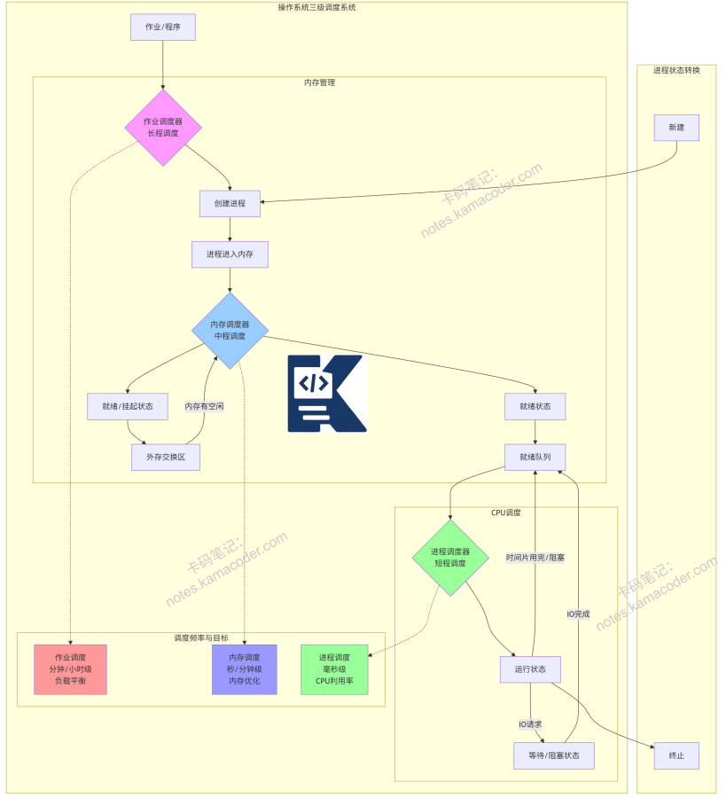

# 作业调度、内存调度、进程调度的区别？

> 来源: https://notes.kamacoder.com/base/scheduling-types.html

# 作业调度、内存调度、进程调度的区别？

## 简要回答

作业调度、内存调度、进程调度是操作系统**调度管理**的**三个不同层级**：

**作业调度（高级调度）**：决定**哪些作业**（程序）从**外存调入内存**，**创建**对应**进程**

**内存调度（中级调度）**：在**内存紧张**时，将**部分进程暂时调出**内存，等**条件允许再调回**

**进程调度（低级调度）**：从**就绪队列**中选择一个**进程**，**分配CPU时间片**执行

三者**协同工作**，分别处理**进入系统、内存驻留、CPU执行**三个不同层次的问题。

## 专业回答

这三种调度是操作系统的**三级调度体系**，分别管理不同的资源：

  1. 作业调度（Job Scheduling / Long-term Scheduling）

**定义** 从外存的**后备队列中**选择作业**调入内存**，**并为它们创建进程**，也称为**长程调度或接纳调度**。

**关键特征：** **调度频率低**（几分钟到几小时一次）
**控制系统的并发度**（内存中的进程数量）
**决策因素**：作业类型、资源需求、优先级
在多道批处理系统中尤为重要

调度目标：
**平衡系统负载**，
**提高系统吞吐量**，
**满足不同用户**需求，
**合理利用系统资源**

**示例决策**：CPU密集型作业和IO密集型作业混合调度，避免资源竞争。

  1. 内存调度（Memory Scheduling / Medium-term Scheduling）

定义：**在内存紧张时**，将**部分进程**暂时**调出到外存（交换区）**，等**内存有空闲或进程可运行时再调入**，也称为**中程调度**或**交换调度**。

关键特征：
**调度频率中等**（秒级到分钟级），**管理系统的多道程序度** **通过交换**（Swapping）实现，
**解决内存资源竞争**问题

两种状态：
**就绪状态**：**进程在内存中，等待CPU** **就绪挂起状态**：**进程被换出到外存**，但处于可运行状态

触发条件：
**内存不足**，
**进程长时间阻塞**，
**系统负载调整需求**

  1. 进程调度（Process Scheduling / Short-term Scheduling）

定义：**从就绪队列中选择一个进程**，**分配CPU时间片执**行，也称为**短程调**度或**CPU调度**。

关键特征：
**调度频率极高**（**毫秒**级），
调度**开销必须很小**，
**实现进程间的快速切换**，
**使用调度器**（Dispatcher）实现

调度目标：
**最大化CPU利用率** **最小化响应时间** **保证公平性** **满足实时性要求**

调度算法：
**先来先服务**（FCFS）
**短作业优先**（SJF）
**优先级调度** **时间片轮转**（RR）
**多级反馈队列**（MFQ）

## 代码示例

先来先服务

```
#include <iostream>
#include <vector>
#include <algorithm>

struct Process {
    int id;
    int arrivalTime;
    int burstTime;
    int completionTime;
    int waitingTime;
    int turnaroundTime;
};

void FCFS_Scheduling(std::vector<Process>& processes) {
    // 按到达时间排序
    std::sort(processes.begin(), processes.end(),
              [](const Process& a, const Process& b) {
                  return a.arrivalTime < b.arrivalTime;
              });

    int currentTime = 0;
    for (auto& p : processes) {
        if (currentTime < p.arrivalTime) {
            currentTime = p.arrivalTime;
        }
        p.completionTime = currentTime + p.burstTime;
        p.turnaroundTime = p.completionTime - p.arrivalTime;
        p.waitingTime = p.turnaroundTime - p.burstTime;
        currentTime = p.completionTime;
    }
}

int main() {
    std::vector<Process> processes = {
        {1, 0, 5},  // id, 到达时间, 执行时间
        {2, 1, 3},
        {3, 2, 8},
        {4, 3, 6}
    };

    FCFS_Scheduling(processes);

    std::cout << "FCFS调度结果:\n";
    std::cout << "PID\t到达\t执行\t完成\t周转\t等待\n";
    for (const auto& p : processes) {
        std::cout << p.id << "\t" << p.arrivalTime << "\t"
                  << p.burstTime << "\t" << p.completionTime << "\t"
                  << p.turnaroundTime << "\t" << p.waitingTime << "\n";
    }
    return 0;
}

```


多级反馈队列

```
#include <iostream>
#include <queue>
#include <vector>

struct MFQProcess {
    int id;
    int remainingTime;
    int priority;  // 队列级别，数字越小优先级越高
    int arrivalTime;
};

void MultilevelFeedbackQueue(std::vector<MFQProcess> processes) {
    const int QUEUE_COUNT = 3;
    std::queue<MFQProcess> queues[QUEUE_COUNT];

    // 时间片配置：队列0最短，队列1中等，队列2最长
    int timeQuanta[QUEUE_COUNT] = {2, 4, 8};

    int currentTime = 0;
    int completed = 0;
    int n = processes.size();
    int index = 0;

    std::cout << "多级反馈队列调度:\n";

    // 按到达时间排序
    std::sort(processes.begin(), processes.end(),
              [](const MFQProcess& a, const MFQProcess& b) {
                  return a.arrivalTime < b.arrivalTime;
              });

    while (completed < n) {
        // 将到达的进程加入最高优先级队列
        while (index < n && processes[index].arrivalTime <= currentTime) {
            processes[index].priority = 0;
            queues[0].push(processes[index]);
            std::cout << "时间 " << currentTime << ": 进程 P"
                      << processes[index].id << " 到达，加入队列0\n";
            index++;
        }

        bool executed = false;

        // 从高优先级到低优先级检查队列
        for (int q = 0; q < QUEUE_COUNT; q++) {
            if (!queues[q].empty()) {
                MFQProcess current = queues[q].front();
                queues[q].pop();

                std::cout << "时间 " << currentTime << ": 从队列" << q
                          << "执行进程 P" << current.id;

                int executeTime = std::min(timeQuanta[q], current.remainingTime);
                currentTime += executeTime;
                current.remainingTime -= executeTime;

                std::cout << " 执行 " << executeTime << " 单位时间\n";

                // 将新到达的进程加入队列0
                while (index < n && processes[index].arrivalTime <= currentTime) {
                    processes[index].priority = 0;
                    queues[0].push(processes[index]);
                    std::cout << "时间 " << currentTime << ": 进程 P"
                              << processes[index].id << " 到达，加入队列0\n";
                    index++;
                }

                if (current.remainingTime > 0) {
                    // 进程未完成，降低优先级
                    int newPriority = std::min(q + 1, QUEUE_COUNT - 1);
                    current.priority = newPriority;
                    queues[newPriority].push(current);
                    std::cout << "  -> 进程 P" << current.id
                              << " 未完成，降到队列" << newPriority << "\n";
                } else {
                    completed++;
                    std::cout << "  -> 进程 P" << current.id << " 完成\n";
                }

                executed = true;
                break;
            }
        }

        if (!executed) {
            currentTime++;  // 所有队列为空，时间前进
        }
    }
}

int main() {
    std::vector<MFQProcess> processes = {
        {1, 8, 0, 0},  // id, 剩余时间, 初始优先级, 到达时间
        {2, 4, 0, 1},
        {3, 12, 0, 2},
        {4, 6, 0, 3}
    };

    MultilevelFeedbackQueue(processes);
    return 0;
}

```


## 知识拓展

分级调度让系统更稳定、高效、公平

  - 知识图解



  - 适用场景

  1.

作业调度适用场景：
**批处理系统** 如：
银行交易批量处理
科学计算任务队列
数据仓库ETL作业
报表生成系统
**大型服务器环境：**
高性能计算集群（HPC）
云计算资源调度
分布式计算框架（Hadoop、Spark）
作业管理系统（Slurm、PBS）
**关键特性需求：**
需要控制并发作业数量
作业间有依赖关系
资源预留和分配
作业优先级管理

   2.

内存调度适用场景：
**内存资源紧张时：**
移动设备的多任务管理
嵌入式系统的内存优化
虚拟机的内存超分配
内存数据库的缓存管理
**工作集管理：**
数据库缓冲池管理
Web服务器缓存优化
文件系统页面缓存
垃圾收集器的内存整理
**虚拟内存系统：**
页面交换（Swapping）
工作集修剪
内存压缩
内存去重

   3.

进程调度适用场景：
**通用操作系统：**
Windows的多级反馈队列
Linux的CFS调度器
macOS的Grand Central Dispatch
公平分享调度
**实时系统：**
嵌入式实时操作系统（VxWorks、QNX）
工业控制系统
航空航天系统
医疗设备
**特殊需求系统：**
交互式系统：快速响应（GUI、终端）
服务器系统：高吞吐量（Web服务器、数据库）
多媒体系统：保证带宽（视频流、音频处理）
节能系统：动态频率调整（移动设备）
**多核/众核系统：**
负载均衡
缓存亲和性
功耗管理
NUMA优化

  - 面试官很能追问

Q1: 作业调度在现代操作系统中是否还存在？

A1:
是的，作业调度在现代操作系统中仍然存在，但其形式和重要性发生了变化：

  1. 传统形式：
在批处理系统中显著
用户提交作业，系统按队列处理
如IBM的OS/360、大型机系统
   2. 现代演变形式：
云计算和集群调度：
桌面/移动系统：
隐式作业调度：用户启动应用即创建作业
启动器/启动器管理
应用沙箱和资源限制
   3. 现代特征：
即时性：用户期望立即响应，而非排队等待
交互性：图形界面、实时反馈
资源管理：与虚拟化、容器化结合
策略多样性：公平调度、优先级、预留、抢占
   4. 重要性变化原因：
硬件性能提升，资源不再极度稀缺
从批处理转向交互式计算
用户期望即时响应
但大数据、科学计算等领域仍需要传统作业调度

结论：**作业调度概念依然存在**，但**已从操作系统内核转移到更高级别的调度器**（如Kubernetes、YARN、Slurm），形式更加多样化和专业化。
