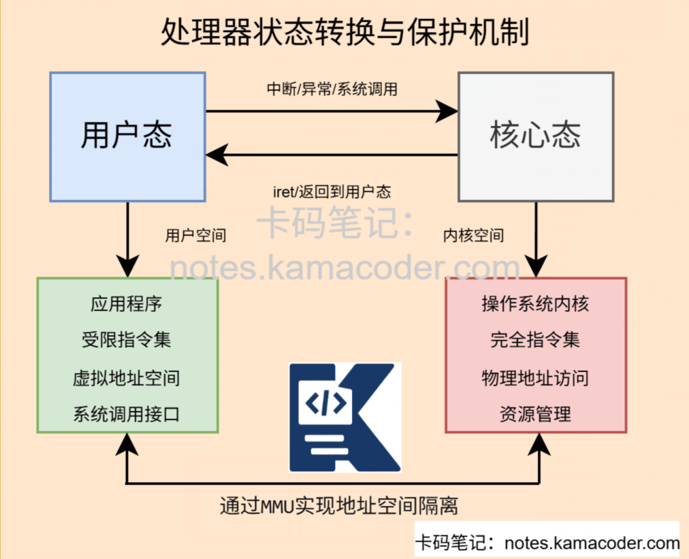

# 处理机有哪两种状态？

> 来源: https://notes.kamacoder.com/base/processor-states.html

# 处理机有哪两种状态？

## 简要回答

处理机（CPU）在操作系统中主要运行在两种状态：**核心态**（Kernel Mode）和**用户态**（User Mode）。

核心态具**有完全的系统控制权限，可以执行所有指令和访问所有内存**；

用户态**则受限**，**只能执行非特权指令**和**访问用户空间内存**。

两种状态的分离保证了操作系统的安全性和稳定性。

## 专业回答

处理机的两种状态——**核心态和用户态**，是现代操作系统架构的**基石**。

**核心态**，又称为**特权态、管态或系统态**，是CPU执行操作系统**内核代码时的工作状态**。

在此状态下，**CPU拥有最高特权级别**，可以执行**所有指令集中的指令**，包括**特权指令**如开关中断、修改页表、直接进行I/O操作等；

可以访问**整个物理内存地址空间**，包括内核空间和用户空间；可以**直接操作所有硬件资源**，如设备控制器、中断控制器、时钟等。

**用户态**，又称普通态或目态，**是CPU运行用户应用程序时的工作状态**。

在此状态下，**CPU的特权级别受到严格限制**：**只能执行非特权指令**，若尝试执行特权指令会触发保护异常；

所有**硬件操作**必须通过**操作系统**提供的**接口**间接完成。

这两种状态的分**离通过CPU硬件机制实现**，包括**模式位、内存保护单元、特权指令**检查等。

**状态切换**通过**特定的触发条件完成**：从用户态切换到核心态主要通过**系统调用**（应用程序主动请求内核服务）、**中断**（外部设备请求服务）和**异常**（程序错误或特殊条件）**三种途径**；

从**核心态**返回**用户态**则通过**中断返回指令**或**进程上下文切换**。

## 代码示例

```
#include <iostream>
#include <stdexcept>
#include <vector>
#include <string>
#include <thread>
#include <chrono>
#include <mutex>
#include <queue>

using namespace std;

// 模拟CPU模式位
enum class CPUMode {
    USER_MODE,
    KERNEL_MODE
};

// 模拟特权指令
enum class InstructionType {
    NON_PRIVILEGED,  // 非特权指令
    PRIVILEGED       // 特权指令
};

// 模拟CPU异常
class CPUException : public runtime_error {
public:
    CPUException(const string& msg) : runtime_error(msg) {}
};

// 模拟保护异常
class ProtectionFaultException : public CPUException {
public:
    ProtectionFaultException(const string& msg) : CPUException(msg) {}
};

// 模拟CPU类
class CPU {
private:
    CPUMode currentMode;
    int programCounter;
    bool interruptsEnabled;
    mutex modeMutex;

    // 模拟寄存器
    struct Registers {
        int eax, ebx, ecx, edx;
        int esp, ebp;  // 栈指针
        int eip;        // 指令指针
        int eflags;     // 状态寄存器
    } registers;

    // 模拟系统调用号
    enum SyscallNumber {
        SYS_READ = 0,
        SYS_WRITE = 1,
        SYS_OPEN = 2,
        SYS_CLOSE = 3,
        SYS_EXIT = 4,
        SYS_FORK = 5
    };

public:
    CPU() : currentMode(CPUMode::KERNEL_MODE), programCounter(0),
            interruptsEnabled(true) {
        cout << "[CPU] 初始化，启动时处于核心态" << endl;
    }

    // 获取当前模式
    CPUMode getCurrentMode() const {
        return currentMode;
    }

    // 切换到核心态
    void switchToKernelMode() {
        lock_guard<mutex> lock(modeMutex);
        cout << "[CPU] 模式切换: 用户态 → 核心态" << endl;
        currentMode = CPUMode::KERNEL_MODE;
        // 模拟TLB刷新等操作
        this_thread::sleep_for(chrono::milliseconds(1));
    }

    // 切换到用户态
    void switchToUserMode() {
        lock_guard<mutex> lock(modeMutex);
        cout << "[CPU] 模式切换: 核心态 → 用户态" << endl;
        currentMode = CPUMode::USER_MODE;
        // 模拟TLB刷新等操作
        this_thread::sleep_for(chrono::milliseconds(1));
    }

    // 执行指令（模拟指令执行）
    void executeInstruction(const string& instruction, InstructionType type) {
        if (type == InstructionType::PRIVILEGED && currentMode == CPUMode::USER_MODE) {
            throw ProtectionFaultException("用户态尝试执行特权指令: " + instruction);
        }

        cout << "[CPU] 执行指令: " << instruction;
        cout << " (模式: " << (currentMode == CPUMode::USER_MODE ? "用户态" : "核心态") << ")" << endl;

        programCounter++;
        this_thread::sleep_for(chrono::milliseconds(50));  // 模拟指令执行时间
    }

    // 模拟系统调用（用户态→核心态→用户态）
    int syscall(SyscallNumber number, int arg1 = 0, int arg2 = 0, int arg3 = 0) {
        cout << "\n[系统调用] 进程发起系统调用 #" << number << endl;

        // 保存用户态上下文
        auto savedRegisters = registers;
        auto savedPC = programCounter;

        try {
            // 切换到核心态
            switchToKernelMode();

            // 根据系统调用号执行相应操作
            int result = handleSyscall(number, arg1, arg2, arg3);

            // 切换回用户态
            switchToUserMode();

            // 恢复用户态上下文（除了返回值）
            registers = savedRegisters;
            registers.eax = result;  // 系统调用返回值放在eax
            programCounter = savedPC + 1;

            cout << "[系统调用] 返回用户态，返回值: " << result << endl;
            return result;

        } catch (const exception& e) {
            // 异常处理
            cerr << "[系统调用] 错误: " << e.what() << endl;
            switchToUserMode();
            registers = savedRegisters;
            programCounter = savedPC;
            return -1;  // 错误返回值
        }
    }

    // 模拟中断处理
    void handleInterrupt(int interruptNumber) {
        cout << "\n[中断] 接收到中断 #" << interruptNumber << endl;

        // 保存当前上下文（无论当前模式）
        auto savedMode = currentMode;
        auto savedRegisters = registers;
        auto savedPC = programCounter;

        try {
            // 切换到核心态（如果不在核心态）
            if (currentMode != CPUMode::KERNEL_MODE) {
                switchToKernelMode();
            }

            // 执行中断处理程序
            executeInterruptHandler(interruptNumber);

            // 恢复之前模式
            if (savedMode == CPUMode::USER_MODE) {
                switchToUserMode();
            }

            // 恢复上下文
            registers = savedRegisters;
            programCounter = savedPC;

            cout << "[中断] 处理完成，返回原模式" << endl;

        } catch (const exception& e) {
            cerr << "[中断] 处理错误: " << e.what() << endl;
            // 发生严重错误，可能进入panic状态
        }
    }

private:
    // 处理系统调用（核心态）
    int handleSyscall(SyscallNumber number, int arg1, int arg2, int arg3) {
        cout << "[核心态] 处理系统调用 #" << number << endl;

        switch (number) {
            case SYS_READ:
                cout << "[核心态] 从文件描述符 " << arg1 << " 读取 " << arg2 << " 字节" << endl;
                // 模拟执行特权操作
                executeInstruction("访问硬盘控制器", InstructionType::PRIVILEGED);
                executeInstruction("DMA传输数据", InstructionType::PRIVILEGED);
                executeInstruction("复制数据到用户空间", InstructionType::PRIVILEGED);
                return arg2;  // 返回读取的字节数

            case SYS_WRITE:
                cout << "[核心态] 向文件描述符 " << arg1 << " 写入 " << arg2 << " 字节" << endl;
                executeInstruction("检查用户缓冲区", InstructionType::PRIVILEGED);
                executeInstruction("复制数据到内核缓冲区", InstructionType::PRIVILEGED);
                executeInstruction("启动磁盘写操作", InstructionType::PRIVILEGED);
                return arg2;  // 返回写入的字节数

            case SYS_OPEN:
                cout << "[核心态] 打开文件: " << arg1 << endl;
                executeInstruction("检查文件路径", InstructionType::PRIVILEGED);
                executeInstruction("分配文件描述符", InstructionType::PRIVILEGED);
                return 3;  // 返回文件描述符

            case SYS_EXIT:
                cout << "[核心态] 进程退出，状态码: " << arg1 << endl;
                executeInstruction("释放进程资源", InstructionType::PRIVILEGED);
                executeInstruction("通知调度器", InstructionType::PRIVILEGED);
                return 0;

            default:
                throw runtime_error("未知系统调用");
        }
    }

    // 执行中断处理程序
    void executeInterruptHandler(int interruptNumber) {
        cout << "[核心态] 执行中断处理程序 #" << interruptNumber << endl;

        switch (interruptNumber) {
            case 0:  // 时钟中断
                cout << "[核心态] 处理时钟中断" << endl;
                executeInstruction("保存时钟计数", InstructionType::PRIVILEGED);
                executeInstruction("更新进程时间片", InstructionType::PRIVILEGED);
                executeInstruction("检查是否需要调度", InstructionType::PRIVILEGED);
                break;

            case 1:  // 键盘中断
                cout << "[核心态] 处理键盘中断" << endl;
                executeInstruction("读取键盘扫描码", InstructionType::PRIVILEGED);
                executeInstruction("转换为字符", InstructionType::NON_PRIVILEGED);
                executeInstruction("放入输入缓冲区", InstructionType::PRIVILEGED);
                break;

            case 2:  // 硬盘中断
                cout << "[核心态] 处理硬盘中断" << endl;
                executeInstruction("读取硬盘状态", InstructionType::PRIVILEGED);
                executeInstruction("DMA传输完成处理", InstructionType::PRIVILEGED);
                executeInstruction("唤醒等待进程", InstructionType::PRIVILEGED);
                break;

            default:
                cout << "[核心态] 处理未知中断" << endl;
                executeInstruction("记录错误日志", InstructionType::PRIVILEGED);
        }
    }
};

// 模拟用户进程
class UserProcess {
private:
    int pid;
    CPU& cpu;
    string name;

public:
    UserProcess(int id, CPU& cpuRef, const string& procName)
        : pid(id), cpu(cpuRef), name(procName) {}

    void run() {
        cout << "\n========== 进程 " << name << " (PID: " << pid << ") 开始运行 ==========" << endl;

        try {
            // 进程开始于用户态
            cpu.switchToUserMode();

            // 执行一些非特权指令
            cout << "\n[用户态] 执行用户代码..." << endl;
            cpu.executeInstruction("mov eax, ebx", InstructionType::NON_PRIVILEGED);
            cpu.executeInstruction("add ecx, 10", InstructionType::NON_PRIVILEGED);
            cpu.executeInstruction("cmp edx, 0", InstructionType::NON_PRIVILEGED);

            // 模拟系统调用 - 读取文件
            cout << "\n[用户态] 调用 read() 系统调用" << endl;
            int bytesRead = cpu.syscall(CPU::SYS_READ, 3, 1024, 0);
            cout << "[用户态] read() 返回: " << bytesRead << " 字节" << endl;

            // 继续执行用户代码
            cpu.executeInstruction("处理读取的数据", InstructionType::NON_PRIVILEGED);

            // 模拟系统调用 - 写入文件
            cout << "\n[用户态] 调用 write() 系统调用" << endl;
            int bytesWritten = cpu.syscall(CPU::SYS_WRITE, 3, 512, 0);
            cout << "[用户态] write() 返回: " << bytesWritten << " 字节" << endl;

            // 尝试执行特权指令（应该失败）
            cout << "\n[用户态] 尝试执行特权指令（应该触发异常）" << endl;
            try {
                cpu.executeInstruction("修改页表寄存器", InstructionType::PRIVILEGED);
                cout << "[ERROR] 不应该执行到这里！" << endl;
            } catch (const ProtectionFaultException& e) {
                cout << "[用户态] 正确捕获保护异常: " << e.what() << endl;
            }

            // 模拟系统调用 - 退出
            cout << "\n[用户态] 调用 exit() 系统调用" << endl;
            cpu.syscall(CPU::SYS_EXIT, 0);

        } catch (const exception& e) {
            cerr << "[进程 " << name << "] 发生异常: " << e.what() << endl;
        }

        cout << "========== 进程 " << name << " 结束 ==========\n" << endl;
    }
};

// 模拟时钟中断线程
void clockInterruptThread(CPU& cpu, int intervalMs) {
    int ticks = 0;
    while (ticks++ < 5) {  // 模拟5次时钟中断
        this_thread::sleep_for(chrono::milliseconds(intervalMs));
        cpu.handleInterrupt(0);  // 时钟中断号为0
    }
}

// 模拟键盘中断线程
void keyboardInterruptThread(CPU& cpu) {
    this_thread::sleep_for(chrono::milliseconds(150));
    cpu.handleInterrupt(1);  // 键盘中断号为1
}

// 模拟硬盘中断线程
void diskInterruptThread(CPU& cpu) {
    this_thread::sleep_for(chrono::milliseconds(300));
    cpu.handleInterrupt(2);  // 硬盘中断号为2
}

// 演示程序
void demonstrateCPUModes() {
    cout << "====== CPU用户态/核心态演示程序 ======" << endl;
    cout << "演示进程执行、系统调用、中断处理和异常捕获\n" << endl;

    // 创建CPU模拟器
    CPU cpu;

    // 启动中断模拟线程
    thread clockThread(clockInterruptThread, ref(cpu), 200);
    thread keyboardThread(keyboardInterruptThread, ref(cpu));
    thread diskThread(diskInterruptThread, ref(cpu));

    // 创建并运行用户进程
    UserProcess proc1(1001, cpu, "文本编辑器");
    UserProcess proc2(1002, cpu, "计算器");

    // 模拟进程执行（在实际操作系统中由调度器控制）
    proc1.run();

    // 等待中断线程完成
    clockThread.join();
    keyboardThread.join();
    diskThread.join();

    cout << "\n====== 演示结束 ======" << endl;

    // 演示模式切换开销
    cout << "\n====== 模式切换开销分析 ======" << endl;

    auto start = chrono::high_resolution_clock::now();
    for (int i = 0; i < 1000; i++) {
        cpu.switchToKernelMode();
        cpu.switchToUserMode();
    }
    auto end = chrono::high_resolution_clock::now();

    auto duration = chrono::duration_cast<chrono::microseconds>(end - start);
    cout << "1000次模式切换总时间: " << duration.count() << " 微秒" << endl;
    cout << "平均每次切换时间: " << duration.count() / 1000.0 << " 微秒" << endl;
    cout << "注：实际模式切换时间约0.1-1微秒，这里模拟了额外开销" << endl;
}

// 实际场景演示：内存访问保护
void demonstrateMemoryProtection() {
    cout << "\n====== 内存访问保护演示 ======" << endl;

    CPU cpu;

    // 模拟内核空间和用户空间
    class MemoryManager {
    private:
        vector<int> kernelMemory;
        vector<int> userMemory;
        CPUMode currentMode;

    public:
        MemoryManager() : kernelMemory(1000, 0), userMemory(1000, 0) {}

        void setMode(CPUMode mode) { currentMode = mode; }

        int readMemory(bool isKernelSpace, int address) {
            if (isKernelSpace && currentMode == CPUMode::USER_MODE) {
                throw ProtectionFaultException("用户态尝试读取内核内存");
            }

            if (isKernelSpace) {
                return kernelMemory[address % kernelMemory.size()];
            } else {
                return userMemory[address % userMemory.size()];
            }
        }

        void writeMemory(bool isKernelSpace, int address, int value) {
            if (isKernelSpace && currentMode == CPUMode::USER_MODE) {
                throw ProtectionFaultException("用户态尝试写入内核内存");
            }

            if (isKernelSpace) {
                kernelMemory[address % kernelMemory.size()] = value;
            } else {
                userMemory[address % userMemory.size()] = value;
            }
        }
    };

    MemoryManager mem;

    // 核心态下可以访问所有内存
    mem.setMode(CPUMode::KERNEL_MODE);
    cout << "[核心态] 写入内核内存: 成功" << endl;
    mem.writeMemory(true, 0x1000, 42);
    cout << "[核心态] 读取内核内存: " << mem.readMemory(true, 0x1000) << endl;
    cout << "[核心态] 写入用户内存: 成功" << endl;
    mem.writeMemory(false, 0x2000, 100);

    // 用户态下只能访问用户内存
    mem.setMode(CPUMode::USER_MODE);
    cout << "[用户态] 写入用户内存: 成功" << endl;
    mem.writeMemory(false, 0x2000, 200);
    cout << "[用户态] 读取用户内存: " << mem.readMemory(false, 0x2000) << endl;

    // 尝试访问内核内存（应该失败）
    cout << "[用户态] 尝试读取内核内存: ";
    try {
        int value = mem.readMemory(true, 0x1000);
        cout << "错误：读取成功，得到 " << value << endl;
    } catch (const ProtectionFaultException& e) {
        cout << "正确触发保护异常" << endl;
    }
}

int main() {
    demonstrateCPUModes();
    demonstrateMemoryProtection();
    return 0;
}

```


## 知识拓展

**现代I/O技术的发展**

  - 知识图解



  - 面试官很能追问

Q1：用户态程序如何执行需要特权的操作？

A1:用户态程序通过**系统调用**接口请求**操作系统内核**代为执**行特权操作**。

当程序调用如read()、write()、fork()等库函数时，这些函数会触发特殊的软中断指令或快速系统调用指令，导致**CPU从用户态切换到核心态**。

Q2：模式切换的具体开销包括哪些？

A2: 模式切换的开销包括**直接开销**和**间接开销**两部分。

直接开销主要来自硬件操作：**保存和恢复用户态上下文需要操作数十个寄存器**；

**切换栈指针到内核栈**,更新CPU模式位和控制寄存器,刷新TLB或切换地址空间ID。

**间接开销更为显著**：TLB失效导致后续内存访问需要页表遍历；缓存污染因用户和内核数据混合降低命中率；分支预测失效导致流水线清空；现代CPU推测执行被打断。
