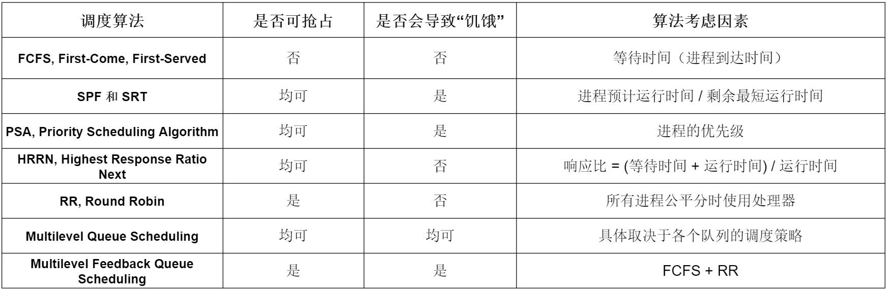
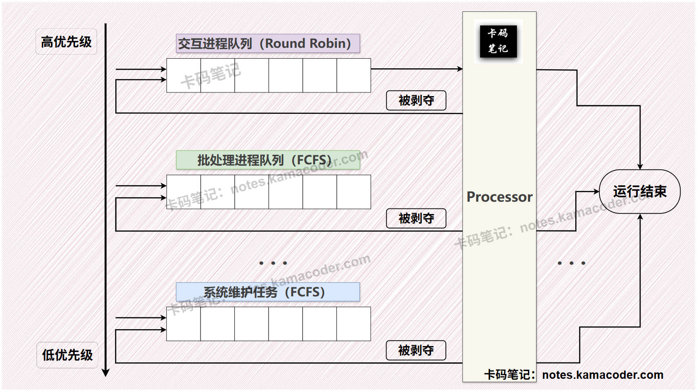
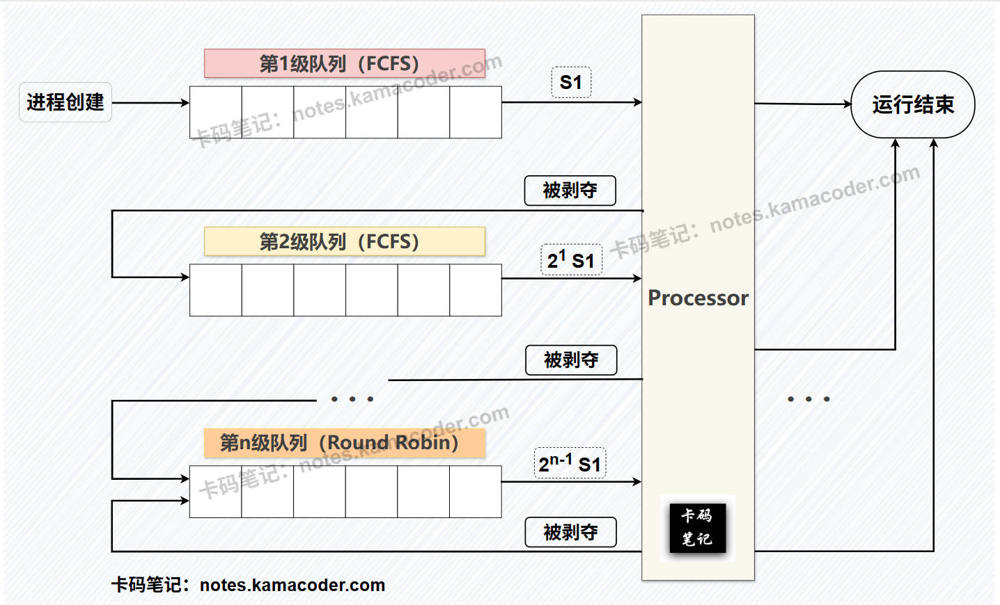

# 进程调度算法你了解多少

> 来源: https://notes.kamacoder.com/base/process-scheduling-algorithms.html

# 进程调度算法你了解多少

## 简要回答

  1. **先来先服务（FCFS, First-Come, First-Served）**：

    - **工作原理**：进程按照到达顺序进入就绪队列，CPU依次执行队列中的进程。FCFS是**非抢占式**，一旦进程开始执行，直到完成才会释放CPU。
     - **适用情景**：批处理系统，任务执行时间差异不大的场景。
     - **优点**：实现**简单**，**公平**性较高。
     - **缺点**：可能导致“饥饿”现象，长作业会阻塞短作业；平均等待时间较长，**不适合交互式系统**。

   2. **短进程优先调度算法（SPF和SRT）**：

    - **工作原理**：
 **1> SPF（Shortest Process First）**：非抢占式，选择当前就绪队列中**运行时间最短**的进程执行。
 **2> SRT（Shortest Remaining Time）**：抢占式，选择**剩余运行时间最短**的进程执行。
     - **适用情景**：适合批处理系统，尤其是短作业较多的场景。
     - **优点**：
 **1> SPF（Shortest Process First）**：减少平均等待时间，适合短作业。
 **2> SRT（Shortest Remaining Time）**：进一步优化平均等待时间。
     - **缺点**：
 **1> SPF（Shortest Process First）**：长作业可能“饥饿”。
 **2> SRT（Shortest Remaining Time）**：需要频繁计算剩余时间，开销较大。

   3. **优先级调度算法（PSA, Priority Scheduling Algorithm）**：

    - **工作原理**：每个进程分配一个优先级，CPU选择优先级最高的进程执行；可以是**抢占式或非抢占式**。
     - **适用情景**：适合**实时系统**或需要区分任务优先级的场景。
     - **优点**：灵活，可根据任务重要性调整优先级。
     - **缺点**：低优先级进程可能“饥饿”；动态调整优先级会增加开销。

   4. **高响应比优先调度算法（HRRN, Highest Response Ratio Next）**：

    - **工作原理**：选择响应比最高的进程执行，**响应比 = (等待时间 + 运行时间) / 运行时间**。
     - **适用情景**：适合批处理系统，任务执行时间差异较大的场景，兼顾等待时间和运行时间。
     - **优点**：兼顾公平性和效率，减少平均等待时间。
     - **缺点**：需要计算响应比，开销较大。

   5. **时间片轮转调度算法（RR, Round Robin）**：

    - **工作原理**：每个进程分配一个时间片（如10ms），时间片用完后切换到下一个进程。
     - **适用情景**：**交互式系统**，如桌面操作系统。
     - **优点**：公平性高，适合交互式系统。
     - **缺点**：时间片过大会退化为FCFS。

   6. **多级队列调度算法（Multilevel Queue Scheduling）**：

    - **工作原理**：将进程按优先级或类型分配到不同的队列，**每个队列采用不同的调度算法**（如FCFS、RR）；队列之间可以有优先级，高优先级队列的进程优先执行。
     - **适用情景**：适合任务类型多样的系统，如混合批处理和交互式任务。
     - **优点**：灵活，可根据任务类型定制调度策略。
     - **缺点**：可能导致低优先级队列的进程“饥饿”。

   7. **多级反馈队列调度算法（Multilevel Feedback Queue Scheduling）**：

    - **工作原理**：将就绪队列分为多个子队列，每个队列的时间片大小不同；**新进程到达首先进入最高优先级队列，时间片用完后降级到下一队列**；低优先级队列的时间片较大，避免频繁切换。
     - **适用情景**：通用操作系统，如Linux、Windows。
     - **优点**：能较好地满足各类进程对处理器的需求；适合通用操作系统。
     - **缺点**：实现复杂，开销较大。

## 详细回答

  1. **先来先服务（FCFS, First-Come, First-Served）**：

    - **工作原理**：也称为FIFO（First In First Out），可以适用于作业调度，进程调度；每次进程调度时，系统会从就绪队列中选择一个最先进入该队列的进程，将该进程的状态转为执行态并为其分配处理器资源，直到下一个调度的时机到来。
     - **适用情景**：批处理系统，任务执行时间差异不大的场景。
     - **优点**：逻辑**简单**，**公平**性较高。
     - **缺点**：可能导致“饥饿”现象，长作业会阻塞短作业；效率差，平均等待时间较长，**不适合交互式系统**；无法实现人机交互；未考虑到不同进程间的差异性（例如进程的紧急性）；更加偏向处理器密集型进程 和 长进程。

   2. **短进程优先调度算法（SPF和SRT）**：- **工作原理**： 可以适用于作业调度、进程调度。 **PS：**有些教材将SPF专指非抢占式短进程优先调度算法，而将抢占式短进程优先调度算法称为最短剩余时间优先调度算法，即SRT，此处也这样划分。
 **1> SPF（Shortest Process First）**：**非抢占式**，在进程调度时，根据就绪队列中排队的进程所预估的处理器使用时间，每次调度选择预估剩余处理器使用时间最短的进程；在作业调度时，称为短作业优先调度算法（Shortest Job First, SJF），根据外存队列中作业所要求的执行时间来调度作业，每次调度选择预估剩余处理器使用时间最短的作业。
 **2> SRT（Shortest Remaining Time）**：**抢占式**，选择**剩余运行时间最短**的进程执行；如果在当前进程运行过程中，就绪队列中出现了要求时间更短的进程，则这个要求时间更短的进程会**抢占**处理器资源，当前运行的进程状态会由执行态变为就绪态。- **适用情景**：适合批处理系统，尤其是短作业较多的场景。- **优点**：
 **1> SPF（Shortest Process First）**：较FCFS性能更好，**如果调度时满足“待调度进程同时可运行” 或者 “待调度进程都几乎同时到达”，那么SPF的平均等待时间和平均周转实际是最优的**。
 **2> SRT（Shortest Remaining Time）**：进一步优化平均等待时间。- **缺点**：
 **1> SPF（Shortest Process First）**：长作业可能“饥饿”；算法需要进程预估其运行时间，在预估时，可能出现估算时间不准确 或者 进程“谎报”时间等问题；同FCFS一样，未考虑到不同进程间的差异性。
 **2> SRT（Shortest Remaining Time）**：需要频繁计算剩余时间，开销较大。
   3. **优先级调度算法（PSA, Priority Scheduling Algorithm）**：

    - **工作原理**：可以适用于作业调度、进程调度；作业（进程）的优先级由外界赋予，系统只需要根据外界赋予的优先级来进行调度即可；根据是否可以抢占，优先级调度算法可以分为“**非抢占式优先级调度算法**” 和 “**抢占式优先级调度算法**”；根据在调度程序运行过程中优先级是否可以动态变化，优先级调度算法又可分为“**静态优先级**” 和 “**动态优先级**”。对于静态优先级，是指各个进程的优先级在调度程序运行之初就已经确定好，整个运行期间不会改变；对于动态优先级，是指在调度程序运行的过程中，各个进程的优先级是动态变化的。
     - **适用情景**：适合**实时系统**或需要区分任务优先级的场景。
     - **优点**：灵活，可根据任务重要性调整优先级。
     - **缺点**：低优先级进程可能“饥饿”；动态调整优先级会增加开销。

   4. **高响应比优先调度算法（HRRN, Highest Response Ratio Next）**：

    - **工作原理**：可以适用于作业调度、进程调度；高响应比优先调度算法综合考虑了进程（作业）的等待时间和运行时间来调度进程，**响应比 = (等待时间 + 运行时间) / 运行时间**；随着进程的等待时间增加，该进程的优先级就会变高，更容易被调度。。
     - **适用情景**：适合批处理系统，任务执行时间差异较大的场景，兼顾等待时间和运行时间。
     - **优点**：兼顾公平性和效率，减少平均等待时间。
     - **缺点**：需要计算响应比，开销较大。

   5. **时间片轮转调度算法（RR, Round Robin）**：

    - **工作原理**：适用于进程调度一般不适用于作业调度；RR算法将处理器使用时间分成一个个时间片，公平地分给每一个等待处理器资源的就绪进程，当时钟中断发生时，系统会修改当前进程在时间片内的剩余时间，当一个进程分配的时间片耗尽后，其会重新进入就绪队列等待下一次分配时间片。**系统会将所有就绪进程按照FCFS算法来维护就绪队列，每个时间片结束后操作系统都会结束当前进程，将当前进程放回到就绪队列末尾，并调度下一个就绪程序运行**；在这种策略下，每个进程都能公平地使用处理器资源，也保证了进程的响应时间。
     - **适用情景**：分时操作系统，交互式系统，如桌面操作系统。
     - **优点**：公平性高，适合交互式系统。
     - **缺点**：时间片过大会退化为FCFS。

   6. **多级队列调度算法（Multilevel Queue Scheduling）**：

    - **工作原理**：仅适用于进程调度；该算法将就绪队列置为多个，根据就绪进程的特点和类型，将其分配在不同的就绪队列中。**针对每个就绪队列，可以采用不同的调度算法**；这样不但可以凸显出各种调度算法的优势，也能在一定程度上弥补这些算法的缺点。每个队列都可以是抢占式的，也都可以是非抢占式的，并且也都可能导致“饥饿”现象，具体要取决于各个队列的调度策略和优先级设置。

尤其是在**多处理器系统**中，可以利用该调度算法为每个处理器资源指定一个就绪队列，这样既可以根据进程类型和紧急程度等因素为进程分配更合理的就绪队列，还有利于需要多组线程或进程协作完成任务的情况，即将这些线程或进程分配到不同的就绪队列中，使得它们可以同时获得处理器资源。
     - **适用情景**：适合任务类型多样的系统，如混合批处理和交互式任务。
     - **优点**：灵活，可根据任务类型定制调度策略。
     - **缺点**：可能导致低优先级队列的进程“饥饿”。

   7. **多级反馈队列调度算法（Multilevel Feedback Queue Scheduling）**：- **工作原理**：仅适用于进程调度；将就绪队列分为多个子队列，每个子队列的时间片大小不同；**为每个子队列依次分配递减等级的优先级**，第一个就绪队列拥有最高的优先级，第二个就绪队列的优先级次于第一个就绪队列，以此类推；在每个就绪队列中，根据该队列的优先级，划分大小不同的时间片，**一般高优先级的队列中时间片更小，低优先级的队列中时间片更大**。
 **PS_1:** 当一个作业的进程被创建并分配资源后，首先将其放入**第一个就绪队列**的末尾，并依据**FCFS算法**进行调度，如果该进程并调度执行后在一个时间片内未完成其任务，就会被降级到下一个队列，重新进行上述过程，一直到进程被降级到**最低优先级**的队列中，此时进程不会继续降级，而是在最低优先级的就绪队列中遵循**时间片轮转调度算法（RR）** 等待调度。
 **PS_2:** 调度时，按照队列的优先级进行调度，高优先级就绪队列中的进程会被优先调度，对于第i级队列，只有当1 ~ i-1队列都不存在就绪进程时，才可以调度i级队列中的进程；如果当前使用处理器资源的进程来自第i级队列，而此时第一级队列中进入了新的就绪进程，那么会立刻进行**抢占式**进程调度，并将此时**正在运行的程序放回i级队列末尾**。- **适用情景**：通用操作系统，如Linux、Windows。- **优点**：能较好地满足各类进程对处理器的需求；适合通用操作系统（许多现代操作系统使用的调度算法都是基于MLFQ的变体）。- **缺点**：实现复杂，开销较大。

## 知识图解

  1. **七种调度算法的对比，如下图所示：** 

   2. **多级队列调度算法**，示意图如下：
 

   3. **多级反馈队列调度算法**，示意图如下：
 

## 知识拓展

  - 在多道程序系统中，一个作业从被提交并加入等待队列开始，到运行结束这一过程中，可能发生**三种层次的调度**，分别是“作业调度”，“内存调度” 和 “进程调度”，根据调度发生的层次，又依次称为“高级调度”，“中级调度” 和 “低级调度”——

    1. **高级调度（High Level Scheduling）**：又称作业调度 或 长程调度，调度的对象是外存中等待的**作业**，调度的行为是将作业从外存调度到内存中；高级调度的发生频率较低。
     2. **中级调度（Intermediate Scheduling）**：又称内存调度，调度的对象是暂时不能运行的进程，调度的行为是将**目标进程的相关数据和资源**在内存和外存间移动，即将进程由就绪态→就绪挂起态，或者是阻塞态→阻塞挂起态（涉及到进程 / 线程的七状态模型）；中级调度的发生频率不高也不低。
     3. **低级调度（Low Level Scheduling）**：又称进程调度，调度的对象是**进程（或内核级线程）**，调度的行为是决定将处理器资源先分配给哪个进程；低级调度的发生频率很高。
