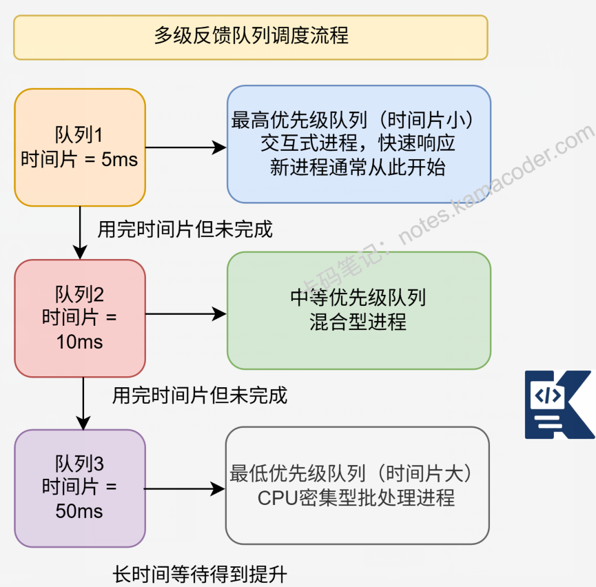

# 进程调度算法有哪些？适用场景是什么？

> 来源: https://notes.kamacoder.com/base/scheduling-algorithms-scenarios.html

# 进程调度算法有哪些？适用场景是什么？

面试时没有回答好问题是很正常的，被面试官质疑时，要有今天不会明天会的底气，面后做好复盘，不在同一道题目上跌倒第二次，今天就从 C++中的inline函数 vs #define宏的区别 背起来

你对进程调度算法的了解有哪些？适用场景是什么？

## 简要回答

进程调度算法是**操作系统决定哪个就绪进程获得CPU时间的方法**。

主要分为**非抢占式**（FCFS、SJF）和**抢占式**（RR、优先级调度、多级队列）。

现代系统采用多级反馈队列（MLFQ）结合**多种策略，平衡响应时间、吞吐量和公平性**。

## 详细回答

  - 调度算法分类体系：

**批处理调度**：FCFS、SJF、HRRN - 注重**吞吐量**

**交互式调度**：RR、优先级调度 - 注重**响应时间**

**实时调度**：EDF、RMS - **满足时间约束**

**混合调度**：MLFQ - **自适应多种负载**

  - 关键调度指标：

周转时间：从**提交到完成的总时间**

响应时间：从**提交到首次响应**的时间

吞吐量：**单位时间完成的进程数**

公平性：**各进程获得CPU时间的均衡度**

CPU利用率：**CPU忙碌时间的比例**

调度算法就像不同的管理风格：

FCFS（先来先服务）：**排队文化**，先到先得，**简单公平但效率可能不高**

SJF（短作业优先）：**效率优先**，让**耗时小的作业先执行**，但可能饿死大作业

RR（时间片轮转）：民主分配，每进程**轮流用一会儿**，保证响应速度

优先级调度：**特权制度，重要任务优先**，但**要防止低优先级饿死**

现代操作系统像经验丰富的项目经理，会**根据任务特点动态调整策略**。

### 进程调度算法特性比较表

| 调度算法  抢占性  公平性  响应时间  吞吐量  实现复杂度  主要特点
| **FCFS**
(先来先服务)  非抢占  高  差  中  低  • 简单公平
• 可能产生 convoy 效应
• 对长作业有利
| **SJF**
(短作业优先)  非抢占  低  好  高  中  • 最小化平均等待时间
• 可能饿死长作业
• 需要预知执行时间
| **SRTF**
(最短剩余时间优先)  抢占  低  很好  高  高  • SJF的抢占式版本
• 响应时间优秀
• 实现复杂度高
| **RR**
(时间片轮转)  抢占  高  好  中  中  • 公平性好
• 时间片大小影响性能
• 适合交互式系统
| **优先级调度**  可选  低  好  高  中  • 支持优先级区分
• 可能饿死低优先级
• 可配置抢占性
| **MLFQ**
(多级反馈队列)  抢占  中  很好  高  高  • 自适应调度
• 平衡响应和吞吐
• 防止饿死机制
| **CFS**
(完全公平调度)  抢占  很高  很好  高  很高  • 红黑树管理进程
• 基于vruntime
• 高度公平性

## 代码示例

```
#include <iostream>
#include <vector>
#include <queue>
#include <algorithm>
#include <iomanip>

struct Process {
    int pid;           // 进程ID
    int arrival_time;  // 到达时间
    int burst_time;    // 执行时间
    int priority;      // 优先级（数字越小优先级越高）
    int remaining_time; // 剩余执行时间
    int start_time;    // 开始时间
    int completion_time; // 完成时间

    // 计算各种时间指标
    int getWaitingTime() const { return start_time - arrival_time; }
    int getTurnaroundTime() const { return completion_time - arrival_time; }
    int getResponseTime() const { return start_time - arrival_time; }
};

class Scheduler {
protected:
    std::vector<Process> processes;

public:
    void setProcesses(const std::vector<Process>& procs) {
        processes = procs;
    }

    virtual void schedule() = 0;

    void printResults() {
        std::cout << "\n调度结果:\n";
        std::cout << "PID\t到达\t执行\t开始\t完成\t等待\t周转\t响应\n";

        double total_waiting = 0, total_turnaround = 0, total_response = 0;

        for (const auto& p : processes) {
            std::cout << p.pid << "\t" << p.arrival_time << "\t"
                      << p.burst_time << "\t" << p.start_time << "\t"
                      << p.completion_time << "\t" << p.getWaitingTime() << "\t"
                      << p.getTurnaroundTime() << "\t" << p.getResponseTime() << "\n";

            total_waiting += p.getWaitingTime();
            total_turnaround += p.getTurnaroundTime();
            total_response += p.getResponseTime();
        }

        std::cout << "\n平均等待时间: " << total_waiting / processes.size() << "\n";
        std::cout << "平均周转时间: " << total_turnaround / processes.size() << "\n";
        std::cout << "平均响应时间: " << total_response / processes.size() << "\n";
    }
};

// 先来先服务调度
class FCFSScheduler : public Scheduler {
public:
    void schedule() override {
        std::vector<Process> sorted_procs = processes;
        std::sort(sorted_procs.begin(), sorted_procs.end(),
                 [](const Process& a, const Process& b) {
                     return a.arrival_time < b.arrival_time;
                 });

        int current_time = 0;
        for (auto& p : sorted_procs) {
            if (current_time < p.arrival_time) {
                current_time = p.arrival_time;
            }
            p.start_time = current_time;
            p.completion_time = current_time + p.burst_time;
            current_time = p.completion_time;
        }
        processes = sorted_procs;
    }
};

// 短作业优先调度（非抢占）
class SJFScheduler : public Scheduler {
public:
    void schedule() override {
        std::vector<Process> sorted_procs = processes;
        int current_time = 0;
        int completed = 0;
        int n = sorted_procs.size();

        std::vector<bool> completed_procs(n, false);

        while (completed < n) {
            int idx = -1;
            int min_burst = INT_MAX;

            // 找出已到达且剩余时间最短的进程
            for (int i = 0; i < n; i++) {
                if (!completed_procs[i] &&
                    sorted_procs[i].arrival_time <= current_time &&
                    sorted_procs[i].burst_time < min_burst) {
                    min_burst = sorted_procs[i].burst_time;
                    idx = i;
                }
            }

            if (idx != -1) {
                sorted_procs[idx].start_time = current_time;
                sorted_procs[idx].completion_time = current_time + sorted_procs[idx].burst_time;
                current_time = sorted_procs[idx].completion_time;
                completed_procs[idx] = true;
                completed++;
            } else {
                current_time++;
            }
        }
        processes = sorted_procs;
    }
};

// 时间片轮转调度
class RRScheduler : public Scheduler {
private:
    int time_quantum;

public:
    RRScheduler(int quantum) : time_quantum(quantum) {}

    void schedule() override {
        std::queue<int> ready_queue;
        std::vector<int> remaining_time;
        std::vector<bool> in_queue;

        // 初始化
        for (const auto& p : processes) {
            remaining_time.push_back(p.burst_time);
            in_queue.push_back(false);
        }

        // 按到达时间排序的进程索引
        std::vector<int> indices(processes.size());
        for (int i = 0; i < processes.size(); i++) indices[i] = i;
        std::sort(indices.begin(), indices.end(), [this](int a, int b) {
            return processes[a].arrival_time < processes[b].arrival_time;
        });

        int current_time = 0;
        int completed = 0;
        int next_proc = 0;

        // 初始化第一个进程
        if (!indices.empty()) {
            ready_queue.push(indices[0]);
            in_queue[indices[0]] = true;
            next_proc = 1;
        }

        while (completed < processes.size()) {
            if (ready_queue.empty()) {
                current_time++;
                // 检查是否有新进程到达
                while (next_proc < processes.size() &&
                       processes[indices[next_proc]].arrival_time <= current_time) {
                    ready_queue.push(indices[next_proc]);
                    in_queue[indices[next_proc]] = true;
                    next_proc++;
                }
                continue;
            }

            int current_idx = ready_queue.front();
            ready_queue.pop();

            Process& current_proc = processes[current_idx];

            // 设置开始时间（如果是第一次执行）
            if (remaining_time[current_idx] == current_proc.burst_time) {
                current_proc.start_time = current_time;
            }

            // 执行一个时间片或剩余时间
            int execution_time = std::min(time_quantum, remaining_time[current_idx]);
            remaining_time[current_idx] -= execution_time;
            current_time += execution_time;

            // 检查新到达的进程
            while (next_proc < processes.size() &&
                   processes[indices[next_proc]].arrival_time <= current_time) {
                if (!in_queue[indices[next_proc]]) {
                    ready_queue.push(indices[next_proc]);
                    in_queue[indices[next_proc]] = true;
                }
                next_proc++;
            }

            // 如果进程未完成，重新加入队列
            if (remaining_time[current_idx] > 0) {
                ready_queue.push(current_idx);
            } else {
                current_proc.completion_time = current_time;
                completed++;
            }
        }
    }
};

// 优先级调度（抢占式）
class PriorityScheduler : public Scheduler {
public:
    void schedule() override {
        auto compare = [](const Process* a, const Process* b) {
            return a->priority > b->priority; // 优先级数字小的优先
        };
        std::priority_queue<Process*, std::vector<Process*>, decltype(compare)> pq(compare);

        std::vector<Process> sorted_procs = processes;
        std::sort(sorted_procs.begin(), sorted_procs.end(),
                 [](const Process& a, const Process& b) {
                     return a.arrival_time < b.arrival_time;
                 });

        std::vector<int> remaining_time;
        for (const auto& p : sorted_procs) {
            remaining_time.push_back(p.burst_time);
        }

        int current_time = 0;
        int completed = 0;
        int n = sorted_procs.size();
        int next_proc = 0;

        Process* current_process = nullptr;
        int current_start = -1;

        while (completed < n) {
            // 将到达的进程加入队列
            while (next_proc < n && sorted_procs[next_proc].arrival_time <= current_time) {
                pq.push(&sorted_procs[next_proc]);
                next_proc++;
            }

            if (!pq.empty()) {
                Process* highest_priority = pq.top();
                pq.pop();

                if (current_process != highest_priority) {
                    if (current_process != nullptr) {
                        // 保存当前进程的执行进度
                        pq.push(current_process);
                    }
                    current_process = highest_priority;
                    if (remaining_time[current_process->pid] == current_process->burst_time) {
                        current_process->start_time = current_time;
                    }
                    current_start = current_time;
                }

                // 执行一个时间单位
                remaining_time[current_process->pid]--;
                current_time++;

                if (remaining_time[current_process->pid] == 0) {
                    current_process->completion_time = current_time;
                    completed++;
                    current_process = nullptr;
                }
            } else {
                current_time++;
            }
        }
        processes = sorted_procs;
    }
};

int main() {
    // 创建测试进程集
    std::vector<Process> processes = {
        {0, 0, 5, 2},  // PID, 到达时间, 执行时间, 优先级
        {1, 1, 3, 1},
        {2, 2, 8, 3},
        {3, 3, 6, 2}
    };

    std::cout << "=== 进程调度算法比较 ===\n";

    // FCFS调度
    FCFSScheduler fcfs;
    fcfs.setProcesses(processes);
    fcfs.schedule();
    std::cout << "\n1. 先来先服务调度 (FCFS):";
    fcfs.printResults();

    // SJF调度
    SJFScheduler sjf;
    sjf.setProcesses(processes);
    sjf.schedule();
    std::cout << "\n2. 短作业优先调度 (SJF):";
    sjf.printResults();

    // RR调度
    RRScheduler rr(2); // 时间片=2
    rr.setProcesses(processes);
    rr.schedule();
    std::cout << "\n3. 时间片轮转调度 (RR, 时间片=2):";
    rr.printResults();

    // 优先级调度
    PriorityScheduler priority;
    priority.setProcesses(processes);
    priority.schedule();
    std::cout << "\n4. 优先级调度:";
    priority.printResults();

    return 0;
}

```


## 知识拓展

  - 各种调度算法的典型应用场景

FCFS适用场景：
批处理系统，
简单的嵌入式系统，
教学演示环境，
负载极轻的服务器

SJF/SRTF适用场景：
已知作业长度的批处理，
科学计算任务调度，
编译服务器，
需要最小化平均等待时间的场景

RR适用场景：
分时操作系统，
交互式系统（桌面、服务器），
需要公平性的多用户环境，
实时性要求不高的通用系统

优先级调度适用场景：
实时系统，
关键任务系统，
有明确优先级区分的应用，
操作系统内核任务调度

MLFQ适用场景：
现代通用操作系统（Windows、macOS的某些版本），
混合型工作负载（交互式+批处理），
需要平衡响应时间和吞吐量的系统

CFS适用场景：
Linux桌面和服务器系统，
需要高度公平性的环境，
虚拟化环境，
多核处理器系统

  - 知识图解



  - 面试官很能追问

Q1: 什么是 convoy效应？如何避免？

A1: Convoy效应是指一个**长进程阻塞了后面多个短进程的执行**。

表现：短进程需要等待长进程完成，导致平均等待时间增加

原因：FCFS调度算法对长进程友好，对短进程不利

避免方法：**使用抢占式调度**（如RR、SRTF）或**设置最大执行时间限制**

Q2: 多级反馈队列如何防止进程饿死？

A2: MLFQ通过以下机制防止饿死：

**优先级提升**：低优先级进程等待一定时间后提升到高优先级队列

**时间片调整**：低优先级队列使用更大的时间片，保证获得足够的CPU时间

**周期重置**：定期将所有进程移回最高优先级队列，重置调度历史

Q3: 实时调度中EDF和RMS的区别是什么？

A3:
**主要区别**：

EDF（最早截止时间优先）：动态优先级，选择绝对截止时间最早的任务

RMS（速率单调调度）：静态优先级，周期越短的任务优先级越高

可调度性：RMS有固定的CPU利用率上限（69%），EDF可达100%

适用性：RMS适合固定周期任务，EDF适合动态周期任务
