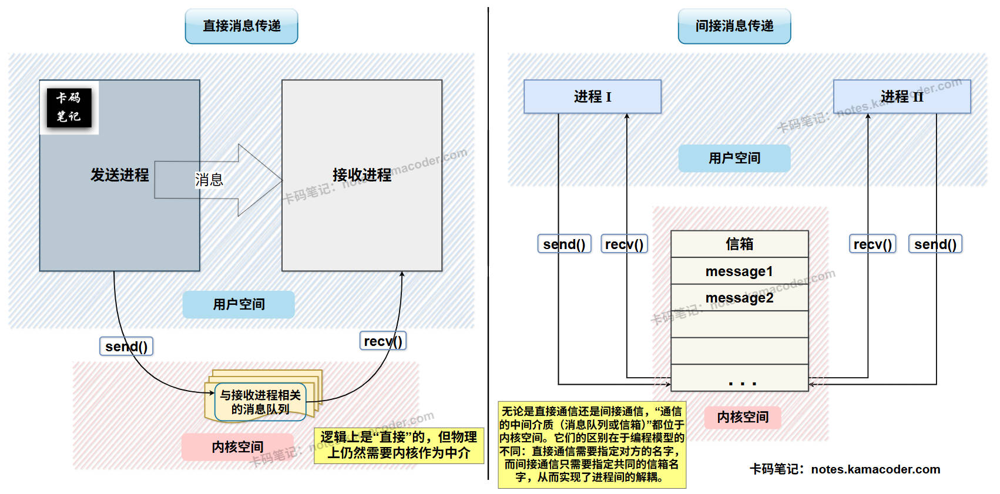
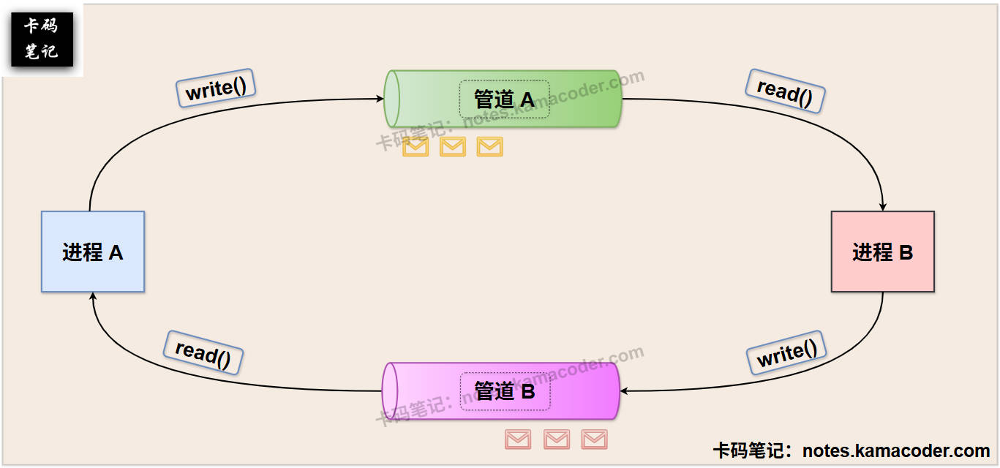

# 进程间有哪些通信方式？

> 来源: https://notes.kamacoder.com/base/ipc-methods.html

# 进程间有哪些通信方式？

## 简要回答

  1. **信号量机制（Semaphore）**：进程通过**P / V操作**控制信号量，可以有效地解决**同步和互斥**问题；信号量机制适合需要同步的场景，如避免竞争条件和死锁。
   2. **共享存储机制（Shared Memory）**：共享内存是一种高效的进程间通信方式，允许多个进程直接访问同一块内存区域。共享存储机制适合需要**高效数据传输**的场景。
   3. **消息传递机制（Message Passing）**：消息传递机制需要操作系统**内核**的支持，通过**消息队列** 或 **信箱**传递数据，消息以数据块的形式传输。消息传递机制支持不同类型的数据，适用于无关进程之间的通信。
   4. **管道通信机制（Pipeline）**：管道通信机制适合进程间的简单数据传输，其又可细分为两类——**①匿名管道**：半双工通信，适用于父子进程或兄弟进程；**②命名管道**：具有文件名，适用于无关进程。
   5. **套接字机制（Socket）**：Socket（套接字）是一种**网络通信**机制，可以在不同主机上的进程之间进行通信；Socket机制适合分布式系统和网络通信。

## 详细回答

  1. **信号量机制（Semaphore）**：信号量是一种**同步通信机制**，用于控制多个进程对共享资源的访问；信号量支持**两种原子操作：P()（等待）和V()（信号）**。
   2. **共享存储机制（Shared Memory）**：共享存储机制又可细分为两种方式——①**共享数据结构**的通信方式：进程间共享同一个数据结构，编程人员需要考虑进程间的同步互斥问题，传输效率低；②**共享存储区**的通信方式：操作系统在内存中开辟一块共享存储区，多个进程可以对该内存区域进行读写，传输效率高。当进程希望对共享存储区进行存取时，会将自己的虚地址空间映射到共享存储区，并向操作系统提出申请。
   3. **消息传递机制（Message Passing）**：进程之间可以调用由操作系统实现的通信命令来传递消息；实现消息传递即分别实现**Send** 和 **Receive**两个**原语**，用于消息的发送和接收。消息传递机制又可细分为两类——①**直接通信方式**：发送进程直接将消息发送给接收进程，将信息挂载到**接收进程的消息队列**上，接收进程从自己的消息队列中获取信息；②**间接通信方式**：操作系统额外**创建一片空间用于存储各种消息**，类似一个信箱，发送进程和接收进程依靠这个中间实体实现信息的发送和接收，这种方式也被称为 “信箱通信模式”，在计算机网络中被广泛运用。
   4. **管道通信机制（Pipeline）**：管道机制又可细分为两种类型——
 **①匿名管道**：即我们平时所说的“管道”通信，它使用一种共享文件来实现进程间通信，这种共享文件被称为“管道” 或 “pipe文件”，可以连接一个读进程和一个写进程。写进程以字节流的形式，将数据送入管道，读进程通过管道将数据读出。匿名管道是一种半双工的通信方式，数据只能单向流动，适用于父子进程或兄弟进程之间的通信；在UNIX/Linux系统中，使用pipe()系统调用创建匿名管道。
 **②命名管道（Named Pipe/FIFO）**：一种特殊的管道，具有文件名，可以在无关进程之间使用；在UNIX/Linux系统中，使用mkfifo()系统调用创建命名管道。
   5. **套接字机制（Socket）**：Socket是一种**网络通信**机制，支持不同主机上的进程之间进行通信。Socket支持网络通信，适用于分布式系统，其通信方式可以是面向连接的（如TCP），也可以是无连接的（如UDP）。

## 知识图解

  1. **消息传递机制的示意图**如下所示：
 

   2. **管道实现全双工通信**的示意图，如下所示：
 

## 知识拓展

  - 操作系统实现管道机制，需要提供三种机制——**①**同步机制；**②**互斥机制；**③**通信进程间确定对方存在的机制。
   - **管道具有以下特点**：

    1. 同步：写进程向管道中写入一定量数据后，会进入阻塞状态，等待读进程将数据读出后将其唤醒；读进程在将管道中数据读完后，也会进入阻塞状态，等待写进程对管道写操作完毕后将其唤醒。
     2. 互斥：当有一个进程在对一个管道读/写时，其他想要读/写该管道的进程必须等待。
     3. 管道需要通信双方确定对方的存在，否则会陷入阻塞。
     4. 管道是一个固定大小的 缓冲区（如4KB），在**内核**中实现，其大小不受磁盘大小的影响。
     5. 管道的实质是一个共享文件，读进程将管道视为输出文件，写进程将管道视为输入文件，因此管道通信机制可以利用文件系统机制实现。
     6. 读数据操作是一次性的，管道中的数据一旦被读取就会被抛弃。
     7. 管道是**半双工通信**的，某一时刻，数据只能单向传输，若希望实现双向传输（即全双工通信），可以使用两个管道。

   - 当多个进程读写同一个管道时，可能会出现读写错乱，解决方案——

    1. 一个管道允许多个写进程，一个读进程；
     2. 允许有多个写进程，多个读进程，但系统会让各个读进程轮流从管道中读数据。
