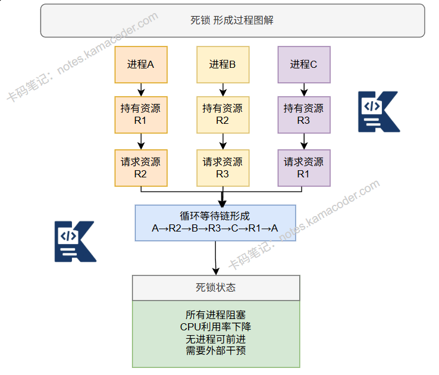

# 产生死锁的原因有什么？

> 来源: https://notes.kamacoder.com/base/deadlock-causes.html

# 产生死锁的原因有什么？

## 简要回答

死锁是指**多个进程因竞争资源而相互等待**的僵局。

必须同时满足四个条件：**互斥、持有并等待、不可抢占、循环等待**

## 专业回答

死锁产生的四个必要条件

**互斥条件**：资源是**独占**的，**一次只能被一个进程使用**，

**持有并等待**：进程**已持有资源**，同时**等待其他资源**，

**不可抢占**：进程**持有的资源不能被强制剥夺**，

**循环等待**：**存在**进程-资源的**循环等待链**

具体原因分析

**资源竞争**：多进程争用有限资源，
**推进顺序不当**：进程执行顺序不合理，
**资源分配策略问题**：缺乏预防和避免机制，
**程序设计缺陷**：未考虑资源获取顺序

## 代码示例

中断处理示示例

```
#include <iostream>
#include <thread>
#include <mutex>
#include <chrono>

std::mutex mutex1, mutex2;

// 线程1：先锁mutex1，再锁mutex2
void thread1_func() {
    std::unique_lock<std::mutex> lock1(mutex1);
    std::cout << "线程1获得锁1，等待锁2..." << std::endl;

    std::this_thread::sleep_for(std::chrono::milliseconds(100)); // 增加死锁概率

    std::unique_lock<std::mutex> lock2(mutex2);
    std::cout << "线程1获得锁1和锁2" << std::endl;
}

// 线程2：先锁mutex2，再锁mutex1
void thread2_func() {
    std::unique_lock<std::mutex> lock1(mutex2);
    std::cout << "线程2获得锁2，等待锁1..." << std::endl;

    std::this_thread::sleep_for(std::chrono::milliseconds(100));

    std::unique_lock<std::mutex> lock2(mutex1);
    std::cout << "线程2获得锁1和锁2" << std::endl;
}

int main() {
    std::thread t1(thread1_func);
    std::thread t2(thread2_func);

    t1.join();
    t2.join();

    std::cout << "程序结束" << std::endl;
    return 0;
}

```


解锁方案实例

```
// 解决方案示例：按固定顺序获取锁
#include <iostream>
#include <thread>
#include <mutex>

std::mutex mutex1, mutex2;

// 解决方案：统一获取锁的顺序
void safe_thread1_func() {
    // 总是先获取mutex1，再获取mutex2
    std::lock(mutex1, mutex2); // 同时锁定，避免死锁
    std::lock_guard<std::mutex> lock1(mutex1, std::adopt_lock);
    std::lock_guard<std::mutex> lock2(mutex2, std::adopt_lock);

    std::cout << "线程1安全地获得两把锁" << std::endl;
}

void safe_thread2_func() {
    // 同样先获取mutex1，再获取mutex2
    std::lock(mutex1, mutex2);
    std::lock_guard<std::mutex> lock1(mutex1, std::adopt_lock);
    std::lock_guard<std::mutex> lock2(mutex2, std::adopt_lock);

    std::cout << "线程2安全地获得两把锁" << std::endl;
}

int main() {
    std::thread t1(safe_thread1_func);
    std::thread t2(safe_thread2_func);

    t1.join();
    t2.join();

    std::cout << "安全结束" << std::endl;
    return 0;
}

```


## 知识拓展

死锁处理策略

1.预防：**破坏四个必要条件**之一2.避免：**银行家算法**，安全序列检测3.检测：**资源分配图检测环路** 4.恢复：**终止进程**或**剥夺资源**

常见死锁场景

**数据库**：事务锁定顺序不一致，**操作系统**：打印机和磁带机分配，
**多线程**：锁顺序不一致，
**分布式系统**：多个节点相互等待

资源分配图

圆形：进程，
方形：资源，
资源→进程：分配边，
进程→资源：请求边，
检测环路判断死锁，

  - 知识图解



  - 适用场景

**数据库系统**

事务A锁定行1等待行2

事务B锁定行2等待行1

解决方案：两阶段锁定协议

**操作系统资源管理**

进程1持有打印机请求扫描仪

进程2持有扫描仪请求打印机

解决方案：资源有序分配

**多线程编程**

线程A：lock(m1)→lock(m2)

线程B：lock(m2)→lock(m1)

解决方案：锁层次结构

  - 面试官很能追问

Q1：如何避免死锁？

A1：
预防：破坏四个条件

破坏互斥：某些资源可共享（如只读文件）

破坏持有并等待：一次申请所有资源

破坏不可抢占：允许资源抢占

破坏循环等待：资源按序申请

避免：银行家算法，预判是否安全

检测与恢复：定期检测环路，强制剥夺资源

Q2：银行家算法原理是什么？

A2：模仿银行家放贷，进程声明最大需求，系统检查分配后是否仍能找到一个安全序列（所有进程都能完成）。

需要四个数据结构：可用资源、最大需求、已分配、需求矩阵。

Q3：实际开发中如何预防死锁？

A3：
锁顺序：所有线程按相同顺序获取锁

锁超时：尝试获取锁设置超时

锁粒度：尽量减小锁范围

无锁编程：使用原子操作或无锁数据结构

层级锁：定义锁的获取层级

Q4：死锁和活锁有什么区别？

A4：
死锁：进程阻塞，什么都不做

活锁：进程在运行，但无法进展（如两人相向而行，不断让路）

饥饿：进程长期得不到资源，但有进展可能
