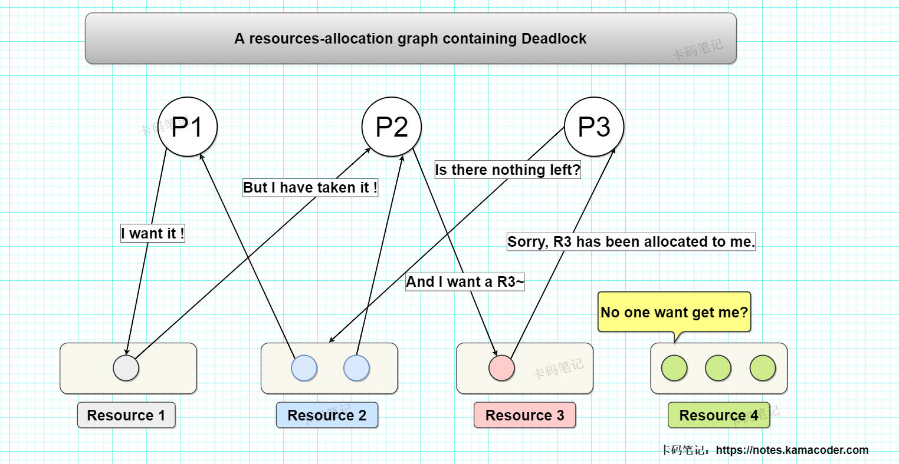

# 什么是死锁？如何避免死锁？

> 来源: https://notes.kamacoder.com/base/deadlock-avoidance.html

# 什么是死锁？如何避免死锁？

## 简要回答

### 死锁的概念：

  1. **死锁的定义**：

    - **死锁**是指多个进程或线程在执行过程中，因为竞争资源而造成的一种互相等待的现象，导致这些进程或线程都无法继续执行。

   2. **死锁的原因**：

    - 资源竞争、进程推进顺序不当。

   3. **死锁产生的必要条件**：

    - ①互斥条件、②请求和保持条件、③不可抢占条件、④循环等待条件。

### 如何预防死锁

  1. **破坏互斥条件** ：允许资源被多个进程或线程共享。
   2. **破坏请求和保持条件** ：进程或线程在请求资源时，必须释放已持有的资源。
   3. **破坏不可抢占条件** ：允许系统抢占进程或线程持有的资源。
   4. **破坏循环等待条件** ：对资源进行排序，进程或线程按顺序请求资源。

## 详细回答

### 死锁的概念：

  1. **死锁的定义**：

    - 死锁是指多个进程或线程在执行过程中，因为**竞争资源**而造成的一种**互相等待**的现象，导致这些进程或线程都无法继续执行。

   2. **死锁的原因**：

    - **资源竞争**：多个进程或线程竞争有限的资源。
     - **进程推进顺序不当**：进程或线程的推进顺序不合理，导致互相等待。

   3. **死锁产生的必要条件**：

    - **互斥条件**：资源**一次只能被一个**进程或线程占用。
     - **请求和保持条件**：进程或线程在**持有**资源的**同时，又请求**其他资源。
     - **不可抢占条件**：进程或线程持有的资源不能被其他进程或线程抢占，只能由该进程**主动**释放。
     - **循环等待条件**：存在一个进程或线程的**循环等待链**，每个进程或线程都在等待下一个进程或线程持有的资源。

### 如何预防死锁？

  1. **破坏互斥条件**：

    - 允许资源被多个进程或线程共享，避免资源独占。
     - eg：只读文件可以被多个进程同时访问。

   2. **破坏请求和保持条件**：

    - 进程或线程在请求资源时，必须释放已持有的资源。
     - eg：使用一次性分配策略，进程或线程在开始执行前请求所有需要的资源。

   3. **破坏不可抢占条件**：

    - 允许系统抢占进程或线程持有的资源。
     - eg：当进程或线程请求资源失败时，系统可以抢占其已持有的资源。

   4. **破坏循环等待条件**：

    - 对资源进行排序，进程或线程按顺序请求资源。
     - eg：为资源编号，进程或线程只能按编号递增的顺序请求资源。

## 知识拓展

  -

有死锁的资源分配图，如下所示：
 

   -

**死锁的处理方法**：

    1. **死锁预防（Deadlock Prevention）**：

死锁预防是通过破坏死锁产生的必要条件来避免死锁的发生。具体方法包括：
 **破坏互斥条件**（允许资源被多个进程共享，如只读文件）、
 **破坏请求和保持条件**（要求进程在请求资源时释放已持有的资源，或采用一次性分配策略）、
 **破坏不可抢占条件**（允许系统抢占进程持有的资源，如强制回收资源）、
 **破坏循环等待条件**（对资源进行排序，进程按顺序请求资源）。

这些方法通过限制资源分配的方式，从根本上避免死锁的发生。
     2. **死锁避免（Deadlock Avoidance）**：

死锁避免是通过**动态**检查资源分配状态，确保系统不会进入不安全状态。最经典的算法是**银行家算法**，它要求每个进程声明其最大资源需求，系统在分配资源前检查是否存在**安全序列**（即是否存在**一种资源分配顺序，使得所有进程都能顺利完成**）。如果存在安全序列，则分配资源；否则拒绝分配。死锁避免的优点是不需要限制资源分配，但需要预先知道进程的资源需求，且计算开销较大。
     3. **死锁检测（Deadlock Detection）**：

死锁检测不需要事先采取任何限制性措施，并**允许死锁的出现**。通过定期检查系统中的进程和资源状态，检测是否存在死锁。常用的方法包括**资源分配图**和**定期检测算法**。资源分配图通过检查是否存在环路来判断死锁；定期检测算法则通过模拟资源分配过程，检查系统是否处于死锁状态。死锁检测的优点是不需要限制资源分配，但检测过程会消耗系统资源，且检测到死锁后需要进一步处理。
     4. **死锁解除（Deadlock Recovery）**：

死锁解除是在检测到死锁后，采取措施恢复系统的正常运行。常用的方法包括**终止进程**和**资源抢占**。
 终止进程是指选择一个或多个死锁进程终止，释放其持有的资源；
 资源抢占是指强制回收一个或多个死锁进程持有的资源，分配给其他进程。

选择终止或抢占的进程时，通常会考虑进程的优先级、运行时间、资源占用情况等因素，以最小化对系统的影响。
