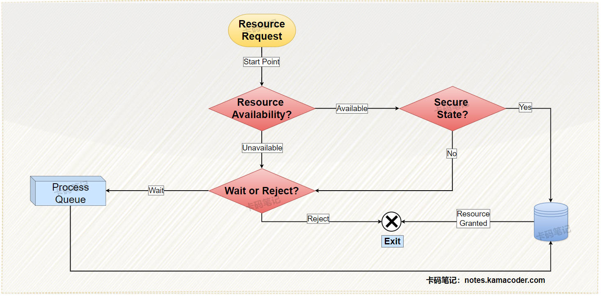
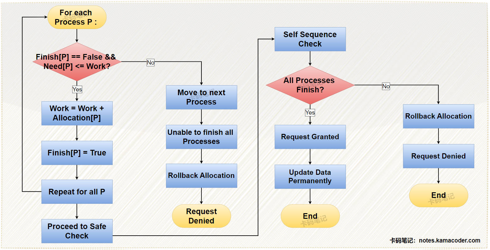
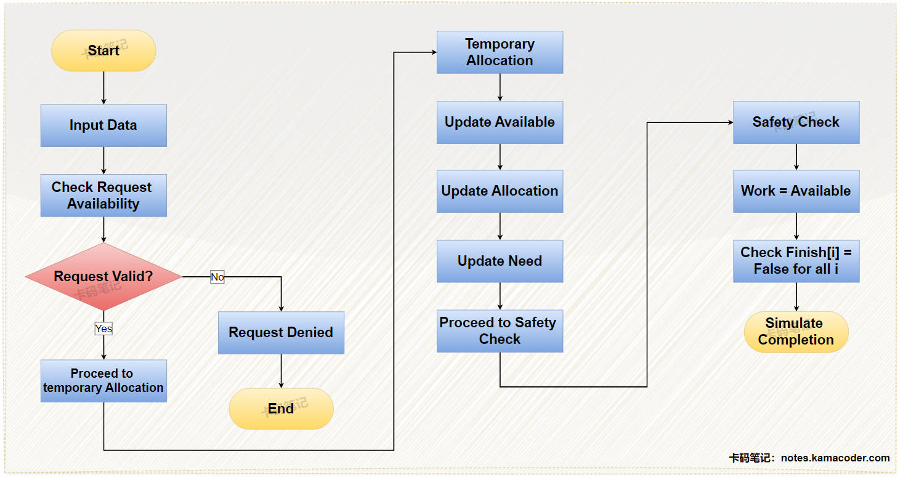

# 什么是银行家算法，它是如何解决死锁问题的？

> 来源: https://notes.kamacoder.com/base/bankers-algorithm.html

# 什么是银行家算法，它是如何解决死锁问题的？

## 简要回答

  1. **银行家算法的概念**：

    - **银行家算法**是一种用于**动态资源分配**的死锁避免算法，由荷兰科学家 **Dijkstra** 提出。其核心思想是：**对于每次资源申请，系统都要实时判断其是否有死锁风险，如果存在风险，就拒绝该申请；仅在资源分配后系统仍处于安全状态时，才允许分配资源**，从而**避免死锁**。

   2. **银行家算法的实现**：

    - **安全状态检查**：每次分配资源前，模拟分配后的系统状态，判断系统是否存在一个 **安全序列**（所有进程能按顺序获得所需资源并完成）。
     - **动态决策**：若安全状态成立，则正式分配资源；若无法找到安全序列，则拒绝资源请求，防止系统进入可能导致死锁的状态。

## 详细回答

  1. **银行家算法的概念**：

    - **银行家算法**是一种用于**动态资源分配**的死锁避免算法，由荷兰科学家 **Dijkstra** 提出。其核心思想是：**对于每次资源申请，系统都要实时判断其是否有死锁风险，如果存在风险，就拒绝该申请；仅在资源分配后系统仍处于安全状态时，才允许分配资源**，从而**避免死锁**。

   2. **银行家算法的实现**：

    - 每次有新进程进入系统时，进程必须提前声明运行周期中可能需要的每一类资源的最大单位数目，该单位数目不得超过系统拥有的资源总数。
     - 当一个进程实际请求一组资源时，银行家算法会对请求进行检查，系统必须首先确定是否有足够的资源可以分配给该进程。
     - 如果当前系统资源充足，它就会计算将这些资源分配给该进程是否会使系统进入不安全状态。如果该分配安全，则将资源分配给该进程；否则，暂时不批准这一资源请求。

   3. **银行家算法的数据结构**：

    - 系统可用资源向量`Available[m]`：表示系统中每种资源的可用数量，随着系统资源分配与回收情况的变动而动态变化。
     - 最大需求矩阵`Max[n][m]`：表示系统中 n 个进程中每个进程对 m 类资源的最大需求量。
     - 分配矩阵`Allocation[n][m]`：表示当前每个进程占有的各类资源数量。
     - 需求矩阵`Need[n][m]`：表示进程完成任务还需要每种资源的数量；`Need[i][j] = Max[i][j] - Allocation[i][j]`。

   4. **银行家算法的思想**：

    -

设Request i 为进程 Pi 的请求向量，当 Pi 申请一个资源时，系统进行以下检查：
① 如果 `Request i <= Need[i][j]`，则进入步骤 ②；否则说明进程所需要的资源数量已经超过了它所申报的最大需求数量，请求失败。
② 如果 `Request i <= Available[j]`，则进入步骤 ③；否则说明系统还没有足够的空闲资源，进程 Pi 必须等待。
③ 系统试图为进程 Pi 分配资源，并更新以下数据结构中的值：

```
Available[j] = Abailable[j] - Request i [j];
Allocation[i][j] = Allocation[i][j] + Request i [j];
Need[i][j] = Need[i][j] - Request i [j];

```


④ 系统通过**安全性算法**检查为该进程分配资源后，是否仍处于安全状态。如果系统是安全的，资源就被正式分配给进程 Pi；否则，终止分配，系统回退到原来的资源分配状态，并让进程 Pi 继续等待。

   5. **银行家算法的安全性检查**：

    -

① 定义两个向量：**工作向量Work[m]** 表示系统中可用于维持进程运行的各类资源的数量，在安全性算法执行前，令 Work = Available；**Finish[n]** 表示系统中是否有足够的资源分配给该进程，以使其运行完毕，初始化 **Finish[i] = FALSE**，当有足够的空闲资源分配给进程 Pi 时，令**Finish[i] = TRUE**。

     -

② 在进程集合中找到一个进程，使其满足条件——`Finish[i] == FALSE && Need[i][j] ≤ Work[j]`，如果能找到，则执行步骤 ③，否则执行步骤 ④。

     -

③ 若进程满足步骤 ② 中的条件，说明当进程 Pi 被分配资源后，它可以顺利运行完毕，并释放其占有的资源，以供其他进程使用，这时应该执行如下指令：

```
Work[j] = Work[j] + Allocation[i][j];
Finish[i] = TRUE;
继续进行步骤 ② (循环执行步骤2，直到所有进程都满足 Finish[i] == TRUE，或者其中一个进程不满足步骤2中的判断条件);

```


     -

④ 如果 **Finish[i] == TRUE** 对于进程集合中的每个进程都满足，说明系统处于安全状态，允许此次资源分配；否则，系统处于不安全状态。

## 知识拓展

### 三图胜三千言

  - 银行家算法的**核心思想**，如下图所示：


   - 银行家算法的**安全性检查算法**，如下图所示：


   - 银行家算法的**整体执行流程**，如下图所示：


### 银行家算法的优缺点

  1. **优点**：

    - 严格避免死锁，保证系统安全。
     - 资源利用率高于死锁预防策略（如一次性分配）。

   2. **缺点**：

    - **静态需求假设**：进程需预先声明最大资源需求，现实中难以动态调整。
     - **计算开销大**：每次请求需遍历所有进程，时间复杂度为 O(n²)。
     - **不适用于不可抢占资源**：如打印机、独占设备。
