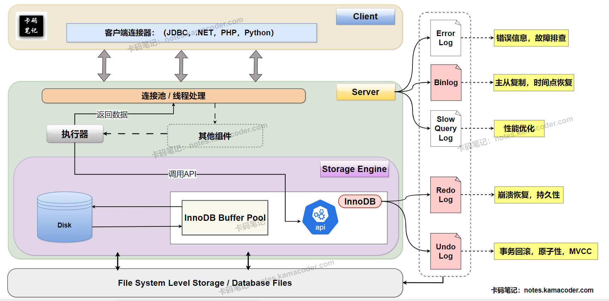

# MySQL日志文件有哪几种？

> 来源: https://notes.kamacoder.com/base/mysql-log-files.html

# MySQL日志文件有哪几种？

## 简要回答

  1. **错误日志 (Error Log)：** 记录 MySQL 服务器启动、运行和关闭过程中的错误、警告和通知信息，用于故障排查。
   2. **二进制日志 (Binary Log / binlog):** 记录所有对数据库的逻辑修改，用于数据复制和时间点恢复。
   3. **慢查询日志 (Slow Query Log):** 记录执行时间超过阈值的 SQL 语句，用于性能优化。
   4. **中继日志 (Relay Log):** 在主从复制中，从库存储主库 binlog 的文件，用于从库回放同步数据。
   5. **InnoDB 存储引擎特有的日志：**
    - **重做日志 (Redo Log):** 记录数据页的物理或逻辑修改，用于保证事务持久性和崩溃恢复。
     - **回滚日志 (Undo Log):** 记录事务旧版本数据，用于事务回滚和 MVCC。

## 详细回答

  1. **错误日志 (Error Log)：**
    - 错误日志是 MySQL 服务器**最重要**的诊断日志，记录了服务器生命周期中的关键事件，包括服务器的启动和关闭过程、运行期间发生的严重错误（如崩溃）、警告信息（如配置问题）以及一些通知信息。
     - 通过查看错误日志，可以快速定位 MySQL 服务器的故障原因，是**排查数据库系统级别问题**的第一手资料。
     - 日志文件的位置通常在 MySQL 数据目录下，文件名默认为 `hostname.err`。

   2. **二进制日志 (Binary Log / binlog):**
    - Binlog 是 MySQL **Server层** 的日志，具体有三种格式：Statement、Row 和 Mixed，该记录了所有对数据库进行**更改**的逻辑操作，例如 INSERT、UPDATE、DELETE 语句(DML)。
     - Binlog 的**主要用途**是实现 MySQL 的**主从复制**，主库将 Binlog 发送给从库，从库通过回放 Binlog 中的事件来实现数据同步。
     - 此外，Binlog 也用于数据库的 **时间点恢复 (Point-in-Time Recovery)** ，可以将数据库恢复到过去的任意一个时间点。

   3. **慢查询日志 (Slow Query Log):**
    - 慢查询日志记录所有**执行时间超过预设阈值**（由 `long_query_time` 参数控制，单位为秒）的 SQL 语句。默认情况下，慢查询日志**不会记录不使用索引的查询**
     - 慢查询日志是进行数据库**性能优化**的关键工具，通过分析慢查询日志，可以找出那些执行效率低下的 SQL 语句，进而进行索引优化、SQL 重写或数据库结构调整，从而提升整体性能。
     - 慢查询日志可以通过 **`slow_query_log`** 参数**开启**，并通过 **`slow_query_log_file`** 参数**指定日志文件路径**。

   4. **中继日志 (Relay Log):**
    - 中继日志是 MySQL **主从复制**架构中的一个重要组件，存在于**从库**上。
     - 从库的 I/O 线程从**主库**读取 Binlog 事件后，会将其写入中继日志文件。然后，从库的 **SQL 线程**会读取中继日志中的事件，并在从库上执行这些操作，从而保持从库与主库的数据同步。
     - 中继日志是**临时文件**，当其中的事件被 SQL 线程执行完毕后，可以被清除。

   5. **InnoDB 存储引擎特有的日志：**

InnoDB 存储引擎为了保证事务的 ACID 特性，拥有自己的日志系统，其中最重要的是 Redo Log 和 Undo Log。

    - **重做日志 (Redo Log):**

① Redo Log 记录了事务对数据页所做的**物理或逻辑修改**。它的主要作用是保证事务的**持久性**。

② 当事务**提交后**，即使数据还没有完全写入磁盘，Redo Log 已经记录了这些修改。在**系统崩溃**后，MySQL 重启时可以通过 Redo Log 来重做（Redo）那些已经提交但未完全写入磁盘的事务，确保数据不丢失。
     - **回滚日志 (Undo Log):**

① Undo Log 记录了事务执行过程中**数据的旧版本**。它的主要作用是保证事务的**原子性**。

② 当事务需要回滚时，可以通过 Undo Log 来**撤销**（Undo）已经执行的操作，将数据**恢复**到事务开始之前的状态。

③ 此外，Undo Log 也是实现 InnoDB **MVCC (多版本并发控制)** 的关键机制，因为它提供了数据的历史版本，使得读操作可以不阻塞写操作。

## 知识拓展

  1.

**MySQL 日志文件在架构中的位置与作用**，示意图如下：
 

   2.

**面试官可能的追问1：Redo Log 和 Binlog 有什么区别？**

    - **简答：** Redo Log 是 **InnoDB 存储引擎特有**的日志，记录的是**物理或逻辑上的数据页修改**，主要用于**崩溃恢复**，保证事务的**持久性**。Binlog 是 **MySQL 服务器层**的日志，记录的是**逻辑上的 SQL 语句或行修改**，主要用于**复制和时间点恢复**。Redo Log 是循环写入的，而 Binlog 是追加写入的。

   3.

**面试官可能的追问2：Undo Log 在 MVCC 中是如何工作的？**

    - **简答：** 在 MVCC 中，当一个事务修改数据时，并不会直接覆盖旧数据，而是将旧数据写入 Undo Log。Undo Log 中会记录数据的多个版本。当一个读事务访问数据时，如果该数据正在被其他事务修改，读事务可以通过 Undo Log 读取到该数据在它开始时的版本，从而实现**非阻塞的读操作**，保证了读的**隔离性**。

   4.

**面试官可能的追问3：如何开启和查看慢查询日志？**

    - **简答：** 可以通过修改 MySQL 配置文件 (`my.cnf` 或 `my.ini`) 或使用 SQL 命令来开启慢查询日志。在配置文件中设置 `slow_query_log = 1` 开启，`slow_query_log_file = /path/to/slow_query.log` 指定日志文件路径，`long_query_time = N` 设置阈值（N 为秒数）。开启后，执行时间超过 N 秒的查询就会被记录到指定的文件中。查看日志文件可以直接使用文本编辑器，或者使用 `mysqldumpslow` 等工具进行分析。
