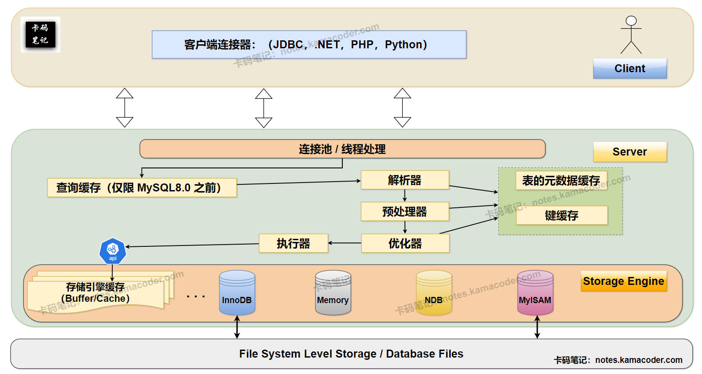
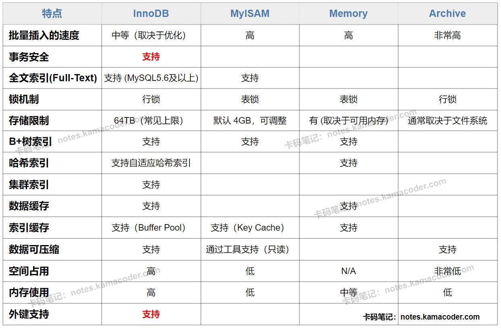

# MySQL的执行引擎有哪些？

> 来源: https://notes.kamacoder.com/base/mysql-storage-engines.html

# MySQL的执行引擎有哪些？

## 简要回答

  1. **InnoDB：** MySQL **默认**的事务性存储引擎，**支持 ACID 事务、行级锁定和外键**，适用于大多数需要数据一致性和高并发的场景。
   2. **MyISAM：** **非事务性**存储引擎，支持表级锁定，读取速度快，适用于读多写少、不需要事务支持的应用。
   3. **Memory：** 数据存储在**内存**中，**速度极快，但数据易失**，适用于临时表或缓存。
   4. **Archive：** 用于存储大量归档数据，**支持高速插入**，但查询性能差，**不支持索引**。

## 详细回答

  1. **InnoDB：**
    - InnoDB 是MySQL **默认**的事务性存储引擎，其核心优势在于对 **ACID 事务**的完整支持，这确保了在高并发环境下数据操作的**原子性、一致性、隔离性和持久性**。
     - InnoDB 采用了**行级锁定**机制，能够最大程度地减少并发写入时的锁冲突，提高系统的并发处理能力。
     - 此外，InnoDB 还支持**外键约束**，有助于维护数据之间的参照完整性，并通过 **redo log 和 undo log** 实现了可靠的**崩溃恢复**能力，保证数据在意外停机后的不丢失和一致性。
     - InnoDB 引擎内部的**缓冲池**机制也能有效地缓存数据和索引，提升读写性能。因此，InnoDB 适用于有**高并发、事务支持和数据完整性**需求的应用场景。

   2. **MyISAM：**
    - 与 InnoDB 不同，MyISAM 是一个**非事务性**的存储引擎，它**不支持 ACID 事务**，这意味着在并发写入或系统崩溃时，数据的一致性无法得到保证。它同样也**不支持外键约束**。
     - MyISAM 采用了**表级锁定**，即当一个写操作发生时，会锁定整个表，这在**高并发**写入场景下会导致严重的性能瓶颈。
     - MyISAM 的主要特点是其**读取速度快**，因为它将数据和索引分开存储，并且结构相对简单。
     - 然而，由于**缺乏事务支持和行级锁定**，MyISAM 更适用于**读多写少**、对数据一致性要求不高的简单应用，例如一些只读的报表查询或日志记录。

   3. **Memory：**
    - Memory 引擎将所有数据存储在**内存**中，因此具有**极高的读写速度**。
     - 然而，其最大的缺点是数据的**易失性**，一旦 MySQL 服务器关闭或重启，存储在 Memory 引擎中的数据将会全部丢失。
     - Memory 引擎支持**表级锁定**，这个引擎通常是用于创建**临时表**，或者缓存一些**频繁访问且数据量不大**、**对持久性要求不高**的临时数据，以加速查询。

   4. **Archive：**
    - Archive 引擎主要用于存储 **大量** **不经常访问的归档数据**。
     - 它最大的特点是对数据进行**高度压缩**，能够显著节省存储空间。
     - Archive 引擎支持**高速的数据插入**，但其**查询性能非常差**，通常只能进行全表扫描，并且**不支持索引**。因此，它适用于那些只需要将数据写入并长期保存，而对查询性能要求不高的场景，例如存储历史日志或传感器数据。

## 知识拓展

  1. **MySQL 架构概览与存储引擎位置**，示意图如下：
 

   2. **四种主流存储引擎的对比**，如下图所示：
 

   3. **面试官可能的追问1：InnoDB 和 MyISAM 在锁定机制上的主要区别是什么？**
    - **简答：** InnoDB 采用**行级锁定**，只锁定需要修改的行，可以有效减少锁冲突，提高并发性能。而 MyISAM 使用**表级锁定**，当进行写操作时会锁定整个表，导致其他写操作必须等待，在高并发写入时性能较差。

   4. **面试官可能的追问2：为什么 InnoDB 更适合高并发写入的场景？**
    - **简答：** InnoDB 的**行级锁定**是其在高并发写入场景下表现优异的关键。它允许多个事务同时修改表中的不同行，互不影响，从而最大限度地提高了系统的并行处理能力，避免了 MyISAM 表级锁定导致的写操作串行化问题。

   5. **面试官可能的追问3：在选择存储引擎时，除了事务和并发，还需要考虑哪些因素？**
    - **简答：** 除了事务支持和并发性能，还需要综合考虑**数据量大小**（Memory 引擎不适合大数据量）、**读写比例**（读多写少可考虑 MyISAM，写多读少或读写均衡通常选择 InnoDB）、**是否需要外键约束**（MyISAM 不支持）、**崩溃恢复能力**（InnoDB 具有更好的恢复机制）以及**特定的功能需求**（如 Archive 用于归档，Memory 用于缓存）来选择最适合的存储引擎。
