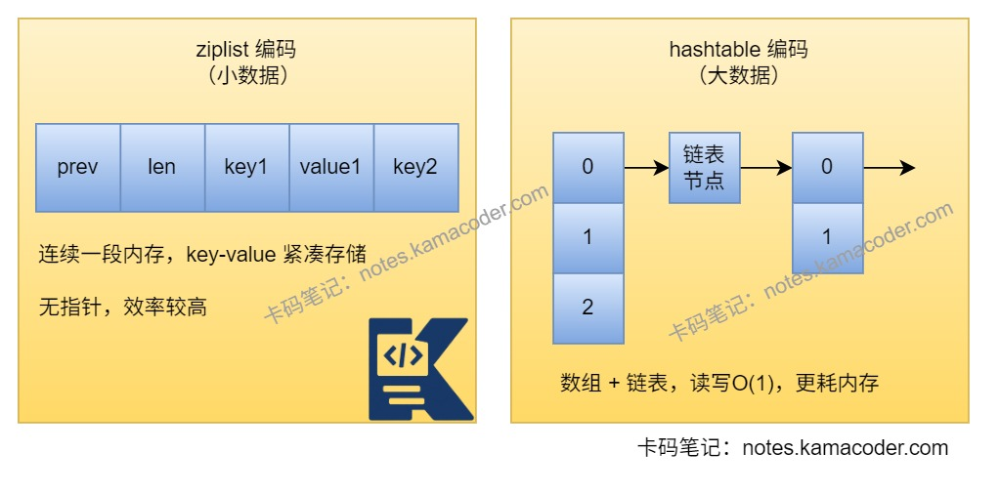

# Redis常见的数据结构有哪些？

> 来源: https://notes.kamacoder.com/base/redis-data-structures.html

# Redis常见的数据结构有哪些？

## 简要回答

  - Redis 最常见的数据结构有 `String`、`Hash`、`List`、`Set`、`ZSet`，如果再往后扩展，还有 `Stream`、`Bitmap`、`HyperLogLog` 和 `Geospatial`。前五种核心结构覆盖了 Redis 大部分业务场景。
   - `String` 适合缓存单值、计数器和分布式锁；`Hash` 适合存对象；`List` 适合消息队列和最新列表；`Set` 适合去重和交并集；`ZSet` 适合排行榜和延迟任务；`Stream` 适合消息流和消费者组。

## 详细回答

  1. String

    -

`String`是 Redis 最基础、最常用的数据结构，本质上是一段二进制安全的字符串，最大可存储 `512MB`。

底层实现通常使用 SDS（简单动态字符串），相比 C 原生字符串更方便记录长度，也能减少缓冲区溢出问题。

     -

典型场景：

      1. 缓存单个对象或 JSON 字符串
       2. 计数器，如点赞数、阅读量
       3. 分布式锁，如 `set key value nx ex 10`
       4. `Bitmap`、`HyperLogLog` 的底层也都和 `String` 有关

   2. Hash

    - `Hash` 是 field-value 结构，一个key可以对应多个field，一个field对应一个value；适合存储对象的多个属性。外层的哈希使用HashTable实现，底层存储hash数据类型时会根据数据量选择更紧凑的编码ziplist或哈希表，大对象场景下通常会转成哈希表结构。
     - 典型场景：用户信息：`name`、`age`、`phone`；商品信息、配置项等。
     - 优点是可以只更新对象中的某个字段，不需要整块重写。

   3. List

    -

`List` 是有序、可重复的字符串列表，支持从左侧或右侧插入、弹出元素。

主流版本中 `List` 底层组织方式是 `quicklist`，兼顾链表插入删除效率和紧凑存储能力。

     -

典型场景：消息队列、最新动态列表、评论时间线等

   4. Set

    -

`Set` 是无序、元素不可重复的集合。

Redis 还支持集合间的交集、并集、差集运算，这也是Set的一个优势。

     -

典型场景：标签去重、共同好友、共同关注、抽奖名单、黑名单

     -

底层常见实现是整数集合或哈希表，具体取决于元素类型和数量。

   5. ZSet

    -

`ZSet`（有序集合）和 `Set` 一样元素不能重复，但每个元素都带有一个 `score`，Redis 会按分值排序。

底层通常会组合使用跳表和哈希表，这样既能按分值排序，也能高效定位元素。

     -

典型场景：排行榜、延迟队列、热度榜、积分榜、范围查询，如分数区间、TopN

   6. Stream

    -

`Stream` 是 Redis 提供的消息流结构，适合需要消息持久化、消费位点、消费者组的场景。

相比 `List`，`Stream` 在消息确认、重复消费控制、消费者组方面更完整。

     -

典型场景：消息队列、异步削峰、订单、日志流水

   7. 特殊结构

    - `Bitmap`：本质上是对 `String` 的位操作，适合签到、在线状态、活跃标记。
     - `HyperLogLog`：适合做海量 UV 去重统计，优点是内存占用小，缺点是有一定误差。
     - `Geospatial`：适合做附近的人、附近门店，本质能力建立在有序集合之上。

## 知识图解

  1. Redis 数据结构选型

| 需求场景  推荐结构  原因
| 缓存单值、Token、计数器  `String`  简单直接，命令丰富
| 存对象属性  `Hash`  支持按字段读写，节省更新成本
| 最新消息、任务队列  `List`  支持双端操作
| 去重、共同关系  `Set`  元素唯一，支持交并差集
| 排行榜、延迟队列  `ZSet`  可排序，可按分值范围查询
| 消息流、消费者组  `Stream`  支持消息 ID 和消费组
  1. Redis Hash的两种编码方式示意


## 代码示例

```
SET user:1:name "tom"
INCR article:1001:view_count

# Hash
HSET user:1 name "tom" age 20 city "shanghai"
HGET user:1 name

# List
LPUSH order:queue 1001 1002 1003
RPOP order:queue

# Set
SADD tag:java user:1 user:2 user:3
SISMEMBER tag:java user:2

# ZSet
ZADD rank:game 100 user:1 95 user:2 88 user:3
ZREVRANGE rank:game 0 2 WITHSCORES

# Stream
XADD stream:order * orderId 1001 status created
XREAD COUNT 1 STREAMS stream:order 0

```


## 知识扩展

  1. 面试官可能追问：

  - Q1：Redis 为什么不用 C 原生字符串，而是使用 SDS？

    - 因为 SDS 会额外记录字符串长度，获取长度是 `O(1)`；同时预留空间机制更适合频繁修改，也能避免 C 字符串常见的缓冲区溢出问题。

   - Q2：`ZSet` 为什么既要哈希表又要跳表？

    - 哈希表适合根据 member 快速定位 score，跳表适合按照 score 做有序范围查询。两者组合后，Redis 既能查得快，也能排得快。

   - Q3：`List` 和 `Stream` 都能做消息队列，怎么选？

    - 如果只是简单异步队列，`List` 就够了；如果需要消费位点、消费者组、重试和更完整的消息语义，通常更适合用 `Stream`。
