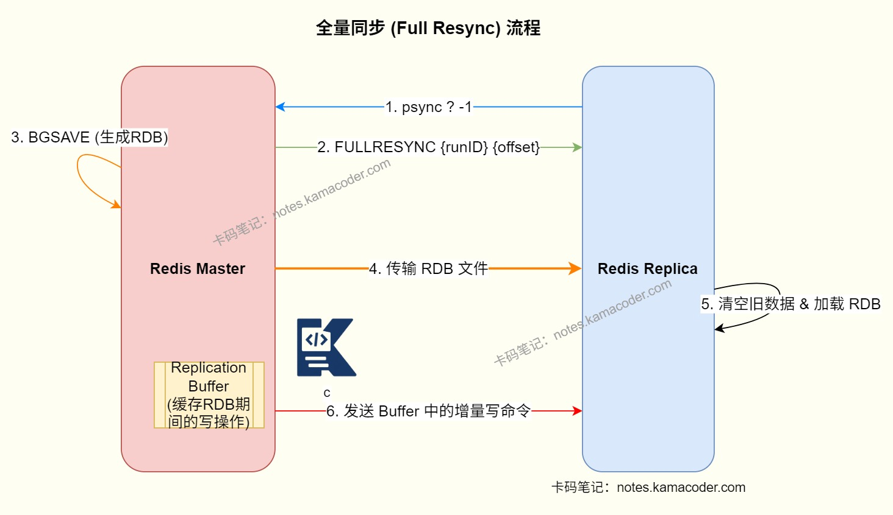
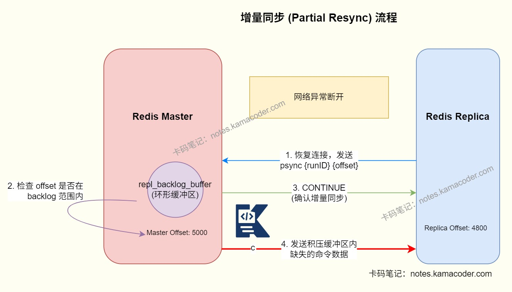

# Redis的主从同步是怎么实现的？

> 来源: https://notes.kamacoder.com/base/redis-master-slave-synchronization.html

# Redis的主从同步是怎么实现的？

## 简要回答

  - Redis 的主从同步就是从节点与主节点建立复制连接后，发送 `PSYNC` 请求，主节点根据复制 ID 和偏移量决定走**全量同步**还是**增量同步**。
   - **全量同步**一般发生在首次复制、从节点刚上线、或者增量数据已经追不上的场景中。主节点会 `BGSAVE` 生成 RDB 发给从节点，从节点加载 RDB 后，再接收这段时间积压的增量写命令。
   - **增量同步**发生在短暂断线重连场景。从节点把自己记住的 `replid` 和 `offset` 带给主节点，只要主节点的 backlog 里还保留着缺失数据，就可以直接补发，不必重新全量复制。

## 详细回答

  1.

Redis 主从同步实现了**读写分离**，让主节点负责写，从节点可以分担读的流量。同时是**高可用基础**，在哨兵和集群做故障转移时，底层都依赖复制链路。

   2.

**复制连接建立**的过程是从节点连接主节点后发送 `PING` 确认链路可用，然后发送 `REPLCONF` 上报自己的监听端口、能力等信息，最后发送 `PSYNC` 请求同步数据。

   3.

**全量同步流程：**
当从节点第一次复制，或者主节点发现无法做部分重同步时，就会走全量复制。

首先由从节点发送 `PSYNC ? -1`，表示自己没有历史复制上下文。主节点回复全量同步指令，并执行 `BGSAVE` 生成 RDB 快照。然后主节点把 RDB 文件发送给从节点。从节点清空旧数据，加载这份 RDB。

主节点在生成和发送 RDB 期间，并不会停止接收写请求，而是把新增写命令先写进复制缓冲区。RDB 发送完成后，主节点再把缓冲区里的增量命令补发给从节点。

   4.

**增量同步流程：** Redis 复制不是每次断线都全量重来，而是尽量做增量复制，它能大幅减少全量同步成本。

从节点会记录自己同步到哪个偏移量 `offset`，主节点也会维护自己的复制偏移量和一个**复制积压缓冲区** `repl_backlog_buffer`。当从节点短暂断线后重新连接，会把自己记住的 `replid + offset` 通过 `PSYNC` 发给主节点：如果主节点 backlog 里还保留着从这个 offset 之后的命令，就直接补发缺失数据。如果 backlog 已经覆盖不到了，或者复制 ID 对不上，就只能重新走全量同步。

   5.

主从同步在完成首次同步后，主节点会持续把后续写命令异步传播给从节点，这个过程也叫**命令传播**。从节点会周期性给主节点回 ACK，告诉主节点自己已经同步到哪个 offset。

Redis 还会依赖以下几个核心状态来维持复制关系：如`master_replid`是当前复制流的唯一标识，`offset`是复制数据流的位置指针，还有`repl_backlog_buffer`会用于断线重连后的增量补偿。

   6.

主从同步实现时需要注意

    - 全量同步需要 `fork` 子进程、生成 RDB、走磁盘或网络传输，对大实例会有明显开销。
     - 如果积压缓冲区太小，网络一抖动就可能追不上，导致频繁全量同步，要设置合理的backlog大小。
     - 主从复制是最终一致，不是强一致，因为复制操作是异步的，主节点写成功，不代表所有从节点已经同步完成。

## 知识图解

  1. 全量同步示意图


   2. 增量同步示意图


## 代码示例

```
REPLICAOF 192.168.1.10 6379

# 查看复制状态
INFO replication

# 首次同步时，从节点通常会发送类似请求
PSYNC ? -1

# 断线重连后，可能带着已有的 replid 和 offset 请求部分重同步
PSYNC <master_replid> <offset>

```


## 知识扩展

  1. 面试官可能追问：

  - Q1：`PSYNC` 和早期的 `SYNC` 有什么区别？

    - `SYNC` 基本只有全量复制思路，而 `PSYNC` 支持根据 `replid + offset` 做部分重同步，所以网络短暂抖动后不必每次都全量复制。

   - Q2：为什么 replication backlog 很重要？

    - 因为它决定了从节点断线重连后能不能直接补发缺失命令。如果 backlog 太小，稍微积压一点就会被覆盖，结果只能重新全量同步。

   - Q3：全量同步期间，主节点还能继续处理写请求吗？

    - 可以。主节点会继续接收写请求，只是把这段时间的新写命令临时记到复制缓冲区，等 RDB 发完后再补给从节点。

   - Q4：主从复制能保证强一致吗？

    - 不能。Redis 主从复制默认是异步的，所以主节点写成功后，从节点可能还没来得及同步完成，读取从节点时可能看到旧数据。
