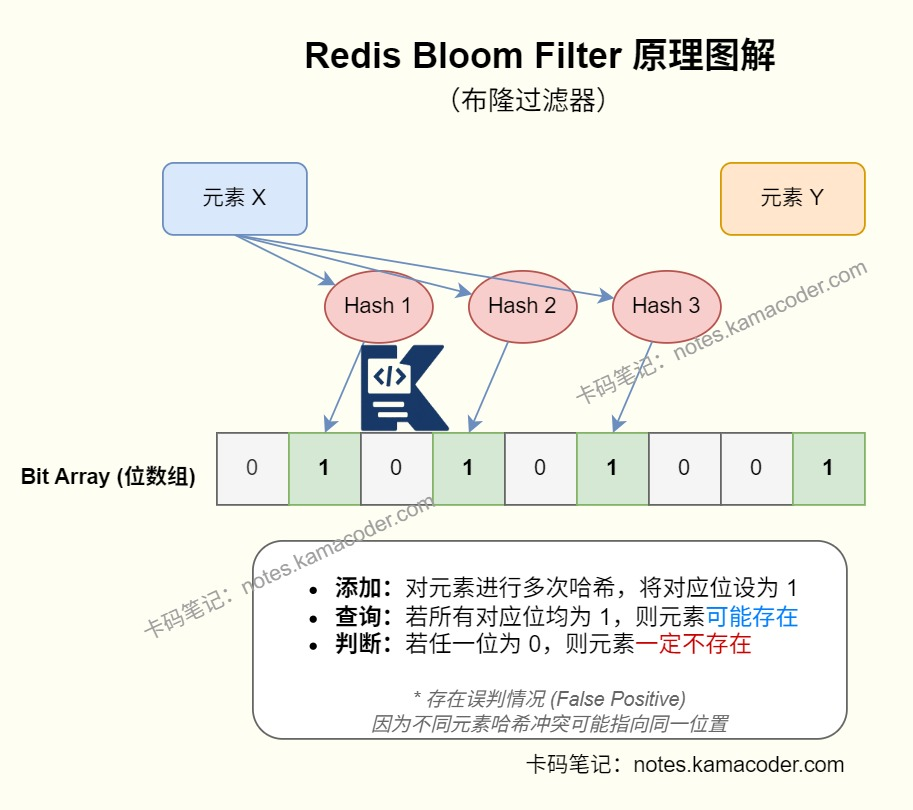

# Redis的布隆过滤器是什么？

> 来源: https://notes.kamacoder.com/base/redis-bloom-filter.html

# Redis的布隆过滤器是什么？

## 简要回答

  - 布隆过滤器（Bloom Filter）是一种**高空间效率的概率型数据结构**，用来判断一个元素“**可能存在**”或者“**一定不存在**”。它的底层核心是**位数组 + 多个哈希函数**。
   - 它能够在海量数据场景下，占用很小的内存，且查询速度很快；缺点是**可能会误判元素存在，但不会误判不存在**，而且普通布隆过滤器**不支持直接删除**。
   - 在 Redis 场景里，布隆过滤器最常见的用途是**防缓存穿透**。请求进来时先过布隆过滤器，如果判断“一定不存在”，就直接拦截，不再访问 Redis 和数据库。

## 详细回答

  1. 布隆过滤器

    - 布隆过滤器本质上不是拿来“存完整数据”的，而是拿来做**存在性判断**的。它适合回答某个用户 ID、商品 ID、订单号，是否可能在指定数据集合里。所以它常常作为缓存层、数据库层之前的一道“预过滤”。

   2. 布隆过滤器工作流程

    - 假设有一个长度为 `m` 的位数组，初始时所有 bit 都是 `0`，再准备 `k` 个不同的哈希函数。
     - **插入元素**时：先对元素执行 `k` 次哈希计算，得到 `k` 个位置后，把这些位置上的 bit 都置为 `1`。
     - **查询元素**时：同样做 `k` 次哈希计算，只要有一个位置是 `0`，就说明这个元素**一定不存在**。如果所有位置都是 `1`，说明它**可能存在**，因为这些 bit 也可能是别的元素碰巧打上的。

   3. 布隆过滤器的特点

    - **优点：**内存占用非常小，适合海量 key。查询和插入都很快，本质上是位运算。很适合放在请求入口做快速拦截。
     - **缺点：**有**误判率**，即“不存在的元素也可能被判断为存在”。且普通布隆过滤器没有直接删除能力，因为多个元素可能共用同一个 bit。

   4. 布隆过滤器典型应用

    - 缓存穿透是外部不断请求一些根本不存在的 key，这些请求既打不到缓存，也查不到数据库，最终把数据库打满。
     - 引入布隆过滤器后，请求先判断这个 key 是否“可能存在”：如果布隆过滤器判定**一定不存在**，就直接返回，不再查 Redis 和数据库。如果判定**可能存在**，再继续走缓存和数据库查询链路，这样就把大量本来就无效的请求挡在更前面了。

   5. Redis 里实现布隆过滤器有两种常见方式：
1. **RedisBloom 模块**：直接用 `BF.ADD`、`BF.EXISTS` 这类命令，使用成本最低。
2. **基于 Bitmap 自己实现**：自己维护位图和多个哈希函数，灵活但实现复杂度更高。

    - 如果团队已经用了 Redis 模块生态，RedisBloom 通常更省事；如果环境不方便安装模块，才会考虑基于 Bitmap 手工实现。

   6. 使用布隆过滤器时需要注意，布隆过滤器要根据预计元素个数和可接受误判率来初始化，否则后期误判率会明显上升；不能只建过滤器不灌数据。一般需要把数据库里的已有 key 先批量导入进去；新增数据时要同步写入布隆过滤器；如果有大量删除需求，普通布隆过滤器就不太适合了。
   7. 实际开发中，对**海量 ID 查询场景**，布隆过滤器很适合做第一层预过滤。对**普通小规模业务**，直接用“参数校验 + 缓存空值”可能已经够了，没必要引入额外复杂度。很多时候可以组合使用**参数校验 + 布隆过滤器 + 缓存空值** 。

## 知识图解

  1. 布隆过滤器的判断结果

| 判断结果  含义  能否直接当最终结果
| 某一位为 `0`  这个元素一定不存在  可以直接拦截
| 所有位都为 `1`  这个元素可能存在  不行，还要继续查缓存或数据库
  1. 布隆过滤器和缓存空值对比

| 方案  优点  缺点  适用场景
| 布隆过滤器  节省内存，适合海量 key  有误判，不适合频繁删除  海量 key 防穿透
| 缓存空值  实现简单，接入快  占缓存空间，存在短时不一致  普通业务场景
  1. 布隆过滤器示意图



## 代码示例

```

# 创建一个预计容纳 100 万元素、误判率 1% 的布隆过滤器
BF.RESERVE user:id:bf 0.01 1000000

# 新增元素
BF.ADD user:id:bf 1001
BF.MADD user:id:bf 1002 1003 1004

# 判断元素是否可能存在
BF.EXISTS user:id:bf 1001
BF.EXISTS user:id:bf 9999999

```


## 知识扩展

  1. 面试官可能追问：

  - Q1：布隆过滤器为什么会误判，但不会漏判？

    - 因为多个元素可能把同一批 bit 置为 `1`，导致一个原本不存在的元素查询时“刚好所有位都是 1”；但如果某一位是 `0`，说明这个元素一定从来没插入过，所以不会把存在的元素误判成不存在。

   - Q2：普通布隆过滤器为什么不方便删除？

    - 因为一个 bit 可能同时被多个元素共用。你删除一个元素时，如果直接把某个位清零，可能会影响其他元素的判断结果。

   - Q3：用了布隆过滤器，是不是就不需要缓存空值了？

    - 不一定。布隆过滤器适合拦截大规模不存在 key，但它有误判；缓存空值适合挡住已经打到业务层的无效查询，很多时候两者是配合使用的。

   - Q4：如果数据量持续增长，布隆过滤器会怎样？

    - 当实际元素数量明显超过设计容量后，误判率会升高。所以要么预留容量，要么做分片、扩容或重建。
