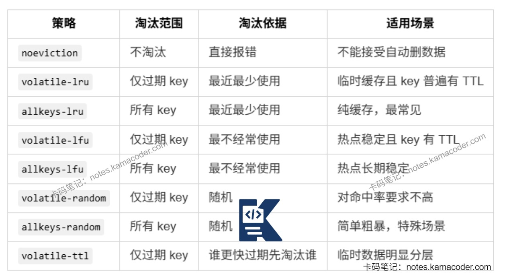

# Redis缓存满了之后的淘汰策略是什么？

> 来源: https://notes.kamacoder.com/base/redis-cache-eviction.html

# Redis缓存满了之后的淘汰策略是什么？

## 简要回答

  - 当 Redis 配置了 `maxmemory`，并且实际内存达到上限后，再执行需要申请更多内存的写命令时，就会触发内存淘汰策略。
   - Redis 的淘汰策略可以分成三类：noeviction、volatile-*和allkeys-*。`volatile-*` 只会从设置了过期时间的 key 中淘汰数据；`allkeys-*` 会从所有 key 中进行淘汰。
   - 常见策略有 `allkeys-lru`、`allkeys-lfu`、`volatile-lru`、`volatile-ttl`。如果 Redis 主要就是拿来做缓存，通常优先考虑 `allkeys-lru` 或 `allkeys-lfu`。

## 详细回答

  1. 什么情况下会触发淘汰策略

    - Redis 只有在配置了 `maxmemory` 的前提下，才会真正进入“缓存满了需要淘汰”的场景。
     - 当 Redis 使用内存达到上限后，如果再来一个写命令，需要申请更多内存，就会触发淘汰逻辑。
     - 如果配置的是 `noeviction`，Redis 不会删数据，而是直接返回 `OOM command not allowed when used memory > 'maxmemory'` 之类的错误。
     - 读操作一般不受影响，主要受影响的是新增数据、修改数据这类可能继续占用内存的命令。

   2. Redis 常见淘汰策略

    - `noeviction`：不淘汰任何数据，内存满后直接报错。适合不允许 Redis 自动删数据的场景。
     - `volatile-lru`：只在设置了过期时间的 key 中，淘汰最近最少使用的数据。
     - `allkeys-lru`：在所有 key 中，淘汰最近最少使用的数据，这是纯缓存场景最常见的选择之一。
     - `volatile-lfu`：只在设置了过期时间的 key 中，淘汰最不经常使用的数据。
     - `allkeys-lfu`：在所有 key 中，淘汰最不经常使用的数据。更适合热点分布相对稳定，希望保留高频访问数据的场景。
     - `volatile-random`：只在设置了过期时间的 key 中随机淘汰。
     - `allkeys-random`：在所有 key 中随机淘汰。
     - `volatile-ttl`：只在设置了过期时间的 key 中，优先淘汰剩余生存时间更短的 key。

   3. `volatile-*` 和 `allkeys-*` 的区别

    -

`volatile-*` 的前提是 Redis 中有足够多带过期时间的 key。

如果采用 `volatile-*` 策略，但很多 key 根本没有设置过期时间，那么可淘汰范围会很小，严重时就会出现“明明配了淘汰策略，但还是 OOM”的情况。

     -

`allkeys-*` 没有这个限制，它会从全量 key 中选择淘汰对象，所以更适合作为纯缓存实例的默认选择。

   4. LRU 和 LFU 的区别

    - `LRU`（Least Recently Used）强调“最近有没有被访问过”。
     - `LFU`（Least Frequently Used）强调“访问频率高不高”。
     - 如果热点数据访问非常集中且长期稳定，`LFU` 往往更合适；如果业务更看重“最近谁在被用”，`LRU` 通常更直观。需要注意的是，Redis 为了控制性能开销，采用的是近似 LRU/LFU，而不是严格全量排序。

   5. 实际开发中，如果是**纯缓存场景**，可以优先 `allkeys-lru` 或 `allkeys-lfu`；如果**只希望淘汰临时缓存，不希望误删持久 key**：考虑 `volatile-lru`、`volatile-lfu`；**严格不允许 Redis 自动删数据**：使用 `noeviction`；**对访问模式没有明显规律，且允许一定随机性**：可以考虑 `allkeys-random`

## 知识图解

  1. Redis 淘汰策略对比


## 代码示例

```
CONFIG SET maxmemory 200mb

# 设置淘汰策略为所有 key 中按 LRU 淘汰
CONFIG SET maxmemory-policy allkeys-lru

# 查看当前策略
CONFIG GET maxmemory
CONFIG GET maxmemory-policy

```


## 知识扩展

  1. 面试官可能追问：

  - Q1：`LRU` 和 `LFU` 应该怎么选？

    - 如果业务热点变化快，更关注“最近谁在被访问”，用 `LRU` 更直观；如果热点相对稳定，更希望保留长期高频数据，`LFU` 往往更适合。

   - Q2：为什么用了 `volatile-lru` 还是会 OOM？

    - 因为 `volatile-lru` 只能在带 TTL 的 key 中淘汰。如果很多 key 没有过期时间，Redis 就找不到足够的候选数据，最终仍然可能报错。

   - Q3：`noeviction` 模式下，读请求也会失败吗？

    - 一般不会。`noeviction` 主要影响写入类命令，读请求通常还能继续执行。
