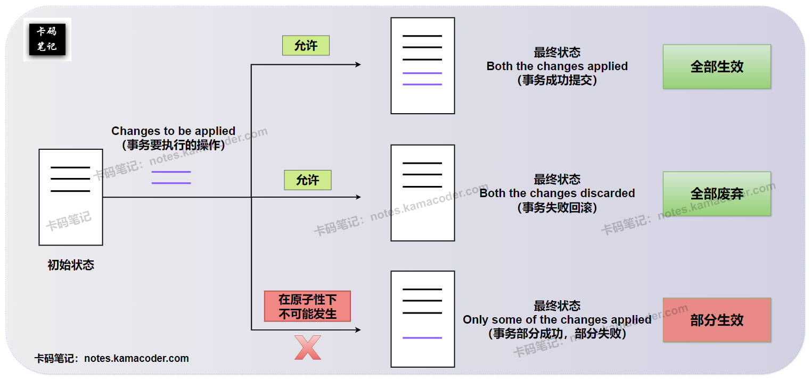
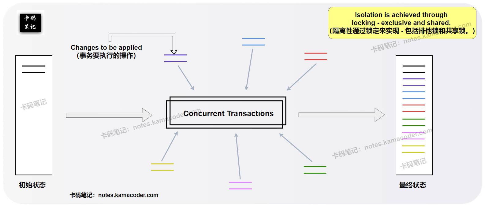
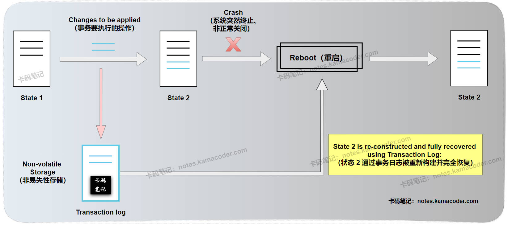

# 事务的四大特性有哪些？

> 来源: https://notes.kamacoder.com/base/acid-properties.html

# 事务的四大特性有哪些？

## 简要回答

  1. **原子性（Atomicity）** ：

    - 原子性是指事务是一个**不可分割**的工作单位，事务中的操作要么都发生，要么都不发生。

   2. **一致性（Consistency）** ：

    - 事务必须使数据库从**一个一致性状态**变换到**另一个一致性状态**。

   3. **隔离性（Isolation）** ：

    - 事务的隔离性是指，多个用户**并发**的访问数据库时，数据库为每一个用户开启的事务不能被其他事务的操作数据所干扰，**多个并发事务之间要相互隔离**。（MySQL默认的隔离级别是 REPEATABLE READ)

   4. **持久性（Durability）** ：

    - 持久性是指，一个事务一旦被提交，它对数据库中**数据的改变就是永久性的**，接下来即使数据库发生故障也不应该对其有任何影响。

## 详细回答

  1. **原子性（Atomicity）** ：

    - 原子性是指事务是一个**不可分割的最小工作单位**。事务中的所有操作要么**全部成功执行**，要么**全部失败回滚**到事务开始前的状态。
     - 这意味着事务是一个“全有 或 全无”的操作。如果在事务执行过程中发生任何错误或中断，已经执行的操作都将被撤销，数据库回到事务开始时的状态，就像这个事务从未发生过一样。
     - 原子性是事务的基础，它保证了事务的完整性。

   2. **一致性（Consistency）** ：

    - 一致性是指事务必须使数据库从**一个一致性状态**转换到**另一个一致性状态**。
     - **一致性状态**是指数据库满足所有的**完整性约束**，包括主键约束、唯一约束、外键约束、检查约束以及用户自定义的业务规则等。
     - 事务执行前数据库处于一致性状态，事务执行完毕后，无论成功提交还是失败回滚，数据库都必须**仍然处于**一致性状态。一致性是事务的**目标**，而原子性、隔离性和持久性是实现一致性的**手段**。

   3. **隔离性（Isolation）：**
    - 隔离性是指多个**并发执行**的事务之间相互**隔离**，互不干扰。
     - 每个事务都应该**感觉**自己是系统中唯一正在运行的事务，即使有其他事务同时在执行，一个事务的中间结果对其他事务也是不可见的。
     - 隔离性是用来解决**并发事务**所带来的问题，如脏读、不可重复读和幻读。数据库通过不同的**事务隔离级别**来控制并发事务之间的隔离程度，从而在数据一致性和并发性能之间进行权衡。隔离级别越高，隔离性越好，但并发性能可能越低。

   4. **持久性（Durability）：**
    - 持久性是指一个事务一旦**成功提交**，它对数据库中数据的改变就是**永久性的**，即使数据库系统发生故障（如断电、系统崩溃）或重启，这些改变也不会丢失。
     - 持久性保证了已提交事务的修改能够**可靠地**保存在数据库中。这通常是通过将已提交事务的修改写入**持久化的存储介质**，如磁盘上的数据文件和日志文件（如 Redo Log）来实现的。在数据库崩溃恢复时，可以通过日志文件来重做已提交的事务，确保数据的完整性。

## 知识拓展

  1. **事务的 原子性(A) 示意图如下**：
 

   2. **事务的 隔离性(I) 示意图如下**：
 

   3. **事务的 持久性(D) 示意图如下**：
 

   4. **面试官可能的追问1：** “你能简要说明一下 ACID 特性是如何通过数据库的底层机制来实现的吗？”

    - **简答：**

① **原子性**通常通过 **Undo Log** 实现回滚；

② **一致性**是事务的最终目标，通过原子性、隔离性和持久性以及数据库的完整性约束来保证；

③ **隔离性**通过**锁机制**和 **MVCC (多版本并发控制)** 来实现不同程度的隔离；

④ **持久性**通过 **Redo Log** 来保证已提交事务的修改不会丢失，即使数据尚未写入磁盘。

   5. **面试官可能的追问2：** “隔离性与事务隔离级别有什么关系？”

    - **简答：** 隔离性是事务的一个基本特性，而**事务隔离级别是实现隔离性的不同程度**。数据库提供了不同的隔离级别（如 Read Uncommitted, Read Committed, Repeatable Read, Serializable），允许用户根据业务需求在数据一致性和并发性能之间进行权衡。

   6. **面试官可能的追问3：** “持久性是如何保证的？如果数据库崩溃了，已提交的数据会丢失吗？”

    - **简答：** 持久性主要通过**日志文件**来保证。当一个事务提交时，它的修改会先写入 **Redo Log**。Redo Log 是持久化的，即使数据库崩溃，Redo Log 中的记录也不会丢失。在数据库重启后，可以通过重放 Redo Log 中的记录来恢复已提交的事务，从而保证已提交的数据不会丢失。
