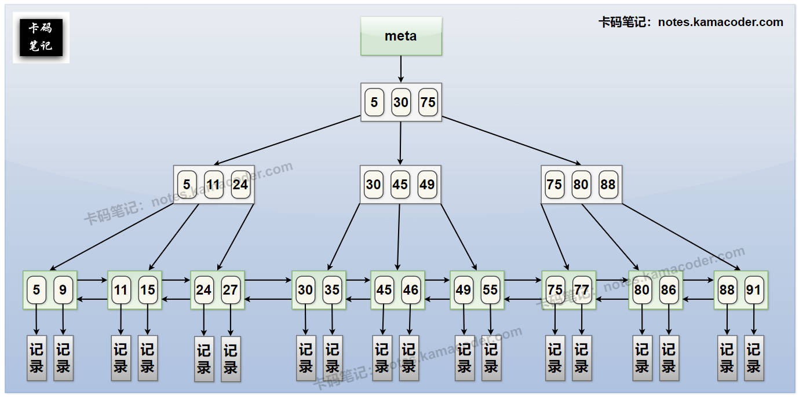
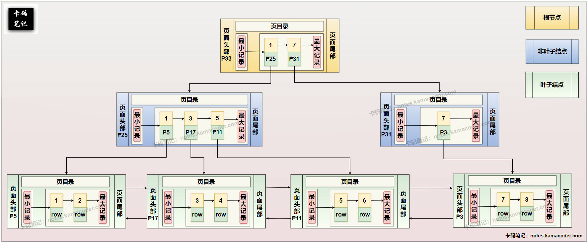

# MySQL为什么使用B+树来作索引？

> 来源: https://notes.kamacoder.com/base/mysql-b-plus-tree-index.html

# MySQL为什么使用B+树来作索引？

## 简要回答

  1. **高效的磁盘 I/O：** B+ 树的**高度低**，节点大小与磁盘页匹配，能**有效减少磁盘寻道次数**。
   2. **优化的范围查询：** 叶子节点通过**链表**连接，方便进行范围扫描。
   3. **稳定的查询性能：** 所有查询路径长度相同，查询效率稳定。
   4. **适合磁盘存储：** 非叶子节点只存索引，一个节点能存更多键，提高扇出。

## 详细回答

  1. **高效的磁盘 I/O：**
    - 数据库索引的查找过程涉及大量的磁盘 I/O 操作。B+ 树通过其**高扇出**特性，使得树的高度非常低。同时，B+ 树的节点大小通常被设计为与磁盘页的大小一致，这样一次磁盘读取就可以加载一个完整的节点，减少了磁盘的**寻道次数**。
     - B+树的**非叶子节点只存储索引键**，不存储实际数据，可以在每个节点中存储更多的键，进一步提高了扇出，降低了树的高度，从而最大限度地减少了磁盘 I/O，这是提升查询效率的关键。

   2. **卓越的范围查询性能：**
    - B+ 树的**所有叶子节点都通过链表连接**。这个特性对于数据库中常见的范围查询（例如 `WHERE price BETWEEN 100 AND 200`）非常有利。因为一旦通过索引找到范围的**起始叶子节点**，就可以沿着叶子节点链表进行**顺序遍历**，无需回溯到父节点，大大提高了范围查询的效率。相比之下，B 树由于数据分布在所有节点，进行范围查询时需要进行中序遍历，效率相对较低。

   3. **稳定的查询效率：**
    - 在 B+ 树中，**所有数据都存储在叶子节点，并且所有叶子节点都在同一层**。这意味着任何一次索引查找，从根节点到目标叶子节点的路径长度都是相同的。因此，B+ 树的查询性能相对稳定，不会出现像二叉查找树那样因数据分布不均导致的性能波动。

   4. **更适合磁盘存储和查找：**
    - 我们上面提到，B+ 树的非叶子节点只存储索引键，不存储实际数据记录。这就使得单个节点可以存储更多的索引键，从而提高了树的扇出，降低了树的高度。这种**结构**非常适合磁盘存储，因为**一次磁盘读取可以加载更多的索引信息**，减少了查找过程中需要进行的磁盘 I/O 次数。相比之下，B 树的非叶子节点也存储数据，导致每个节点存储的键更少，树的高度更高，磁盘 I/O 次数可能更多。

## 知识拓展

  1. **MySQL InnoDB的 B+树索引（主键，聚簇索引）** ， 示意图如下：
 

   2. **MySQL Innodb的 B+树索引（二级索引，非聚簇）** ，示意图如下：
 

   3. **InnoDB 存储引擎在页面 (Page) 级别实现的 B+ 树索引结构**，示意图如下：
 

   4. **面试官可能的追问1：B+ 树和 B 树在结构上最主要的区别是什么？**
    - **简答：** 最主要的区别在于**数据存储位置**和**叶子节点连接**。B 树的非叶子节点和叶子节点都存储数据，而 B+ 树只在叶子节点存储数据，非叶子节点只存储索引键。此外，B+ 树的所有叶子节点通过链表连接，而 B 树没有。

   5. **面试官可能的追问2：虽然 B+ 树很优秀，但在实际使用中，它有哪些潜在的限制或需要注意的地方吗？**
    - **简答：** B+ 树索引虽然高效，但也存在一些潜在限制。例如，**索引维护的开销**：插入和删除操作可能导致节点分裂或合并，带来额外的开销。此外，**索引会占用额外的磁盘空间**。对于**非前缀匹配的模糊查询**（如 `LIKE '%keyword%'`），B+ 树索引通常无法发挥作用，需要进行全表扫描。对于**数据量非常小**的表，索引带来的开销可能大于其带来的性能提升。。

   6. **面试官可能的追问3：除了 B+ 树，还有哪些数据结构可以用来做索引？它们为什么不如 B+ 树常用？**
    - **简答：** 常见的还有哈希表、B 树、二叉查找树等。哈希表适用于等值查询，但**不支持范围查询和排序**。B 树在**单点查询**上理论上可能略快，但**范围查询效率不如 B+ 树**，且树高可能更高导致磁盘 I/O 更多。二叉查找树可能**退化成链表**，导致查询效率不稳定且不适合磁盘存储。B+ 树在综合性能上更均衡，尤其在数据库常见的范围查询和磁盘 I/O 优化方面表现突出，因此成为主流选择。
