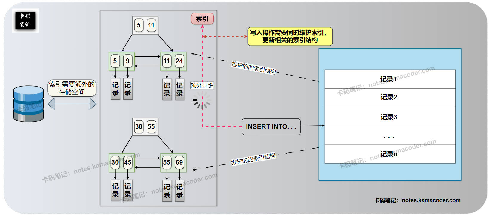

# 什么时候不需要创建索引？

> 来源: https://notes.kamacoder.com/base/when-not-to-create-index.html

# 什么时候不需要创建索引？

## 简要回答

  1. **数据量小的表：** 对小表创建索引可能带来额外开销，全表扫描可能更快。
   2. **写入操作频繁的表：** 索引维护增加插入、更新、删除开销，影响写性能。
   3. **区分度低的列：** 对于数据重复率高（如性别）的列，索引无法有效过滤数据。
   4. **不常用于查询的列：** 索引利用率低，建立索引会浪费资源。
   5. **查询返回大部分数据的场景：** 即使有索引，优化器也可能选择全表扫描。
   6. **查询条件无法利用索引：** 例如在索引列上使用函数或模糊匹配。

## 详细回答

  1. **数据量小的表：**
    - 对于数据量非常小的表（例如只有几十或几百行），**全表扫描的开销通常很低**，甚至比通过索引查找再回表读取数据的开销更小。在这种情况下，创建索引带来的性能提升微乎其微，反而增加了索引的存储和维护成本。

   2. **写入操作频繁的表：**
    - 索引虽然能**提高查询性能**，但会**降低写入性能**。每次进行插入、更新或删除操作时，数据库不仅需要修改数据本身，还需要**同步更新相关的索引结构**。对于写入操作非常频繁的表，索引维护的开销会显著增加，导致写操作变慢。因此，在读少写多的场景下，需要谨慎创建索引，或者权衡索引带来的查询收益与写入性能损失。

   3. **区分度低的列：**
    - 如果某个列的**数据重复率很高**，即该列的不同值很少，例如性别（男/女）、布尔值（是/否）等，那么在该列上创建索引的意义不大。因为即使使用了索引，数据库也需要扫描大量具有相同索引值的记录，**无法有效地过滤数据**。数据库优化器可能会判断全表扫描比通过索引查找更高效，从而放弃使用索引。

   4. **不常用于查询的列：**
    - 如果某个列很少被用于 **`WHERE`**、**`JOIN`**、**`ORDER BY`** 或 **`GROUP BY`** 子句中，那么在该列上创建索引后，索引的**利用率非常低**。索引需要占用磁盘空间，并且需要维护，如果一个索引很少被用到，那么它带来的存储和维护开销就是不必要的浪费。

   5. **查询返回大部分数据的场景：**
    - 即使表的数据量很大，如果**查询条件很宽松**，返回的结果集占总数据量的比例很高（例如超过 20% 或 30%），那么 **数据库优化器** 可能会**判断**直接进行全表扫描比通过索引查找更高效。因为通过索引查找需要先访问索引，然后再根据指针回表读取数据，而全表扫描可以直接顺序读取数据，在读取大部分数据时，顺序读的效率可能更高。

   6. **查询条件无法利用索引：**
    - 即使在某个列上创建了索引，如果查询条件无法有效地利用这个索引，那么创建索引就失去了意义。常见的导致索引失效的情况包括：在索引列上使用函数、使用 `LIKE '%keyword'` 进行模糊匹配（以通配符开头）、使用“不等于”操作符 (!= 或 <>)、使用 OR 连接不同的索引列等。在这些情况下，数据库优化器可能无法使用索引，只好仍然进行全表扫描。

## 知识拓展

  1. **索引的代价——创建索引带来的存储和写入开销**，示意图如下：
 

   2. **面试官可能的追问1：** “你提到区分度低的列不适合建索引，那么如何判断一个列的区分度高低呢？”

    - **简答：** 可以通过查看列的**唯一值数量**或使用 `COUNT(DISTINCT column_name)` 来判断。唯一值数量越多，区分度越高。通常认为，如果一个列的唯一值数量占总行数的比例较低（例如低于 10% 或 20%），那么它的区分度可能较低。

   3. **面试官可能的追问2：** “你提到查询条件无法利用索引，能举个更具体的例子吗？”

    - **简答：** 例如，在 `user_name` 列（有索引）上执行 `WHERE LEFT(user_name, 1) = 'A'`。由于对 `user_name` 列使用了 `LEFT()` 函数，数据库无法直接使用 `user_name` 列上的索引，只好进行全表扫描。

   4. **面试官可能的追问3：** “如果一个表既有频繁的查询，又有频繁的写入，应该如何权衡是否创建索引？”

    - **简答：** 需要根据实际的**读写比例**和对查询性能的要求来权衡。如果查询是核心业务，对性能要求很高，可以考虑创建必要的索引，并通过其他方式（如优化写入操作、使用更快的存储介质、读写分离等）来缓解写入性能问题。如果写入是主要操作，对查询性能要求不高，可以尽量减少索引数量。最重要的是进行**性能测试**，根据实际情况进行决策。
