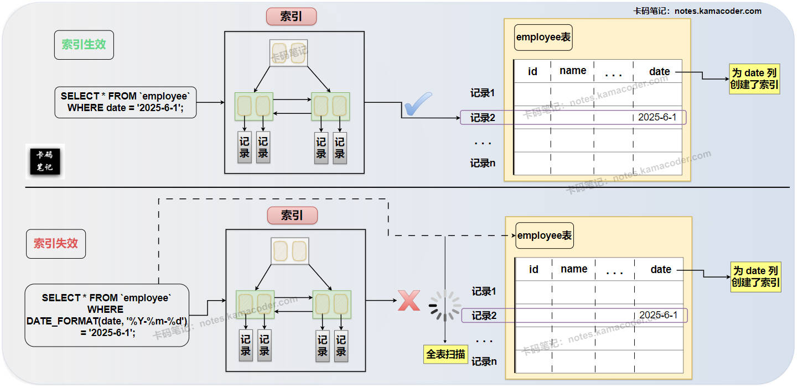
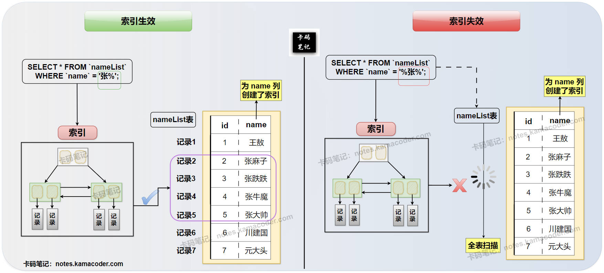

# 索引失效的场景有哪些

> 来源: https://notes.kamacoder.com/base/index-failure-scenarios.html

# 索引失效的场景有哪些

## 简要回答

### 拾枝杂谈

  1. **索引失效的含义：** 指数据库优化器在执行查询时没有使用**本应使用**的索引，而是选择了其他执行方式（比如全表扫描）。
   2. **索引失效的影响：** 可能导致查询性能急剧下降，尤其是在处理大量数据时。

### 典型场景

  1. **从 查询条件对索引列的操作 出发：**
    - **在索引列上使用函数或计算：** 如 `WHERE FUNCTION(column) = value` 或 `WHERE column + 1 = value`。
     - **以通配符开头的模糊匹配：** 如 `WHERE column LIKE '%keyword'`。
     - **使用不等于操作符：** 如 `WHERE column != value`。
     - **使用 OR 连接不同索引列：** 如 `WHERE column1 = value1 OR column2 = value2` (column1 和 column2 分别有索引)。
     - **隐式类型转换：** 查询条件类型与索引列类型不匹配。

   2. **从联合索引的最左前缀原则出发：**
    - 查询条件没有包含联合索引的最左边的列。

   3. **从数据库优化器的选择出发：**
    - 数据库的**查询优化器**在一些 情景下可以会跳过使用索引，例如：查询返回结果集占总数据量比例较高 或者 索引列区分度较低。

   4. **从索引本身的问题出发：**
    - 索引损坏或未生效。

## 详细回答

### 拾枝杂谈

  1. **索引失效的含义：** 索引失效是指在执行 SQL 查询语句时，数据库的查询优化器没有选择使用**已经创建的索引**来加速查询，而是采用了其他执行计划，最常见的就是全表扫描。
   2. **索引失效的影响：** 索引失效会导致**查询效率大幅降低**，尤其是在处理大量数据时，可能从秒级甚至毫秒级响应变成分钟级甚至更长，严重影响系统的性能和用户体验。

### 典型场景

  1. **从查询条件对索引列的操作出发：**（常见5种）

    - **在索引列上使用函数或进行计算：** 当在查询条件的索引列上使用了函数（如 `LEFT()`, `RIGHT()`, `UPPER()`, `LOWER()`, `DATE_FORMAT()` 等）或者 进行了数学计算时，**数据库优化器**很难直接利用索引进行查找。这是因为**索引是基于原始列值构建的，对列值进行函数处理或计算后，其结果与原始索引值不匹配，导致索引失效**。
 **示例①：** `SELECT * FROM users WHERE DATE_FORMAT(create_time, '%Y-%m-%d') = '2023-10-26';` (假设在 `create_time` 列上有索引)
 **示例②：** `SELECT * FROM products WHERE price * 0.8 < 100;` (假设在 `price` 列上有索引)
     - **以通配符开头的模糊匹配：** 在使用 `LIKE` 进行模糊匹配时，如果**通配符 (`%` 或 `_`) 出现在查询字符串的开头**，例如 `WHERE column LIKE '%keyword'`，那么索引会失效，这是因为**索引是按照从左到右的顺序进行排序的，以通配符开头意味着无法确定起始字符，也就无法利用索引的有序性进行快速查找了**。
 **示例：** `SELECT * FROM users WHERE user_name LIKE '%zhang%';` (假设在 `user_name` 列上有索引)
 **Δ注意：** 如果通配符出现在查询字符串的末尾，例如 `WHERE column LIKE 'keyword%'`，索引通常是可以生效的。
     - **使用不等于操作符 (!= 或 <>):** 例如当不等于的值占总数据比例很高时，数据库优化器可能会认为扫描大部分数据（即全表扫描）比通过索引查找少量不符合条件的数据更有效率。
 **示例：** `SELECT * FROM orders WHERE status != 'completed';` (假设在 `status` 列上有索引)
     - **使用 OR 连接不同索引列：** 如果在一个查询中，使用 `OR` 连接了**不同索引列**的条件，可能会导致索引失效。这是因为**数据库优化器**难以同时利用多个索引，最终选择全表扫描。
 **示例：** `SELECT * FROM products WHERE product_name = 'honor' OR category = 'electronics';` (假设在 `product_name` 和 `category` 列上分别有索引)
 **Δ注意：** 如果 OR 连接的是**同一个索引列的不同条件**，索引通常是可以生效的。
     - **隐式类型转换：** 如果**查询条件的类型与索引列的类型不匹配**，数据库可能会进行隐式类型转换。这种隐式转换可能会导致索引失效。
 **示例：** `SELECT * FROM users WHERE phone = 12345678900;` (如果 `phone` 列是 VARCHAR 类型且有索引，而查询条件是数字类型)

   2. **从联合索引的 最左前缀原则 出发：**
    - 如果使用了**联合索引**（例如在列 `a`, `b`, `c` 上创建了联合索引 `(a, b, c)`），但查询条件没有包含联合索引的**最左边的列**，或者跳过了中间的列，索引可能会部分或完全失效。
 **示例①（索引生效）：** `WHERE a = 1`, `WHERE a = 1 AND b = 2`, `WHERE a = 1 AND b = 2 AND c = 3`
 **示例②（索引失效）：** `WHERE b = 2`, `WHERE c = 3`, `WHERE b = 2 AND c = 3`
 **示例③（索引部分生效）：** `WHERE a = 1 AND c = 3` (只能利用到 `a` 列的索引)

   3. **从数据库优化器的选择出发：**
    - 即使存在合适的索引，数据库的查询优化器也可能根据其内部的**成本估算模型**，判断使用索引的成本高于全表扫描的成本，从而选择全表扫描。例如——

① **查询返回结果集占总数据量比例较高：** 当查询条件很宽松，返回的结果集占总数据量的比例很高时，回表读取数据的开销会很大，优化器可能认为直接全表扫描更高效。

② **索引列区分度较低：** 在区分度低的列（如性别）上创建索引，索引并不能有效过滤数据，优化器可能认为扫描少量数据比通过索引查找更有效率。

③ **数据库统计信息不准确：** 因为优化器依赖于数据库的统计信息来估算不同执行计划的成本。如果数据库的统计信息过时或不准确，就可能导致优化器做出错误的决策，而不使用索引。

   4. **从索引本身的问题出发：**
    - 在极少数情况下，索引可能因为某些原因而损坏，导致无法被使用。
     - 在创建索引后，需要确保索引已经生效，并且数据库配置允许使用该索引。

## 知识拓展

  1. **在索引列上使用函数，导致索引失效**的场景，示意图如下：
 

   2. **以通配符开头的模糊查询，导致索引失效**的场景，示意图如下：
 

   3. **面试官可能的追问1：** “如何判断一个查询是否使用了索引？”

    - **简答：** 可以使用数据库提供的 `EXPLAIN` 命令来分析查询语句的执行计划。查看 `EXPLAIN` 输出结果中的 `type`、`key`、`rows` 等列，可以判断是否使用了索引以及索引的使用情况。

   4. **面试官可能的追问2：** “你提到以通配符开头的模糊匹配会导致索引失效，那么有没有办法优化这种查询？”

    - **简答：** 可以考虑使用**全文索引**（如果存储引擎支持且适用于文本搜索场景），或者在应用层进行处理（例如，先获取所有数据再进行模糊匹配，但这可能效率不高）。另外，如果业务允许，可以考虑使用搜索引擎技术（如 Elasticsearch）。

   5. **面试官可能的追问3：** “除了避免索引失效，还有哪些方法可以优化 SQL 查询语句？”

    - **简答：** 除了避免索引失效，还可以优化 SQL 语句本身，例如：减少不必要的列返回、使用 LIMIT 限制返回行数、避免使用 `SELECT *`、合理使用子查询和 JOIN、优化 WHERE 子句的条件顺序等。
