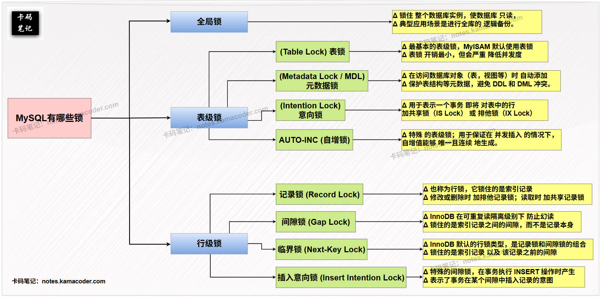

# 什么是数据库中的锁，有哪些类型？

> 来源: https://notes.kamacoder.com/base/database-locks.html

# 什么是数据库中的锁，有哪些类型？

## 简要回答

  1. **全局锁：** 锁住整个数据库实例，使数据库**只读**，用于**全库备份**。
   2. **表级锁：** 锁住整张表。

    - **表锁：** 最基本的表级锁，MyISAM 存储引擎默认使用。
     - **元数据锁：** 保护表结构等**元数据**，避免 DDL 和 DML 冲突。
     - **意向锁：** 表明事务即将对行加锁，协调表锁和行锁。
     - **AUTO-INC 锁：** 控制**自增列并发插入**的表级锁。

   3. **行级锁：** 锁住表中的行，开销大，并发度高，InnoDB 中实现了行级锁。

    - **Record Lock：** 锁住**单条**索引记录。
     - **Gap Lock :** 锁住索引记录之间的间隙，**防止幻读**。
     - **Next-Key Lock :** **记录锁和间隙锁的组合**，锁住记录和之前的间隙。
     - **插入意向锁 :** **特殊的间隙锁**，表示插入新记录的意图。

## 详细回答

  1. **全局锁：**
    - 全局锁是对整个数据库实例加锁。最典型的应用场景是进行**全库的逻辑备份**。
     - 通过执行 `FLUSH TABLES WITH READ LOCK` (FTWRL) 命令，可以使整个数据库处于**只读状态**，阻止所有对数据的修改操作（包括 INSERT, DELETE, UPDATE 以及大部分 DDL 语句）。这样可以确保备份期间数据的**一致性**。
     - 释放全局锁可以使用 `UNLOCK TABLES` 命令或客户端断开连接。

   2. **表级锁：** 直接锁住整张表。

    - **表锁 (Table Lock):**

① 是最基本的表级锁，可以通过 `LOCK TABLES` 命令**显式地**对表加锁，例如 `LOCK TABLES table_name READ` (表读锁) 或 `LOCK TABLES table_name WRITE` (表写锁)。

② 表锁**开销最小**，但会严重**降低并发度**，因为会阻塞对该表的其他所有读写操作。MyISAM 存储引擎默认使用表锁。
     - **元数据锁 (Metadata Lock / MDL):**

① MDL 是在访问数据库对象（如表、视图、存储过程等）时**自动添加**的锁。

② 它的主要作用是保证在执行 DDL 操作时，不会与正在进行的 DML 操作发生冲突，反之亦然。例如，当一个事务正在读取表数据时，如果另一个会话尝试修改表结构，就会被 MDL 阻塞，直到读事务完成。
     - **意向锁 (Intention Lock):**

① 意向锁是 InnoDB 存储引擎**自动添加的表级锁**。

② 它用于表示一个事务**即将**对表中的行加**共享锁（IS Lock）** 或 **排他锁（IX Lock）** 。

③ 意向锁的存在是为了提高行级锁和表级锁的兼容性判断效率。当一个事务尝试加表级共享锁或排他锁时，**只需要检查表上是否存在意向锁**，而无需遍历所有行检查是否存在行级锁。
     - **AUTO-INC 锁 (自增锁):**

① AUTO-INC 锁是一种特殊的表级锁，在向**包含自增列**的表中插入数据时使用。

② 它用于保证在**并发插入**的情况下，自增值能够**唯一且连续**地生成。在插入完成后，自增锁会立即释放。

③ 在不同的 `innodb_autoinc_lock_mode` 配置下，自增锁的行为会有所不同，以平衡并发度和自增值的连续性。

   3. **行级锁：** 只锁住表中的某一行或某些行。行级锁开销较大，但能显著提高并发度。行级锁主要由 InnoDB 存储引擎实现。

    - **记录锁 (Record Lock):**

① 记录锁**也称为行锁**，它锁住的是索引记录。

② 当一个事务对某条记录进行**修改或删除**时，会加**排他记录锁**；当一个事务对某条记录进行**读取**（在特定隔离级别下）时，会加**共享记录锁**。
     - **间隙锁 (Gap Lock):**

① 间隙锁是 InnoDB 在可重复读 (REPEATABLE READ) 隔离级别下为了防止**幻读**而引入的一种锁。

② 它锁住的是**索引记录之间的间隙，而不是记录本身**。间隙锁之间是兼容的，但会阻塞其他事务在被锁的间隙中插入记录。
     - **临界锁 (Next-Key Lock):**

① 临界锁是 **InnoDB 默认的行锁类型**，它是**记录锁和间隙锁的组合**，锁住的是**索引记录以及该记录之前的间隙**。

② 临界锁在可重复读隔离级别下使用，既能防止幻读，也能保证索引记录的唯一性。
     - **插入意向锁 (Insert Intention Lock):**

① 插入意向锁是一种**特殊的间隙锁**，它在事务执行 INSERT 操作时产生。

② 当多个事务在同一个间隙中插入记录时，如果它们插入的位置不冲突，它们可以同时持有插入意向锁，而无需互相等待。

③ 插入意向锁表示了事务在某个间隙中插入记录的**意图**，但不会阻塞其他事务在该间隙中插入记录（除非有冲突的间隙锁）。

## 知识拓展

  1. **MySQL常见的锁类型**，示意图如下：
 

   2. **面试官可能的追问1：InnoDB 的行级锁是如何实现的？**
    - **简答：** InnoDB 的行级锁是基于**索引**实现的。它通过在索引记录上加锁来锁定对应的行。如果没有索引，InnoDB 会使用隐藏的聚簇索引来加锁，这可能会导致全表扫描并加锁，降低并发度。

   3. **面试官可能的追问2：间隙锁主要解决了什么问题？在哪些隔离级别下会使用？**
    - **简答：** 间隙锁主要解决了**幻读**问题。幻读是指在同一个事务中，两次执行相同的查询语句，第二次查询结果包含了第一次查询没有的记录。间隙锁通过锁住索引记录之间的间隙，防止其他事务在间隙中插入记录，从而避免幻读。间隙锁主要在 **可重复读 (REPEATABLE READ)** 隔离级别下使用。

   4. **面试官可能的追问3：意向锁的作用是什么？它是如何协调表锁和行锁的？**
    - **简答：** 意向锁是一种表级锁，用于表示事务即将对表中的行加锁。当一个事务尝试加表级共享锁或排他锁时，MySQL 会检查表上是否存在意向锁。如果存在意向排他锁，则不能加表级共享锁或排他锁；如果存在意向共享锁，则不能加表级排他锁。通过意向锁，可以在表级快速判断是否存在行级锁，避免遍历所有行进行检查，提高了锁的兼容性判断效率。
