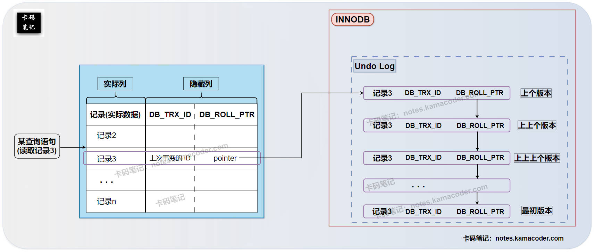

# 说一说你了解的MVCC机制？

> 来源: https://notes.kamacoder.com/base/mvcc-mechanism.html

# 说一说你了解的MVCC机制？

## 简要回答

### MVCC的相关概念

  - 在数据库高并发场景下，传统的锁机制会导致大量的锁等待，严重影响性能。为了解决这个问题，出现了 **MVCC** (**Multi-Version Concurrency Control**，多版本并发控制) 机制。MVCC 的**核心思想**不是通过加锁来阻止读写冲突，而是通过保存数据的多个版本，使得读操作可以读取数据的旧版本，从而实现读写操作的并发执行，提高数据库的吞吐量。

### MVCC的工作原理

  1. **版本链：** InnoDB数据引擎 在每行数据后添加隐藏列（事务 ID 和回滚指针），将同一行数据的不同版本连接起来形成版本链，旧版本数据存储在 **`Undo Log`** 中。
   2. **读视图 (Read View)：** 事务开始时生成一个 **Read View**，用于记录当前活跃事务状态。
   3. **可见性判断：** 事务根据 **Read View** 和数据版本的事务 ID 来判断数据是否对它（也就是当前事务）可见，不可见则沿着版本链回溯查找旧版本。

### MVCC的协作关系

  - MVCC 主要用于实现 **Read Committed** 和 **Repeatable Read** 隔离级别。

    1. 在 Read Committed 下，每次读操作生成新的 Read View；
     2. 在 Repeatable Read 下，事务开始时只生成一个 Read View。

   - MVCC 并**不取代锁，而是与锁协同工作**，使得读操作通常无需加锁，而写操作仍需加锁。

## 详细回答

### MVCC的相关概念

  1. **为什么需要MVCC？**
    - 在数据库系统中，为了保证数据的一致性，当**多个事务并发执行**时，需要采取并发控制机制。
     - **传统**的并发控制机制主要**依赖于锁**，通过对数据加锁来协调并发事务的访问。然而，在**高并发**场景下，频繁的加锁和释放锁会导致大量的锁等待和阻塞，降低数据库的吞吐量和响应速度。
     - MVCC的出现，就是为了提高数据库的并发性能，并且减少读写冲突时的锁等待。

   2. **什么是MVCC？**
    - MVCC 的全称是 **Multi-Version Concurrency Control**，即**多版本并发控制**。
     - 它的**核心思想**是**通过保存数据的多个版本来实现读写操作的并发执行**。
     - 当一个事务需要读取数据时，它读取的是数据的一个**历史快照**，而不是数据的最新版本。这个快照是事务开始时的数据状态。
     - 这样，**读操作就可以在不加锁的情况下进行，不会阻塞写操作**，写操作也不会阻塞读操作，从而提高了数据库的并发性能。

   3. **MVCC的优缺点？**
    - **优点：**

① **提高读写并发性：** 允许多个事务同时读取和写入数据，减少锁竞争。

② **降低锁开销：** 普通的读操作通常不需要加锁，降低了锁管理的开销。
     - **缺点：**

① **增加存储开销：** 需要额外的空间来存储数据的旧版本。

② **清理旧版本开销：** 需要后台线程（如 Purge 线程）来清理不再需要的旧版本数据，这也会带来一定的开销。

### MVCC的工作原理

  1. **版本链 (Version Chain):**
    - **隐藏列：** InnoDB 存储引擎在**每行数据**后面会添加两个隐藏列：

① `DB_TRX_ID` (Transaction ID): 记录了**最近一次修改该行的事务**的 ID。

② `DB_ROLL_PTR` (回滚指针): 指向存储在 **`Undo Log`** 中的**该行上一个版本的记录**。
     - **版本链形成：** 通过 `DB_ROLL_PTR`隐藏列，同一行数据的不同版本会被连接起来，形成一个链表，也就是我们说的**版本链**。**最新版本的记录位于链的头部，旧版本的记录通过回滚指针连接起来**。
     - **Undo Log 的作用：** Undo Log 是 InnoDB 的**回滚日志**，它不仅用于事务回滚，还用于存储数据的旧版本。当一个事务修改数据时，会将数据的旧版本写入 Undo Log，并更新当前记录的 `DB_ROLL_PTR` ，使其指向这个旧版本。

   2. **读视图 (Read View):**
    - **概念：** Read View 是 MVCC 机制中一个非常重要的概念，它代表了事务开始时，数据库中**可见的数据版本集合**。
     - **生成时机：** 在 Repeatable Read 隔离级别下，Read View 是在每个事务开始时生成；而在 Read Committed 隔离级别下，Read View是在每次执行 `SELECT` 语句时生成。
     - **包含信息：** Read View 主要包含以下信息：

① `m_ids`: 是指生成 Read View 时，系统中所有**活跃的（尚未提交或回滚的）事务**的 ID 列表。

② `min_trx_id`: 是指`m_ids` 列表中的**最小事务 ID**。

③ `max_trx_id`: 是指生成 Read View 时，系统**即将分配给下一个新事务的 ID**。

④ `creator_trx_id`: 是指生成这个 Read View 的**当前事务本身的 ID**。

   3. **可见性判断规则：**
    - 当一个事务**读取**一行数据时，它会**获取当前数据的最新版本**，并**检查该版本的 `DB_TRX_ID`**。然后，根据以下规则使用 Read View 来**判断该版本是否对当前事务可见**：

① 如果 `DB_trx_id` < `min_trx_id`：表示该版本在当前事务开始之前就已经提交，那么该数据对当前事务**可见**。

② 如果 `DB_trx_id` >= `max_trx_id`：表示该版本在当前事务开始之后才产生，那么该数据对当前事务**不可见**。

③ 如果 `min_trx_id` <= `DB_trx_id` < `max_trx_id`：又分为两种子情况——若 `DB_trx_id` 在 `m_ids` 列表中，则表示该版本是由一个活跃事务修改的，那么该数据对当前事务**不可见**；若 `DB_trx_id` 不在 `m_ids` 列表中，则表示该版本是由一个已提交的事务修改的，那么该数据对当前事务**可见**。
     - 如果当前版本不可见，事务会**沿着版本链向上回溯**，查找更旧的版本，直到找到一个可见的版本。

### MVCC的协作关系

  1. **MVCC与事务隔离级别的关系：**
    - MVCC 是实现 **Read Committed** 和 **Repeatable Read** 这两个隔离级别的关键机制。
     - **Read Committed：** 在该级别下，**每次执行 `SELECT` 语句时都会生成一个新的 Read View**。这意味着一个事务可以读取到其他事务在它执行期间已经提交的修改，从而导致**不可重复读**。
     - **Repeatable Read：** 在该级别下，**事务只在开始时生成一个 Read View，并在整个事务执行期间都使用这个 Read View**。这意味着一个事务只能看到它开始时的数据快照，而不会受到其他事务在它执行期间提交的修改的影响，从而解决了不可重复读。
     - MVCC **不能**解决 **Serializable** 隔离级别下的并发问题，Serializable 隔离级别通常完全依赖于锁来实现串行执行。MVCC 也**不能**解决 **Read Uncommitted** 隔离级别下的并发问题，因为 Read Uncommitted 允许读取未提交的数据，与 MVCC 的多版本特性无关。

   2. **MVCC与锁的关系：**
    - MVCC 并不是完全取代了锁，而是与锁**协同工作**。
     - 在 Read Committed 和 Repeatable Read 隔离级别下，MVCC 使得普通的 **SELECT** 操作（快照读）通常**不需要加锁**，可以并发执行，极大地提高了读操作的性能。
     - 然而，**写操作**（如 INSERT, UPDATE, DELETE）以及一些特殊的读操作（如 `SELECT ... FOR UPDATE` 或 `SELECT ... LOCK IN SHARE MODE`）仍然需要加锁，以保证数据修改的原子性、一致性和隔离性。锁用于控制 `写-写`冲突 和 `写-读`冲突。

## 知识拓展

  1. **MVCC的版本链（Version Chain）示意图如下**：
 

   2. **面试官可能的追问1：** “MVCC 如何解决幻读问题？（针对 MySQL InnoDB 的 Repeatable Read）”

    - **简答：** 在 MySQL InnoDB 的 Repeatable Read 级别下，MVCC 结合 **Next-Key Lock**（行锁和间隙锁的组合）来解决幻读问题。MVCC 保证了事务在读取数据时看到的是一个快照，而 Next-Key Lock 则阻止了其他事务在查询范围内插入新的记录，从而避免了幻读。

   3. **面试官可能的追问2：** “Undo Log 在 MVCC 中有什么作用？”

    - **简答：** Undo Log 在 MVCC 中主要有两个作用：一是用于事务回滚，当事务失败时，可以通过 Undo Log 中的记录撤销已执行的操作；二是用于存储数据的旧版本，这些旧版本构成了版本链，供 MVCC 的读操作读取。

   4. **面试官可能的追问3：** “Read View 是如何被垃圾回收的？”

    - **简答：** 当一个事务提交或回滚后，它所创建的 Read View 就不再需要了。系统会有一个后台线程（Purge 线程）来扫描 Undo Log，清理那些不再被任何活跃事务的 Read View 引用的旧版本数据。
