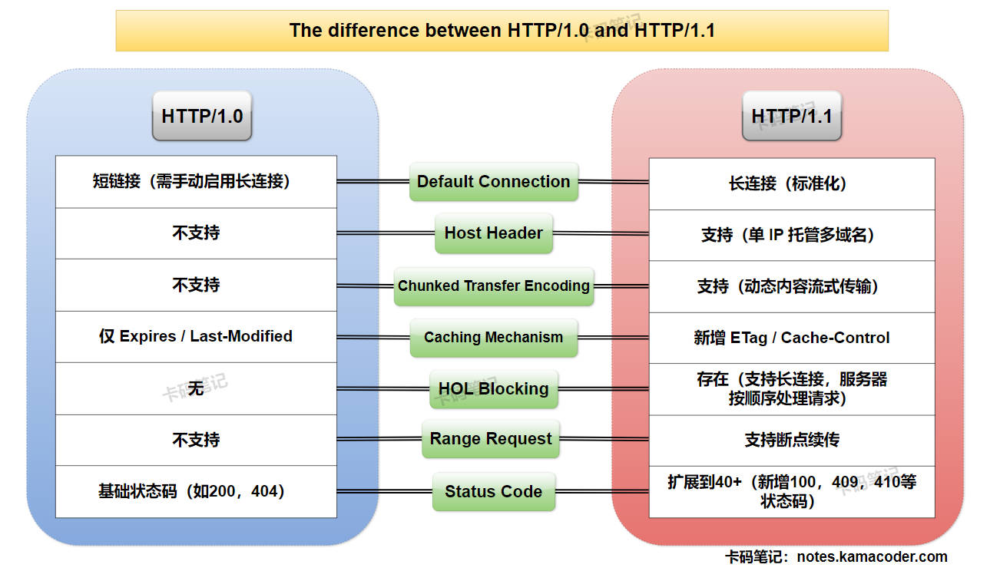

# GET请求和POST请求的区别？

> 来源: https://notes.kamacoder.com/base/http1-0-vs-1-1.html

# GET请求和POST请求的区别？

## 简要回答

### HTTP/1.0 和 HTTP/1.1 的概念

  1. **HTTP/1.0**：

    - 默认使用**短连接**（每次请求后关闭 TCP 连接），支持非标准长连接（需手动添加 `Connection: keep-alive` 请求头。
     - HTTP/1.0 性能开销大，且不适合频繁请求的情况。

   2. **HTTP/1.1**：

    - 默认使用标准化**长连接**（无需额外手动设置），支持复用 TCP 连接处理多个请求。
     - HTTP/1.1 复用TCP连接，减少了连接开销，提高了性能，但连接管理更复杂。

### HTTP/1.0 和 HTTP/1.1 的区别

  -

如下表所示：

| **核心区别**  **HTTP/1.0**  **HTTP/1.1**
| **默认连接**  短连接（需手动启用长连接）  长连接（标准化）
| **Host 头**  不支持  支持（单 IP 托管多域名）
| **分块传输编码**  不支持  支持（动态内容流式传输）
| **缓存机制**  仅 **Expires** / **Last-Modified**  新增 **ETag** / **Cache-Control**
| **队头阻塞问题**  无（因短连接）  存在（长连接顺序处理请求）
| **范围请求**  不支持  支持断点续传
| **状态码扩展**  基础状态码（如 200、404）  新增 100、409、410 等状态码

## 详细回答

### HTTP/1.0 和 HTTP/1.1 的概念

  1. **HTTP/1.0短连接**：

    - **定义**：

在HTTP/1.0中，默认情况下，每次HTTP请求完成后会关闭TCP连接。
     - **过程**：

① 浏览器与服务器通过三次握手建立TCP连接。

② 浏览器发送HTTP请求，服务器返回HTTP响应。

③ 服务器关闭TCP连接。
     - **缺点**：

① **性能开销大**：每次请求都需要建立和关闭TCP连接，增加了延迟和资源消耗。

② **不适合频繁请求**：对于需要多次请求的页面（如加载多个资源），性能较差。

   2. **HTTP/1.1长连接**：

    - **定义**：

在HTTP/1.1中，默认使用长连接（`Connection: keep-alive`），允许在同一个TCP连接上发送多个HTTP请求和响应。
     - **过程**：

① 浏览器与服务器通过三次握手建立TCP连接。

② 浏览器发送多个HTTP请求，服务器返回多个HTTP响应。

③ 当连接空闲一段时间后，服务器或浏览器会关闭TCP连接。
     - **优点**：

① **减少连接开销**：复用TCP连接，减少了建立和关闭连接的开销。

② **提高性能**：适合需要多次请求的页面（如加载多个资源）。
     - **缺点**：
 **连接管理复杂**：需要处理连接的复用和超时关闭。

### HTTP/1.0 和 HTTP/1.1 的区别

  1. **默认连接管理**：

    - **HTTP/1.0**：

每次请求后关闭 TCP 连接，导致频繁的三次握手和四次挥手。

可通过非标准头 `Connection: keep-alive` 启用长连接，但依赖服务器实现。
     - **HTTP/1.1**：

采用**标准化长连接**，默认复用 TCP 连接处理多个请求，减少连接开销。

可通过 `Keep-Alive: timeout=30` 设置**空闲超时时间**（默认约 5-15 秒）。

   2. **Host 头支持**：

    - **HTTP/1.0**：

不支持 Host 头，一个 IP 地址只能绑定一个域名，无法支持虚拟主机。
     - **HTTP/1.1**：

支持 Host 头字段，客户端必须在请求中指定域名（如 `Host: programmercarl.com`）；Host 头字段为云计算和共享主机提供基础，允许单服务器托管多个网站。

   3. **分块传输编码（Chunked Transfer Encoding）**：

    - **HTTP/1.0**：

必须预先知道响应内容长度（通过 `Content-Length` 头），无法动态生成内容。
     - **HTTP/1.1**：

支持**分块传输**，服务器通过 `Transfer-Encoding: chunked` 响应头分块发送动态内容，适用于实时日志流、大文件下载等场景。

   4. **缓存机制优化**
    - **HTTP/1.0**：
 **强缓存**仅支持 `Expires`（绝对过期时间）；
 **协商缓存**仅支持`Last-Modified / If-Modified-Since`（最后修改时间）。
     - **HTTP/1.1**：
 **强缓存**新增了 `Cache-Control`（如 `max-age=3600` 相对时间）。
 **协商缓存**新增了 `ETag`（文件哈希值）和 `If-None-Match` 实现更精准的缓存验证。

   5. **队头阻塞问题（Head-of-Line Blocking）**
    - **HTTP/1.0**：

无队头阻塞问题（因短连接每次请求独立处理）。
     - **HTTP/1.1**：

支持**管道化（Pipelining）**，允许客户端在未收到前一个响应时，继续通过**同一TCP连接**发送多个请求（无需等待响应），但服务器必须按顺序返回响应。若某个请求处理缓慢（如复杂查询），后续响应会被阻塞，实际应用中被浏览器**默认禁用**。

   6. **范围请求（Range Requests）**
    - **HTTP/1.0**：

不支持部分内容请求，必须下载完整资源。
     - **HTTP/1.1**：

允许浏览器通过 `Range: bytes=0-499` 请求部分内容，服务器返回 `206 Partial Content` 和 `Content-Range` 头。eg：视频拖动播放、断点续传下载。

   7. **状态码扩展**
    - **HTTP/1.0**：

仅支持基础状态码（如 200 OK、404 Not Found）。
     - **HTTP/1.1**：
 **新增 100、409、410 等状态码，总数扩展至 40+，**

其中 100，409，410 状态码如下：
 `100 Continue`：客户端发送请求体前，服务器确认接收请求头。
 `409 Conflict`：请求与资源当前状态冲突（如并发编辑冲突）。
 `410 Gone`：资源已永久删除（比 404 更明确）。

## 知识拓展

### 一图胜千言

  - HTTP/1.0 和 HTTP/1.1 关键区别，如下图所示：
 

### HTTP and TCP Relationship

  - HTTP (Hypertext Transfer Protocol) and TCP (Transmission Control Protocol) are fundamental components of web communication, each playing distinct roles:

    1. **Layered Architecture**:

      - **TCP** operates at the **transport layer** (Layer 4) of the OSI model, ensuring reliable, ordered, and error-checked data delivery between devices.
       - **HTTP** operates at the **application layer** (Layer 7), defining how clients (e.g., browsers) and servers format and exchange messages (e.g., requests for web pages).

     2. **Dependency**:

      - HTTP **relies on TCP** to establish and manage connections. Before sending an HTTP request, a TCP connection is established via a three-way handshake.
       - Example: When you visit a website, your browser uses TCP to create a stable channel, then sends HTTP requests (e.g., `GET /index.html HTTP/1.1`) over this channel.

     3. **Connection Management**:

      - **HTTP/1.0**: Used short-lived TCP connections (one request per connection), leading to high overhead.
       - **HTTP/1.1**: Introduced **persistent connections**, reusing a single TCP connection for multiple requests, reducing latency and improving efficiency.

     4. **Evolution Beyond TCP**:

      - **HTTP/2** retained TCP but added multiplexing to mitigate head-of-line blocking.
       - **HTTP/3** abandoned TCP and adopted **QUIC** (a UDP-based protocol) to further reduce latency and address TCP’s limitations in modern networks.
