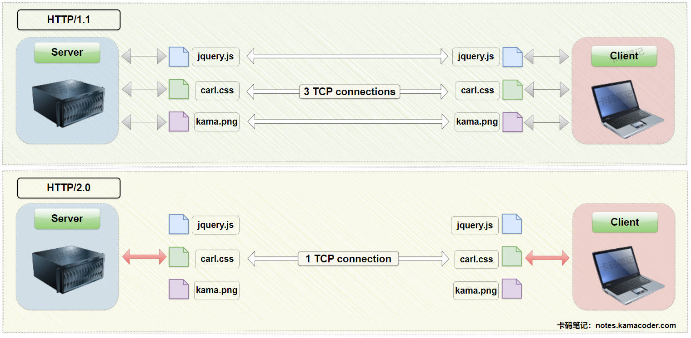

# HTTP_2.0与HTTP_1.1相比有哪些主要改进？

> 来源: https://notes.kamacoder.com/base/http2-improvements.html

# HTTP_2.0与HTTP_1.1相比有哪些主要改进？

## 简要回答

  1. **多路复用（Multiplexing）**：允许在 **单个**TCP连接 上并行交错发送 **多个**请求和响应 ，解决队头阻塞，提升传输效率。
   2. **头部压缩（Header Compression）**：引入了 **HPACK** 压缩算法，减少冗余头部数据，节省带宽。
   3. **二进制协议（Binary Protocol）**：采用 **二进制帧** 替代 HTTP/1.1的 文本协议，使得解析更快更高效。
   4. **流优先级（Stream Prioritization）**：允许按 **权重和依赖关系** 优先传输关键资源，优化用户体验。
   5. **服务器推送（Server Push）**：服务器 **主动推送** 资源给客户端，而不需要客户端明确请求，减少额外请求延迟。

## 详细回答

  1. **多路复用（Multiplexing）**：

    - **问题**：HTTP/1.1 的队头阻塞问题（HOL Blocking）导致请求必须串行处理，响应按序返回，传输效率低下。
     - **改进**：

① **二进制分帧**：将消息拆分为独立的帧（HEADERS、DATA），每个帧绑定唯一流标识符（Stream ID）。

② **并行传输**：不同流的帧可乱序发送和重组，无需等待前序请求完成。
     - **效果**：单个TCP连接即可高效加载多个资源，减少延迟，提升吞吐量。

   2. **头部压缩（Header Compression）**：

    - **问题**：在 HTTP/1.1 中，**每个请求都会包含完整的头部信息**，即使这些头部信息在多个请求中是相同的，这会导致带宽的浪费，尤其是在移动端这种带宽有限的场景下。
     - **改进**：

① **HPACK 算法**：静态字典（61 个预定义字段） + 动态字典（自定义字段缓存） + Huffman 编码（进一步压缩）。

② **压缩率**：头部大小减少 50%-90%。
     - **效果**：显著降低弱网环境下的传输开销。

   3. **二进制协议（Binary Protocol）**：

    - **问题**：HTTP/1.1 的文本解析效率低（如换行符分隔），且易出错。
     - **改进**：

① **二进制帧结构**：固定格式的帧头（类型、长度、流 ID） + 载荷。

② **帧类型**：HEADERS（元数据）、DATA（内容）、PRIORITY（优先级）等。
     - **效果**：解析速度更快，支持多路复用、优先级等高级功能。

   4. **流优先级（Stream Prioritization）**：

    - **问题**：HTTP/1.1 无法控制资源加载顺序，非关键资源可能阻塞关键内容，影响用户体验。
     - **改进**：

① **优先级树**：通过权重（带宽分配比例）和依赖关系（如 JS 依赖 CSS）定义流优先级。

② **动态调整**：客户端可更新优先级。
     - **效果**：优先加载首屏内容（如 HTML、CSS），提升用户感知速度。

   5. **服务器推送（Server Push）**：

    - **问题**：客户端需解析 HTML 后才发现依赖资源（如 CSS、JS），需要再次发出请求，导致多次往返延迟。
     - **改进**：

① **主动推送**：服务器在响应主资源（如 HTML）时，直接推送关联资源（如 CSS）。

② **拒绝机制**：客户端可通过 `RST_STREAM` 帧拒绝冗余推送。
     - **效果**：减少 RTT（Round-Trip Time），提前加载关键资源。

## 知识拓展

  1. **HTTP/2.0 multiplexing diagram** :
 

   2. **Redundant Headers in HTTP/1.1** ：

    - **Depiction**: Each HTTP request includes repetitive header fields (e.g., `User-Agent`, `Cookie`, `Accept-Language`), even when communicating with the same server.
     - **Example**: Loading a webpage with 10 images requires sending the same headers 10 times, wasting bandwidth.
     - **Impact**: In HTTP/1.1, **redundant headers** are a major inefficiency, which caused Significant overhead for mobile devices and high-latency networks.

   3. **HOL Blocking in HTTP/1.1 (With or Without Pipelining)** ：

    - **Without Pipelining**: Clients must wait for the previous response before sending the next request (**client-side HOL**).
     - **With Pipelining**: Clients can send multiple requests at once, but servers must return responses in order. A slow response (e.g., a large image) blocks all subsequent responses (**server-side HOL**).
     - **Root Cause**: Sequential request-response design, fixed in HTTP/2 via multiplexing.

   4. **HPACK算法的实现** ：

    - **静态字典（Static Table）**：

① 静态字典是一个预定义的表格，包含了 61 个常见的 HTTP 头部字段及其常用值。

② 对于这些常见的头部字段，HPACK 可以直接使用字典中的索引来表示，而不需要传输完整的字段名和值。
     - **动态字典（Dynamic Table）**：

① 动态字典是一个在通信过程中动态更新的表格，用于存储自定义的头部字段及其值。

② 对于不在静态字典中的头部字段，HPACK 会将其添加到动态字典中，并分配一个索引。后续请求中，可以直接使用索引来表示这些字段，减少重复传输。

③ 动态字典的大小有限，当新字段加入时，旧的字段可能会被淘汰。
     - **Huffman 编码**：

① Huffman 编码是一种**基于字符出现频率**的压缩算法，出现频率高的字符用较短的二进制码表示，出现频率低的字符用较长的二进制码表示。

② 对于头部字段中的字符串，HPACK 使用 Huffman 编码进一步压缩，减少传输大小。
