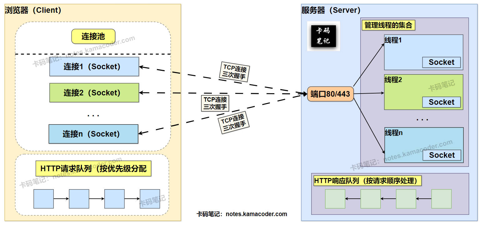

# HTTP是怎样实现多个TCP连接的

> 来源: https://notes.kamacoder.com/base/http-multiple-tcp-connections.html

# HTTP是怎样实现多个TCP连接的

## 简要回答

  - 在 **HTTP/1.1** 中，浏览器通过 **连接池（Connection Pool）** 为同一域名建立多个**并行 TCP 连接**（默认 6-8 个），每个连接独立完成三次握手和请求-响应过程，绕过协议层的队头阻塞，实现资源并发下载，但**单个连接内**仍存在队头阻塞（服务器必须按照顺序依次响应每一个请求）。
   - **HTTP/2** 及以后版本通过 **多路复用（Multiplexing）** 在单连接上并发处理多个请求，减少了连接开销和延迟。

## 详细回答

### HTTP/1.1 多 TCP 连接的具体实现机制

  1. **连接池管理**：

    - **连接池初始化**：浏览器为每个域名维护一个连接池，默认分配 6-8 个 TCP 连接（不同浏览器策略不同）。
     - **连接复用**：通过 `Connection: keep-alive` 头保持连接活跃，避免重复握手（但每个连接仍需串行处理请求）。

   2. **连接建立流程**：

    - **DNS 解析**：浏览器解析域名获取服务器 IP（可能缓存结果）。
     - **TCP 握手**：每个连接独立完成三次握手（SYN → SYN-ACK → ACK）。
     - **TLS 握手（HTTPS）**：每个连接单独协商加密参数（增加 1-2 个 RTT 延迟）。

   3. **请求分发与处理**：

    - 浏览器将页面资源（JS/CSS/图片）分配到**并行的**不同连接，例如：连接1 请求 `/carl.js`，连接2 请求 `/kama.css`。
     - 每个连接**独立接收响应**，响应顺序可能与请求顺序不一致。

   4. **关键技术依赖**：

    - **操作系统支持**：内核需维护多个 Socket 描述符，通过多线程或 I/O 多路复用（如 `epoll`）处理并发。
     - **浏览器调度策略**：优先级队列管理关键资源（如 HTML 优先加载）。
     - **协议优化**：TCP 快速打开（TFO）、TLS 会话复用减少握手开销。

   5. **性能瓶颈**：

    - **队头阻塞（HOL Blocking）**：**单个连接内**请求必须串行处理，若某响应延迟，后续请求会被阻塞。
     - **TCP 慢启动**：每个连接初始传输速率低，多个连接可能加剧网络竞争。

### HTTP/2.0 相比于 HTTP/1.1的改进

  1. **多路复用（Multiplexing）**：允许在 **单个**TCP连接 上并行交错发送 **多个**请求和响应 ，解决队头阻塞，提升传输效率。
   2. **头部压缩（Header Compression）**：引入了 **HPACK** 压缩算法，减少冗余头部数据，节省带宽。
   3. **二进制协议（Binary Protocol）**：采用 **二进制帧** 替代 HTTP/1.1的 文本协议，使得解析更快更高效。
   4. **流优先级（Stream Prioritization）**：允许按 **权重和依赖关系** 优先传输关键资源，优化用户体验。
   5. **服务器推送（Server Push）**：服务器 **主动推送** 资源给客户端，而不需要客户端明确请求，减少额外请求延迟。

## 知识拓展

  1.

**TCP实现多个连接的示意图**如下：
 

   2.

**HTTP/3.0 相比于 之前版本的主要不同**：

    - **传输层协议革新**：HTTP/3.0 基于 **QUIC 协议（UDP）**，替代 TCP，解决队头阻塞，降低连接延迟。
     - **彻底解决队头阻塞**：QUIC 直接在传输层实现多路复用，单个流的数据包丢失不影响其他流。
     - **头部压缩优化**：采用 **QPACK** 算法，允许乱序传输动态表更新，避免解码阻塞。
     - **强制加密与快速握手**：默认集成 TLS 1.3，合并 TLS 和 QUIC 握手，**支持 0-RTT 连接**。
