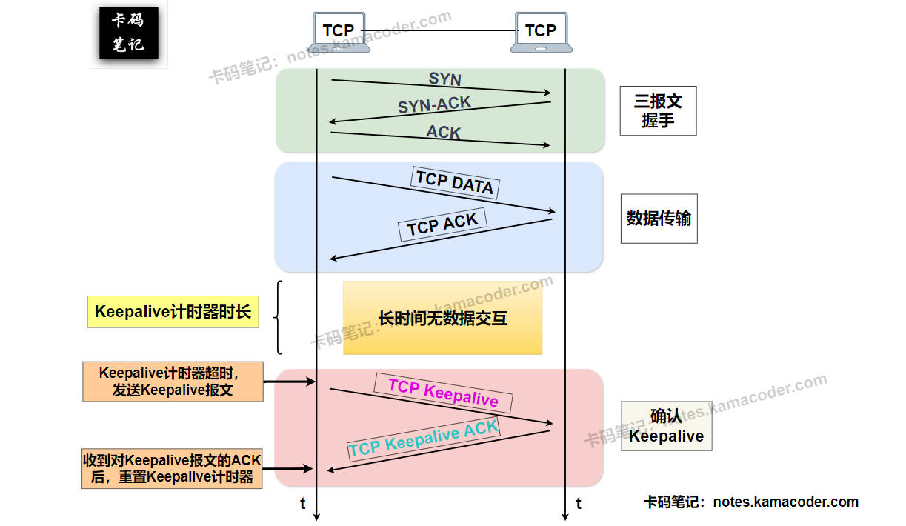
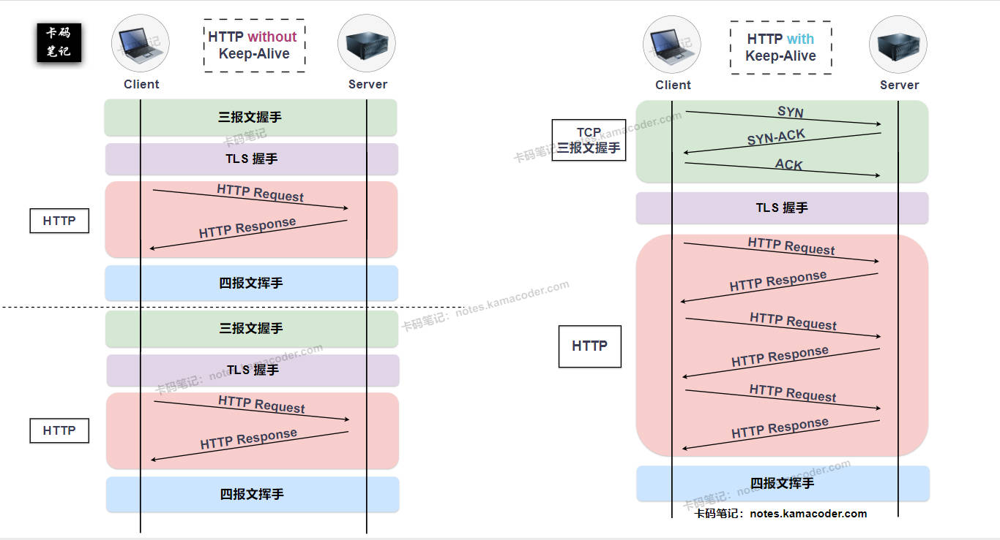

# TCPKeepalive和HTTPKeep-Alive的区别？

> 来源: https://notes.kamacoder.com/base/tcp-keepalive-vs-http-keep-alive.html

# TCPKeepalive和HTTPKeep-Alive的区别？

## 简要回答

### TCP Keepalive 和 HTTP Keep-Alive 的概念

  1. **TCP Keepalive：** 这是 **TCP 协议（传输层）** 提供的一种机制，由**操作系统内核**管理，主要目的是检测一个**空闲**的 TCP 连接是否仍然有效。当连接长时间没有数据传输时，操作系统内核会发送探测报文给对方，以确认对方主机是否仍在运行、网络是否通畅，从而避免连接在对方崩溃或网络中断时无限期地保持“僵尸”状态。
   2. **HTTP Keep-Alive：** 这是 **HTTP 协议（应用层）** 的一种特性，由**客户端和服务器应用程序**管理，也称为 HTTP 持久连接 (**Persistent Connection**)。它的目的是让一个 TCP 连接在**一次 HTTP 请求/响应**完成后**不立即关闭**，后续的 HTTP 请求可以**复用**这个已经建立的 TCP 连接，从而减少重复建立 TCP 连接（和可能的 TLS/SSL 握手）带来的延迟和开销，提高效率。

### TCP Keepalive 和 HTTP Keep-Alive 的区别

  - 如下表所示：

| **特性**  **TCP Keepalive**  **HTTP Keep-Alive**(持久连接)
| **协议层**  传输层 (TCP)  应用层 (HTTP)
| **主要目的**  检测空闲连接的**存活性**  **复用** TCP 连接以提高 HTTP 传输效率
| **触发条件**  TCP 连接长时间**空闲**  HTTP 事务（请求/响应）完成
| **管理方**  操作系统内核  HTTP 客户端和服务器应用程序
| **控制方式**  OS 内核参数, Socket 选项  HTTP Header (`Connection`), Web服务器配置
| **传输内容**  通常是空的探测报文 (ACK)  实际的 HTTP 请求和响应数据

## 详细回答

### TCP Keepalive 和 HTTP Keep-Alive 的概念

  1. **TCP Keepalive：**
    - 这是**传输层 TCP 协议**提供的一种可选机制，其核心在于维持连接的**健壮性** 和 检测**死连接**。
     - 当一个 TCP 连接建立后，如果双方长时间（通常是数小时）没有任何数据交互，**操作系统内核**为了确认该连接是否依然有效（例如，对端主机是否崩溃、网络是否中断），可以启动 **Keepalive** 功能。
     - 它会**周期性**地发送特殊的**探测报文**给对端。如果能收到预期响应，说明连接仍然存活；如果在规定次数内未收到响应，内核就会认为连接已失效，并通知应用程序连接中断，同时回收连接资源。

   2. **HTTP Keep-Alive：**
    - 这是**应用层 HTTP 协议**（特别是 HTTP/1.1 默认行为）采用的一种策略，称为**持久连接**，其核心在于**减少连接建立的开销**，提高 HTTP 传输**效率**。
     - 它允许**客户端** 和 **服务器**在一个 TCP 连接成功传输完一次 HTTP 请求及其响应后，不立即关闭这个 TCP 连接。后续来自该客户端的对同一服务器的请求，可以继续使用这个已经打开的连接，直到客户端或服务器认为不再需要（如超时、达到最大请求数或显式要求关闭）。

### TCP Keepalive 和 HTTP Keep-Alive 的区别

  1. **协议层不同：**
    - **TCP Keepalive** 工作在 OSI 模型的**传输层**，是 TCP 协议的一部分，由**操作系统内核**直接管理，对上层应用程序（如 HTTP）是透明的。
     - **HTTP Keep-Alive** 工作在**应用层**，是 HTTP 协议的特性，由 HTTP **客户端**（浏览器）和**服务器**（Web 服务器）应用程序协同实现和管理。

   2. **主要目的不同：**
    - **TCP Keepalive** 的主要目的是**检测连接的存活性**。它关心的是 TCP 连接本身在长时间空闲后是否还“活着”，能否继续通信，用于清理无效连接，防止资源泄露。
     - **HTTP Keep-Alive** 的主要目的是**提高效率和性能**。它通过**复用**同一个 TCP 连接来处理多个 HTTP 请求/响应，避免了重复进行 TCP 三次握手和可能的 TLS 握手的延迟与资源消耗。

   3. **触发条件不同：**
    - **TCP Keepalive** 的触发条件是 TCP 连接**长时间处于空闲状态**（没有数据收发），这个“长时间”通常由操作系统参数定义（如默认 2 小时）。
     - **HTTP Keep-Alive** 的机制是在一次**完整的 HTTP 事务（请求+响应）完成后**发挥作用，决定是否保持连接以备下次使用，其保持时间通常由 Web 服务器配置（如几十秒到几分钟）。

   4. **管理方不同：**
    - **TCP Keepalive** 的启用和参数（探测时间、间隔、次数）由**操作系统内核**管理，应用程序可以通过 Socket API 进行有限的控制（如启用/禁用、调整参数）。
     - **HTTP Keep-Alive** 的行为主要由**HTTP 应用程序**（客户端和服务器）根据 HTTP 协议规范和各自的配置来管理。

   5. **控制方式不同：**
    - **TCP Keepalive** 主要通过操作系统级别的**内核参数**（如 sysctl 中的 `net.ipv4.tcp_keepalive_*` 系列参数）和**套接字选项**（如 `SO_KEEPALIVE`）来控制。
     - **HTTP Keep-Alive** 主要通过 HTTP 报文中的 **`Connection` Header**（虽然在 HTTP/1.1 中 Keep-Alive 是默认行为，`Connection: close` 用于关闭）以及 Web 服务器的**配置文件**（如 Apache 的 `KeepAliveTimeout`、`MaxKeepAliveRequests`）来控制。

   6. **传输内容不同：**
    - TCP Keepalive 发送的是**探测性的 TCP 报文段**，通常不包含任何应用层数据，目的是探测网络路径和对端 TCP 栈的响应能力。
     - 处于 HTTP Keep-Alive 状态的 TCP 连接传输的是**实际的、完整的 HTTP 请求和响应报文**，包含应用层数据。

## 知识拓展

  1.

**TCP Keepalive**示意图如下：
 

   2.

**HTTP Keep-Alive**示意图如下：
 

   3.

**术语拼写差异 (Keepalive vs Keep-Alive):**

    - **TCP Keepalive** 通常写成一个单词，这与其在操作系统内核、系统调用和 Socket API (如 `SO_KEEPALIVE` 选项) 中的称呼习惯一致。它更偏向于一个**系统级、底层**的机制描述。相关文档（如`RFC`）和讨论中多采用这种形式。
     - **HTTP Keep-Alive** 通常写成带有连字符的形式，这源于它最初在 HTTP/1.0 中作为实验性扩展时，通过 `Connection: Keep-Alive` 这个特定的 **HTTP Header** 值来启用。虽然 HTTP/1.1 将持久连接变为默认行为，但这个带有连字符的术语因历史渊源和与 Header 的关联而被广泛用于指代 HTTP 层的连接复用概念。
     - 虽然没有某个 RFC 文件强制规定这两个概念的非正式术语必须如何拼写，但这种**约定俗成的拼写差异有助于区分这两个工作在不同协议层、目的不同的机制**。

   4.

**TCP Keepalive 与 HTTP Keep-Alive 的关系:**

    - 它们是**不同层面、目标不同但可以协同工作**的机制。
     - HTTP Keep-Alive **依赖于底层 TCP 连接的存在**。当 HTTP 决定保持一个连接“Keep-Alive”时，意味着它暂时不关闭这个 TCP 连接，以便复用。
     - 这个被 HTTP “Keep-Alive” 的 TCP 连接，如果**在 HTTP 层面长时间没有新的请求到来**（例如，用户停留在一个页面很久没有操作），那么在 TCP 层面看来，这个连接就进入了**空闲状态**。
     - 如果这个 TCP 空闲时间**达到了操作系统设定的 TCP Keepalive 阈值**（通常远长于 HTTP Keep-Alive 的超时时间），那么**操作系统内核**就会开始发送 TCP 探测包来检查这个底层连接本身的死活。
     - 因此，TCP Keepalive 可以看作是为 HTTP Keep-Alive（以及其他所有可能产生长空闲连接的应用）提供的一个**底层连接健康状态的最终保障机制**。HTTP Keep-Alive 管理的是连接的**应用层复用**，而 TCP Keepalive 管理的是连接在**极端空闲情况下的存活性探测**。
