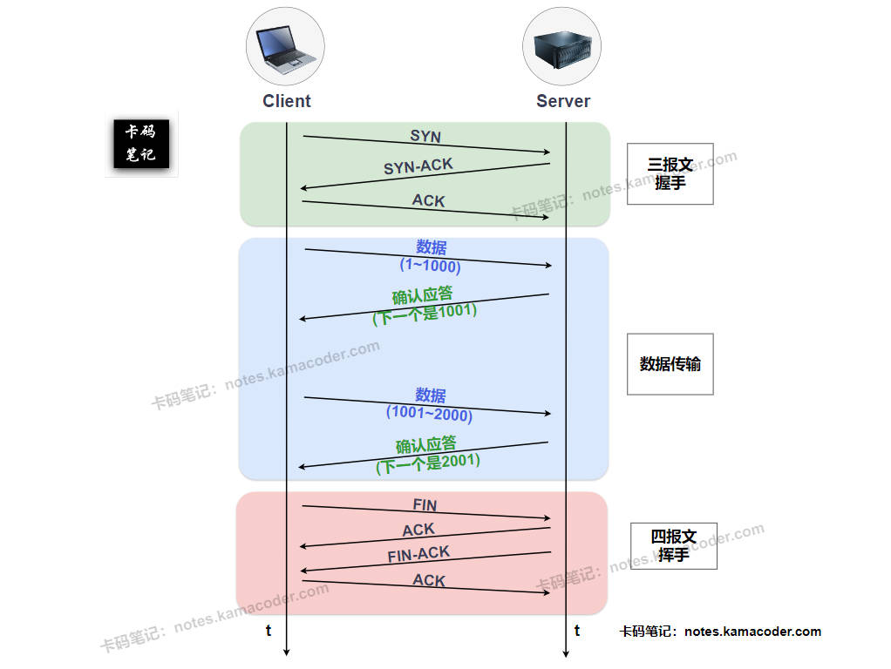
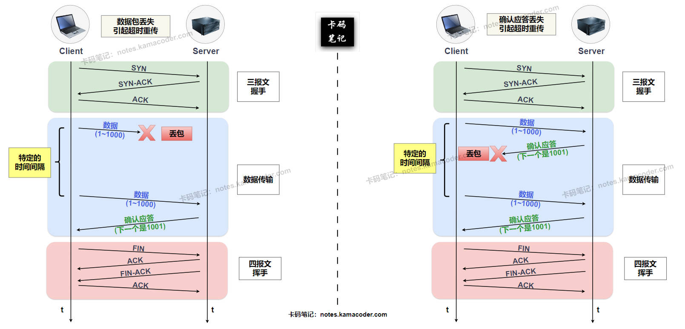

# TCP连接如何确保可靠性？

> 来源: https://notes.kamacoder.com/base/tcp-reliability.html

# TCP连接如何确保可靠性？

## 简要回答

TCP 通过一系列协同工作的机制来确保数据传输的**可靠性**，即保证数据能够**准确、有序、不丢失、不重复**地从发送端送达接收端。其核心机制包括：

  1. **序列号 (Sequence Numbers):** 为每个字节流分配序号，用于保证数据段的顺序，检测丢失和重复的数据段。
   2. **确认应答 (Acknowledgements - ACKs):** 接收方发送 ACK 报文来确认已成功接收到的数据，告知发送方哪些数据已安全抵达。
   3. **重传机制 (Retransmission):** 当发送方在规定时间内未收到某数据段的确认时（超时重传），或收到多个重复的 ACK 时（快速重传），会重新发送该数据段，以应对数据丢失或确认丢失。
   4. **校验和 (Checksum):** 发送方和接收方计算数据段（包括头部和数据）的校验和，用于检测数据在传输过程中是否发生比特错误。
   5. **连接管理 (Connection Management):** 通过三次握手建立连接，确保双方都准备好收发数据并同步初始序列号；通过四次挥手断开连接，确保双方数据都传输完毕。
   6. **流量控制 (Flow Control):** 使用滑动窗口机制，接收方告知发送方自己还有多少缓冲区空间（接收窗口），防止发送方发送过快导致接收方处理不过来而丢包。
   7. **拥塞控制 (Congestion Control):** 通过感知网络拥堵状况（如丢包、延迟增加）动态调整发送速率（拥塞窗口），避免过多数据注入网络导致路由器过载而丢包。

## 详细回答

TCP (Transmission Control Protocol) 设计的核心目标之一就是提供**可靠的数据传输服务**，即保证数据能够**准确、有序、不丢失、不重复**地从发送端送达接收端。它在网络层 IP 协议提供的“尽力而为”的不可靠服务基础上，增加了一系列复杂的机制来实现这一目标：

  1. **基于字节流的序列号机制 (Sequence Numbers):**
    - TCP 将应用程序交付的数据视为一个**连续的字节流**。在建立连接时，双方会协商一个初始序列号 (ISN)。之后，TCP 会为发送的每一个字节都分配一个**逻辑上**的序列号。
     - 每个发送的 TCP 数据段 (Segment) 的头部都包含该段数据中第一个字节的序列号。
     - **作用：**

① **保证顺序：** 接收方可以根据序列号对收到的乱序数据段进行重新排序，恢复成原始的字节流顺序。

② **检测丢失：** 接收方可以通过检查收到的序列号是否连续来判断是否有数据段丢失。

③ **去除重复：** 如果接收方收到具有相同序列号范围的数据段，可以丢弃重复的数据。

   2. **确认应答机制 (Acknowledgements - ACKs):**
    - 当接收方成功接收到来自发送方的数据段后，会向发送方回送一个确认 (ACK) 报文段。
     - ACK 报文中包含一个**确认号 (Acknowledgement Number)**，这个确认号通常是接收方期望接收的**下一个字节**的序列号。这是一种**累积确认**的方式，表示该确认号**之前的**所有字节（数据）都已成功接收。
     - **作用：** 明确告知发送方哪些数据已经被对方安全接收，是触发数据发送和判断是否需要重传的关键依据。

   3. **超时重传机制 (Timeout Retransmission):**
    - 发送方每发送一个数据段，就会启动一个**重传计时器 (Retransmission Timer)**。
     - 如果在计时器超时之前收到了对该数据段的确认 (或者对包含该段数据的更高序列号的确认)，则撤销计时器。
     - 如果计时器**超时**（**RTO - Retransmission Timeout**）后仍未收到确认，发送方就认为该数据段可能在网络中丢失或其 ACK 丢失，于是会**重新发送**该数据段。
     - RTO 的值是**动态计算**的，基于对网络往返时间 (RTT) 的测量和估计，以适应不同的网络状况。
     - **作用：** 这是处理数据段丢失或 ACK 丢失的最基本机制。

   4. **快速重传机制 (Fast Retransmission):**
    - 当接收方收到一个**失序**的数据段时（即收到的段序号大于期望的序号），它会立即发送一个**重复的 ACK**，该 ACK 的确认号仍然是它当前期望接收的那个丢失的字节序号。
     - 如果发送方连续收到**三个或以上**的重复 ACK（**冗余 ACK**），它就推断这个 ACK 对应的那个数据段很可能已经在网络中丢失了，并且接收方确实收到了该丢失段之后的一些数据。
     - 此时，发送方**不必等待重传计时器超时**，而是立即**重新发送**那个被重复确认的数据段。
     - **作用：** 相比超时重传，快速重传能更早地发现并恢复丢失的数据段，提高了传输效率，尤其是在网络丢包但不太拥塞的情况下。

   5. **校验和 (Checksum):**
    - TCP 头部和数据部分都会计算一个 16 位的校验和。发送方计算并将其放入 TCP 头部。
     - 接收方收到数据段后，会重新计算校验和，并与头部中的校验和字段进行比较。
     - 如果不匹配，说明数据在传输过程中可能发生了比特错误，接收方会**丢弃**这个数据段（不发送 ACK，等待发送方超时重传）。
     - **作用：** 提供基本的端到端数据完整性校验，检测传输错误。

   6. **连接管理 (Connection Management):**
    - **三次握手 (Three-way Handshake):** 在传输数据前，通过交换三个报文段（SYN, SYN+ACK, ACK）来建立连接。这个过程确保了双方都同意建立连接，能够正常收发数据，并同步了双方的初始序列号 (ISN)。
     - **四次挥手 (Four-way Handshake):** 在数据传输结束后，通过交换四个报文段（FIN, ACK, FIN+ACK, ACK）来终止连接。这个过程确保了双方的数据都能完整发送并被确认，各自都能优雅地关闭连接。
     - **作用：** 保证了数据传输是在一个双方确认建立、状态同步、并且最终能可靠关闭的通道上进行的。

   7. **流量控制 (Flow Control):**
    - 使用滑动窗口机制，接收方告知发送方自己还有多少缓冲区空间（接收窗口），防止发送方发送过快导致接收方处理不过来而丢包。
     - **作用：** 防止发送方压垮接收方，减少因接收端处理不过来导致的丢包，从而间接支持了可靠传输。

   8. **拥塞控制 (Congestion Control):**
    - 通过感知网络拥堵状况（如丢包、延迟增加）动态调整发送速率（拥塞窗口），避免过多数据注入网络导致路由器过载而丢包。
     - **作用：** 防止发送方过多的数据导致网络（路由器）过载而丢包，维护网络的稳定性，减少因网络拥塞导致的丢包，从而间接支持了可靠传输。

## 知识拓展

  1.

**TCP 序列号确认机制**，如下图所示：
 

   2.

**TCP 超时重传机制**，如下图所示：
 

   3.

**TCP 可靠传输、流量控制与拥塞控制的关系：**

    1. **可靠传输是基石：** 可靠传输机制（序列号、确认、重传、校验和）是 TCP 的核心目标和基础保障。无论网络状况如何，这些机制都在努力确保数据“必须”准确、有序、完整地到达。它们是处理**已经发生**的错误（丢包、乱序、比特错误）的最终手段。
     2. **流量控制是“点对点”的协调：** 流量控制关注的是**发送方**和**接收方**之间的速度匹配。它通过接收窗口 (`rwnd`) 防止发送方发送速度超过接收方的处理能力，避免**接收端缓冲区溢出**导致的丢包。它是一种**端到端**的速率协调机制。
     3. **拥塞控制是“全局”的考量：** 拥塞控制关注的是**发送方**与**整个网络**之间的容量匹配。它通过拥塞窗口 (`cwnd`) 和一系列算法来探测和适应网络的承载能力，避免**网络中间节点（如路由器）过载**导致的丢包。它是一种**发送端对网络整体状况**的自适应调节机制。
     4. **相互支撑与优化关系：**

① **流量控制和拥塞控制支持可靠传输：** 通过主动限制发送速率，它们旨在**预防**或**减少**特定类型的丢包（接收端溢出丢包、网络拥塞丢包）。丢包减少了，就不需要那么频繁地触发代价较高的**重传**机制，从而使得整个可靠传输过程更**高效**、更**稳定**。

② **可靠传输机制支撑流量控制和拥塞控制：** 流量控制和拥塞控制的算法本身也依赖于可靠传输机制提供的反馈信息。例如，拥塞控制通常将**丢包事件**（通过超时或收到重复 ACK 检测到）作为网络拥塞的信号；流量控制依赖于 ACK 报文来传递接收窗口信息。没有可靠的确认和序列号机制，流量控制和拥塞控制也无法有效工作。
